# Module 4 Lesson 1- Lab 1: Patient Outreach

## Overview

The **Patient Outreach** application in Microsoft Cloud for Healthcare focuses on patient campaign management, which helps you organize and automate marketing and communicate with patients. It helps healthcare providers reach out to their communities and patients in a targeted, efficient way. Providers can choose email, text, regular mail, or a combination, to provide healthcare information to specific groups of patients and community members.

The Patient Outreach application in Microsoft Cloud for Healthcare allows healthcare providers to communicate with their communities and patients in a targeted, efficient way. Patient Outreach is a patient campaign management application that helps you organize and automate marketing and outreach to patients. The application allows you to orchestrate personalized journeys across patient touchpoints to strengthen relationships and increase patient retention and thus improving care.

Key capabilities of **Patient Outreach** include:

-   **Patient segmentation** - Prebuilt patient segments are based on the industry
    standard Healthcare Effectiveness Data and Information Set (HEDIS) to
    provide baseline patient cohorts.

-   **Patient engagement campaigns** - Create healthcare-specific email campaigns
    that use patient segments based on the HEDIS industry standard.

-   **Event management** - Use provider and payer event management templates for
    event administration and registration.

-   **Trigger-based journeys** - Allow patient journeys to initiate based on a condition and enable faster reactions to patient interactions and changes. Trigger journeys are based on real-world interactions such as checking in for an appointment or being discharged from the hospital.

Patient Outreach focuses on the Deliver exceptional patient and member experiences priority scenario by creating personalized communication based on patient insights

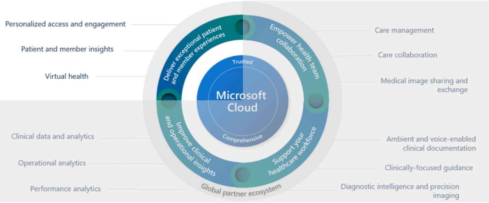

This lab focuses on the healthcare story of Elizabeth Moore.

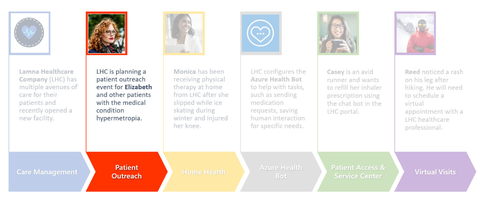

At an annual checkup earlier this year, Elizabeth is diagnosed with hypermetropia, a common eye condition in adults in which nearby objects are blurry. Lamna Healthcare Company has seen a recent influx of patients who want to be more educated on hypermetropia. Lamna has decided to increase their patient outreach efforts by hosting a virtual marketing event.

In this module, you'll play the role of a Lamna Healthcare Company marketing administrator and will use the Patient Outreach capabilities in Microsoft Cloud for Healthcare to walk through the following exercises:

1.	Create a patient segment to group patients based off a similar characteristic.
2.	Create a marketing email for outreach to patients in the defined segment.
3.	Create a patient journey using the designer to send the marketing email to everyone in the patient segment.
4.	Create a virtual marketing event to track the attendees and details of the event.
5.	Create a trigger and use this to trigger a patient journey.

## Exercise 1: Create a Patient Segment

In this exercise, you'll create a patient segment by using the Patient Outreach app in Microsoft Cloud for Healthcare. You can use a patient segment to group patients into cohorts based on similar characteristics so that they can be better targeted with marketing communications. In this example, you'll create a patient segment for patients with hypermetropia (a vision condition in which nearby objects appear blurry).

1.  Navigate to https://make.powerapps.com/ and log into your Microsoft 365 tenant, if needed.

1.  If needed, change the environment on the top right corner of the Power apps home page.
  
2.  Go to **Apps**. Click on **All** tab if you don’t see apps.

3.  Select **Customer Insights - Journeys**  app in the right pane. Click on play button to launch the application.

4.	Check you are in the **Real-time journeys** area. If not, change the area accordingly. 

5.	Select **Segments** under **Audience** from the left navigation pane.

6.	Click on a **New Segment**.
 

7.	Update with below details:

    1.	Name of the Segment – **Patients with Hypermetropia**

    2.	Select the target Audience – **Contact**

    3.	Click on **Create**.
 
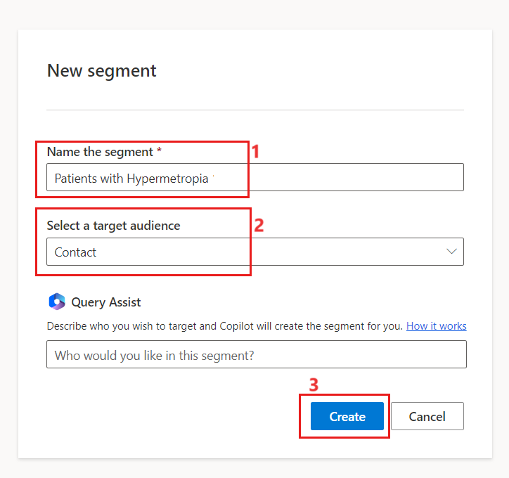

8.	Expand the arrow beside the **Add a new group** and select **Attribute group**.
 
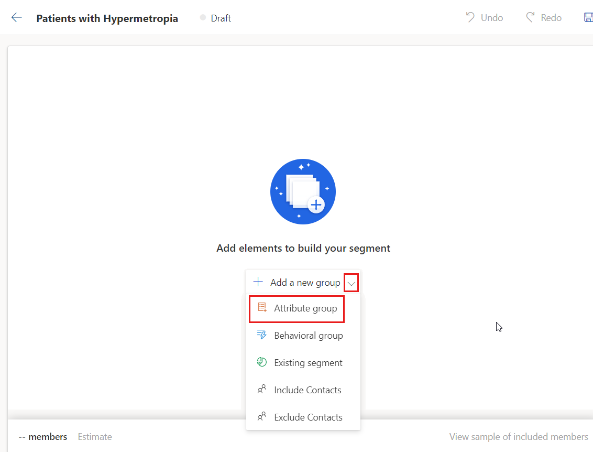

9.	Search for **Status** under Search area. Expand **Contact** and select **Status** under Contact. Add it to existing group.
 

10.	 Select the **operator** as **Is** and **Value** as **Active**
 
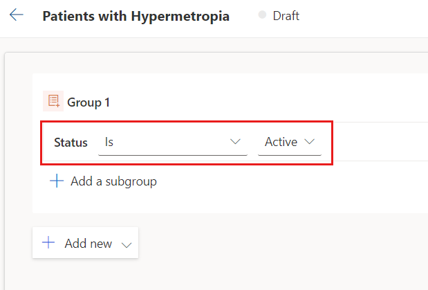

11.	Select **Add a subgroup**.

12.	Enter **Condition** in the search area on the Right-side panel. Select **Condition** under **Condition**. Click on **+** symbol. Select **Existing group** and then select **Group 1.1.**

**Note** - If you are unable to find, you can click on Add a table and add the condition table
 

13.	 Select **Patient** under **Add an attribute from a different table** pop-up.
 
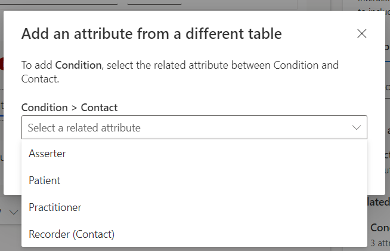

14.	Click on **Done**.
 
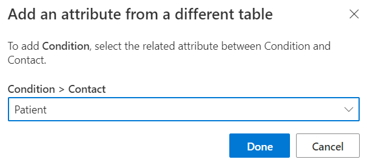

15.	 Update with below details

        1. Operator – **Contains**

        2.	Value – Enter **Hypermetropia**

        3.	Click on **Save**.
 

16.	 Click on **Ready to use**.
 
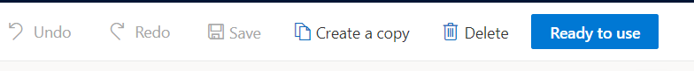

17.	 The segment takes approximately 10-15 minutes to be used in journey.
 
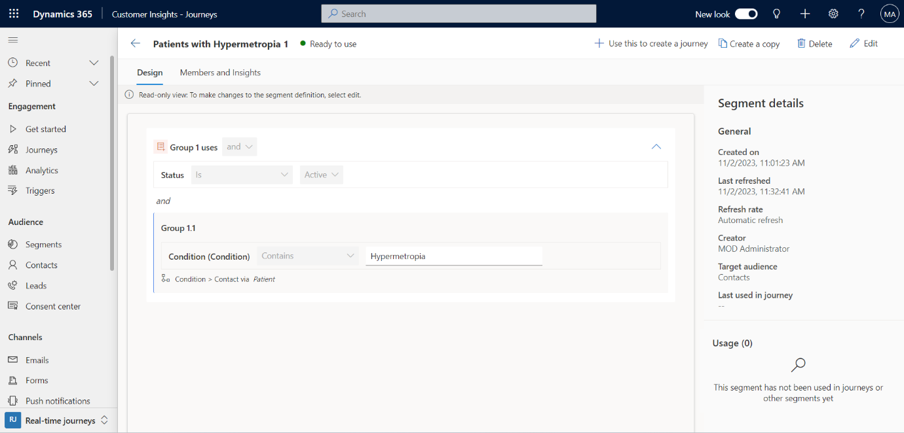

**Note**- You won't be able to use the new patient segment in a customer journey until it goes live.

18.	Select **Refresh** on the command bar to refresh the page.

19.	Select the **Members and Insights** tab to see which patients have been added to the Dynamic segment. Notice Elizabeth Moore in the list, a recipient of our next marketing event outreach email.
 

You've completed the steps to create a patient segment that can be used for patient outreach. This patient segment will be used in the tasks in the next exercise. For more information about dynamics segments, see [Create a dynamic segment (Dynamics 365 Marketing)](https://learn.microsoft.com/en-us/dynamics365/marketing/create-segment/). For more information about segments in general, see [Working with segments (Dynamics 365 Marketing)](https://learn.microsoft.com/en-us/dynamics365/marketing/segmentation-lists-subscriptions/).

    
## Exercise 2: Create a Marketing Email 

In this exercise, you'll create a marketing email that will be used to reach out to the patient segment that you created in the previous exercise. Marketing emails help you directly communicate with patients who reside in a particular patient segment.

1.	Select **Emails** under **Channels** from the Left navigation pane.

2.	Click on **+ New**.
 

3.	Click on **Skip** on Email templates window.

4.	Rename the Email as **Email Invitation - Healthy Eye Seminar Virtual Event.**
 

5.	In the Email body, Click on **Add element here** and click on **Image**.

 

6.	Click on **Add image > Upload to library**.
 

7.	Navigate to the path where **Glasses.jpg** image is saved and upload the file.

8.	Click on + sign once the image is uploaded.
 

9.	Click on **text**.
 

10.	Edit the text of the email as follows:

    1.	Pick a date : **December 1st, 2023, 9:00 am to 1:00 pm**

    2.	Headline : **Healthy Eye Seminar**

    3.  Description 1 - **Hi, {{contact.firstname}}! You're invited to Lamna Healthcare's Healthy Eye Virtual Event.**

    4.	Description 2 - **Come join us at this virtual Event.**
 

12.	Remove the **{{contact.firstname}}** and click on **Personalization**.
 

13.	Click on **New Dynamic text**.
 
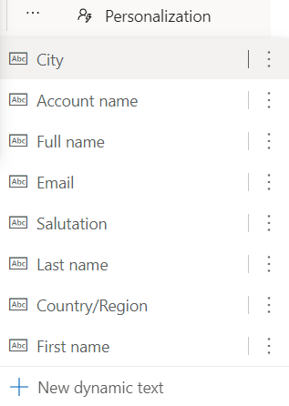

14.	Click on **Choose an attribute.**
 

15.	Expand **Contact** and select **first name**.
 
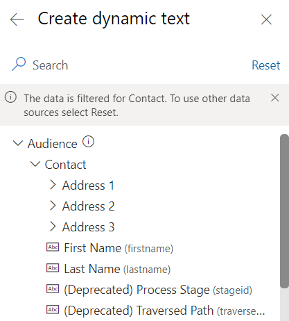

16.	Edit the footer text of the email so that it reads **©2023 Lamna Health Event.**
 
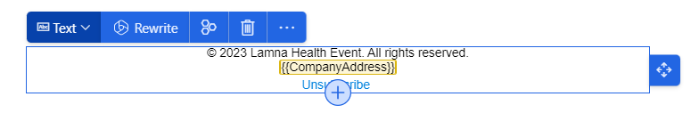

17.	Update the below details

    1.	From – Enter the text as **Your Care Team at**

    2.	From Email – Add a dynamic content text Account’s Name. – {{AccountName}}
 
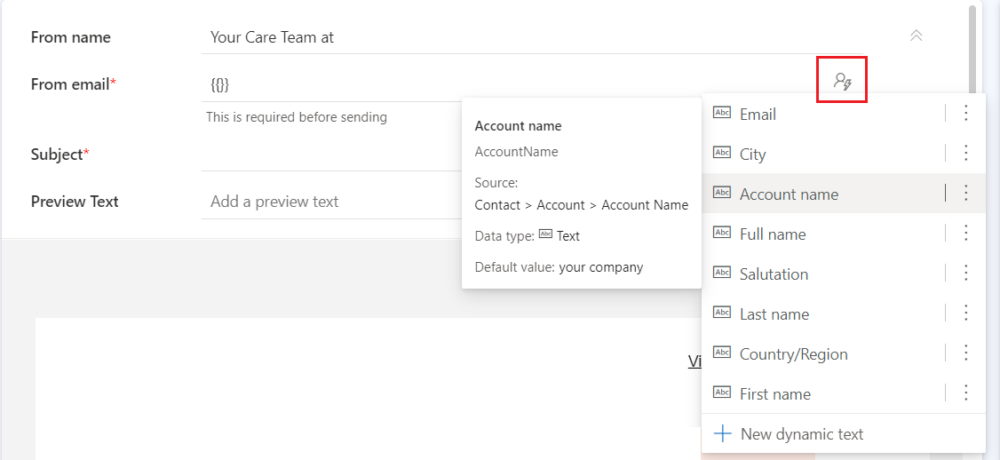

   	3.	Scroll up and add a Subject - You are invited for Healthy Eye Virtual Seminar!
 
 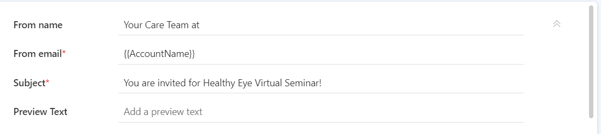
    
    4.	On the right-side panel, click on **Settings**, Under Reply to **Email** please enter dynamic content text Email.
 
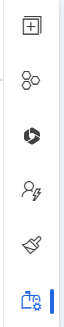

19.	On the command bar, select **Save**. Click on **Ready to Send**.

You've completed the steps to create a marketing email that can be used for patient outreach. This marketing email will be used in the next exercise. For more information on creating marketing emails, see [Create a marketing email (Dynamics 365 Marketing)](https://learn.microsoft.com/en-us/dynamics365/marketing/create-marketing-email/)

## Exercise 3: Create a Patient Journey

In this exercise, you'll create a patient journey for the patient segment that you created in the first exercise. A patient journey can expand your organization's patient outreach marketing capabilities by helping healthcare organizations guide the members of a selected segment through the communication process. It completes this action by using automated messaging, activity generation, interactive decision points, and more.

The following screenshot shows an example of a configured patient journey that focuses on the Patient Activation Measure segment group and sends them a marketing email after a three-month waiting period.
 

Now let’s make our own patient journey for patients with hypermetropia.

1.	Click on **Journeys** under **Engagement** on the left navigation pane.

2.	Select **+ New journey** to create a new patient journey.

3.	Click on **Skip** and create from Blank.
 

4.	Update the details:

    1.	Name of the Journey - **Healthy Eye Seminar**

    2.	Choose the type of Journey – **Segment-based**.

    3.	Select a Segment – **Patients with Hypermetropia**

    4.	Start Date – Current date.

    5.	Click on **Create**.
 

5.	Click on + symbol.
 

6.	Select **Send an email.**
 

7.	On the right side, select the email that you created – **Email invitation – Healthy Eye Seminar.**
 
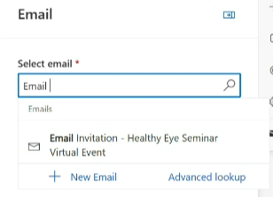

8.	Change the frequency to  repeating journey.
 

9.	You can update the End data accordingly.

10.	Once you have created. **Save** and **publish** the journey.

11.	After your patient journey has started, you'll be able to gather key metrics and insights from the record. This information will become available at a time that is based on the date and time that you chose for the start of the customer journey. You can return to view the results later if they aren't yet available.

You've created a patient journey that will send the invitation email to the Healthy Eye Seminar to members of the Patients with Hypermetropia segment. For more information on patient journeys, see Create a simple customer journey (Dynamics 365 Marketing).

## Exercise 4: Create a Virtual Healthcare Educational Event

In this exercise, you'll create a healthcare-focused, virtual marketing event that corresponds to the patient journey that you created in the previous exercise where you sent the Healthy Eye Seminar event invite to everyone in the patient segment. The **Marketing Event Management** feature helps you every step of the way, from initial planning and budgeting through promotion and publication, attendee registration, webinar broadcasting, final analytics, lead generation, and evaluation of ROI.

1.	Change the area to **Event planning**.

2.	Select **Events** on the left navigation pane on the page.
 
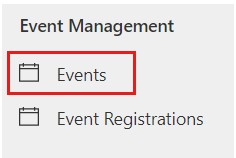

3.	Select **+ New event** on the command bar to create a new event.
 
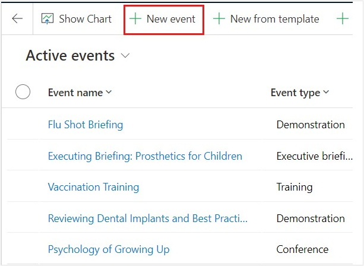

4.	Enter details for the new event. Enter **Healthy Eye Seminar** in the **Event name** field and enter the same schedule details that you entered for the marketing email in the previous exercise. Make sure that you become familiar with the other fields on the forms as part of the **Preliminaries** event stage.
 
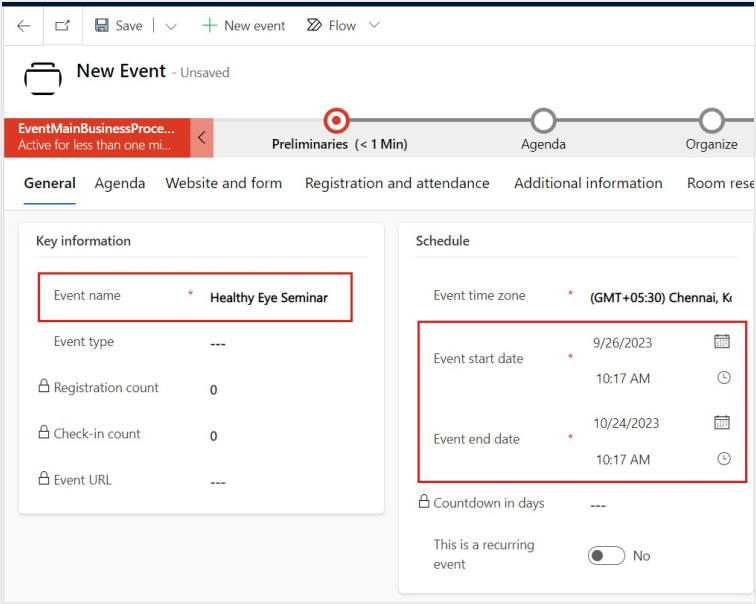

5.	Select **Save**. This will open more options on the command bar.

6.	Because this event will be virtual, in the **Stream This Event Online** section, change the **Do you want to stream this event toggle** to **Yes**.

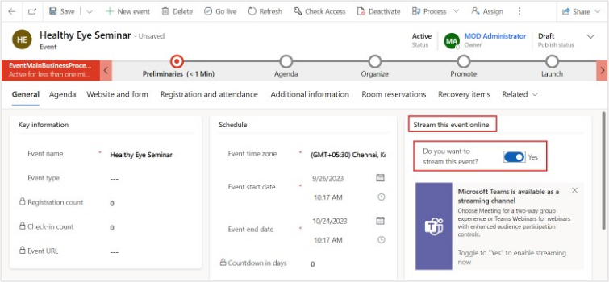 

7.	In the Business Process Flow, select the first stage **Preliminaries**. In the flyout menu, select **Next Stage**.
 
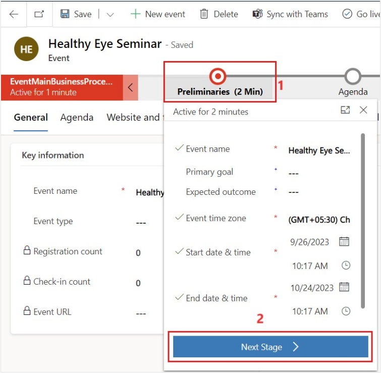

8.	Advance each stage in the business process flow until you reach the **Launch** stage. Observe the fields that are associated with each stage as you advance through them. Click on **Next** Stage for **Launch** stage. Click on **Finish** when you reach **Post Event** stage.
  
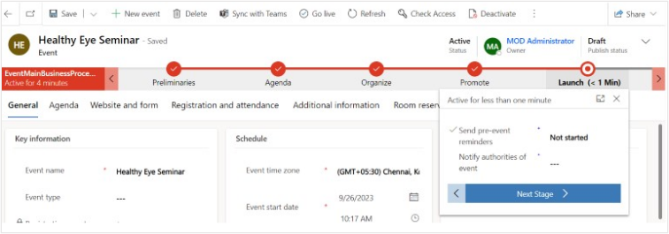

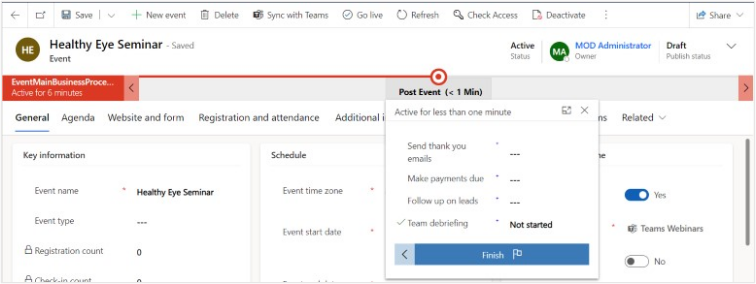

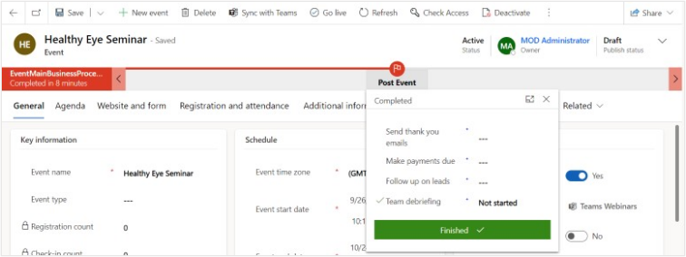

9.	Select **Go live** on the command bar. If you don’t see Go live available, select Save first.
 
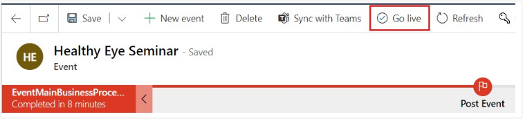

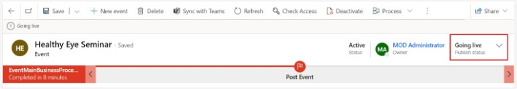

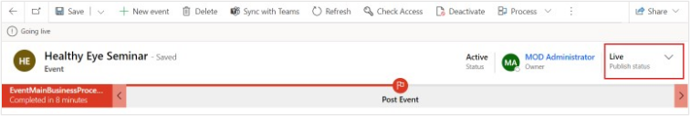

10.	The Microsoft Teams meeting URL will populate.

11.	You can also choose to **change the meeting options** toggle to **Yes** to enable its settings and more fields appear. These options allow you to make the recording available to attendees, enable meeting chat, allow reactions, and more.
 
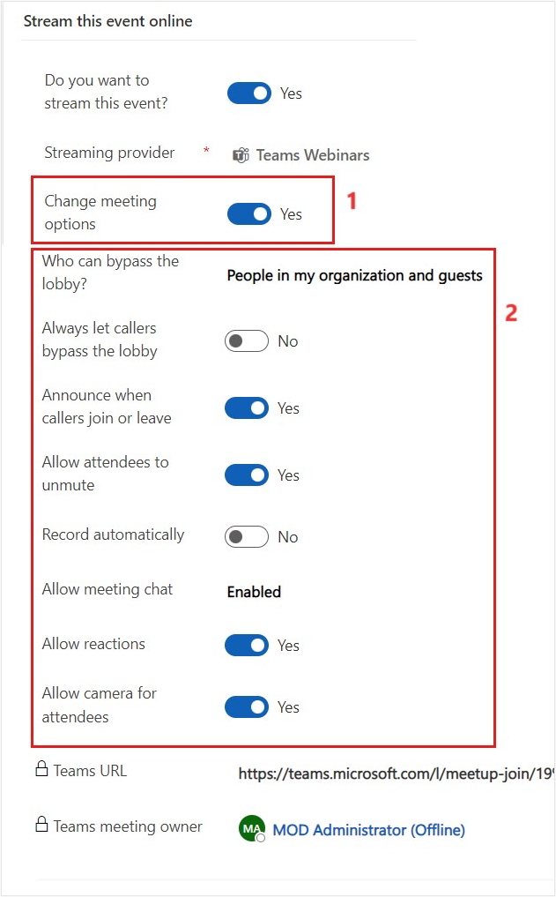

You've created a virtual marketing event for patients with hypermetropia by using Microsoft Cloud for Healthcare. For more information, see [Event planning and management overview.](https://learn.microsoft.com/en-us/dynamics365/marketing/event-management/)

## Exercise 5 – Create a trigger-based patient journey 

In this exercise, you'll create a patient trigger by using the Customer Insights – Journey app in Microsoft Cloud for Healthcare and use the patient trigger to create the patient journey. 

## Task: Create a trigger

1.	Switch back to [Power Apps portal](https://make.powerapps.com/). Navigate to **Apps** on the left navigation pane and launch **Customer Insights – Journeys** App by selecting the **play** button.
 

2.	On the Customer Insights – Journeys app, select **Triggers** under **Engagement** from the left-navigation pane.
 

3.	Select **New trigger.**
 

4.	Enter the following details:

  	a.	Name the new trigger - **Encounter Details Updated**. 

    b.	What action will activate the trigger? – Select **When a record related to the customer is created or updated.**

    c.	Select **Create**.
 
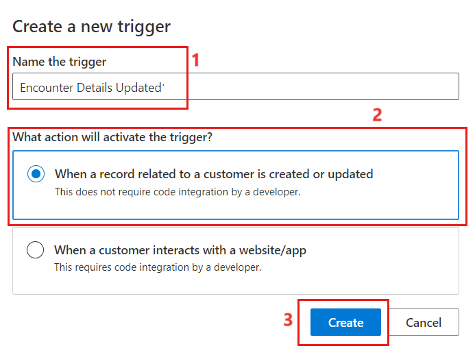

6.	Enter the following details. 

    a.	In which table is the record created or updated? – Search for **Encounter** and select the option from the list.

    b.	Which attribute contains the audience? – **Patient**

    c.	When is the trigger activated? – **Any of the above** 

    d.	Which attribute updates should activate the trigger? – **Encounter Name**

    e.	Click on **Ready to use**.
 
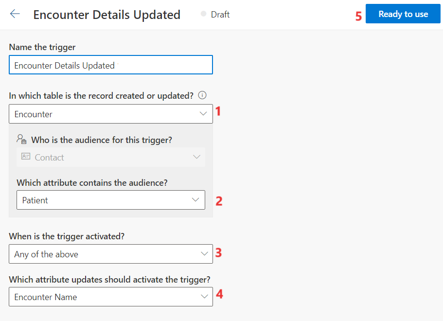

7.	 After the trigger is saved. It is not ready to use for the journey.
 
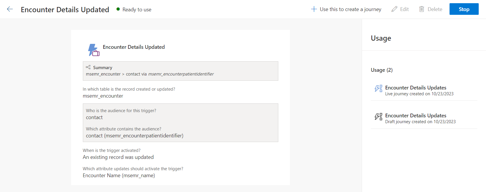

## Task: Create a trigger-based patient journey

1.	Select **Journeys** on the left navigation pane.
 

2.	Select **New Journey.**
 

3.	Enter the following details:

    a.	Name of Journey – **Encounter Details Update** 

    b.	Choose the type of the journey -  **Trigger-based**.

    c.	Choose a trigger – Select **Encounter Details Updated**

    d.	Select **Create**.
 

4.	Select **Save** to save the journey. 

**Note** – You can click on Plus symbol to add and extend your Trigger based journeys
 

5.	Select **Publish** on the journey is saved.
 

The status of the Journey now is Live

