Module 4 Lesson 1- Lab 1: Patient Outreach
==========================================

## Overview

The **Patient Outreach** application in Microsoft Cloud for Healthcare allows
healthcare providers to communicate with their communities and patients in a
targeted, efficient way. Patient Outreach is a patient campaign management
application that helps you organize and automate marketing and outreach to
patients.

Key capabilities of **Patient Outreach** include:

-   Patient segmentation - Prebuilt patient segments are based on the industry
    standard Healthcare Effectiveness Data and Information Set (HEDIS) to
    provide baseline patient cohorts.

-   Patient engagement campaigns - Create healthcare-specific email campaigns
    that use patient segments based on the HEDIS industry standard.

-   Event management - Use provider and payer event management templates for
    event administration and registration.

Patient Outreach focuses on the **Enhance patient engagement** priority scenario
by creating personalized communication based on patient insights.

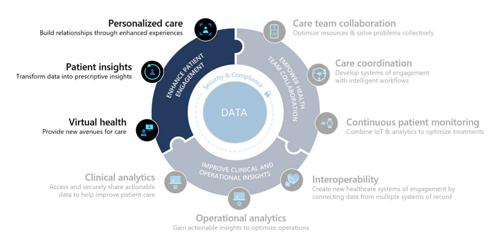

This lab focuses on the healthcare story of Elizabeth Moore.

At an annual checkup earlier this year, Elizabeth learned that she has
hypermetropia, a common eye condition in adults in which nearby objects are
blurry. Lamna Healthcare Company has seen a recent influx of patients who want
to be more educated on hypermetropia and has decided to increase their patient
outreach efforts by hosting a virtual marketing event.

In this lab, you will play the role of a Lamna Healthcare Company marketing
administrator and will use the Patient Outreach capabilities in Microsoft Cloud
for Healthcare to create a virtual marketing event.

## Learning objectives

In this lab, you will:

-   Create a patient segment.
-   Create a marketing email.
-   Create a patient journey.
-   Create a healthcare marketing event.

## Exercise 1: Create a Patient Segment

In this exercise, you will create a Patient Segment using the Patient Outreach
app in Microsoft Cloud for Healthcare. A **Patient Segment** is used to group
patients into cohorts based on similar characteristics so that they can be
better targeted with marketing communications. In this example, you will create
a Patient Segment for patients with hypermetropia (a vision condition in which
nearby objects are blurry).

1. [] Navigate to +++https://make.powerapps.com/+++ and log into your Microsoft 365 tenant, if needed.

1. [] If needed, change the environment from **Contoso** to **MC4H** on the top bar. Go to **Apps** and open **Marketing**.

    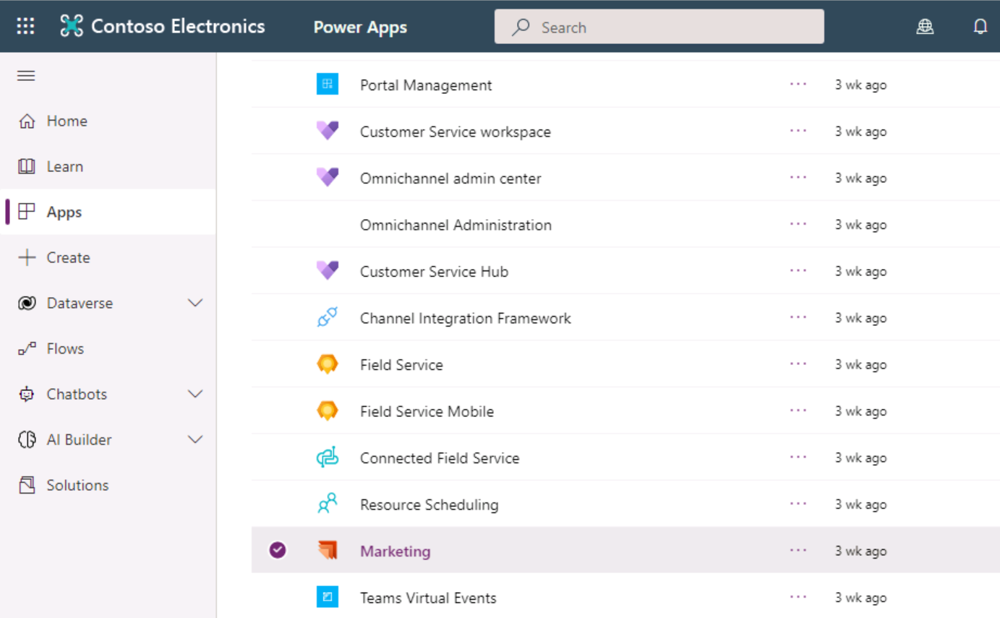

1. [] Navigate to the bottom left drop-down and change the selection from **Real-time Marketing** to **Settings**.

    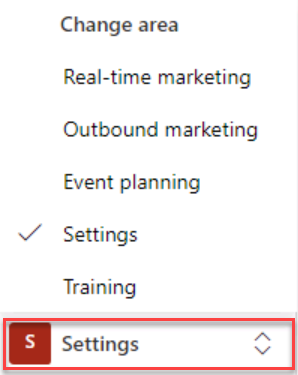

1. [] On the **Settings overview** screen, select **Dataset configuration** under **Data management**.

    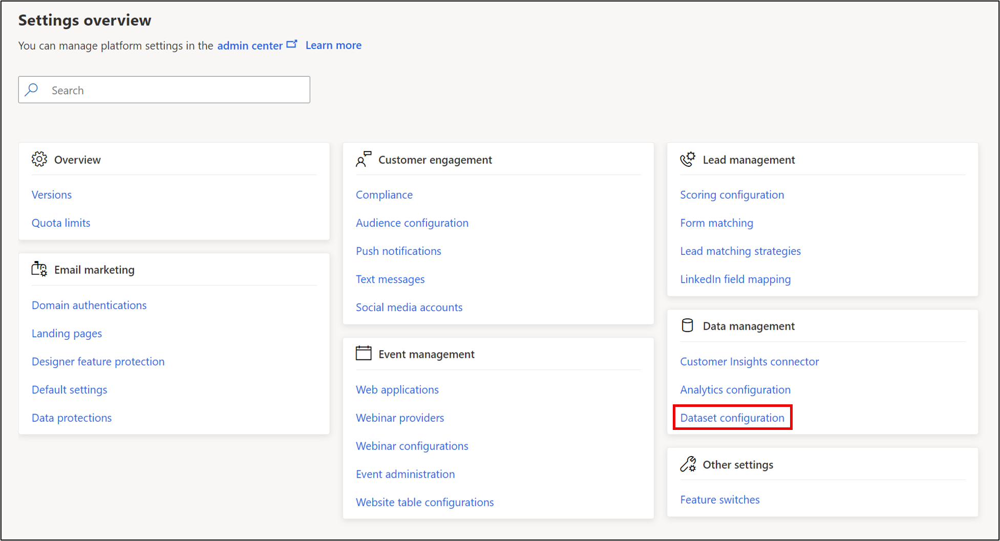

1. [] Scroll down and select the **Condition (msemr_condition)** entity.

    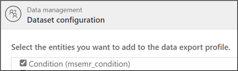

1. [] Select **Publish Changes** on the top right and select **OK** twice.

    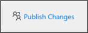

    > [!NOTE] Note: While it may take up to 30 minutes for changes to take effect, they are generally ready in a few minutes.

1. [] Go back to **Apps** and open **Patient Outreach**.

    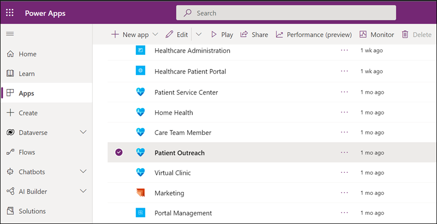

1. [] Select **Segments** on the left navigation bar to create a new specific group of patients.

    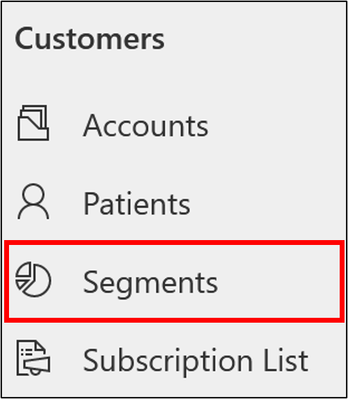

1. [] Select **New** to create a new Patient Segment. Select **+ New Dynamic Segment**.

    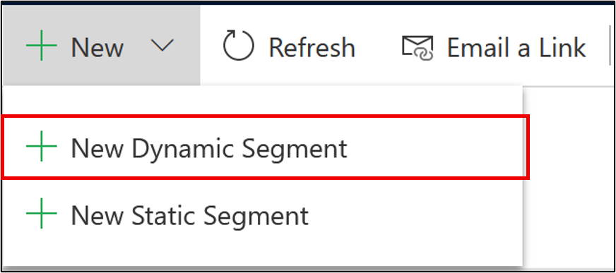

    > [!KNOWLEDGE] Did you know? Static segments enable you to choose and add segment members manually based on existing lists or search results. Dynamic Segments, which you define by using a set of rules and conditions, are constantly and automatically changing based on information in your database. Since we want our group to change depending on database information, we are choosing the dynamic segment option.

1. [] When prompted to choose a **Segment Template** option, select **Skip** since we will create our own Segment.

    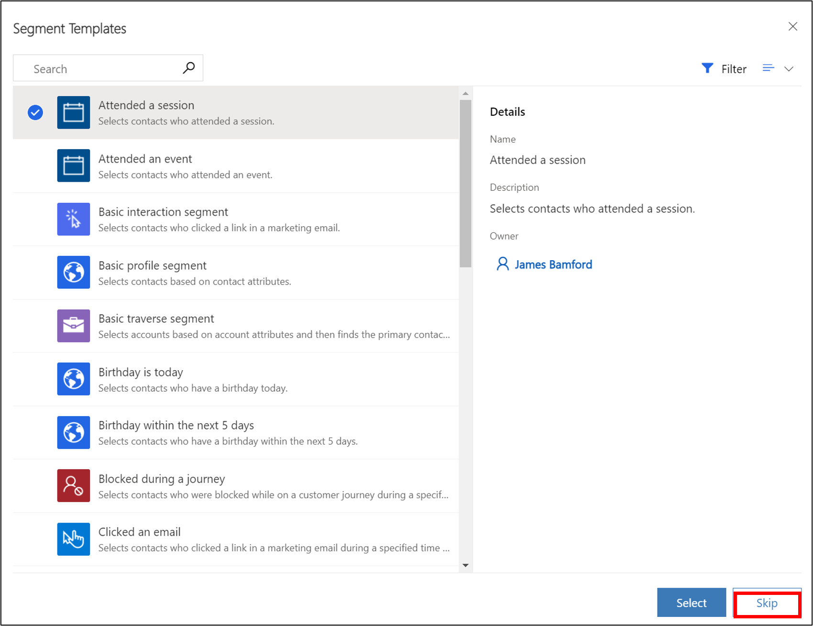

1. [] Name the new Segment +++**Patients with Hypermetropia**+++. Select **Add query block.**

    

    

    We will now create a new Segment for Active Patients who have a Hypermetropia condition where the Contact has a Status of Active, and the related Condition Description contains “Hypermetropia”. Configure this new segment by doing the following:

1. [] Leave **Contact** as the main entity.

1. [] In the **Select attribute** drop-down, select **Status** from the list of fields.

1. [] When the additional fields appear, set condition to Status **Is Active**.

1. [] Select **Add > Add related entity**.

    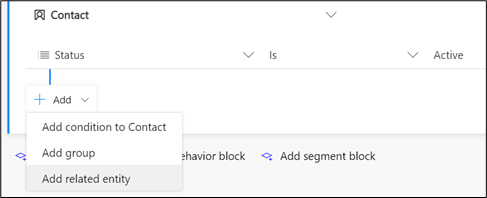

    It should default to **AND** in the drop-down. Now let’s add the second part of the condition.

1. [] In **Select related entity** drop down, choose **Condition (Condition -> Contact (Patient))**.

1. [] Select the nested **Add > Add condition to Condition**.

    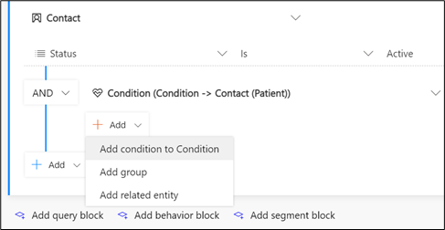

1. [] Select attribute **Condition (msemr_name)**.

1. [] Change the operator to **Contains** and type +++**Hypermetropia**+++.

    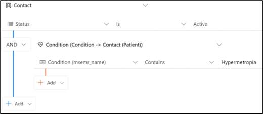

1. [] Select **Save** and then select **Go live** to publish the segment (you won't be able to use it in a customer journey until it goes live, even though you've saved it).

    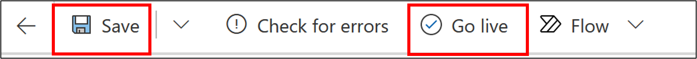

1. [] Select **Refresh** on the command bar to refresh the page. Select the **Members** tab to see which patients have been added to the Dynamic Segment. Notice Elizabeth Moore in the list who will eventually be a recipient of our marketing event outreach email.

    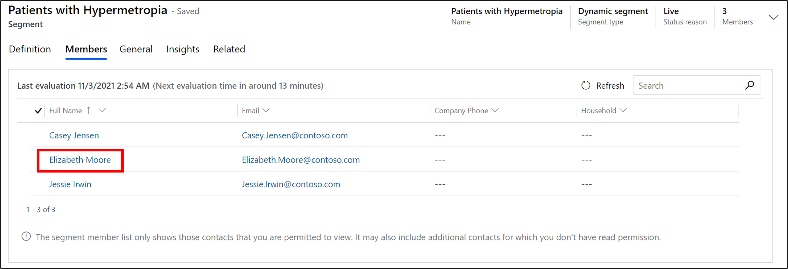

**Congratulations**! You have completed the steps to create a patient segment that groups together contacts with hypermetropia. This patient segment will be used in the next set of tasks. For more information about dynamics segments, see [Create a dynamic segment (Dynamics 365 Marketing) \| Microsoft Docs](https://docs.microsoft.com/en-us/dynamics365/marketing/create-segment). For more information about segments in general, see [Working with segments (Dynamics 365 Marketing) \| Microsoft Docs](https://docs.microsoft.com/en-us/dynamics365/marketing/segmentation-lists-subscriptions).

===

## Exercise 2: Create a Marketing Email 

In this exercise, you will create a marketing email that will be used to reach out to the patient segment you created in the previous exercise. Marketing emails are used to directly communicate with the patients that reside in a particular patient segment.

1. [] In the **Patient Outreach** app, scroll down to **Marketing Execution** in the left navigation pane and select **Marketing emails.**

    

1. [] In the **Active marketing emails** view, open **Email invitation – Free Diabetes Prevention Event**.

    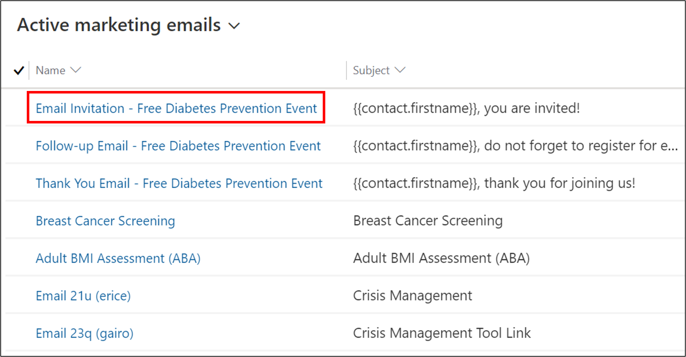

1. [] Select the **Save** dropdown on the command bar and then **Save as**.

    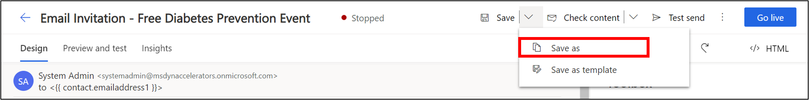

1. [] Change the **Name** of the event to +++**Email Invitation – Healthy Eye Seminar Virtual Event**+++ and the **Description** to +++**Healthy Eye Seminar Event**+++.

    

1. [] Select **Save and Close**.

    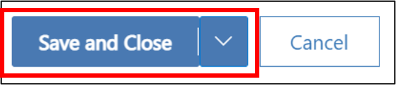

1. [] Navigate back to **Marketing** emails list and select your newly created segment **Email Invitation – Healthy Eye Seminar Virtual Event**.

    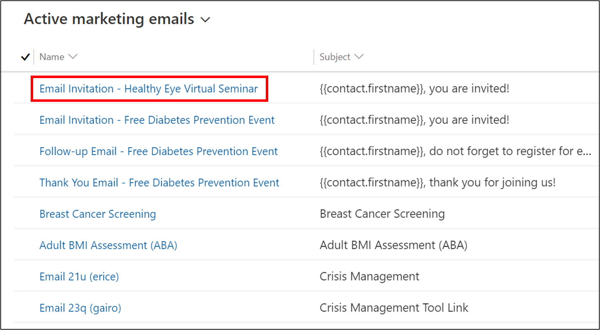

1. [] Select the image in the Designer.

    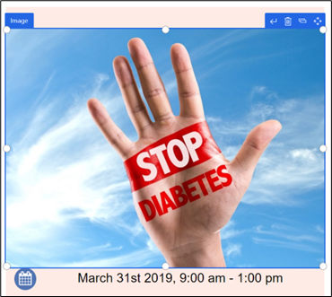

1. [] Hover over the image in the **Edit image** pane and select **Replace**. Select **Upload to library**.

    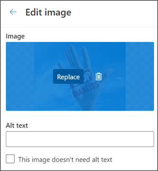

1. [] Select **Add files**.

    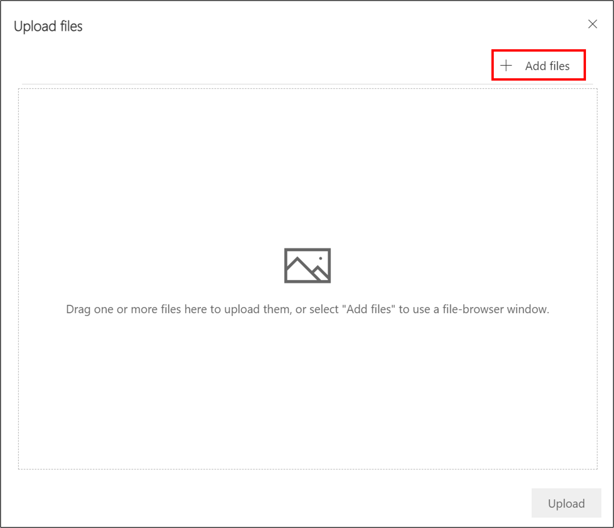

1. [] Navigate to **C:\LabFiles** and select the file **Glasses.jpg**. Select **Open** and then **Upload**.

    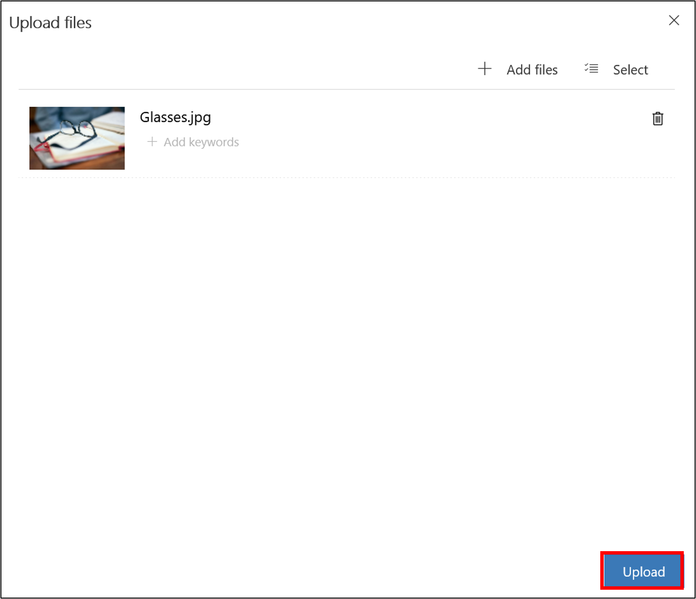

1. [] Select **Done**.

    

1. [] Edit the text of the email as follows:

    1. [] **Date**: Pick a date in the future
    1. [] **Headline**: +++Healthy Eye Seminar+++
    1. [] **Description 1**: +++Hi, {{contact.firstname}}! You are invited to Lamna Healthcare’s Healthy Eye Virtual Event.+++
    1. [] **Description 2**: +++Come join us at this virtual event!+++

        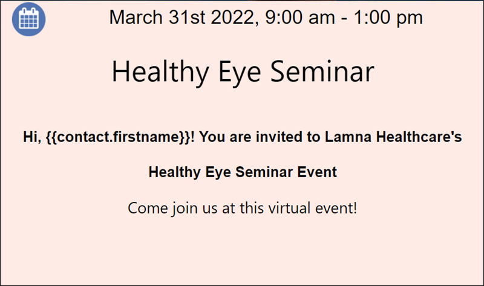

1. [] Edit the **footer** text of the email so that it reads **©2022 Lamna Healthcare Event.** Do not edit the dynamic text below it.

    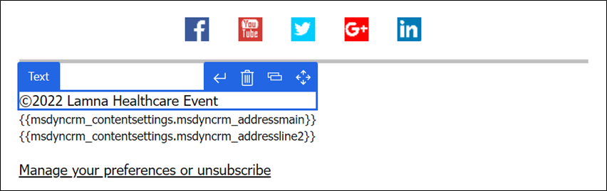

1. [] Select **Save** on the command bar and then select **Go live** so that the marketing email is available for use.

    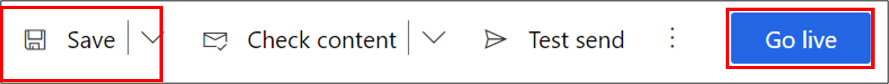

**Congratulations**! You have completed the necessary steps to create a marketing email for patient outreach. This marketing email will be used in the
next set of tasks. For more information on creating marketing emails, see [Create a marketing email (Dynamics 365 Marketing) \| Microsoft Docs](https://docs.microsoft.com/en-us/dynamics365/marketing/create-marketing-email).

===

## Exercise 3: Create a Patient Journey

In this exercise, you will create a Patient Journey for the patient segment that you created in the first exercise. A **Patient Journey** can expand your
organization’s patient outreach marketing capabilities by helping healthcare organizations guide the members of a selected segment through the communication process. It does this by using automated messaging, activity generation, interactive decision points, and more.

Here is an example of a configured **Patient Journey**, which focuses on the Patient Activation Measure segment group and sends them a marketing email after a 3-month waiting period.

Now let’s make our own customer journey for patients with hypermetropia.

1. [] In the **Patient Outreach** app, select **Patient journeys** under **Marketing execution** on the Site map.

    

1. [] Select **New** to create a new Patient Journey.

    

1. [] When prompted to choose a **Customer journey template** option, select **Skip** as we will create our own customer journey.

    

1. [] In the **Designer** view under **Who do you want to be on this journey?**, select the plus sign to **Set audience.**

    

1. [] In the **Audience** panel that shows on the right, search for the **Patients with Hypermetropia** segment that you created in the previous task.

    

1. [] Select “**Patients with Hypermetropia**” for the source segment.

    

1. [] Select the **General** tab and rename the record to +++**Healthy Eye Seminar**+++. Select **Save**.

    

1. [] Go back to the **Designer** tab. On the canvas between the gray arrows after the starting box, select the blue plus sign (**+**) that appears when you scroll over the line.

    

1. [] Select **Send an email** from the contextual menu.

    

1. [] In the panel on the right for the **Email** field, select the marketing email **Email Invitation – Healthy Eye Seminar Virtual Event** that you created in the previous exercise.

    

    

1. [] Select **Save.**

    

1. [] Switch to the **General** tab to configure the run schedule for your customer journey. Enter a **Start and End** date and time that makes sense for your event. If you want to see insights for the journey, choose an upcoming **Start time** on today’s date. Remember the dates you enter for the next exercise.

    

1. [] Select **Save**.

1. [] Your journey is now ready to go. To start the journey, navigate back to the **Designer** tab and publish it by selecting **Go live** on the command bar.

    

1. [] Dynamics 365 Marketing copies the journey to its email marketing service, which executes the journey by processing contacts, performing actions, and collecting results during the time it is set to run. Watch the journey's **Status Reason** as it sequences through **Going Live** to **Live**.

    

1. [] Once your patient journey runs, you will be able to gather **key metrics and insights** from the record. When this information is available depends on the date and time you chose for the start of the customer journey. You may come back to see the results later if they aren’t yet available.

**Congratulations**! You have created a patient journey by utilizing the patient segment and marketing email you created in the previous exercise. For more information on patient journeys, see [Create a simple customer journey (Dynamics 365 Marketing) \| Microsoft Docs](https://docs.microsoft.com/en-us/dynamics365/marketing/create-simple-customer-journey).

===

## Exercise 4: Create a Virtual Healthcare Educational Event

In this exercise, you will create a healthcare-focused, virtual educational **Event** corresponding to the patient journey you created in the previous exercise that sends the Healthy Eye Seminar event invite to everyone in the patient segment. The **Marketing Event Management** feature helps you every step of the way, from initial planning and budgeting through promotion and publication, attendee registration, webinar broadcasting, final analytics, lead generation, and evaluation of ROI.

1. [] In the **Patient Outreach** application, select **Events** on the Site Map under **Event Management**.

    

1. [] Select **New** on the command bar to create a new event.

1. [] Enter details for the New Event. Enter **Event name** as +++**Healthy Eye Seminar**+++ and enter the same **Schedule details** as you entered for the Marketing email in the previous exercise. Familiarize yourself with the other fields on the forms as part of the Preliminaries event stage.

    

1. [] Select **Save**.

1. [] Since this will be a virtual event, in the **Stream This Event Online** section, toggle “**Do you want to stream this event**” to **Yes**. If you are working on a small screen, you may have to scroll down to see this section.

    

    

1. [] In the **Business Process Flow**, select the first stage **Preliminaries**. In the flyout, select **Next Stage.**

    

1. [] Advance each stage in the business process flow until you reach the **Launch** stage. Observe the fields associated with each stage as you advance through them.

    

    > [!NOTE] If you also want to include Post Event items in your event, you can advance to the **Post Event** stage and select **Finish** at the end.

1. [] Select **Go live** on the command bar. If you don’t see Go live available, select **Save** first.

    

1. [] You will see the **Teams URL** populated.

    

1. [] You may also choose to **change the meeting options**. After toggling to enable this setting, additional fields appear. These allow you to modify settings such as making the recording available to attendees, enabling meeting chat, allowing reactions, etc.

    
    
**Congratulations**, you have created a virtual marketing event for patients with hypermetropia by using Microsoft Cloud for Healthcare. For more information, see [Event planning and management overview](https://docs.microsoft.com/en-us/dynamics365/marketing/event-management/).
