Module 4 Lesson 1- Lab 1: Patient Outreach

## Overview

The **Patient Outreach** application in Microsoft Cloud for Healthcare focuses on patient campaign management, which helps you organize and automate marketing and communicate with patients. It helps healthcare providers reach out to their communities and patients in a targeted, efficient way. Providers can choose email, text, regular mail, or a combination, to provide healthcare information to specific groups of patients and community members.

The Patient Outreach application in Microsoft Cloud for Healthcare allows healthcare providers to communicate with their communities and patients in a targeted, efficient way. Patient Outreach is a patient campaign management application that helps you organize and automate marketing and outreach to patients. The application allows you to orchestrate personalized journeys across patient touchpoints to strengthen relationships and increase patient retention and thus improving care.

Key capabilities of **Patient Outreach** include:

-   **Patient segmentation** - Prebuilt patient segments are based on the industry
    standard Healthcare Effectiveness Data and Information Set (HEDIS) to
    provide baseline patient cohorts.

-   **Patient engagement campaigns** - Create healthcare-specific email campaigns
    that use patient segments based on the HEDIS industry standard.

-   **Event management** - Use provider and payer event management templates for
    event administration and registration.

-   **Trigger-based journeys** - Allow patient journeys to initiate based on a condition and enable faster reactions to patient interactions and changes. Trigger journeys are based on real-world interactions such as checking in for an appointment or being discharged from the hospital.

Patient Outreach focuses on the Deliver exceptional patient and member experiences priority scenario by creating personalized communication based on patient insights

This lab focuses on the healthcare story of Elizabeth Moore.

At an annual checkup earlier this year, Elizabeth is diagnosed with hypermetropia, a common eye condition in adults in which nearby objects are blurry. Lamna Healthcare Company has seen a recent influx of patients who want to be more educated on hypermetropia. Lamna has decided to increase their patient outreach efforts by hosting a virtual marketing event.

In this module, you'll play the role of a Lamna Healthcare Company marketing administrator and will use the Patient Outreach capabilities in Microsoft Cloud for Healthcare to walk through the following exercises:

1.	Create a patient segment to group patients based off a similar characteristic.
2.	Create a marketing email for outreach to patients in the defined segment.
3.	Create a patient journey using the designer to send the marketing email to everyone in the patient segment.
4.	Create a virtual marketing event to track the attendees and details of the event.
5.	Create a trigger and use this to trigger a patient journey.

## Exercise 1: Create a Patient Segment

In this exercise, you'll create a patient segment by using the Patient Outreach app in Microsoft Cloud for Healthcare. You can use a patient segment to group patients into cohorts based on similar characteristics so that they can be better targeted with marketing communications. In this example, you'll create a patient segment for patients with hypermetropia (a vision condition in which nearby objects appear blurry).

1.  Navigate to https://make.powerapps.com/ and log into your Microsoft 365 tenant, if needed.

1.  If needed, change the environment on the top right corner of the Power apps home page.
  
2.  Go to **Apps**. Click on **All** tab if you don’t see apps.

3.  Select **Customer Insights - Journeys**  app in the right pane. Click on play button to launch the application.

4.	Check you are in the **Real-time journeys** area. If not, change the area accordingly. 

5.	Select **Segments** under **Audience** from the left navigation pane.

6.	Click on a **New Segment**.
 
7.	Update with below details:

    1.	Name of the Segment – **Patients with Hypermetropia**

    2.	Select the target Audience – **Contact**

    3.	Click on **Create**.
 
8.	Expand the arrow beside the **Add a new group** and select **Attribute group**.
 
9.	Search for **Status** under Search area. Expand **Contact** and select **Status** under Contact. Add it to existing group.
 
10.	 Select the **operator** as **Is** and **Value** as **Active**
 
11.	Select **Add a subgroup**.

12.	Enter **Condition** in the search area on the Right-side panel. Select **Condition** under **Condition**. Click on **+** symbol. Select **Existing group** and then select **Group 1.1.**

**Note** - If you are unable to find, you can click on Add a table and add the condition table
 
13.	 Select **Patient** under **Add an attribute from a different table** pop-up.
 
14.	Click on **Done**.
 
15.	 Update with below details

        1. Operator – **Contains**

        2.	Value – Enter **Hypermetropia**

        3.	Click on **Save**.
 
16.	 Click on **Ready to use**.
 
17.	 The segment takes approximately 10-15 minutes to be used in journey.
 
**Note**- You won't be able to use the new patient segment in a customer journey until it goes live.

18.	Select **Refresh** on the command bar to refresh the page.

19.	Select the **Members and Insights** tab to see which patients have been added to the Dynamic segment. Notice Elizabeth Moore in the list, a recipient of our next marketing event outreach email.
 
You've completed the steps to create a patient segment that can be used for patient outreach. This patient segment will be used in the tasks in the next exercise. For more information about dynamics segments, see [Create a dynamic segment (Dynamics 365 Marketing)](https://learn.microsoft.com/en-us/dynamics365/marketing/create-segment/). For more information about segments in general, see [Working with segments (Dynamics 365 Marketing)](https://learn.microsoft.com/en-us/dynamics365/marketing/segmentation-lists-subscriptions/).

    
## Exercise 2: Create a Marketing Email 

In this exercise, you'll create a marketing email that will be used to reach out to the patient segment that you created in the previous exercise. Marketing emails help you directly communicate with patients who reside in a particular patient segment.

1.	Select **Emails** under **Channels** from the Left navigation pane.

2.	Click on **+ New**.
 
3.	Click on **Skip** on Email templates window.

4.	Rename the Email as **Email Invitation - Healthy Eye Seminar Virtual Event.**
 
5.	In the Email body, Click on **Add element here** and click on **Image**.
 
6.	Click on **Add image > Upload to library**.
 
7.	Navigate to the path where **Glasses.jpg** image is saved and upload the file.

8.	Click on + sign once the image is uploaded.
 
9.	Click on **text**.
 
10.	Edit the text of the email as follows:

    1.	Pick a date : **December 1st, 2023, 9:00 am to 1:00 pm**

    2.	Headline : **Healthy Eye Seminar**

    3.  Description 1 - **Hi, {{contact.firstname}}! You're invited to Lamna Healthcare's Healthy Eye Virtual Event.**

    4.	Description 2 - **Come join us at this virtual Event.**
 
12.	Remove the **{{contact.firstname}}** and click on **Personalization**.
 
13.	Click on **New Dynamic text**.
 
14.	Click on **Choose an attribute.**
 
15.	Expand **Contact** and select **first name**.
 
16.	Edit the footer text of the email so that it reads **©2023 Lamna Health Event.**
 
17.	Update the below details

    1.	From – Enter the text as **Your Care Team at**

    2.	From Email – Add a dynamic content text Account’s Name. – {{AccountName}}
 
    3.	Scroll up and add a Subject - You are invited for Healthy Eye Virtual Seminar!
 
    4.	On the right-side panel, click on **Settings**, Under Reply to **Email** please enter dynamic content text Email.
 
18.	On the command bar, select **Save**. Click on **Ready to Send**.

You've completed the steps to create a marketing email that can be used for patient outreach. This marketing email will be used in the next exercise. For more information on creating marketing emails, see [Create a marketing email (Dynamics 365 Marketing)](https://learn.microsoft.com/en-us/dynamics365/marketing/create-marketing-email/)

## Exercise 3: Create a Patient Journey

In this exercise, you will create a Patient Journey for the patient segment that you created in the first exercise. A **Patient Journey** can expand your
organization’s patient outreach marketing capabilities by helping healthcare organizations guide the members of a selected segment through the communication process. It does this by using automated messaging, activity generation, interactive decision points, and more.

Here is an example of a configured **Patient Journey**, which focuses on the Patient Activation Measure segment group and sends them a marketing email after a 3-month waiting period.

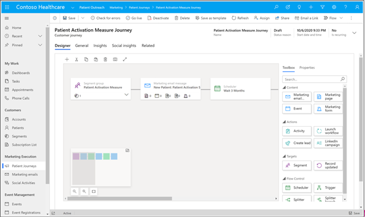

Now let’s make our own customer journey for patients with hypermetropia.

1.  In the **Patient Outreach** app, select **Patient journeys** under **Marketing execution** on the Site map.

    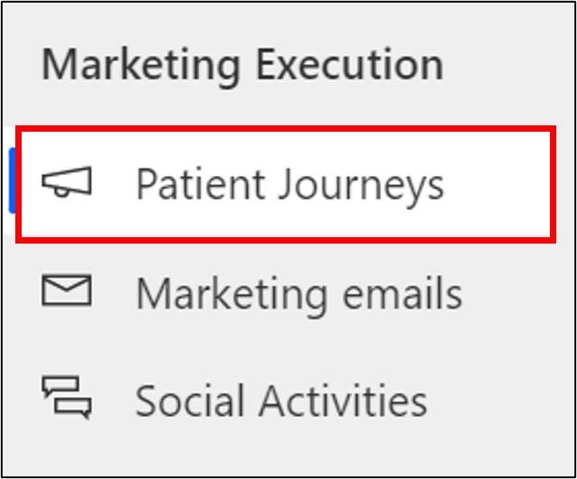

1.  Select **New** to create a new Patient Journey.

    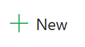

1.  When prompted to choose a **Customer journey template** option, select **Skip** as we will create our own customer journey.

    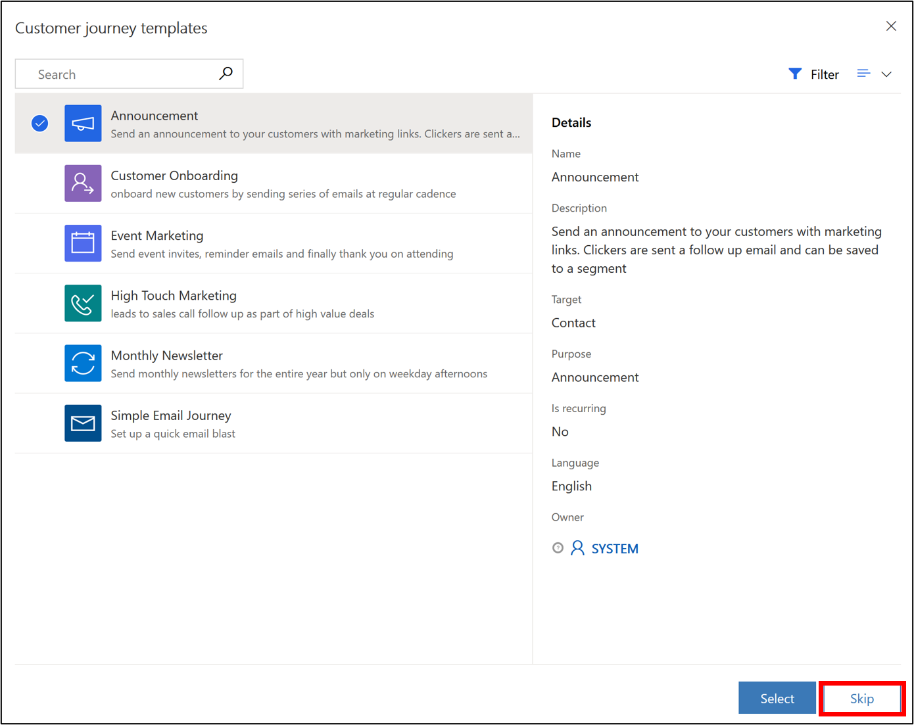

1.  In the **Designer** view under **Who do you want to be on this journey?**, select the plus sign to **Set audience.**

    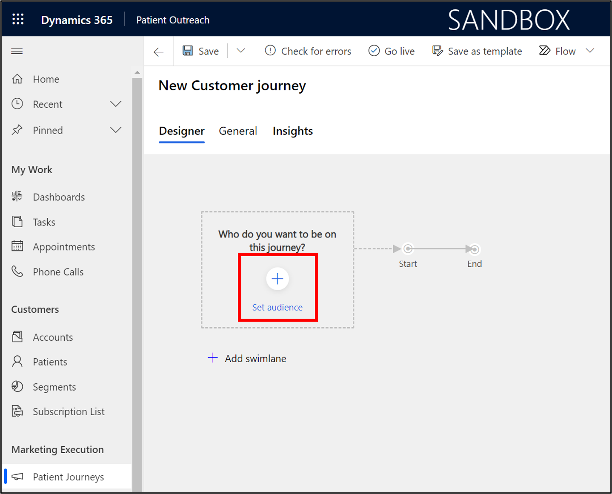

1.  In the **Audience** panel that shows on the right, search for the **Patients with Hypermetropia** segment that you created in the previous task.

    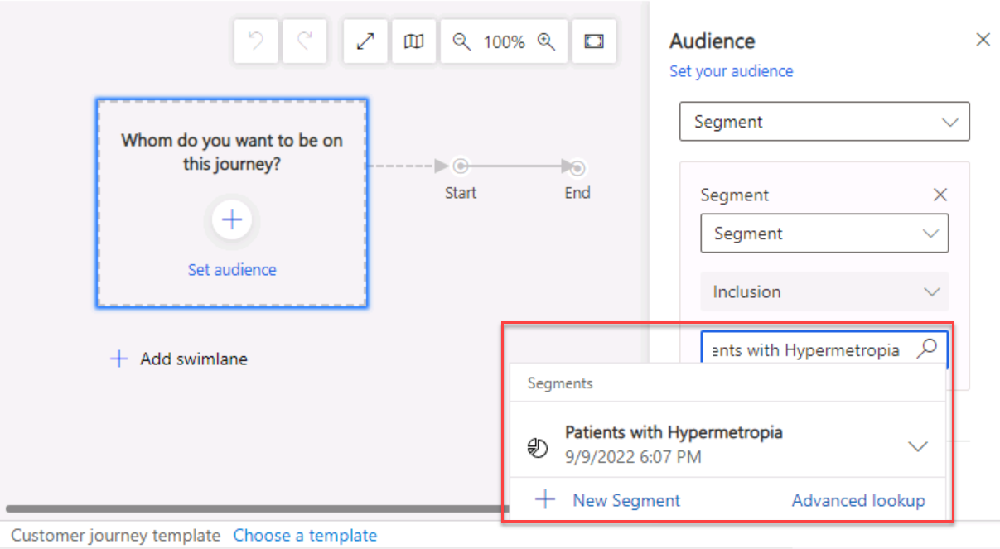

1.  Select “**Patients with Hypermetropia**” for the source segment.

    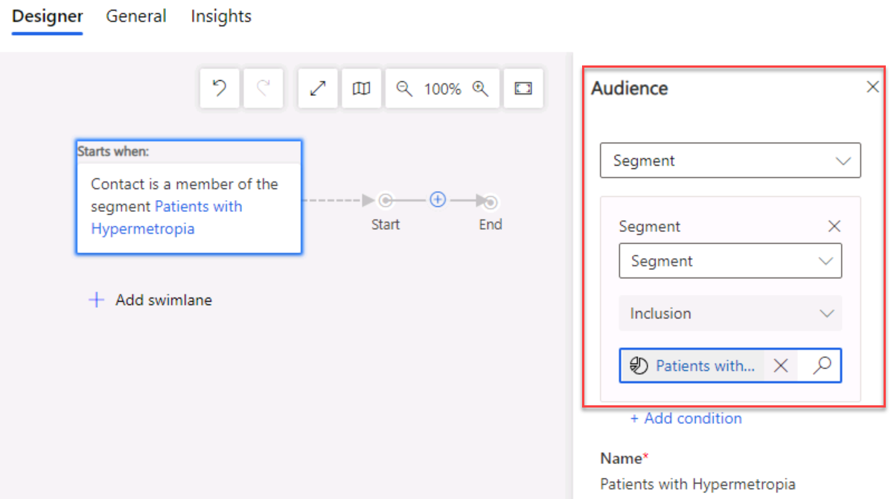

1.  Select the **General** tab and rename the record to **Healthy Eye Seminar**. Select **Save**.

    

1.  Go back to the **Designer** tab. On the canvas between the gray arrows after the starting box, select the blue plus sign (**+**) that appears when you scroll over the line.

    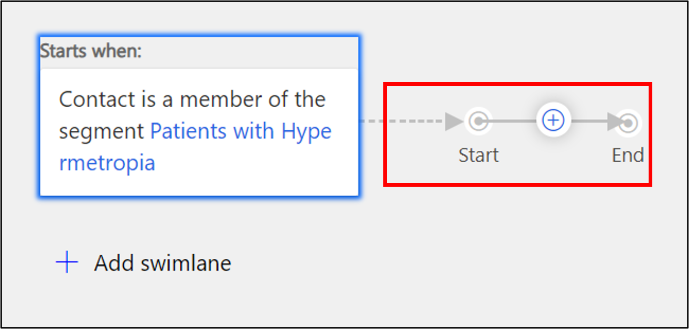

1.  Select **Send an email** from the contextual menu.

    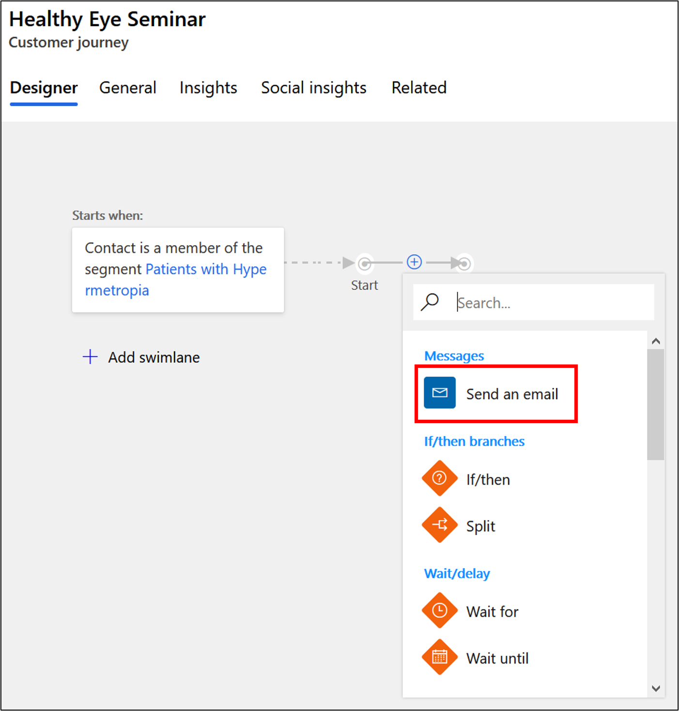

1.  In the panel on the right for the **Email** field, select the marketing email **Email Invitation – Healthy Eye Seminar Virtual Event** that you created in the previous exercise.

    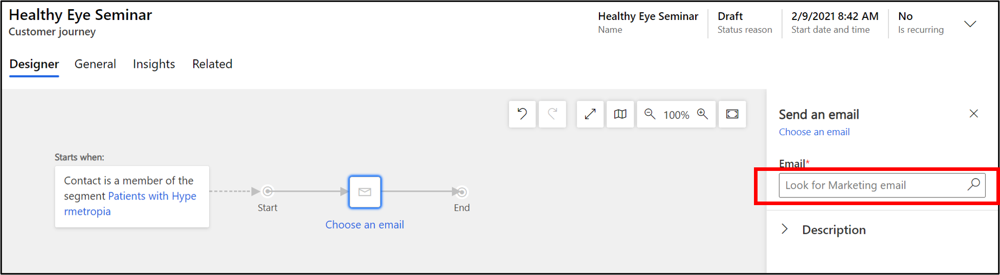

    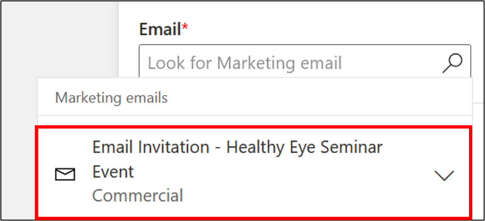

1.  Select **Save.**

    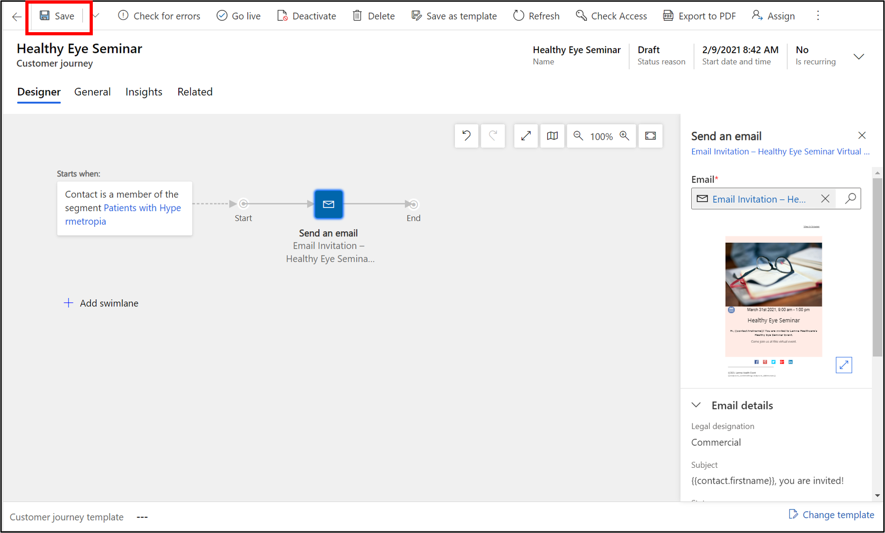

1.  Switch to the **General** tab to configure the run schedule for your customer journey. Enter a **Start and End** date and time that makes sense for your event. If you want to see insights for the journey, choose an upcoming **Start time** on today’s date. Remember the dates you enter for the next exercise.

    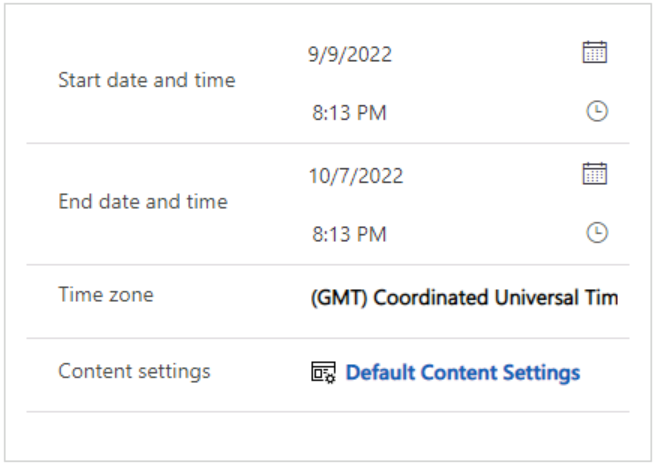

1.  Select **Save**.

1.  Your journey is now ready to go. To start the journey, navigate back to the **Designer** tab and publish it by selecting **Go live** on the command bar.

    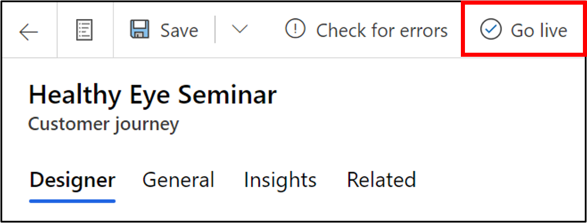

1.  Dynamics 365 Marketing copies the journey to its email marketing service, which executes the journey by processing contacts, performing actions, and collecting results during the time it is set to run. Watch the journey's **Status Reason** as it sequences through **Going Live** to **Live**.

    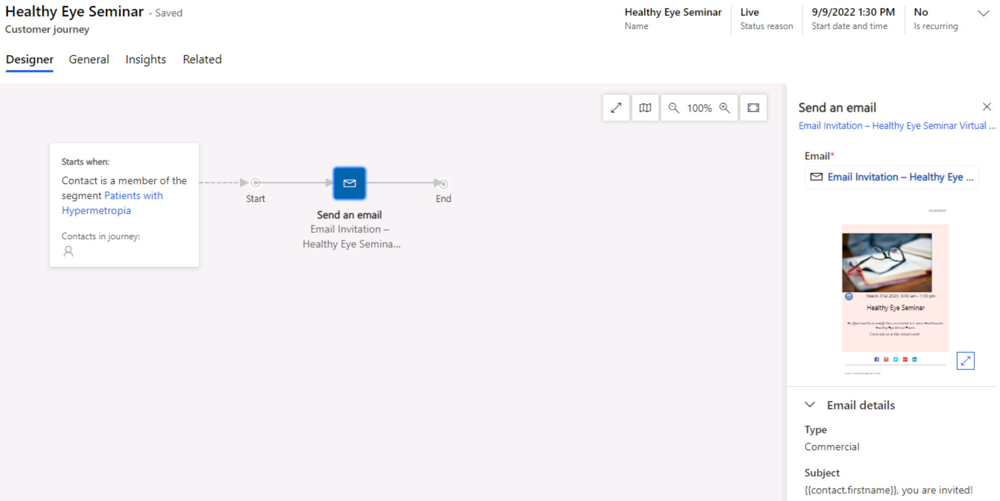

1.  Once your patient journey runs, you will be able to gather **key metrics and insights** from the record. When this information is available depends on the date and time you chose for the start of the customer journey. You may come back to see the results later if they aren’t yet available.

**Congratulations**! You have created a patient journey by utilizing the patient segment and marketing email you created in the previous exercise. For more information on patient journeys, see [Create a simple customer journey (Dynamics 365 Marketing) \| Microsoft Docs](https://docs.microsoft.com/en-us/dynamics365/marketing/create-simple-customer-journey).

=

## Exercise 4: Create a Virtual Healthcare Educational Event

In this exercise, you will create a healthcare-focused, virtual educational **Event** corresponding to the patient journey you created in the previous exercise that sends the Healthy Eye Seminar event invite to everyone in the patient segment. The **Marketing Event Management** feature helps you every step of the way, from initial planning and budgeting through promotion and publication, attendee registration, webinar broadcasting, final analytics, lead generation, and evaluation of ROI.

1.  In the **Patient Outreach** application, select **Events** on the Site Map under **Event Management**.

    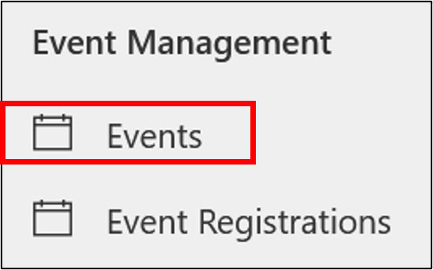

1.  Select **New** on the command bar to create a new event.

1.  Enter details for the New Event. Enter **Event name** as **Healthy Eye Seminar** and enter the same **Schedule details** as you entered for the Marketing email in the previous exercise. Familiarize yourself with the other fields on the forms as part of the Preliminaries event stage.

    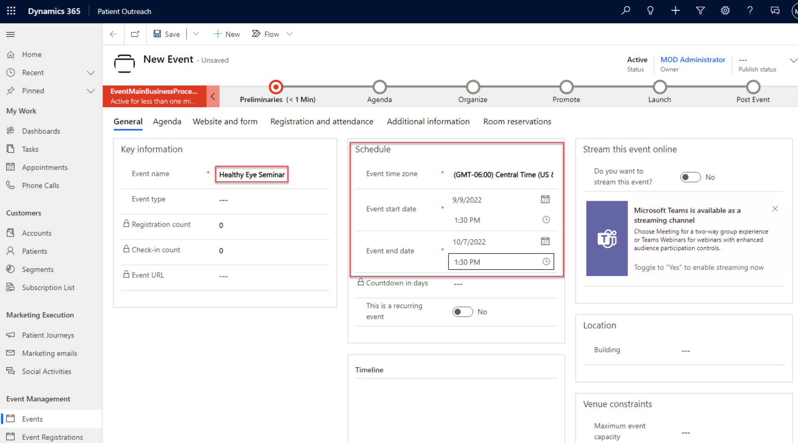

1.  Select **Save**.

1.  Since this will be a virtual event, in the **Stream This Event Online** section, toggle “**Do you want to stream this event**” to **Yes**. If you are working on a small screen, you may have to scroll down to see this section.

    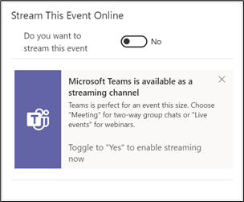

    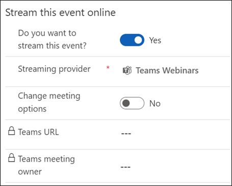

1.  In the **Business Process Flow**, select the first stage **Preliminaries**. In the flyout, select **Next Stage.**

    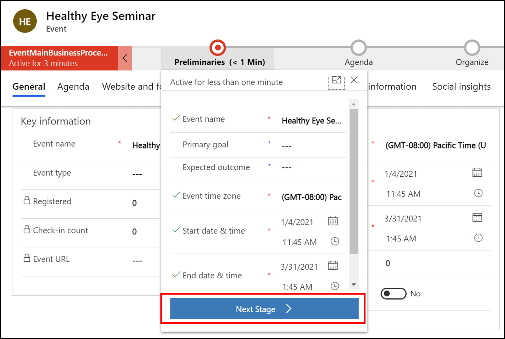

1.  Advance each stage in the business process flow until you reach the **Launch** stage. Observe the fields associated with each stage as you advance through them.

    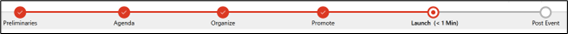

    > [!NOTE] If you also want to include Post Event items in your event, you can advance to the **Post Event** stage and select **Finish** at the end.

1.  Select **Go live** on the command bar. If you don’t see Go live available, select **Save** first.

    

1.  You will see the **Teams URL** populated.

    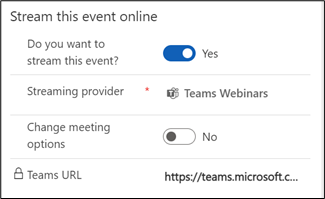

1.  You may also choose to **change the meeting options**. After toggling to enable this setting, additional fields appear. These allow you to modify settings such as making the recording available to attendees, enabling meeting chat, allowing reactions, etc.

    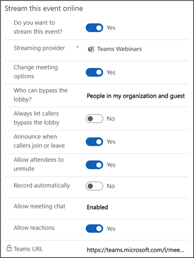
    
**Congratulations**, you have created a virtual marketing event for patients with hypermetropia by using Microsoft Cloud for Healthcare. For more information, see [Event planning and management overview](https://docs.microsoft.com/en-us/dynamics365/marketing/event-management/).
