# Module 4 Lesson 1- Lab 2B: Configuring Omnichannel

## Overview

As stated in the Lab 2A, Lamna Healthcare Company is seeking to streamline their patient engagement capabilities by implementing Azure Health Bot to help improve processes and services, such as entering medication requests. By allowing patients to interact with this service, Lamna Healthcare Company will move one step closer to their goal of improving patient outcomes while reducing overall costs.

In this lab, you'll play the role of a Lamna Healthcare IT developer and use the Azure Health Bot you configured in Lab2A to integrate with Dynamics 365 Omnichannel. This will complete the work for a medication refill scenario.

## Assign the Omnichannel agent security role

To assign the Omnichannel agent security role, follow these steps:

1.	While in an InPrivate or Incognito browser, go to [Microsoft Power Apps](https://make.powerapps.com/)

2.	Select your environment from the **Environment** dropdown menu in the upper right.

3.	Select the **gear icon** in the upper-right corner and then select **Advanced settings**.
 
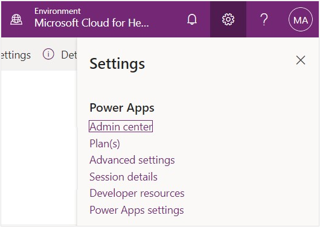

4.	A new window should open showing the **Business Management** section of Dynamics 365. If loading takes a while, reload the page.

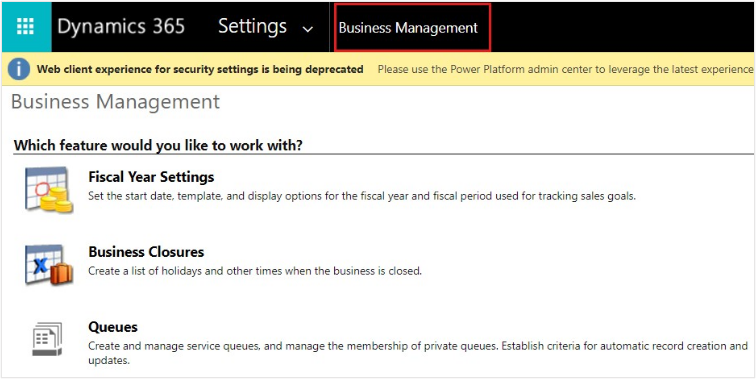

5.	On the upper command bar next to Dynamics 365, select **Settings** to open the dropdown menu. Select **Security** in the third column under **System**.

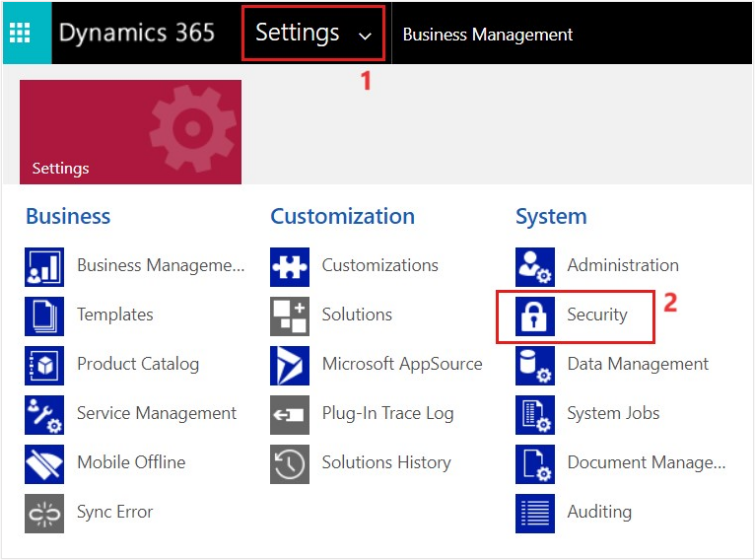

6.	Under **Security**, select **Users**.

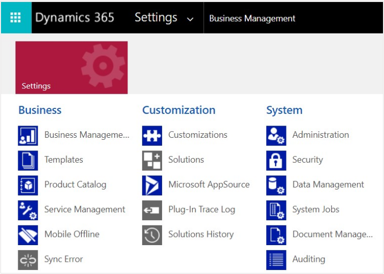

7.	Switch the grid view dropdown menu from **Omnichannel Users** to **Enabled Users** so that you can view the user in the list.

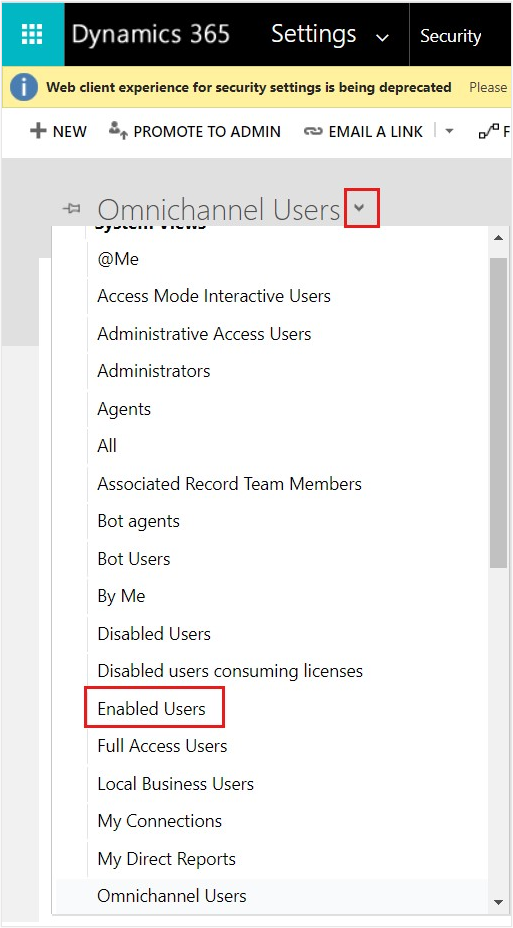

8.	In the **Enabled Users** list, scroll or use the search bar to find your user.

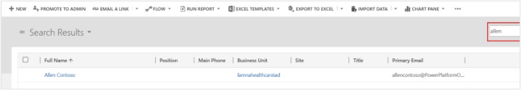

9.	Select your user for the training and then select **Manage Roles** on the upper command bar.
 
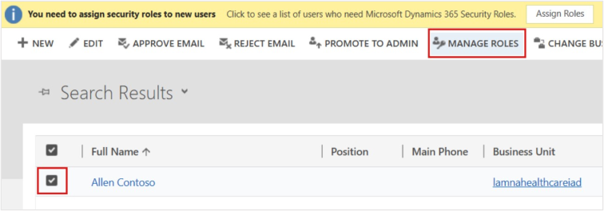

10.	Select the **Omnichannel agent** role to assign to your user and then select **OK**.

You've now assigned the correct Omnichannel agent role to the user, which will allow you to be a live agent in Omnichannel.

## Task: Create a Health Bot user in Dynamics 365 Customer Service

You need to set up two users in Omnichannel for Customer Service:

1. **Health Bot User** - The Azure Health Bot user that you created in the previous exercise. This configuration will allow you to assign the bot as a user and take initial messages through live chat.

2. **Omnichannel Agent User** - The current user account that you've used to sign in to Dynamics 365. This configuration will allow you to be a live agent in Customer Service who receives messages from portal users through Azure bot escalations.

In this task, you'll create a bot user, which will help you connect **Azure Health Bot** with **Omnichannel live chat.**

1.	Open a new tab and go to Power Platform admin URL -  [Microsoft Power Platform admin center.](https://admin.powerplatform.microsoft.com/)

2.	Select **Environments** from the left navigation pane. Search for and select your Microsoft Cloud for Healthcare environment from the list.

3.	On your **Environments > Details** page, select the **Settings** button on the upper command bar.

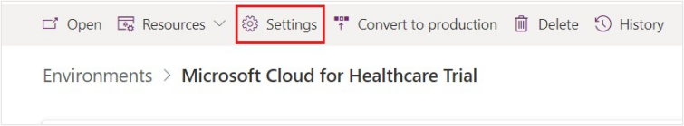

4.	Expand **Users + permissions** and then select **Application users**.

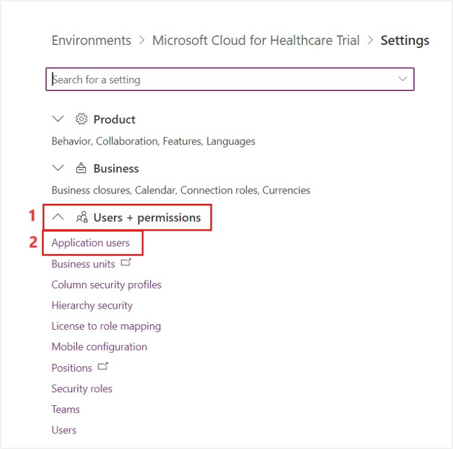

5.	Select the **+ New app user** button to create a new application user.

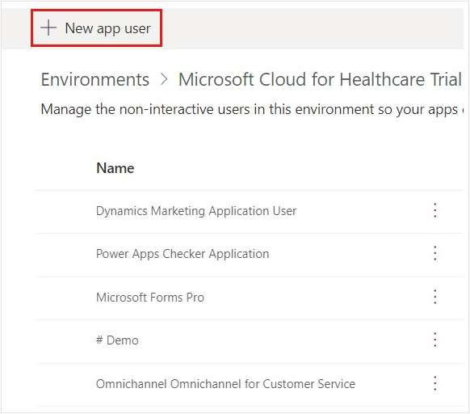

6.	Select **+ Add an app** on the **Create a new app user** page.

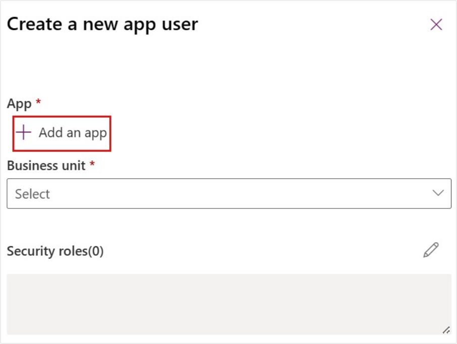

7.	Paste the **Application ID** (the Application (client) ID that you obtained in the Azure portal for the supplied MCH Application ID) into the search box and then select the app from the list. You can also search for **mch**. Select **Add**.

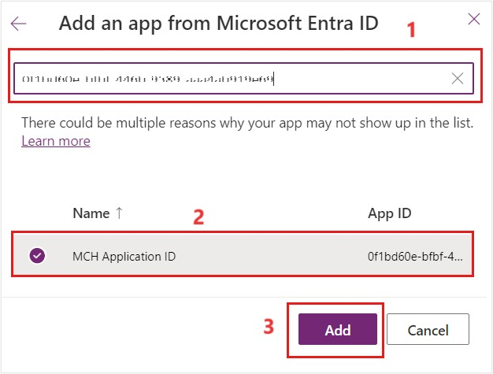

8.	Select a **Business unit** from the dropdown list (the options in the list will be unique for each Dynamics 365 environment). Select **Create** in the lower right of the page.
 
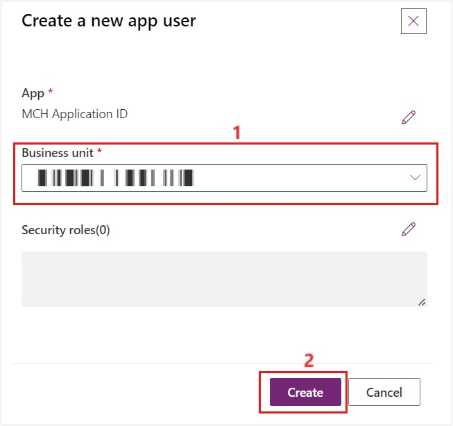

9.	Return to the **Dynamics 365 User** page that you previously accessed through **Advanced settings**. Switch the view to **Enabled Users** if you're not already on it. Clear the search terms, if any.

10.	While in the **Enabled Users** list, search for **MCH Application ID** or scroll to find the bot app user. Double-click the user or select the row and then select **Edit**.

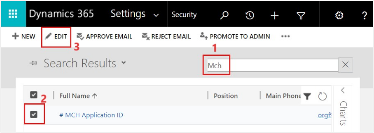

11.	Above the username, change the form type from **User** to **Application User.**

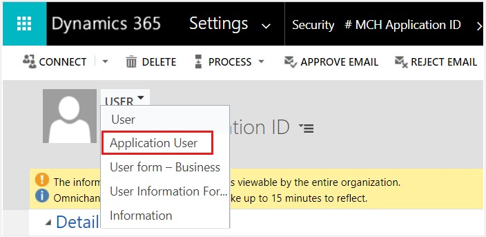

A new form will appear, and the **User type** should show as **Application user.**

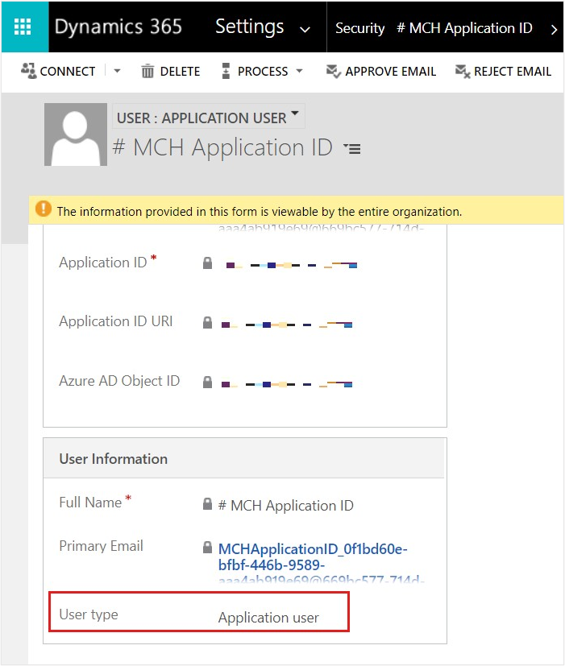

12.	In the **User Information** section, change the User type from Application user to **Bot application** **user**. A new field called **Bot application ID** will display.

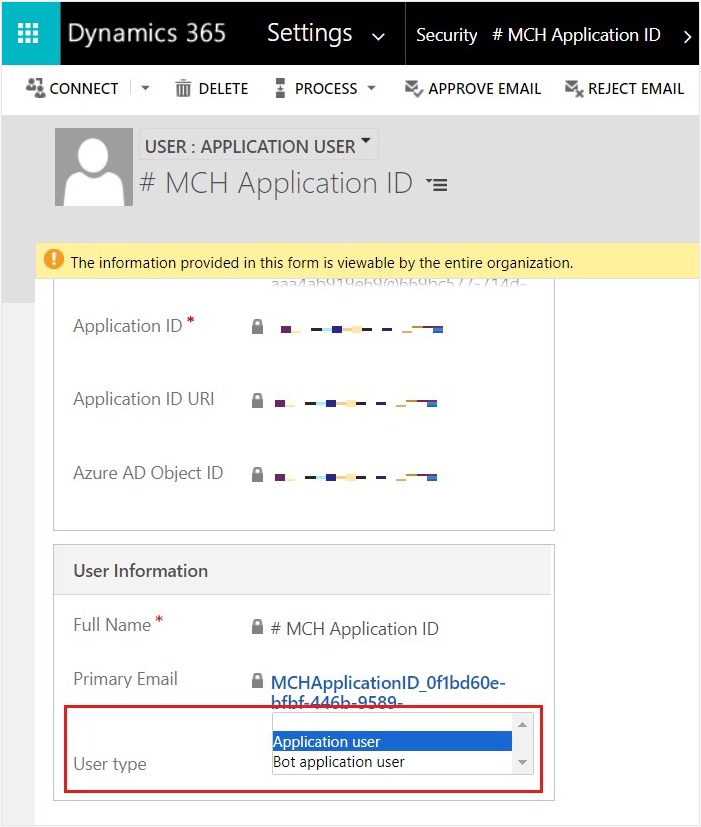

13.	Add your details to the **Bot application ID**. This ID is the Azure Health Bot ID that you previously noted when you enabled the Teams and Omnichannel channels. This field displays after **Bot application user** has been selected as the **User type.**

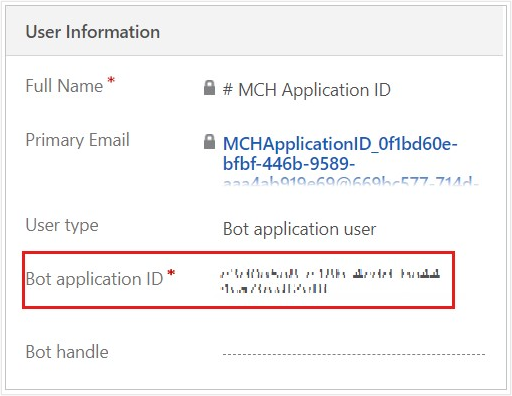

14.	Select **Manage Roles** on the command bar.

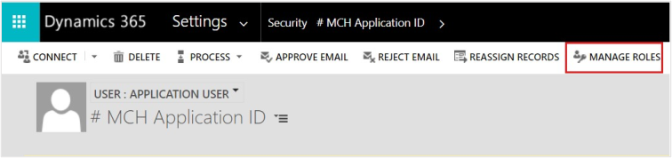

15.	Assign the **Omnichannel agent** role to the bot user as you did for your own user in the previous task. This action will allow the bot to act as an omnichannel agent like your user.

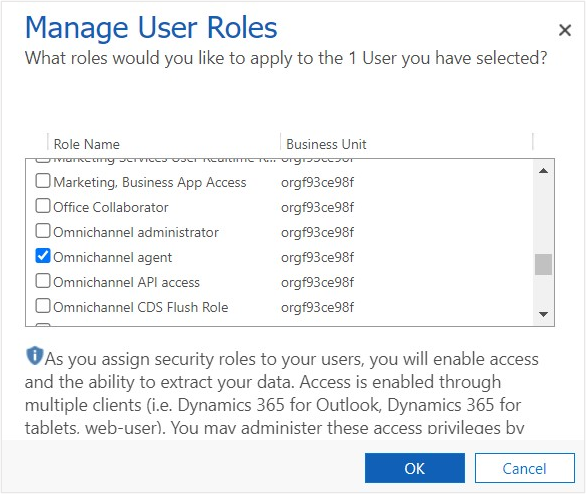 

16.	Select **OmniChannel Administrator** role for your user ID and MCH Application Id users.
 
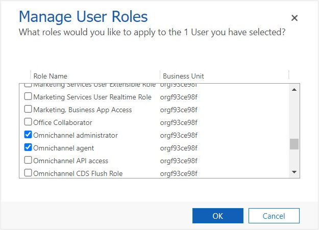

You've successfully created a bot user and have assigned the Omnichannel agent role to it.

## Task: Create and set up human agent queues

You can use queues to collect and distribute workload among agents. As a result, agents will be added as members to the queues and the workload will be distributed among the agents based on assignment methods. For more information, see [Manage queues for unified routing.](https://learn.microsoft.com/en-us/dynamics365/customer-service/queues-omnichannel?tabs=customerserviceadmincenter)

In this task, you'll create the omnichannel queue that's necessary for communicating with a human agent.

1.	Switch back to the tab with [Power Apps](https://make.powerapps.com/) select Apps in the left navigation pane and open the **Customer Service admin center** app

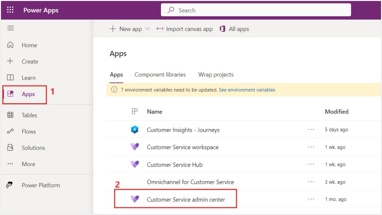

2.	You should be on the **Home** page.  Select **Guided channel setup** on the left navigation pane and select **Start new.**
 
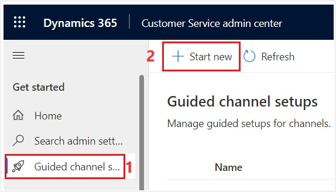

3.	On the **Name your setup** page, in the **Setup name** field, enter the name as **Healthcare** **Training**. Select **Next**.

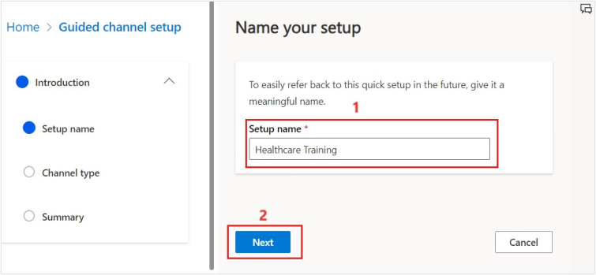

4.	Select **Chat** as the channel type. Select **Next**.

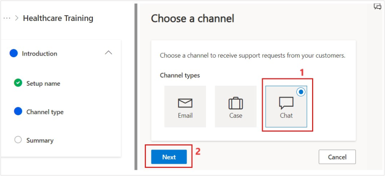

5.	Select **Continue** **setup** on the **Summary** page.

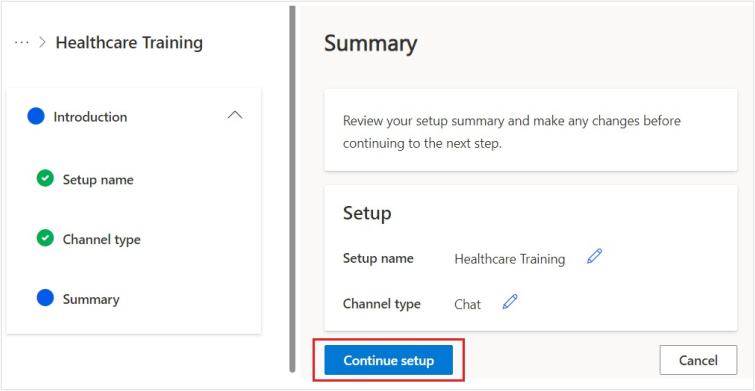 

6.	Select **Next** on the following two screens, which discuss creating user accounts and assigning security roles.

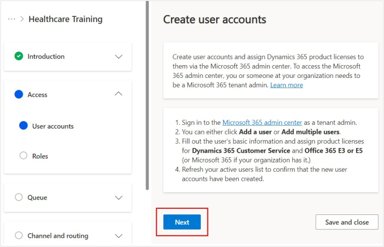

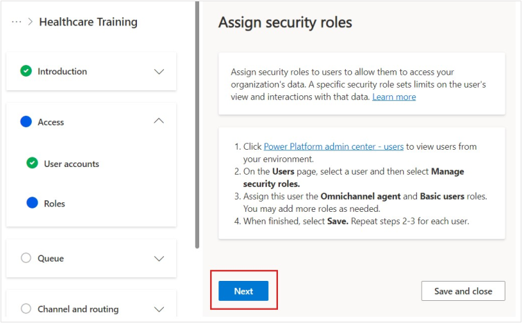

7.	In the  Define a queue page, create a queue called **Escalate to Human,** which will manage and redirect the incoming messages from a user to a Customer Service (human) agent when the bot sends the user through to a live agent. Create the new queue with the following details:

    o	**Name** - Escalate to Human

    o	**Type** - It will default to **Messaging**

8. Select  **Next**.

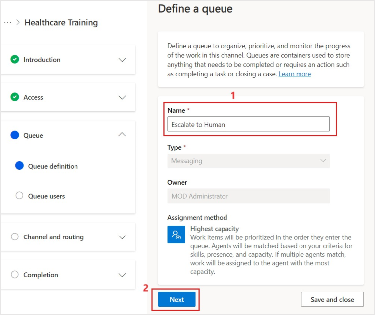

9.	Select your user to add to the queue. Select **Next**.

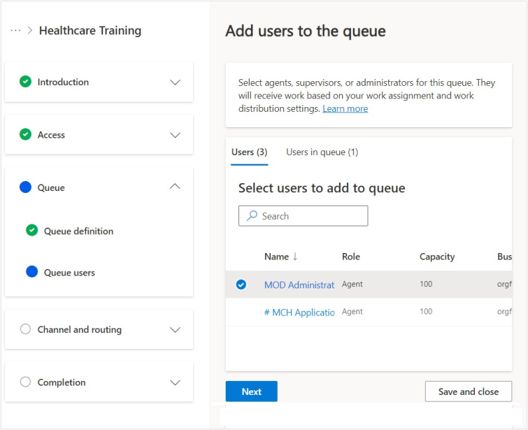

You've now created the necessary queue to escalate to a human agent and have added your user to the messaging queue. Now, you can create the workstream to initially route to a virtual bot, along with routing rules to direct the user to the **Escalate to Human** queue in the proper conditions.

## Task: Update the live workstream with context variables and routing rules

A workstream is a container to enrich, route, and assign work items, and it's associated with a channel, such as live chat, voice, or case. After a bot has been added to a workstream, the incoming work item will be routed to the selected bot at runtime based on classification rules. For more information, see [Create workstreams for unified routing.](https://learn.microsoft.com/en-us/dynamics365/customer-service/create-workstreams?tabs=customerserviceadmincenter)

In this task, you'll set up basic chat routing with a new workstream. This setup will allow users to chat with a bot user initially and then route to a live human agent in the proper situation.

You'll complete the following tasks:

1. Create a new channel and workstream.

2. Turn on proactive chat for the channel.

3. Add a bot for initial routing: Initial customer conversation is directed to the Azure Health Bot.

4. Create a context variable and routing rule to escalate to a human agent. When context variable **EscalateToAgent** is present and set to **1**, you'll route to the **Escalate to Human** queue that you previously set up with your user so that an agent can continue the conversation.

1.	While continuing the guided setup from the previous task, enter a **Chat name** and **Chat language** for your channel and a workstream **Name**. Keep the **Work distribution mode** as **Push** and then select **Next**.

    o	**Chat name** - Chat Widget

    o	**Workstream Name** - Chat Workstream

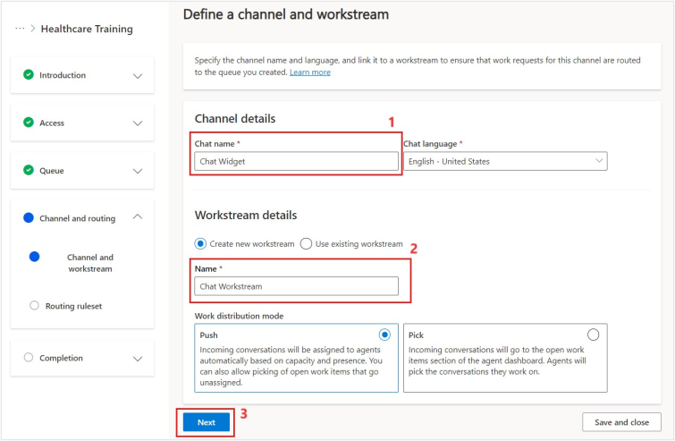

2.	Define a ruleset that will allow work from this channel to be routed to the **Escalate to Human** queue. Name the **Routing rules as Human Agent** and the **Rule item** as **Human Agent Rule**. Select **Next**.

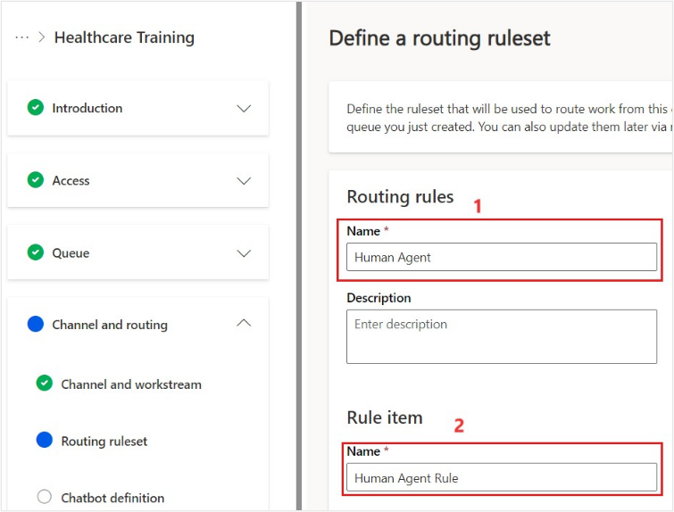

**Note** – On **Define a Chatbot** page select **Skip for now** and select **Next**.
 
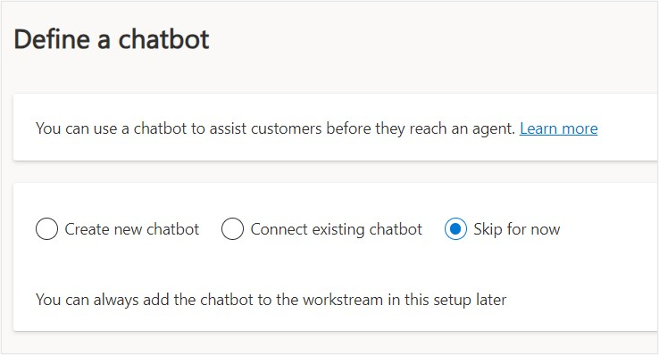

3.	It will take a moment for the system to create the chat channel and workstream. When the process is complete, make sure that you **Copy** the c**hat widget snippet** **code** and store it for later. Select **Go to home**.

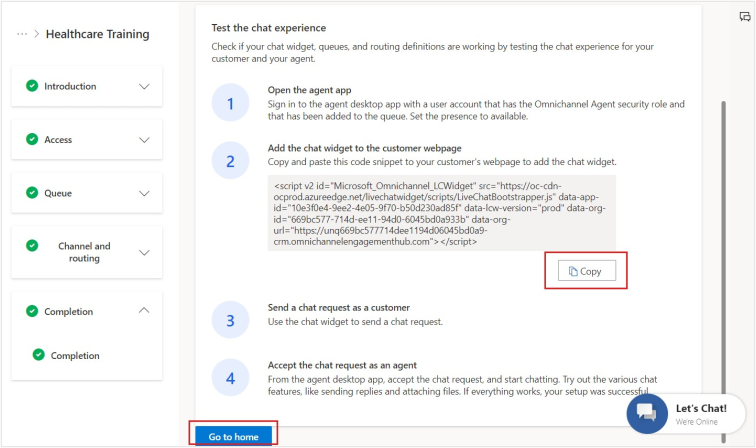

4.	You still need to set up a few components for the routing to happen correctly:

  	o	Enable proactive chat for the chat channel so that the bot can prompt the user.

    o	Add the bot user in the default messaging queue so that conversations initially route to the bot.

    o	Add the default messaging queue as the fallback queue for the new workstream.

    o	Define the routing rule in the workstream for escalating to a human agent.

5.	Go to **Overview** on the left navigation. Select **Chat** in the **Channels** section to view all chat channels.

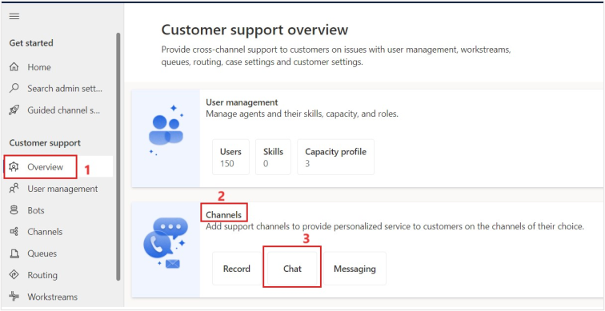

6.	Select the newly created chat channel, **Chat Widget**, and then select **Edit** on the command bar.

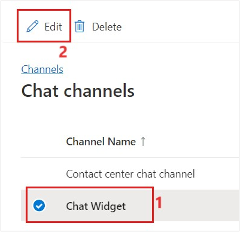

7.	In the **Chat channel settings** form, select the **Chat widget** tab and then turn on **Proactive chat**. This setting will allow the bot to prompt the user on the website where it’s embedded. Select **Copy** to copy the chat widget code and store it for later use, if you haven’t done so already. Select **Save** **and close.**

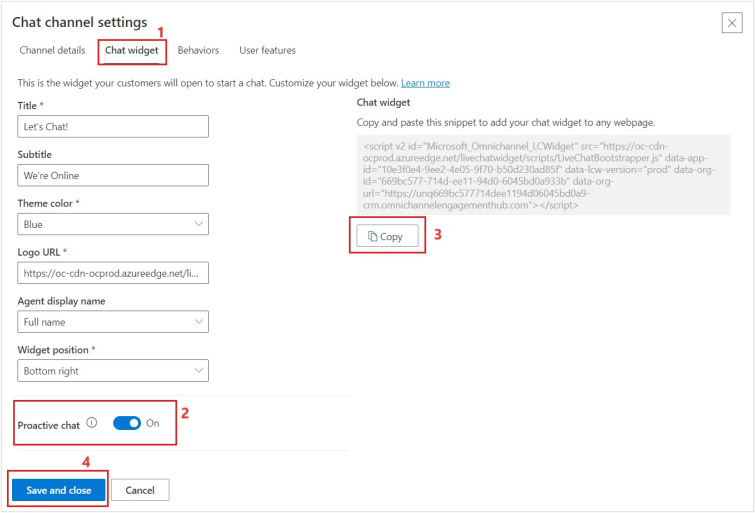

8.	Return to **Overview** on the left navigation pane. Scroll down to **Workstreams** and then select **Chat**.
 

9.	Select **Chat Workstream** and then select **Edit**.

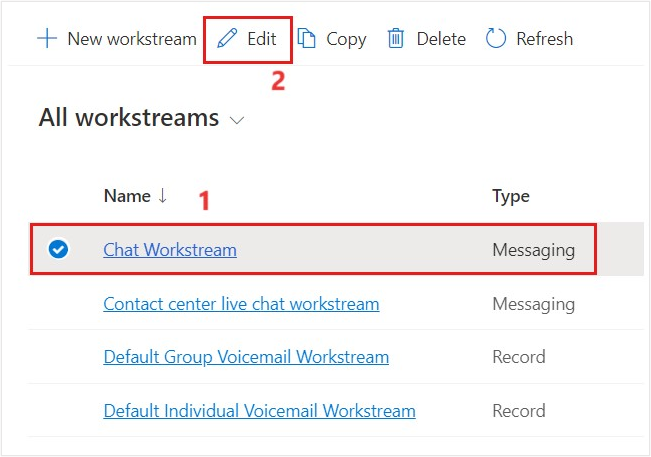

10.	In the **Chat Workstream** record, select **Edit** for the **Fallback queue.**
 
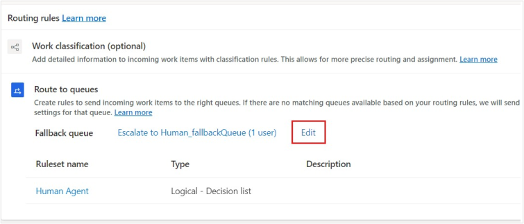

11.	Select the **Default messaging queue(All users)** from the **Choose existing** dropdown menu. Select **Save and close.**
 
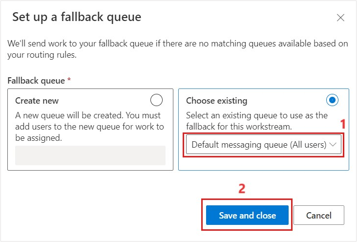

12.	The updated fallback queue will display. Select **+ Add bot** to add the Azure Health Bot for initial routing.
 
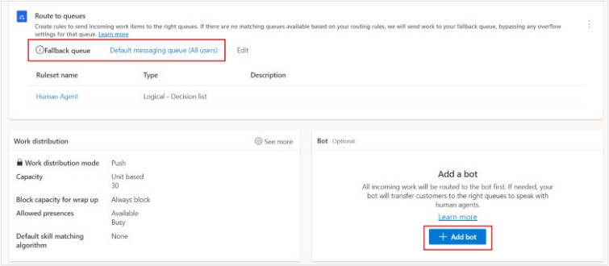

13.	Select your bot user from the **Name** dropdown menu. Select  Connect. 
 
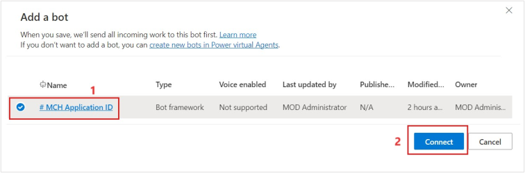

14.	The bot user has been added. Now, you’ll need to edit the ruleset so that the queue properly escalates to a human agent. First, you’ll need a number variable to use with your escalation logic. On the lower-left corner of the **Workstream** page, select **Show advanced settings.**
 
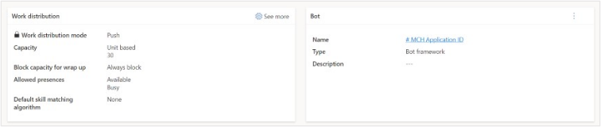

15.	Review the advanced settings for the workstream and then select **+ Add context variable.**
 
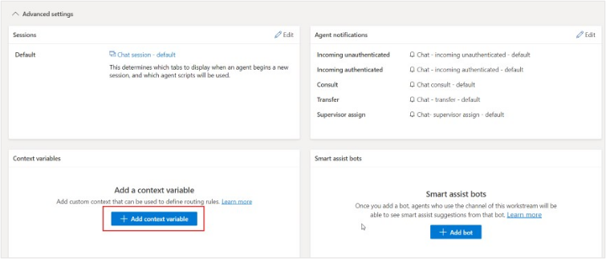

16.	In the **Add context variable** screen, select **+ Add**. Create the new context variable, which you’ll use to determine whether you need to escalate to an agent or not. Enter **EscalateToAgent** as the **Name** and then select **Number** from the **Type** dropdown menu. Select **Create**.
 
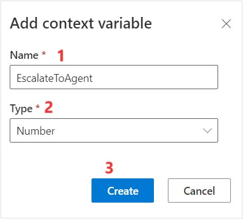

17.	The **EscalateToAgent** context variable of the **Number** type should show as added. Close the **Context variables** screen.

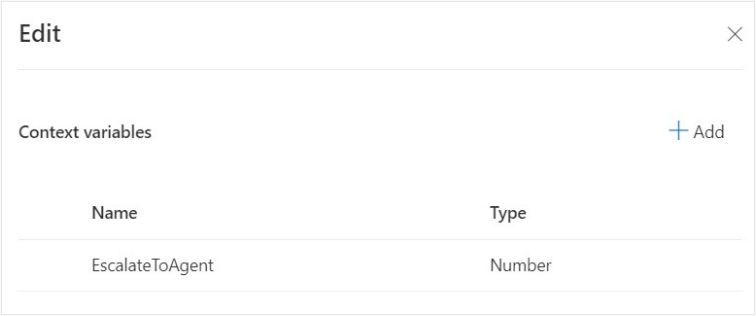

18.	On the workstream record, select Show **Advanced Settings** to collapse it. Select **Human Agent** under **Ruleset name.**
 
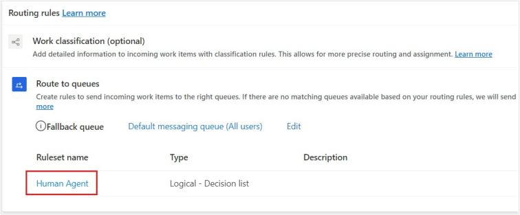

19.	Select **Human Agent Rule** and then select **Edit**.
 
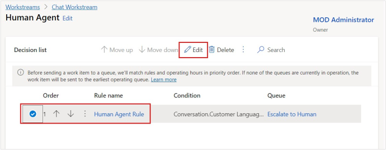

20.	**Delete** the initial condition in the rule to start with a blank canvas. The logic to follow is having the workstream route the chat channel to a human agent if the **EscalateToHuman** context variable is equal to **1** in any bot conversation.
 
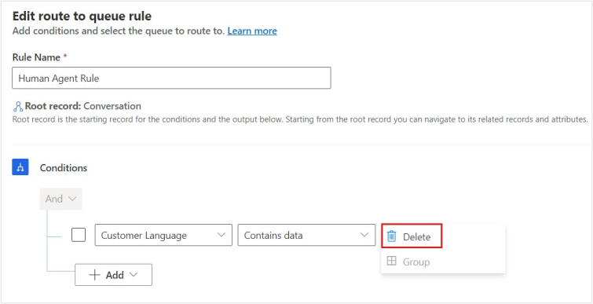

21.	Select **Add > Add related entity** to add a new condition.
 
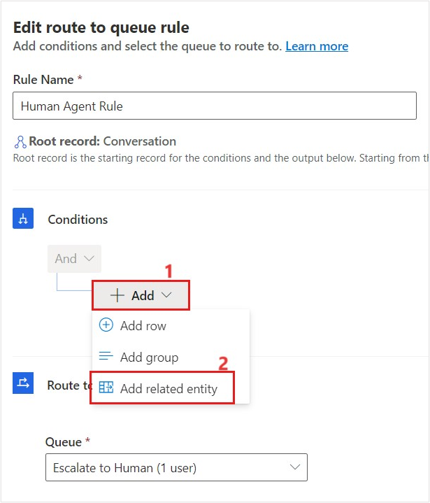

22.	Select **Context item value (Conversation)** from the dropdown menu to have the routing rule check if conversation context values contain specific data.

23.	After you select **Context item value (Conversation)**, the following dropdown menu will populate with **contains data** and a sub condition will appear. Select the new **EscalateToAgent** context variable, and then set it as **Equals** to **1** in the condition. This setting will allow bot conversations to route to a human agent if that variable is ever set to **1**. You’ll view this result in the last exercise in this module. Select **Save and close**.

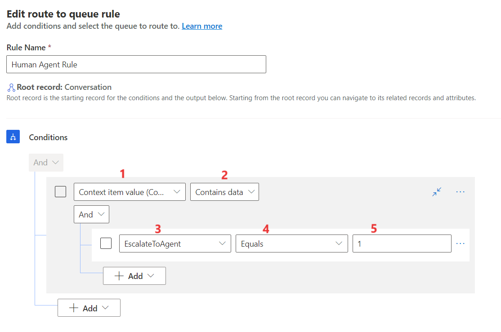

The Chat Workstream will show **Human Agent Rule** with the condition that will escalate to a human agent when the context variable is set to 1.
 
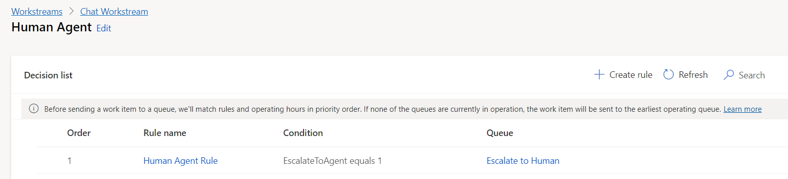

You’ve now created a new chat channel, workstream, queue, context variable, and routing rule that will allow customers to begin a conversation with a health bot and escalate to a human agent.

### Embed Azure Health Bot in the Power Apps portal

In this exercise, you’ll embed the **Omnichannel Chat Widget** into the Power Apps Customer self-service portal by using the Portal Management configuration. In your environment, you created a Lamna Healthcare Company portal by using the **Customer self-service** portal template before deploying Microsoft Cloud for Healthcare. 

Now, you’ll set up the chat widget to show on the customer website.

•	**Customer self-service portal** – Enables customers to access self-service knowledge and support resources, view the progress of their cases, and provide feedback.

•	**Portal Management** – Application to help you get started with the advanced portal configuration. In this exercise, you’ll learn how to set up the chat widget in the **Portal Management** app.

Follow these steps to complete the exercise:

1.	In [Power Apps,](https://make.powerapps.com/) select Apps in the left navigation pane and open the **Portal Management** app

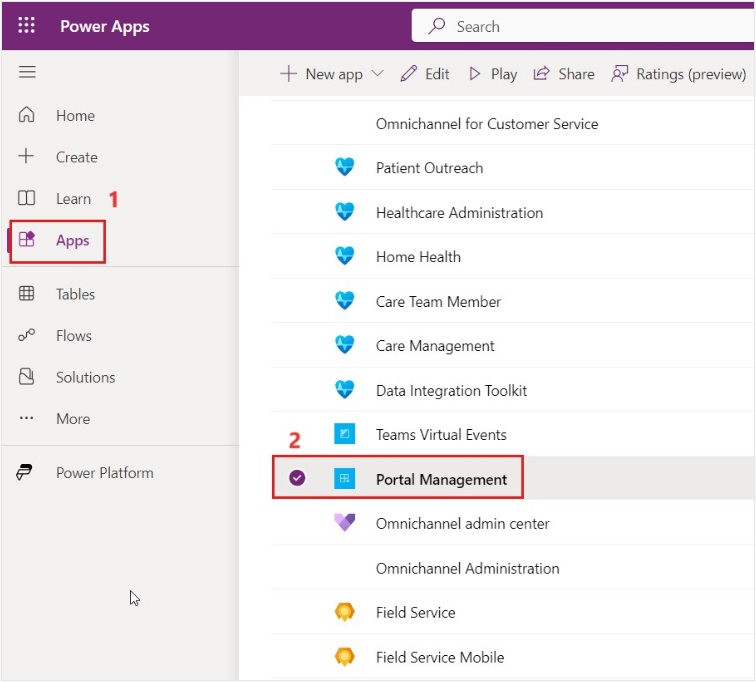

2.	Select **Content Snippets** in the left navigation pane. Enter **chat** in the search box and then press the **Enter** key. Two **Chat Widget Code** records( **Healthcare Patient Portal** and the **Lamna healthcare Patient portal** you created) will be visible in the list as highlighted in the below screenshot.
 
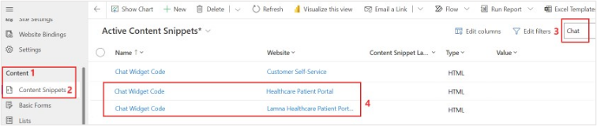

3.	Select and edit each **Chat Widget** **Code** record, one at a time, to modify the **Value** contents with the chat widget code snippet that you previously saved. You can find the snippet in the Chat Workstream in the Customer Service admin center again if needed.

 
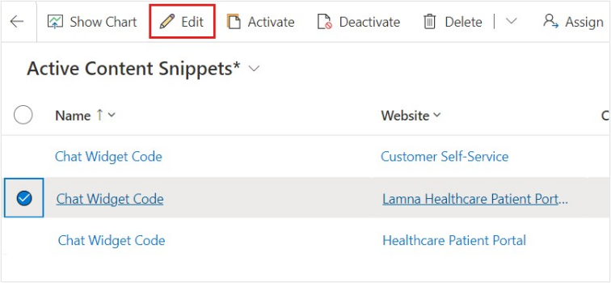

4.	In each **Chat Widget Code** record, under **Value** **(HTML)**  paste the chat widget code snippet that you previously copied and saved. The Health Bot that you created is embedded in the Customer self-service portal and the Healthcare Patient Portal templates, whichever your portal website is currently set to show. Select **Save & Close.**
 
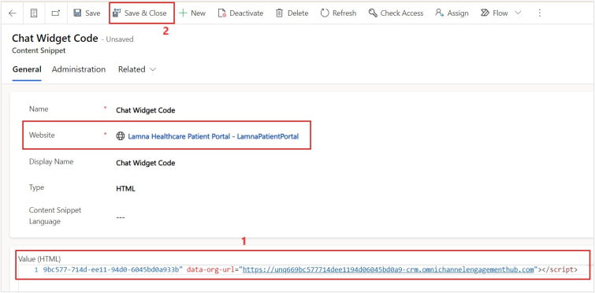

5.	Repeat the same step for the other  chat widgets so that it will show on both website templates: the Healthcare Patient Portal and the one that's associated with your current Customer self-service template.

 
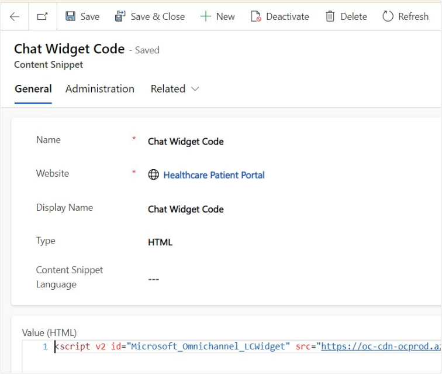

6.	Test to ensure that the chat widgets are properly embedded. Go to Power Apps and select to open **Lamna Healthcare Patient Portal**

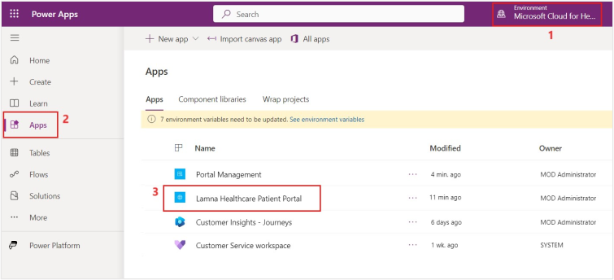 

7.	The Azure Health Bot should display the **Let's Chat** button in the lower-right corner of the screen. The chat widgets are successfully embedded into the Customer self-service portal.

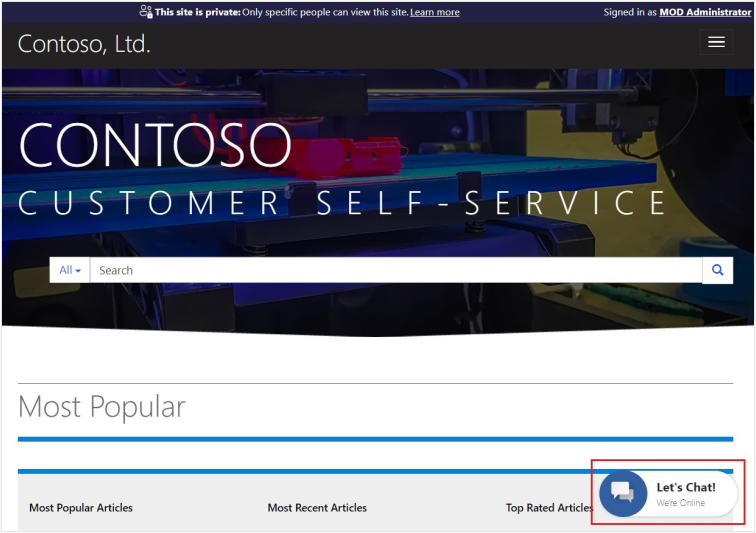 

8.	Test that the bot is properly connected. Go to your Health Bot management portal that you have created before from Azure Portal. Select **Configuration > Conversation** left navigation pane. Scroll down to the **Automatic welcome** section and enter a greeting for the portal user as **Hello! This is a test**. Select **Save** on the command bar.	

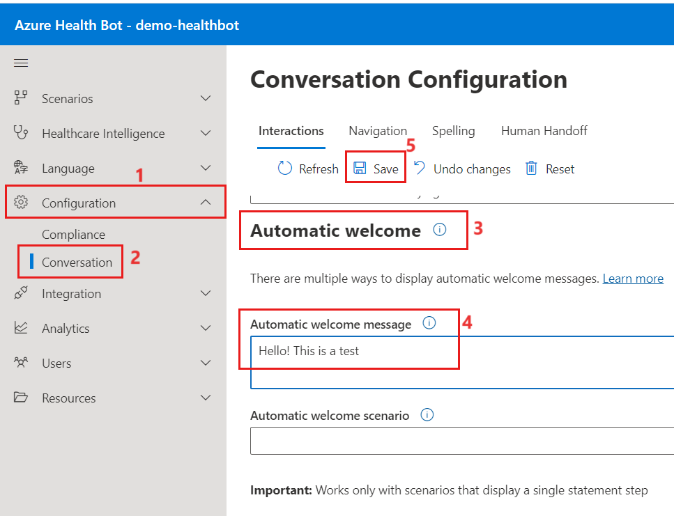 

9.	Return to Lamna Healthcare Patient Portal with the Customer self-service template. Refresh the page and select the **Let's Chat** widget, and the **welcome message** should greet you in the chat.

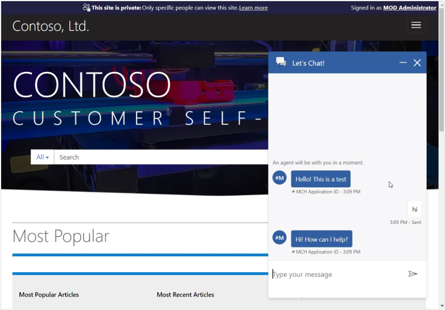 

In this exercise, you've successfully updated the chat widget in the Power Apps portal content snippets. With this configuration, the Health Bot will be visible on the Power Apps portal for the Customer self-service template and the Healthcare Patient Portal template.

## Extend Azure Health Bot with custom scenarios

Integration with Omnichannel for Dynamics 365 Customer Service allows the patient to interact with the Azure Health Bot by using the Dynamics 365 chat widget to access medical information and your custom scenarios. It also allows the escalation of a bot conversation to a live agent to continue the interaction. When a conversation is escalated, Dynamics passes along the conversation history and the context to the agent.

In this exercise, you'll complete the following tasks:

1.	Design the following Health Bot scenario called **MCH_PatientService.**

    o	**Intro** statement card - Triggers a welcome message to the customer.

    o	**MedOrAgent** card - Prompts with the **Medication refill** or **Live Agent** action authored card.

    o	**IsMedRefill** decision card - Checks the variable and submits a medication refill or starts live chat.

    o	**Submit** card - Prompts an adaptive card message (input text) with name, email, and medication name.

    o	**Live Chat** card - Communicates to the customer that they're being directed to a live agent.

    o	**Confirmation** card - Repeats information that has been gathered from the submission and then thanks the customer.

    o	**Escalate** card - Triggers an **escalate to live agent** message on Omnichannel for Customer Service.

2.	Design another Health Bot scenario called **MCH_PatientServiceWelcome**. This scenario holds the starting statement that will allow the user to invoke the **MCH_PatientService** scenario.

3.	Set the **Automatic Welcome Scenario** to be the **MCH_PatientServiceWelcome** custom scenario that you create. This setting will begin the scenario when a user first interacts with the Health Bot.

## Task: Create the MCH_PatientService scenario

In this task, you'll create the **MCH_PatientService** bot scenario by using the designer canvas.

1.	Return to the **Azure Health Bot** instance home page where you set the bot settings. This link is the portal management link that you copied from the Azure portal. Select **Create new scenario** on the landing page. If you aren't on the landing page, you can go to **Scenario > Manage** on the left navigation pane.

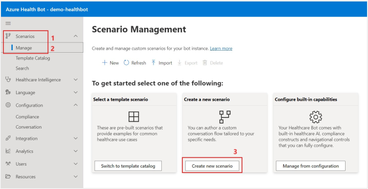 

2.	Enter **MCH_PatientService** as the **Name** and the **Scenario ID** for the new Health Bot scenario.

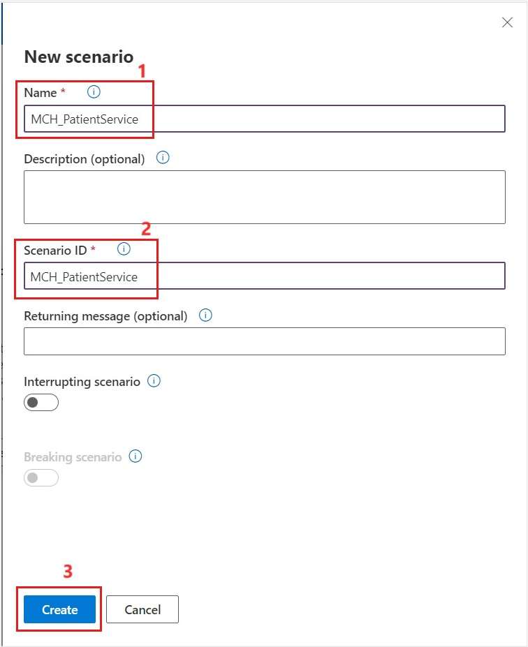 

3.	Design the scenario conversation, which should take you directly to the designer. If not, select the **MCH_PatientService** scenario in **Scenarios > Manage** to edit.
 
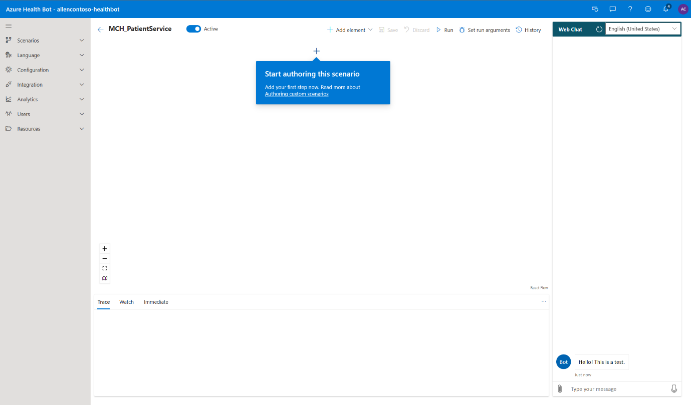

**Step: Add a bot introduction statement**

In this step, you'll add a bot introduction statement.

1.	Click on the **Plus(+)** symbol.
 
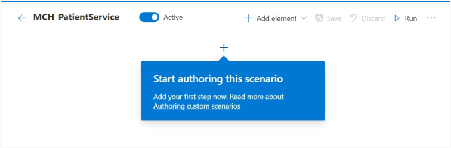

2.	Add a beginning statement to the scenario by selecting the plus (+) sign in the center of the canvas and then by going to **Conversational elements > Statement**.

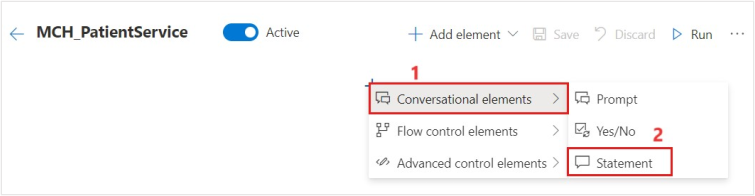 

3.	In the **Display text** box, enter the following message: **Hi there, I'm your Healthcare Assistant.**

4.	Select the pencil icon next to Statement in the upper bar and change the Title to Intro. Select Save.
 
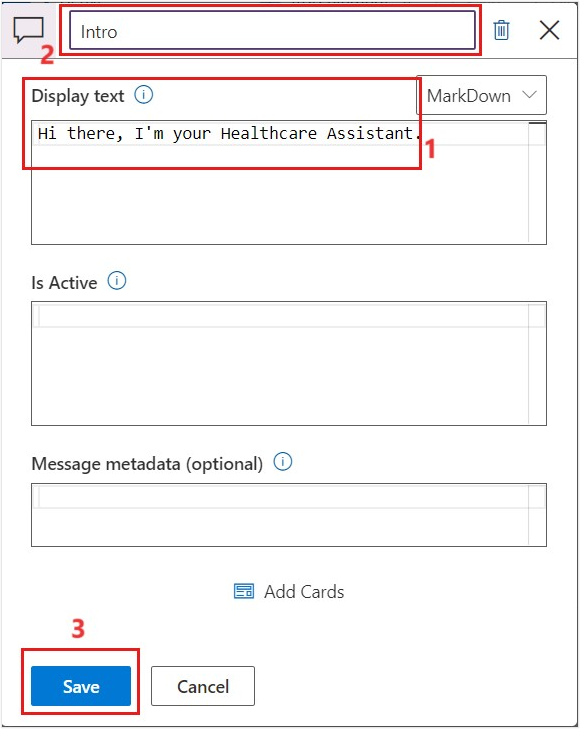

5.	The Intro statement will be added to the designer canvas. Double-click if you need to edit any item on the canvas.
 
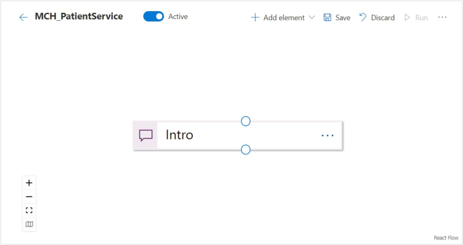

**Step: Add a statement for a medication request or a live agent**

This section prompts two buttons: **Medication Refill** and **Live Agent.** When a user selects either button, the appropriate text to the **MedicationOrAgent** variable will be set.

1.	Add a prompt to the user by right clicking the canvas or by selecting **Add element > Conversational elements > Prompt**.

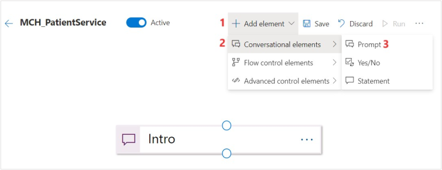 

2.	Enter the following details:

    o	**Display text** - Would you like to request a medication refill or chat with a live agent?

    o	**Input variable** - MedicationOrAgent

    o	**Input type** - String

    o	**Title** - Rename to MedOrAgent
 
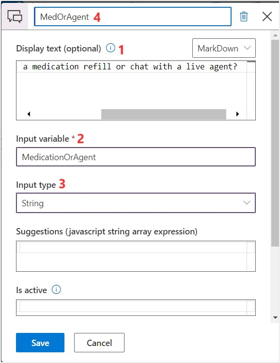

3.	Scroll down and select the **Add Cards** button.

 

4.	Select **Hero Card** from the **Card type** dropdown menu. Leave the title blank because you're already prompted with the display text. Select the plus (+) icon to add new actions so that the user can select a response to send to the bot.

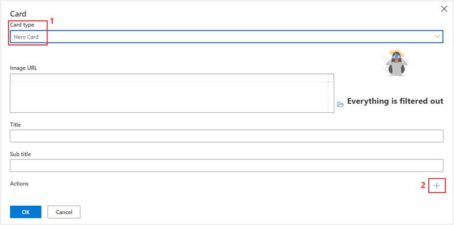

5.	Select the plus (+) icon twice to add two actions. For the first action, select the following values:

    1.	**Action type** - imBack

    2. **Action value** - MedicationRefill

    3. **Action title** - "Medication Refill"

6. For the second action, fill in the following values:

   1. **Action type** - imBack

   2. **Action value** - LiveAgent

   3. **Action title** - "Live Agent"

5.  Select **OK** to return to the prompt details. The Hero Card should be defined.	

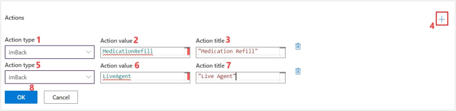

6.	Select **Vertical** from the **Cards layout** dropdown menu. Select **Save**.

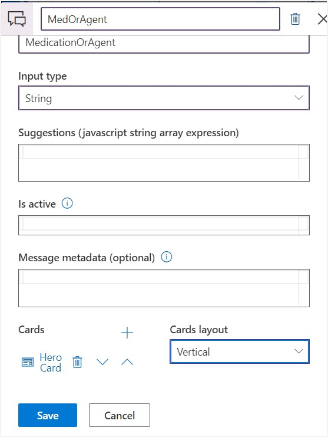 

7.	Move the **Intro** box above the **MedOrAgent** box and connect them. To do so, select the bottom circle on **Intro** and drag it to the top circle on the new prompt. An arrow automatically appears when you try to connect the **Intro** and **MedOrAgent** boxes. Select **Save** in the menu, which might have changed to an ellipsis (...).

 
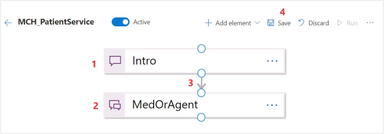

8.	Remember to save often because the scenario won't auto save. Now that the scenario has been saved, the run command should be enabled. Select **Run** from the menu to view the output in the Web Chat on the right.

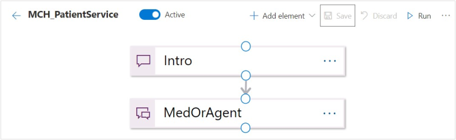

The test welcome message should display from the previous exercise along with the new statement and prompt asking for a medication refill or chat with an agent.

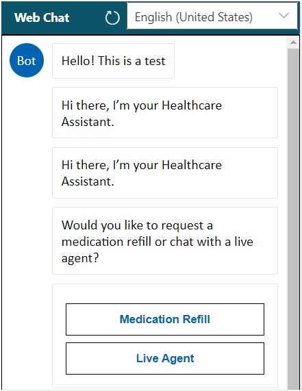

**Step:** **Add a MedicationOrAgent decision branch**

This step checks whether the user has selected **Medication Refill** or **Live Agent** with the help of the **MedicationOrAgent** variable. It will redirect the message according to the selection.

1.	Right-click the canvas to bring up the menu, select **Flow control elements > Branch** to allow your logic to proceed in two different directions.

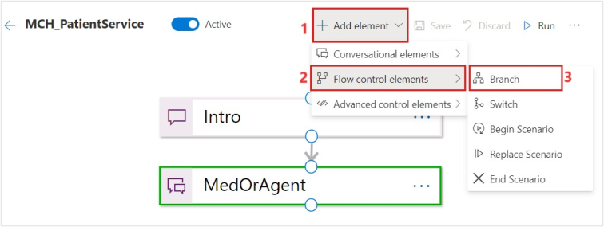 

2.	Enter the following expression in the **Javascript Boolean expression** box: **scenario.MedicationOrAgent === "MedicationRefill"**

3.	Rename the branch to **IsMedRefill** and then select **Save**.
 
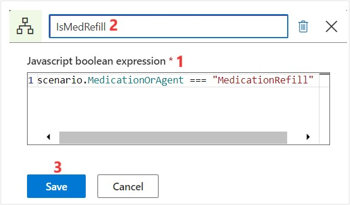

4.	Place the IsMedRefill below MedOrAgent. Select and drag the bottom circle of the **MedOrAgent** prompt to the top circle of the **IsMedRefill** branch decision to connect them.
 
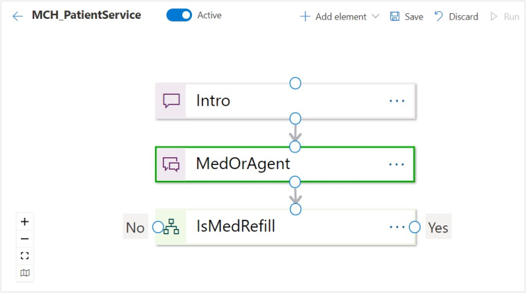

**Step:** **Prompt the user to enter data for the medication refill option**

Your next step is to prompt the user to enter data for the medication refill option by following these steps:

1.	Add a **Prompt** element that will be used to display the form data (by using an Adaptive Card) to capture the patient's name, email, and phone number to create an appointment.

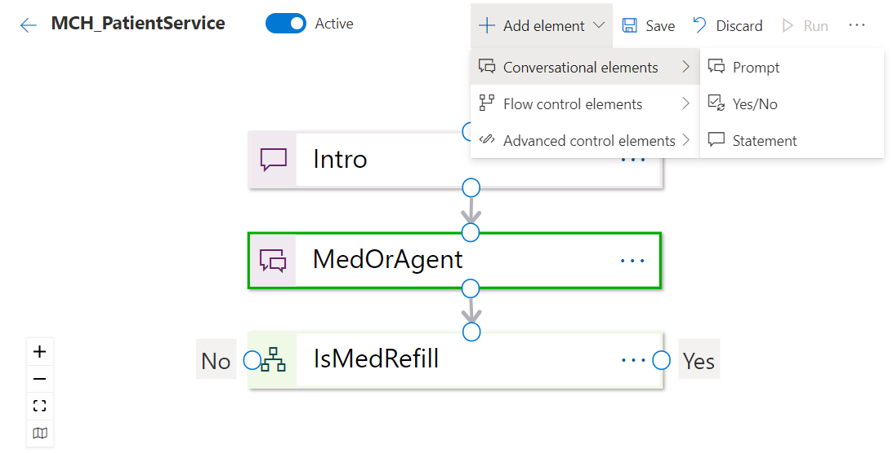 

2.	Add the following details. When you're finished, select the **Add Cards** button.

    o	**Input variable** - formData

    o	**Input type** - Object

    o	**Title** - Submit

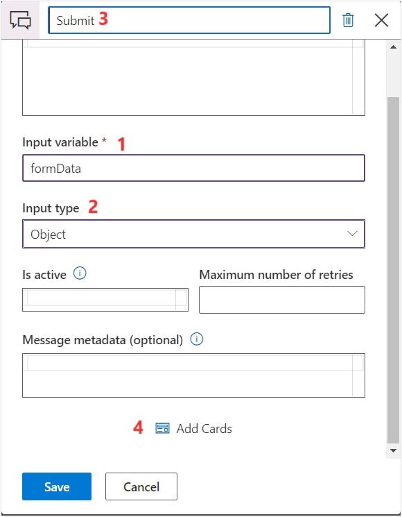

3.	Change the **Card type** to **Adaptive Card**. Add the following **JSON** to your card to show multiple fields of input for the user in an appealing format. Select **OK**.

JSON for adaptive card:

{ 

"$schema": "http://adaptivecards.io/schemas/adaptive-card.json", 
    "type": "AdaptiveCard", 
    "version": "1.0", 
    "body": [
    {
    "type": "ColumnSet",
    "columns": [
        {
        "type": "Column",
        "width": 2,
        "items": [
            {
            "type": "TextBlock",
            "text": "Tell us about yourself",
            "weight": "bolder",
            "size": "medium"
            },
            {
            "type": "TextBlock",
            "text": "We just need a few more details to get your Medication refill.",
            "isSubtle": true,
            "wrap": true
            },
            {
            "type": "TextBlock",
            "text": "Don't worry, we'll never share or sell your information.",
            "isSubtle": true,
            "wrap": true,
            "size": "small"
            },
            {
            "type": "TextBlock",
            "text": "Your name",
            "wrap": true
            },
            {
            "type": "Input.Text",
            "id": "myName",
            "placeholder": "Full name"
            },
            {
            "type": "TextBlock",
            "text": "Your email",
            "wrap": true
            },
            {
            "type": "Input.Text",
            "id": "myEmail",
            "placeholder": "youremail@example.com",
            "style": "email"
            },
            {
            "type": "TextBlock",
            "text": "Medication Requested"
            },
            {
            "type": "Input.Text",
            "id": "myMedReq",
            "placeholder": "Medication Name",
            "wrap": "true"
            }
          ]
        }
      ]
    } ],  
    "actions": [
    {
    "type": "Action.Submit",
    "title": "Submit"
    } ] 

}  

**Note** - Go to the [Adaptive Card visualizer](https://adaptivecards.io/) to test your own authored card.
 
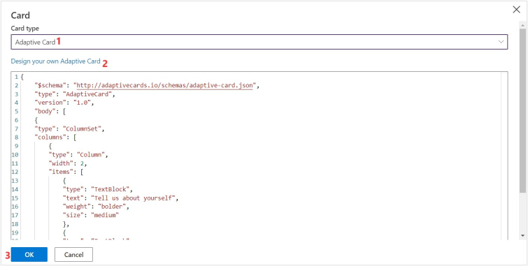

4.	On the prompt form, select **Vertical** from the **Cards layout** dropdown menu. Select **Save**.

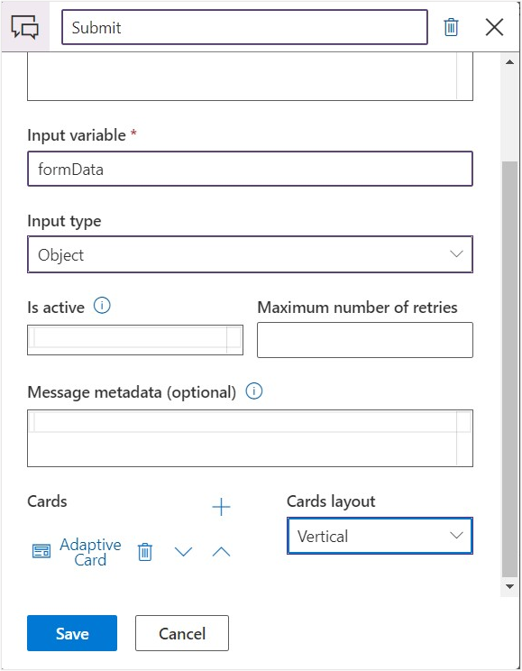

5.	**Connect** the **Yes** condition of the **IsMedRefill** branch to the **Submit** prompt.

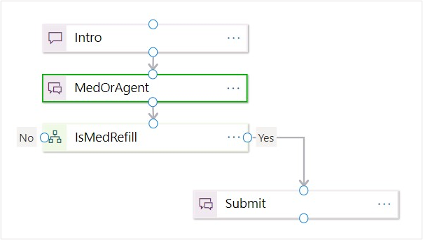 

6.	**Save** and **Run** your current scenario. If you don't save the scenario first, it won't run with updates that have been made since the last save. If you haven't saved at all, it won't recognize any conversation.

The Adaptive Card output should display in the Web Chat when the system is running the conversation and selecting **Medication Refill** when prompted.

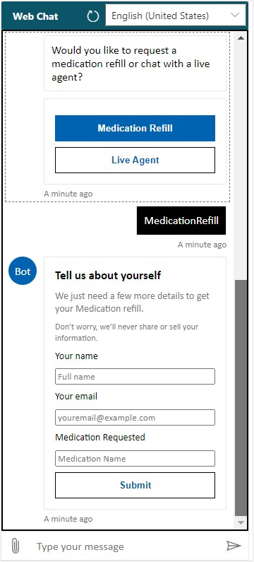

**Step: Add a confirmation statement**

To add a confirmation statement, follow these steps:

1.	Add a **Statement** element.
 
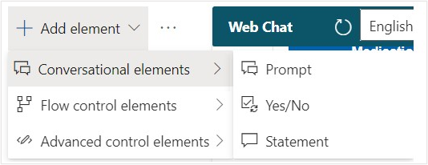

2.	Set the **Display text** as follows:

    scenario.formData.myName + " - Thanks for providing the information, we have created a Medication Request for you regarding the following medication: " + scenario.formData.myMedReq

3.	Rename the statement to **Confirmation** and then select **Save**.
 
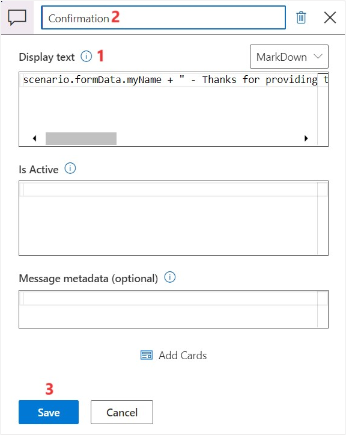

4.	Connect the **Submit** element to the **Confirmation** element on the designer canvas.
 
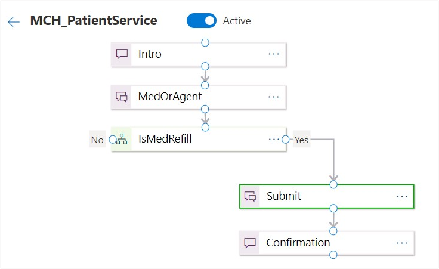

5.	Select **Save** and **Run** to view your scenario in the web chat. Select **Refill Medication** in the authored card.

6.	Fill in information for the request and then select **Submit**. Note the confirmation text that's returned from the bot, which was defined in your confirmation step.
 
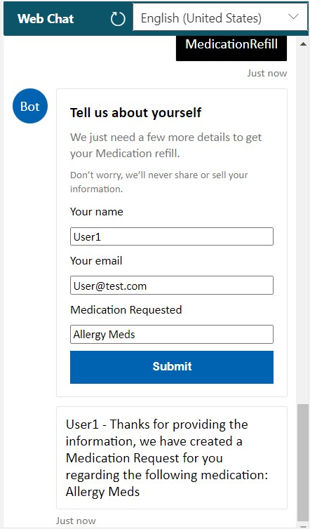

**Step: Invoke a live agent action**

To invoke a live agent action, follow these steps:

1.	Add a **Statement** element to the canvas.

2.	In the **Display text** box, enter **Please wait, I am transferring your request to a live agent for further assistance.**

3.	Rename the statement to **Live Chat** and then select **Save**.
 
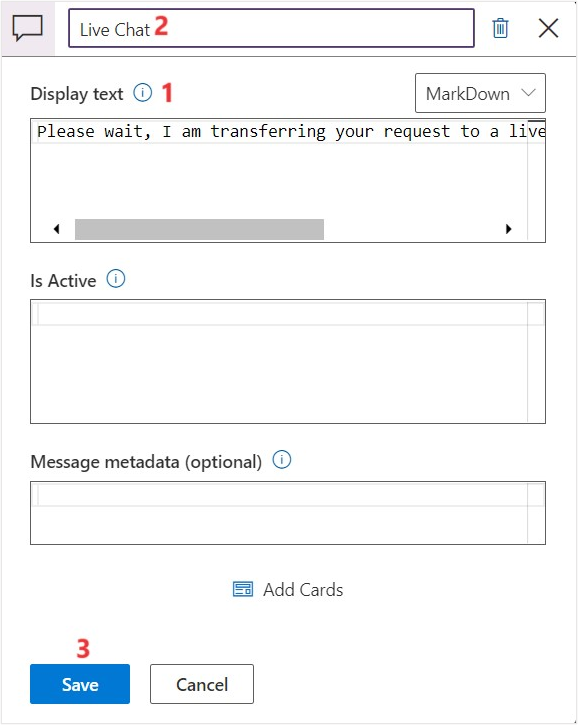

4.	Connect the **No** decision of the **IsMedRefill** branch to the **Live Chat** statement.

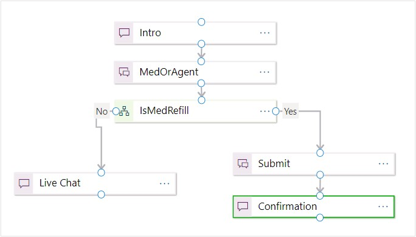

**Step: Add an action to invoke escalation**

To add an action to invoke escalation, follow these steps:

1.	Add an **Action** element to the canvas under **Advanced control elements**, which you'll use to trigger an escalation to an Omnichannel live agent.

 
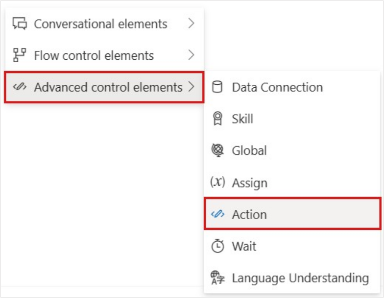

2.	Add the following code to the action, which will trigger the live agent chat:

    session.sendChannelData('Escalating...', {
  "tags": JSON.stringify({type: "Escalate", context: {"EscalateToAgent": 1}})
   });

3.	Name the action **Escalate** and then select **Save** to return to the designer page.

 
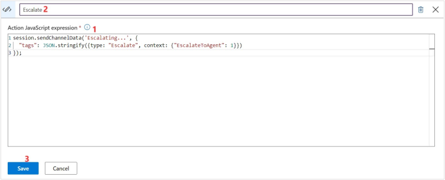

Connect the **Live Chat** statement to the new **Escalate** action. 
 
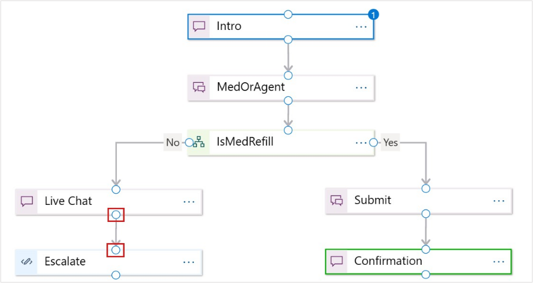

You've now completed the final connection. The following screenshot shows your full scenario.
 
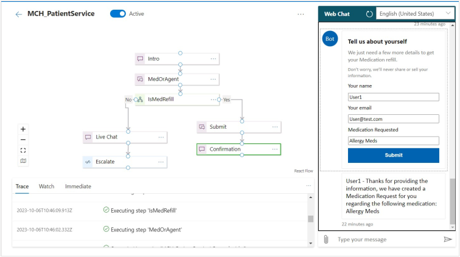

4.	**Save** and **Run** your scenario to view the full scenario output.

5.	Select **Live Agent** in the authored card to show the escalation action.

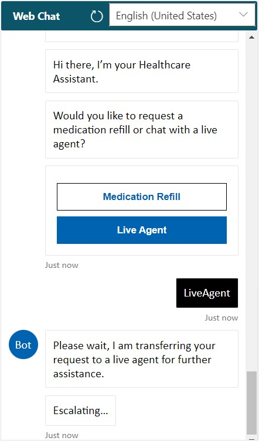 

6.	**Exit** the **MCH_PatientService** scenario editor with the back arrow next to your scenario name. Make sure that you save before confirming to exit.

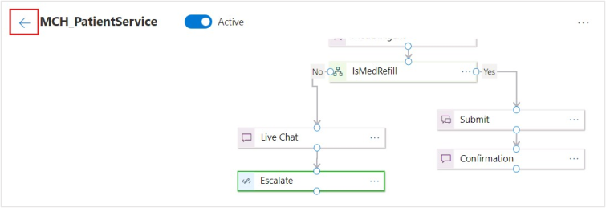

You've now created a custom scenario to allow the patient to refill a medication or escalate to a live agent.

## Task: Create the MCH_PatientServiceWelcome scenario

In this task, you'll create another bot scenario called **MCH_PatientServiceWelcome** to invoke the **MCH_PatientService** scenario. Because the automatic welcome message in the Health Bot settings can be only one step, you'll use it to initiate the multi-step scenario that you created.

1.	On the Azure Health Bot scenarios page, select **New** to create another new scenario.

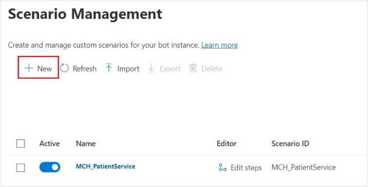 

2.	Enter **MCH_PatientServiceWelcome** as the **Name** and the **Scenario ID** for the new Health Bot scenario. Select **Create**.
 
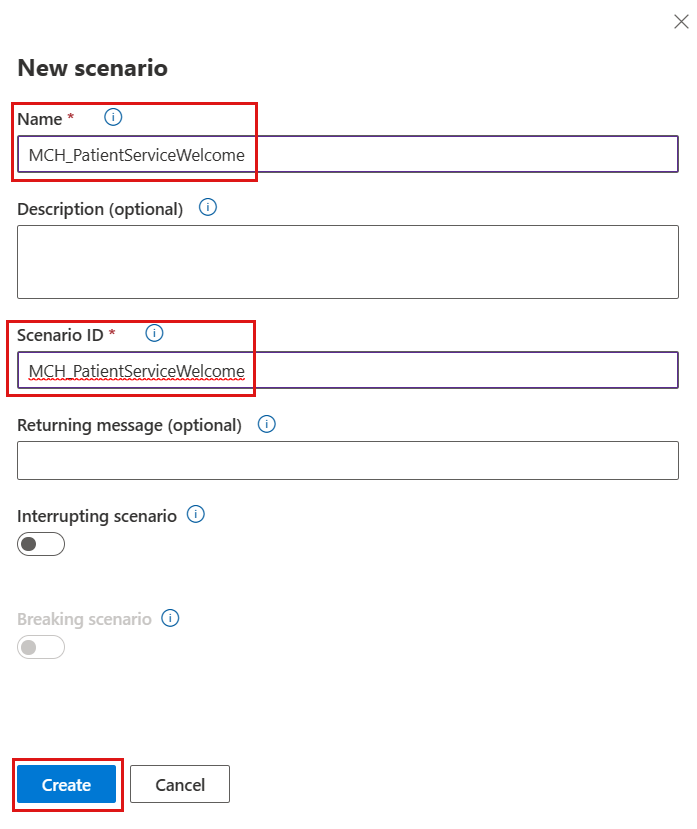 

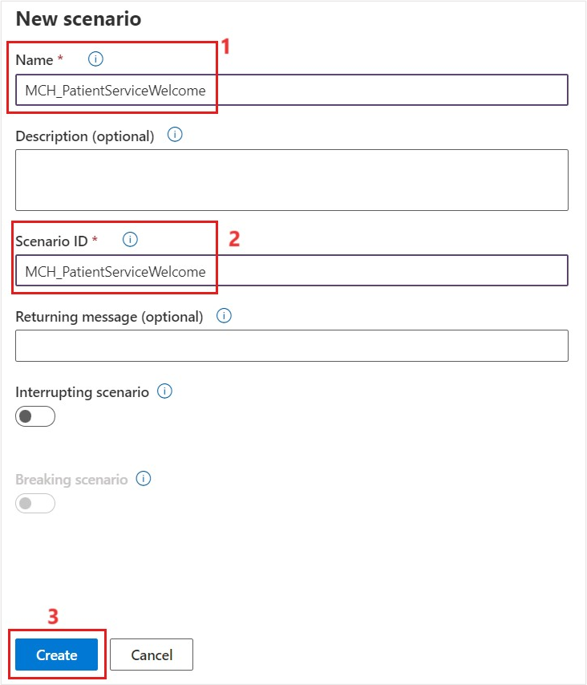

3.	On the scenario editor designer, add a **Statement** element.

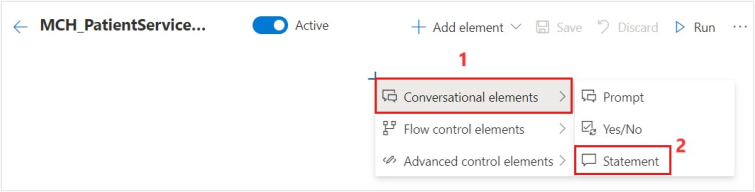 

4.	Rename the statement to **Welcome**. Add a Display text as – **Welcome to Lamna Healthcare Patient Service Portal**. Select **Add Cards.**

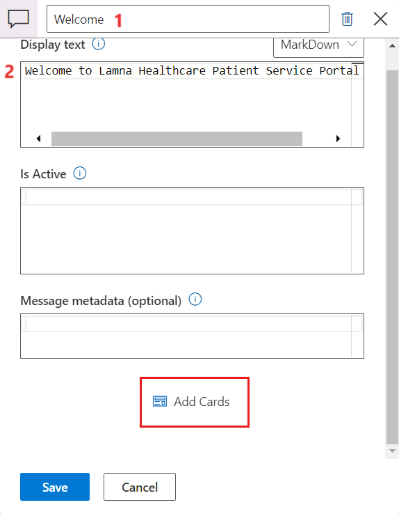 

5.	Select **Hero Card** from the **Card type** dropdown menu. Select the plus (+) icon to add an action.

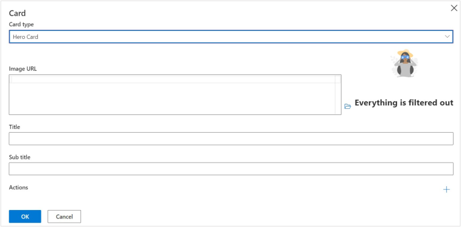 

6.	Provide the following details for the action:

    o	**Action type** - imBack

    o	**Action value** - begin MCH_PatientService

    o	**Action title** - "Lamna Healthcare Support"

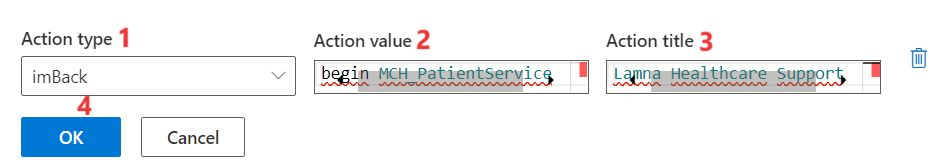 

7.	Select **OK** and then select **Save** on the statement form.

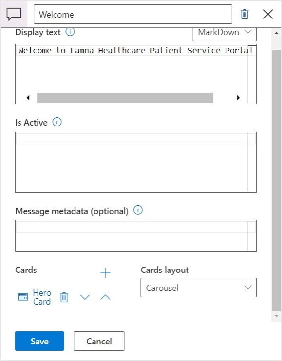 

8.	**Save** and **Run** to test your **MCH_PatientServiceWelcome** bot scenario in the Web Chat.
 
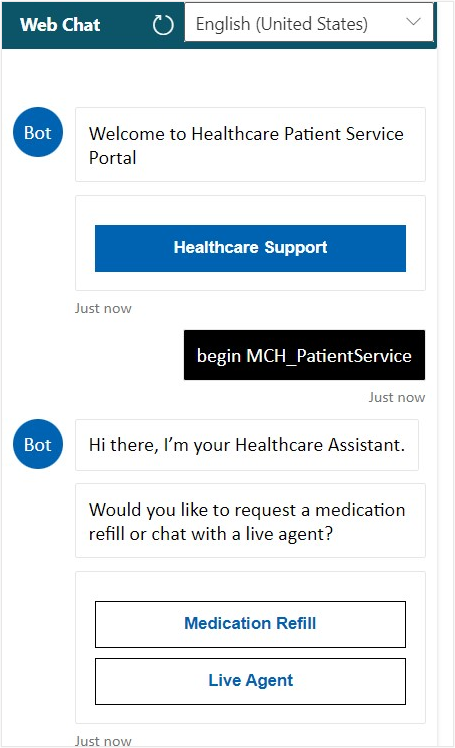

9.	**Exit** the scenario designer.

You've now created a welcome scenario that will kick off the MCH_PatientService scenario.

## Task: Set up the welcome scenario to be automatic

In this task, you'll set the **MCH_PatientServiceWelcome** to be the **Automatic Welcome Scenario** in settings. This setting will always trigger the scenario when a user starts a conversion with the Health Bot from the portal.

1.	Go to **Configuration > Conversation** from the left navigation pane.
 

2.	On the **Interactions** tab, scroll down to the **Automatic welcome** section. From the **Automatic welcome scenario** dropdown menu, select the **MCH_ PatientServiceWelcome** scenario. You can clear the automatic welcome message that you previously set. Select **Save**.

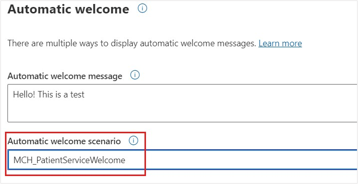

You've successfully set the **MCH_PatientServiceWelcome** scenario as the default scenario that kicks off when a user interacts with the Health Bot.

## Task: Test Health Bot escalation from Power Apps portal to Omnichannel

In this task, you'll test the escalation experience from the Power Apps portal to an Omnichannel live agent.

1.	Go to Power Apps. Select the correct environment and open **Lamna Healthcare Patient Portal**.

2.	The Azure Health Bot **Let's Chat** button should display in the lower-right corner of the screen, meaning that the chat widget was successfully embedded into the Customer self-service portal.
 
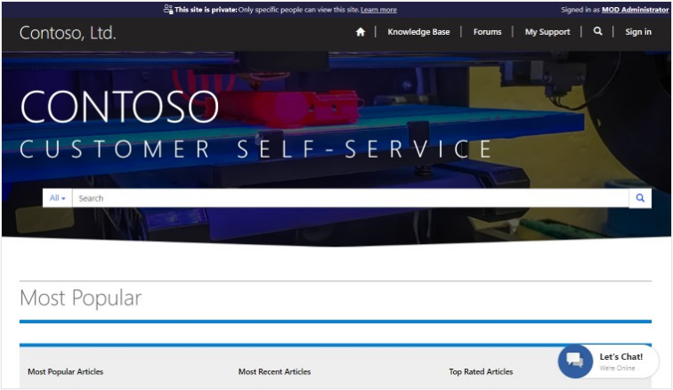

3.	When you select the chat widget, the bot will trigger the welcome scenario message that you created and will set it as the default welcome message, **MCH_PatientServiceWelcome**.

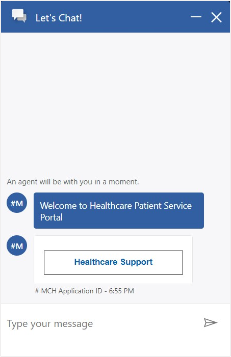 

4.	Return to Power Apps and open **Customer Service workspace.**

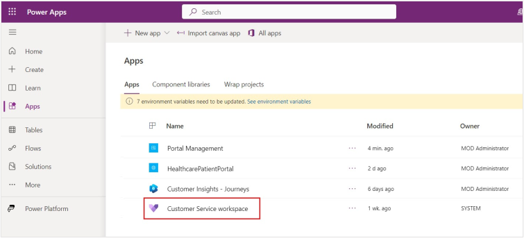

**Note** - Escalation into the Customer Service workspace will work only when the **Presence** status shows as enabled. A splash loading screen will show that goes through multiple steps and then displays the status indicator as **Available** after it's loaded. The status is enabled when it shows a check mark in a green circle.

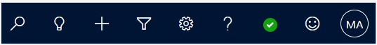  

5.	In the Health Bot dialog in the Patient Portal, select the **Healthcare Support** button and then select the **Live Agent** button to witness the escalation into Omnichannel to chat with a live agent (you).

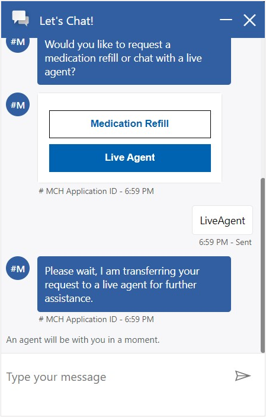 

6.	Return to Omnichannel for Customer Service. Your user, as the **Live Agent**, should receive an incoming notification with **Accept** and **Reject** options for the chat.

7.	Select **Accept** to connect and chat with the customer, or in this case, the patient.

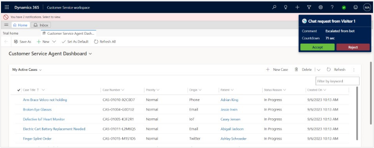  

8.	When a live chat agent accepts the incoming chat notification, Omnichannel for Customer Service will open a **Live Chat** widget, where the agent can view the entire bot conversation with the user and continue to chat with them.
 
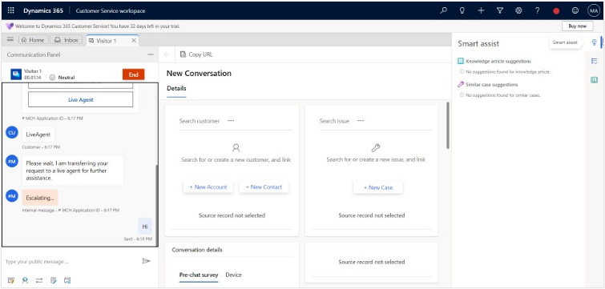 

Now, you've successfully tested the escalation scenario from the patient by using a Health Bot in the Power Apps portal to a live agent in Omnichannel for Customer Service.
