# Module 4 Lesson 1- Lab 2B: Configuring Omnichannel

## Overview

Dynamics 365 Omnichannel integration allows the patient to interact with Health Bot using the Dynamics 365 chat widget to access the medical knowledge and your custom scenarios. It also allows the escalation of a bot conversation to a live agent to continue the interaction. When escalating a conversation, Dynamics passes along the conversation history and the context to the agent.

This lab will focus on Lamna Healthcare Company.

As stated in the Lab 2A, Lamna Healthcare Company is seeking to streamline their patient engagement capabilities by implementing Azure Health Bot to help improve processes and services, such as entering medication requests. By allowing patients to interact with this service, Lamna Healthcare Company will move one step closer to their goal of improving patient outcomes while reducing overall costs.

In this lab, you'll play the role of a Lamna Healthcare IT developer and use the Azure Health Bot you configured in Lab2A to integrate with Dynamics 365 Omnichannel. This will complete the work for a medication refill scenario.

## Learning objectives

In this lab, you will:

- Configure Dynamics 365 Customer Service Omnichannel Live Chat
- Embed Azure Health Bot in a Power Apps Portal
- Extend Azure Health Bot with custom scenarios

## Exercise 1: Configure Omnichannel Live Chat

In this exercise, you will be configuring live chat for **Dynamics 365 Omnichannel for Customer Service**. Omnichannel for Customer Service offers a suite of capabilities that extend the power of Dynamics 365 Customer Service Enterprise to enable organizations to instantly connect and engage with their customers across digital messaging channels.

In the following tasks, you will complete the following:

1.  Assign Omnichannel agent security role
2.  Create an Application User using the **MCH Application Id** and your **Bot ID**
3.  Configure Queues for Bot and Agent Users
4.  Configure a Context Variable and Routing rule to route the message either to a Bot or Agent.

### Task 1: Assign Omnichannel Agent Security Role

1. [] While in the In-Private or Incognito window, navigate to +++https://make.powerapps.com/+++.

1. [] Ensure the correct environment from the upper right **Environment** dropdown is selected.

    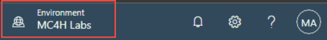

1. [] Select the **gear** icon in the upper right corner and navigate to **Advanced Settings**.

    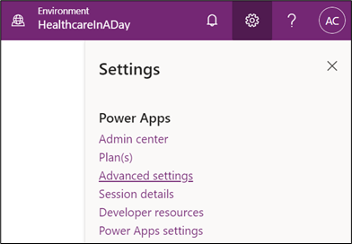

1. [] A new window should open and navigate to Dynamics 365. It may take a while to load. If it’s been longer than a minute, stop and reload the page. It should then load faster. It will land you in the Business Management section of Dynamics 365.

    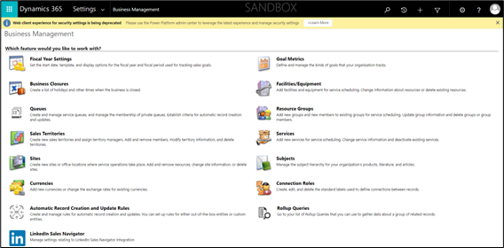

1. [] On the top command bar next to **Dynamics 365**, select **Settings** to open the drop-down, then select **Security** in the third column under **System**.

    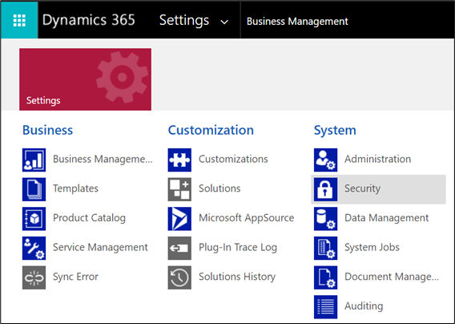

1. [] Under **Security**, select **Users**.

    

1. [] Switch the dropdown from **Omnichannel Users** to **Enabled Users** for the grid view so that your user will show in the list. You may have to select the ellipsis next to Chart Pane to open the contectual menu and select System Views to make the view dropdown visible. This may take several minutes for the page to display.

    

1. [] While in the **Enabled User** list, scroll to find the **Mod Administrator** or use the **Search** bar.

    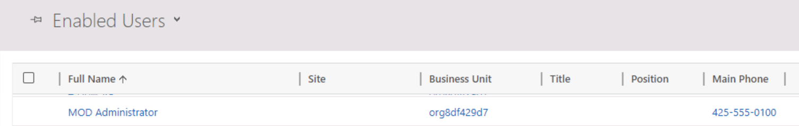

1. [] Select your user for the training and select **Manage Roles** on the top command bar.

    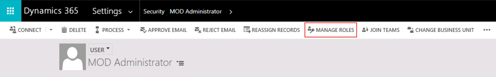

1. [] If necessary, select the **Omnichannel Agent** roles to assign to your user and select **OK**.

    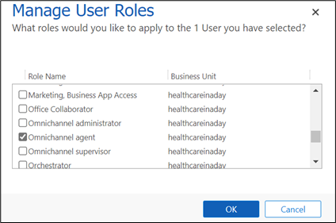

**Congratulations!** You assigned the proper omnichannel agent role to your user to allow you to be a live agent in omnichannel.

### Task 2: Create Health Bot User in Dynamics 365 Customer Service

We need two users to configure in Omnichannel for Dynamics 365 Customer Service:

-   **Health Bot User** – This is the Azure Health Bot user we created in the previous exercise.
-   **Omnichannel Agent User** – This is your current user whom you are logged into Dynamics 365. This will allow you to be a live agent in Customer Service who receives messages from portal users through Azure Bot escalations. Note: For official trainings, this is your assigned user, MOD Administrator.

In this task, you will create a **Bot User** which helps connect **Azure Health Bot** with **Omnichannel live Chat**.

1. [] Go to +++https://admin.powerplatform.microsoft.com+++. Select your **MC4H Labs** environment from the list
    
    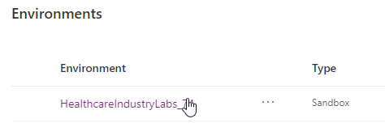

1. [] You will land on your environments detail page.

    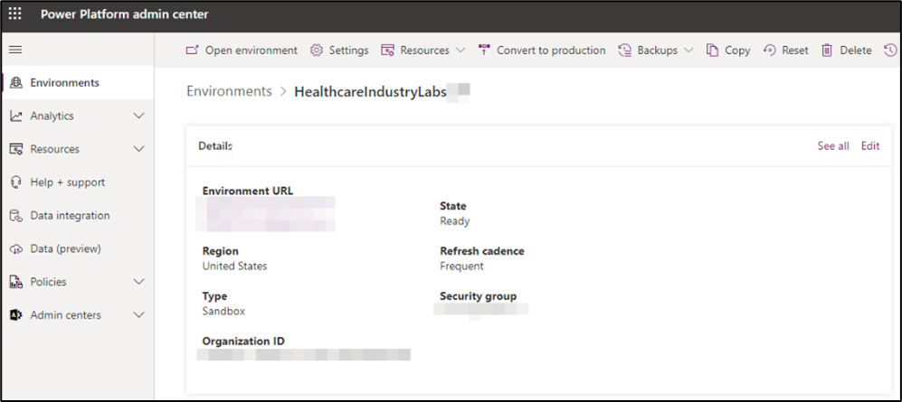

1. [] Select the **Settings** button on the top command bar.

    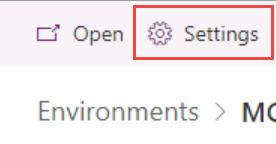

1. [] Expand **Users + permissions** and select **Application users**.

    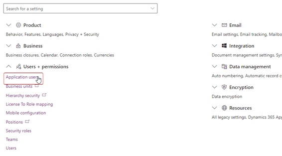

1. [] Select (**+**) **New app user** button to create a new Application User.

    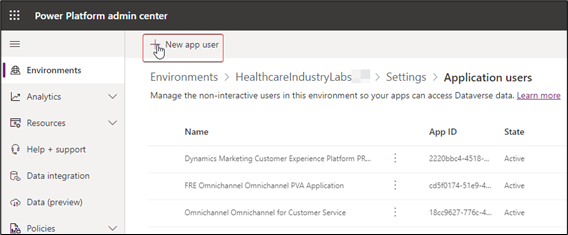

1. [] Select (+) **Add an app** on the create screen that slides out on the right side.

    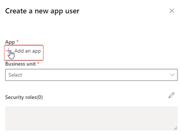

1. [] Paste the **Application ID** (the Application (client) ID you obtained in the Azure portal for the supplied MCH Application ID) into the search box and select the app from the list. Select **Add** at the bottom right.

    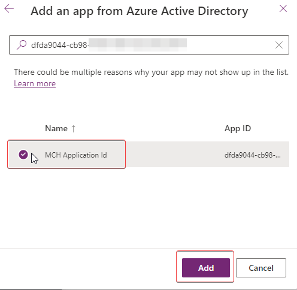

1. [] Select a **Business unit** from the dropdown list (the options in the list will be unique for each Dynamics 365 environment). Select **Create** at the bottom right.

    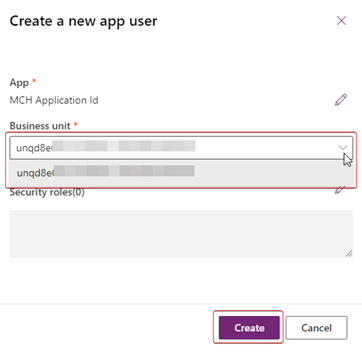

1. [] Return to the **Dynamics 365 User** page, switch the view to **Enabled Users**. This may take several minutes for the page to display.

    
    
    

    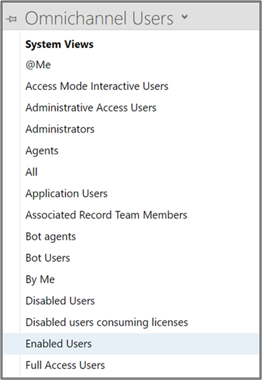

1. [] While in the **Enabled User** list, scroll to find your **App user** (this is your MCH user, not the MOD admin user) or use the **Search** bar. Double-click on the user or select the row and click **Edit**.

    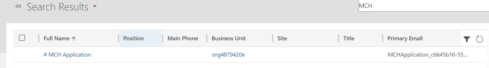

1. [] Change the form type from **User** to **Application User** above the User Name.

    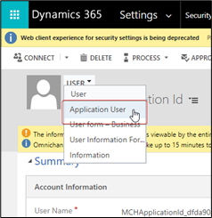

1. [] You will see a new form appear that aligns to an Application User.

    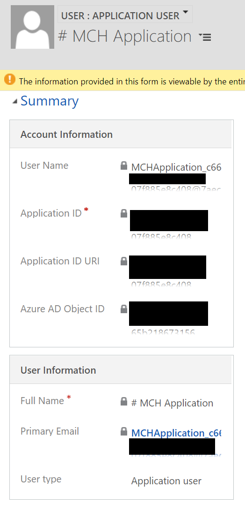

1. [] In the **User Information** section, enter or select the following information and select the **Save** icon in the bottom right corner:
    1. [] **User type**: Select **Bot application user**. This will *display a new field* to store the Bot application Id.
    1. [] **Bot application ID**: This is the Azure Health BotId you copied when enabling the Teams channel. This field is displayed once the User Type is selected to be Bot application user.

        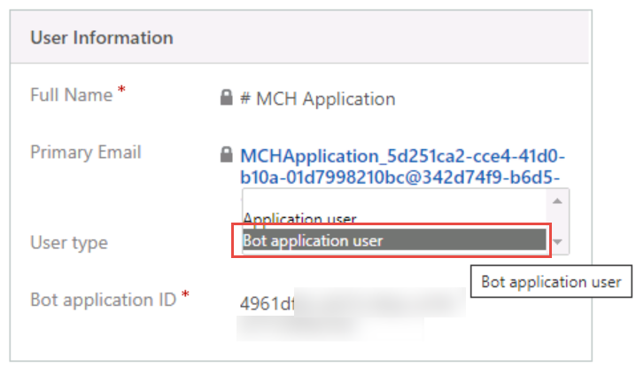

1. [] Select **Manage Roles** on the command bar.

    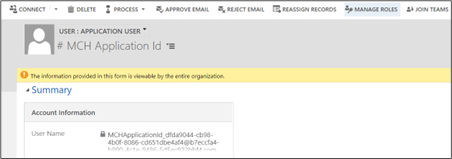

1. [] If necessary, assign the **Omnichannel Agent** role to the Bot User as you did for your own user in the previous task. This will allow the bot to act as an omnichannel agent like your user.

    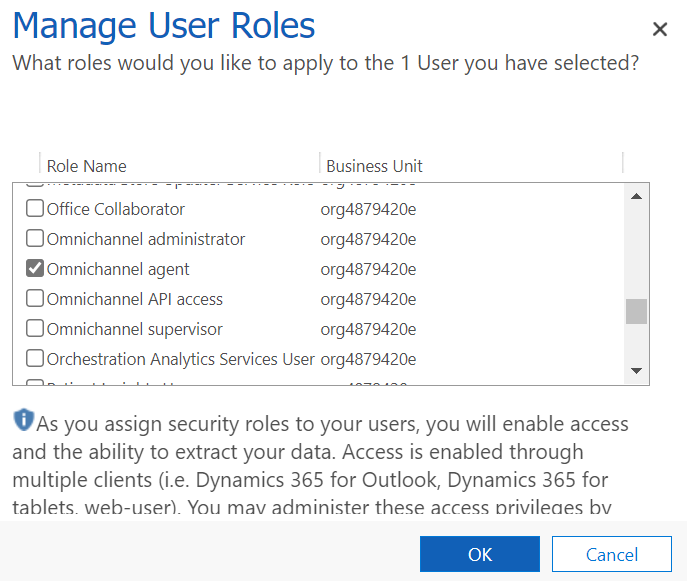

**Congratulations**! You successfully created a Bot User and assigned to it the Omnichannel Agent role.

### Task 3: Create and Configure Omnichannel Queues

In this task, you will create and configure the omnichannel queues necessary to communicate with the correct bot or agent depending on the situation.

1. [] In <http://make.powerapps.com>, open the **Omnichannel admin center** app.

    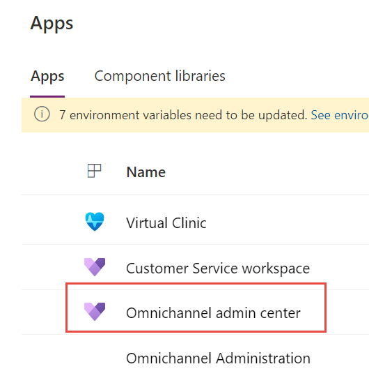

1. [] Select **Queues** on the left navigation bar.

    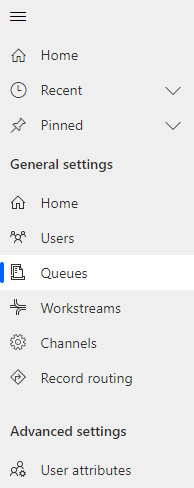

1. [] Open **Default Messaging Queue**.

    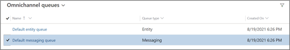

    We will now associate the Default messaging queue with the Bot User so it will respond to incoming messages from customers without agent (human) intervention.

1. [] Select **Add Existing User** on the **User (Agents)** subgrid to add the Bot user you previously created.

    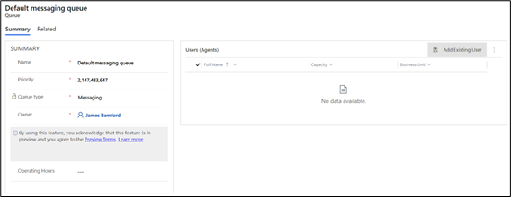

1. [] In the **Lookup Records** pane, search for your Bot User (**MCH Application**) created in the earlier task.

    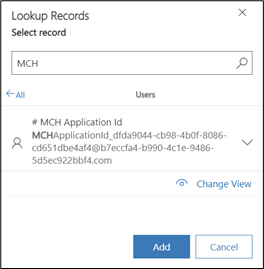

1. [] Select the record from the list and select **Add**.

    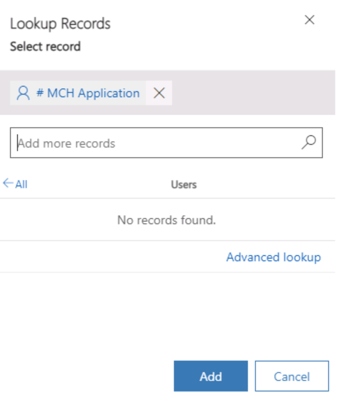

1. [] You should now see the Bot User (MCH Application) in the Users list. Save and close.

    > [!NOTE] Note: If the user does not populate after adding, make sure you assigned the omnichannel agent security role to the bot user in the previous task (it may take up to 15 minutes for changes to take effect).

    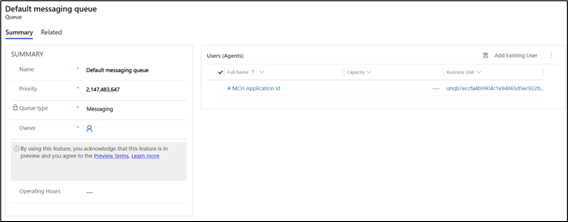

1. [] Go back to the **Queues** grid. Select **+ New queue** to create a new Queue.

    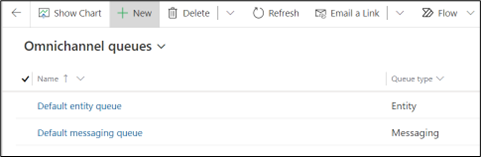

1. [] Give the new Queue the following details:
    1. [] **Name**: +++Escalate To Human+++
    1. [] **Type**: Messaging
    1. [] **Group number**: 1
    1. [] Select **Create**.

        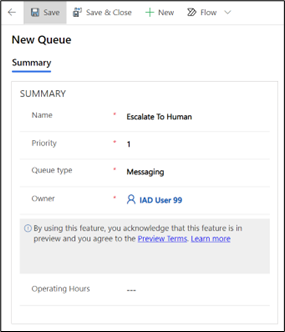

1. [] A **Users** subgrid should appear. If your user is not visible, select **Add Users** in the subgrid.

1. [] Search for and add your **MOD Administrator** user to the queue. The user is now added to the queue with the agent role.

    The queue **Escalate To Human** is created to manage and redirect the incoming messages from a user to a Customer Service (human) Agent when Bot sends the user through to a live agent.

    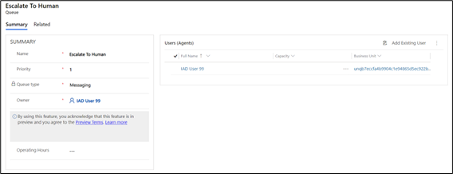

**Congratulations!** You have created the necessary queue to escalate to human agent and added the appropriate users to each messaging queue.

### Task 4: Update Live Work Stream with Context Variables and Routing Rules

Workstreams are containers to enrich, route, and assign work items. A workstream is associated with a channel, such as live chat, voice, or case. After a bot is added to a workstream, the incoming work item is first routed to the selected bot at runtime based off classification rules. For more information, see Create workstreams for unified routing on Microsoft Learn.

In this task, we will set up basic chat routing. This will allow for users to chat with a bot user in certain cases and a live human agent in other scenarios. The routing rules will allow chat to behave as follows:

-   **Route to Bot:** Initial customer conversation is through Health Bot in the default messaging queue. When the chat bot is first opened, route to Default queue which only contains the bot user (agent).
-   **Human Routing Rule**: When context variable **EscalateToAgent** is present and set to 1, we route to the queue that has only human users (agents) who can take over conversation.

1. [] Navigate to **Workstreams**.

    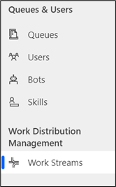

1. [] Select **+ New Workstream** on the command bar.

    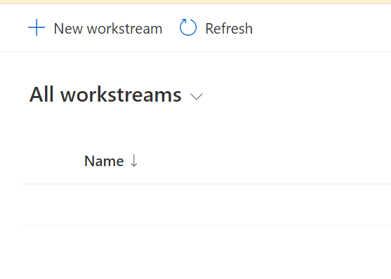
    
1. [] Enter the following details for the new workstream and select **Create**:
    1. [] **Name**: +++Chat Workstream+++
    1. [] **Type**: Messaging
    1. [] **Channel**: Chat
    1. [] **Work distribution mode**: Push

        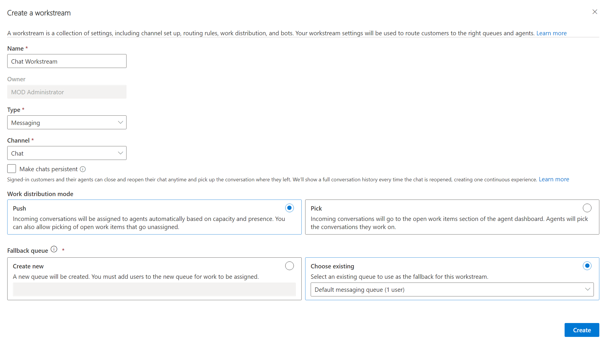

1. [] On the **Chat Workstream** record, you must set up your chat channel. Select **Set up chat** under **Live chat**.

    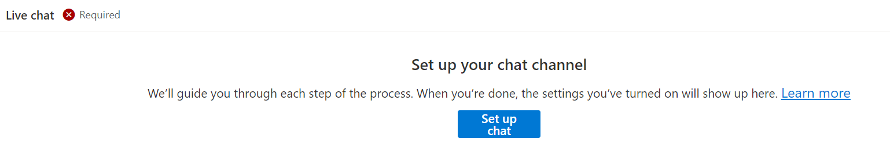

1. [] The Live Chat setup screen will open. Enter the channel details as follows and select **Next.**:
    1. [] **Name**: Chat Widget
    1. [] **Language**: English – United States

        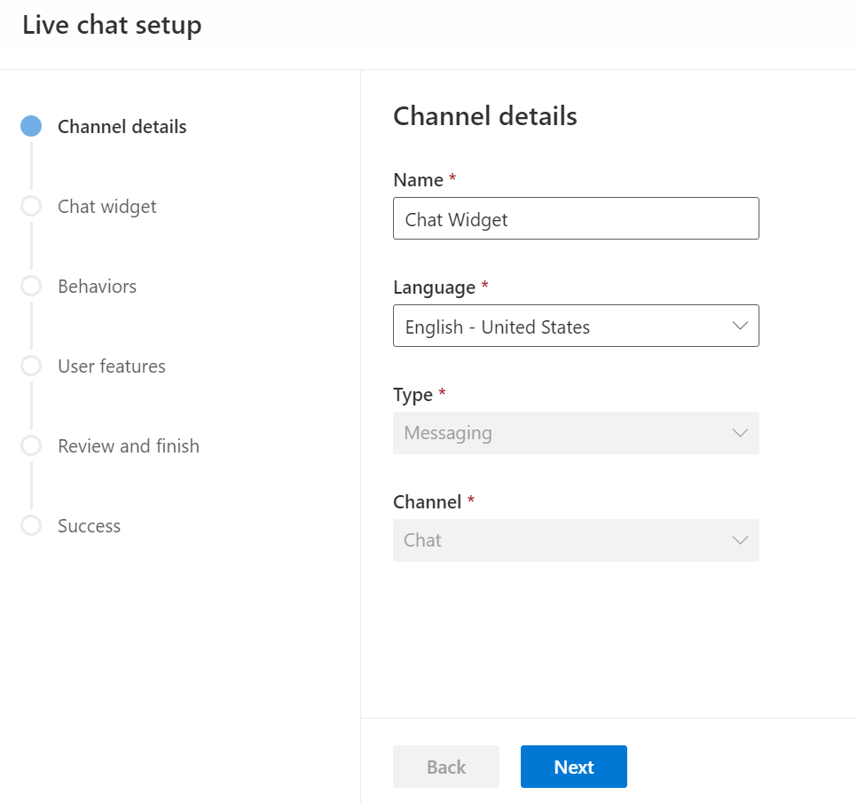

1. [] On the following screen, toggle to enable **Proactive chat**. 

1. [] Select **Next** to see the **Behaviors** settings you can customize for your bot, including automated messages and surveys. No need to customize anything here now.

1. [] Select **Next** to see the **User features** that can be defined for the bot. Nothing is needed here now.

1. [] Review your settings and select **Create channel**.

    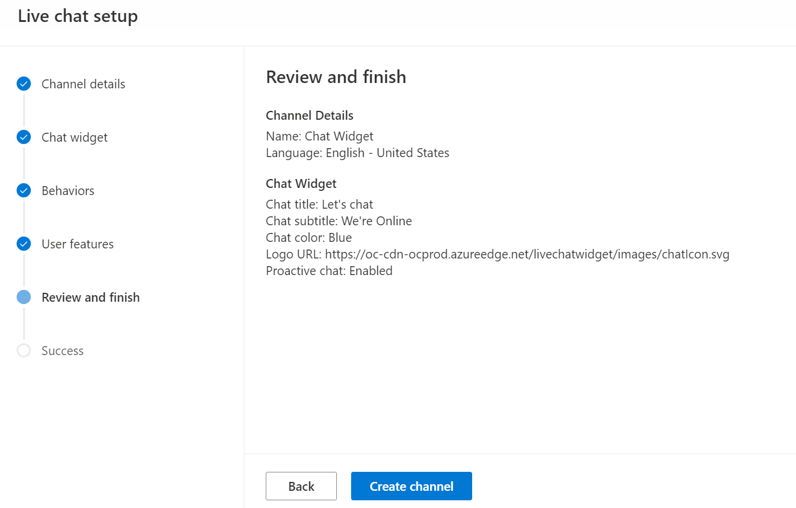
        
1. [] Once the chat channel is successfully created, copy the script of the chat **widget**, and save it somewhere like Notepad to add it to your website later. Select **Done** to close the wizard.

1. [] In your new **Chat Workstream** record, select **Add Bot** to add the Azure Health bot for initial routing.

    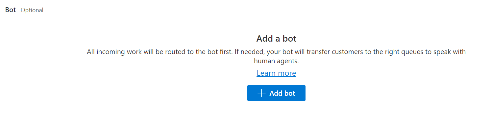

1. [] Find and select your bot. Select **Save and close**.

    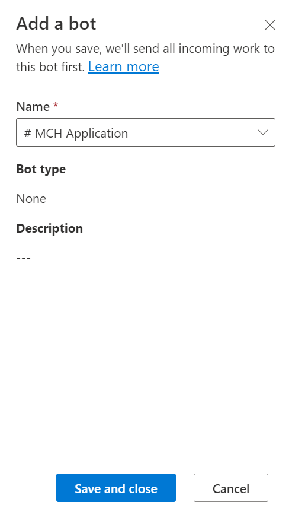

1. [] Expand **Advanced settings** to see the **Smart assist bots** subgrid. Select **Add Bot**, ensure **MCH Application** is selected and select **Save and close**.

1. [] Now we want to define a new context variable and routing rule. Select **+ Add Context variable**.

    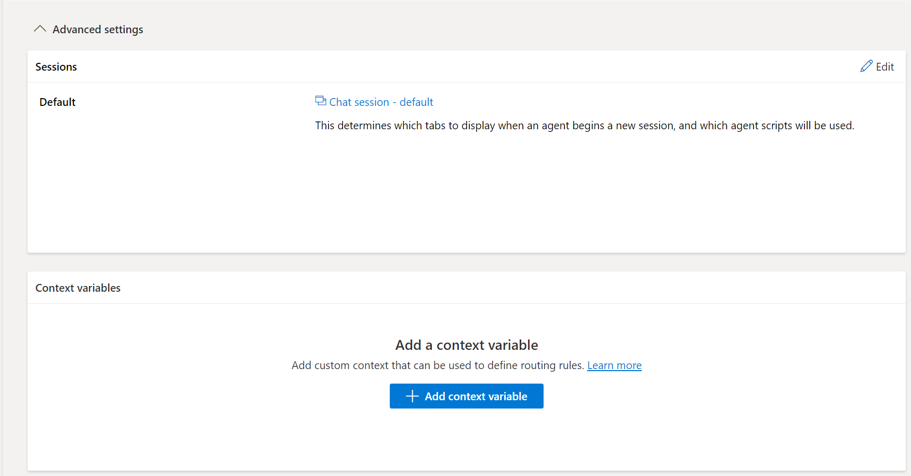

1. [] In the context variable flyout, select **+ Add** to add new context variable.

1. [] Create the new Context Variable with the following details and select **Create**:
    1. [] **Name**: +++EscalateToAgent+++
    1. [] **Type**: Number

        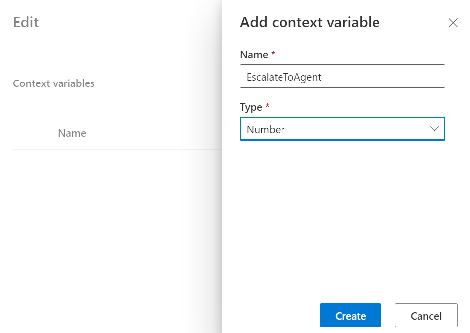

1. [] Close the context variable panel. You should now see the new EscalateToAgent context variable in the live chat workstream. 

1. [] Select **Advanced Settings** to collapse to the main page.

1. [] In the **Routing rules** subgrid, next to **Route to queues**, select **+Create ruleset**.

    

1. [] Create the new route-to-queues ruleset with the following details and select **Create**:
    1. [] **Name:** +++Human Agent+++
    1. [] **Queue:** EscalateToHuman

        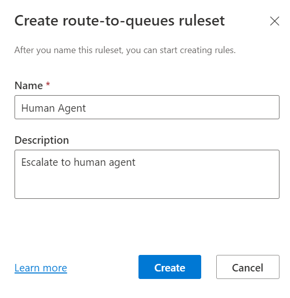

1. [] In the new **Human Agent** queue ruleset, select **+ Create rule**.

1. [] Name the new rule +++**Human Agent Rule**+++.

1. [] Under **Conditions**, choose **Add related entity** from the dropdown.

1. [] In the first two dropdowns, choose **Context item value** and **Contains data**. In the inline condition, choose **EscalateToAgent Equals 1**.

1. [] In the **Route to queues** section, choose **Escalate to Human** queue created previously. 

1. [] The configured rule set is shown below. Select **Create**.

    

1. [] The Chat Workstream now has a Human Agent ruleset that will escalate to a human agent when the EscalateToAgent context variable is set to 1

    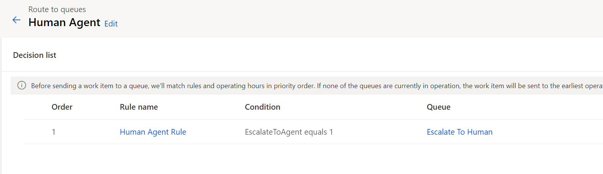

**Congratulations!** You have created the proper context variable and routing rules that will allow customers to begin conversation with a health bot and escalate to a human agent.

### Task 5: Create Chat Widget for Health Bot

1. [] Navigate to **Chat**.

    

1. [] Select **+New** Chat Widget.

    

1. [] Give the Chat Widget a **Name** (eg., Patient Portal Chat Widget).

    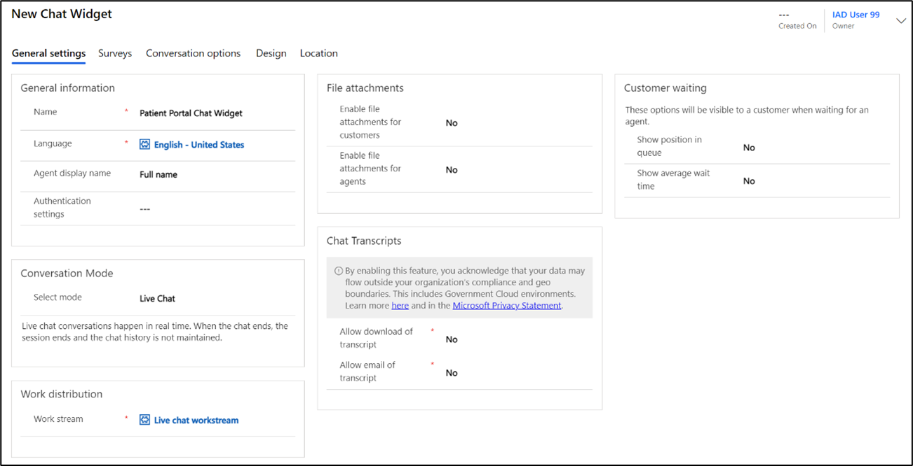

1. [] Select **Save**.

    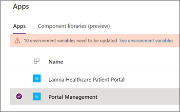

1. [] After the record is saved, a **Widget Code Snippet** will be generated. Copy the code snippet and store it for later use.

    

**Congratulations!** In this exercise, you have successfully configured Customer Service Omnichannel Live chat by creating the necessary Users, Queues, Work Streams, Context Variables, Routing Rules, and Chat Widget. These all work together and allow patients to chat with a virtual health bot with the option to escalate up to a human agent if needed.

===

## Exercise 2: Embed Health Bot in Power Apps Portal

In this exercise, you will be embedding the **Omnichannel Chat Widget** into the Power Apps Customer self-service portal using Portal Management configuration. In your environment, we created a Lamna Healthcare Company Portal using the **Customer self-service portal** template before deploying Microsoft Cloud for Healthcare. Now we will configure the chat widget to show on the customer website.

Customer self-service portal: A customer self-service portal enables customers to access self-service knowledge, support resources, view the progress of their cases, and provide feedback.

Portal Management: Application to help you get started with the advanced portal configuration. In this walk-through, you will learn how to configure Chat widget in Portal Management app.

1. [] In <http://make.powerapps.com>, open the **Portal Management** app.

    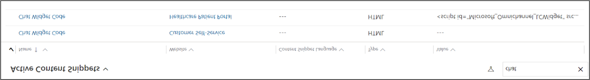

1. [] Select **Content Snippets** in the left navigation pane

    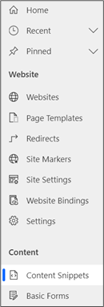

1. [] In **Active Content Snippets**, type: +++**Chat**+++ in the **Search** box and press **Enter**.

    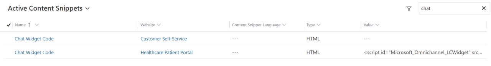

1. [] You will see two **Chat Widget Code** records retrieved in the list. Select to open the Chat Widget Code record related to **Lamna Healthcare Patient Portal**.

    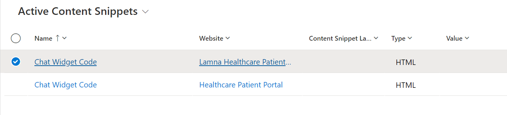

1. [] In the **Chat Widget Code** record associated with **Lamna Healthcare Patient Portal**, select **Value (HTML) > Html** tab and then paste the Chat Widget Code snippet that you copied and stored in Task 5 of Exercise 1.

    

1. [] Select **Save & Close**.

    

1. [] Now open the other **Chat Widget Code** associated with the **Healthcare Patient Portal** website.

    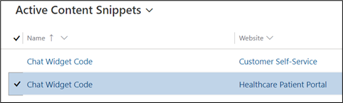

1. [] In the **Chat Widget Code** record associated with the **Healthcare Patient Portal**, in the **Value (HTML) > HTML** tab, paste the same Chat Widget Code snippet that you copied and stored previously and added to the Lamna Healthcare Patient Portal chat widget code. Replace any value that may have already populated the field.

    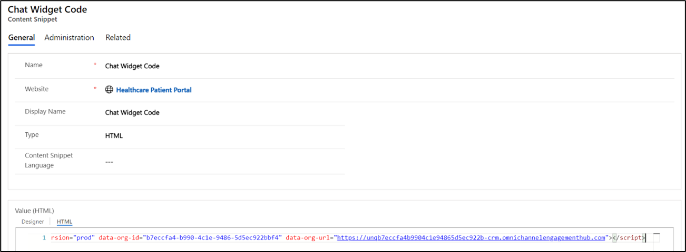

1. [] Select **Save and Close**.

**Congratulations!** In this exercise you have successfully updated the chat widget in the Power App Portal Content Snippets. With this configuration, the Health Bot will be visible on the Power Apps portal for both the customer self-service template and the healthcare patient portal template.

===

## Exercise 3: Extend Azure Health Bot with Custom Scenarios

**Dynamics 365 Omnichannel** integration allows the patient to interact with **Azure Health Bot** using the Dynamics 365 chat widget to access the medical knowledge and your custom scenarios. It also, allows the escalation of a bot conversation to a live agent to continue the interaction. When escalating a conversation, Dynamics passes along the conversation history and the context to the agent.

In this exercise, you will be doing the following:

-   Designing the below Health Bot Scenario called **MCH_PatientService**

    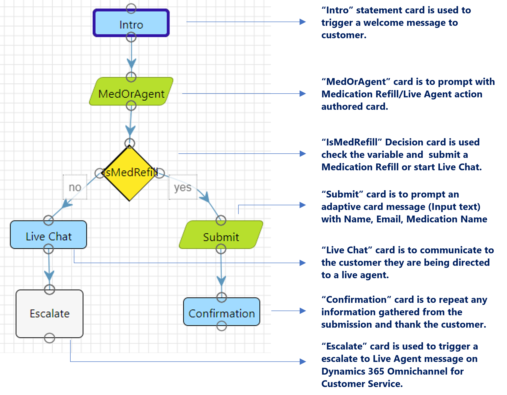

-   Design another Health Bot Scenario called **MCH_PatientServiceWelcome**. This scenario holds the starting statement which will allow the user to invoke the **MCH_PatientService** scenario.
-   Set the **Automatic Welcome Scenario** to be the MCH_PatientServiceWelcome custom scenario you create. This will begin the scenario when a user first interacts with the Health Bot.

### Task 1: Create MCH_PatientService Scenario

In this task, you will create the **MCH_PatientService** bot scenario using the designer canvas.

1. [] Navigate back to the Azure **Health Bot instance** homepage where you set the bot settings. This is the portal management link you copied from the Azure portal.

    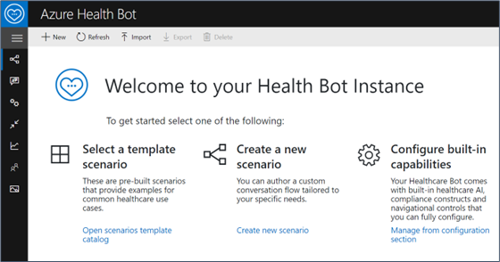

1. [] Select to expand the side navigation bar. Navigate to **Scenario > Manage**.

    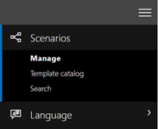

1. [] Select **+ New** button on the top ribbon.

    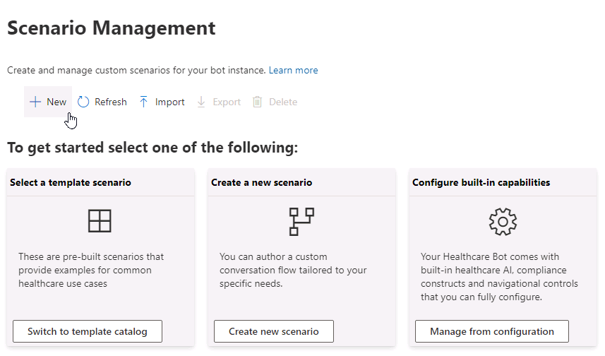

1. [] Provide the following details for the new health bot scenario and select **Create**:
    1. [] **Name**: +++MCH_PatientService+++
    1. [] **Scenario ID**: +++MCH_PatientService+++

        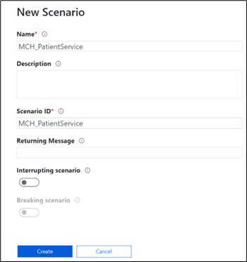

1. [] It should navigate you directly to the designer. If not, select the MCH_PatientService scenario in **Scenarios > Manage** to edit. Now let’s design the scenario conversation. 

    

#### Step 1: Add Bot Introduction Statement

1. [] Select **+ Add element > Conversational elements > Statement** to add a beginning **Statement** to the scenario to the editor.

    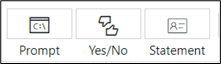

1. [] Enter the **Display Text**: +++Hi there, I’m your Healthcare Assistant.+++

1. {} Select the **pencil** next to **Statement** in the top bar and change Title to **Intro**.

    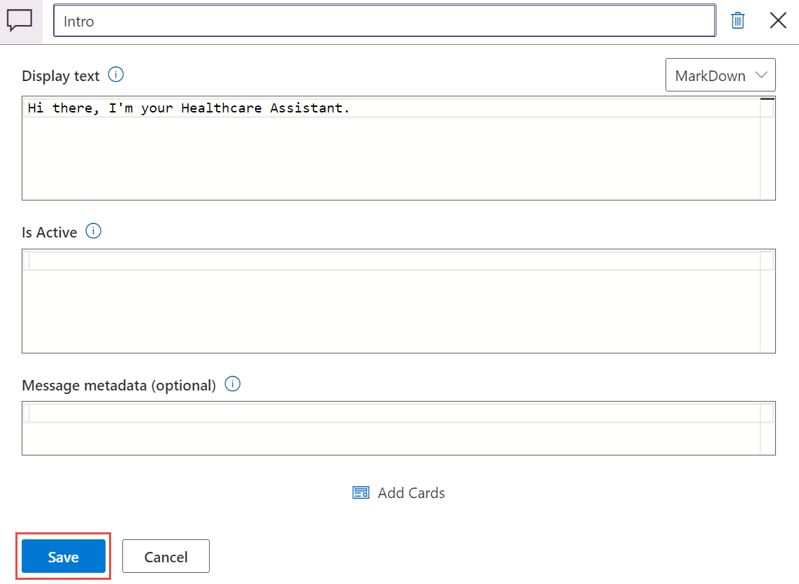

1. [] Select **Save**. You will see the intro statement added to the designer canvas. To edit it, you can double-click anytime.

#### Step 2: Add Prompt for Medication Request or Live Agent

This section prompts two buttons Medication Refill and Live Agent. When user click any one of the buttons it will set the appropriate text to the variable MedicationOrAgent.

1. [] Select **Add element > Conversational elements > Prompt** icon to add a prompt.

    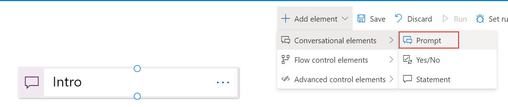

1. [] Enter the following details:
    1. [] **Display Text**: +++Would you like to request a medication refill or chat with a live agent?+++
    1. [] **Variable name**: ++MedicationOrAgent++
    1. [] **Data type**: string
    1. [] Rename Title to +++**MedOrAgent**+++.

1. [] Select **Add Cards**.

    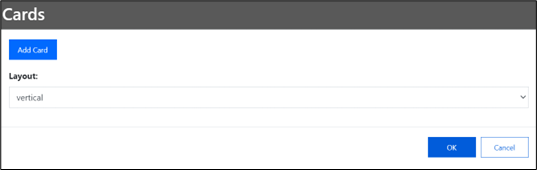

1. [] Select **Card Type** as **Hero Card.** Leave title blank as we already prompted with display text.

    

1. [] Select **Add Action** button twice to add two actions.

1. [] For the first action, select the following:
    1. [] **Action type**: imBack
    1. [] **Action value**: +++MedicationRefill+++
    1. [] **Action title**: +++"Medication Refill"+++

1. [] For the second action, fill in the following:
    1. [] **Action type**: imBack
    1. [] **Action value**: +++LiveAgent+++
    1. [] **Action title**: +++“Live Agent”+++

    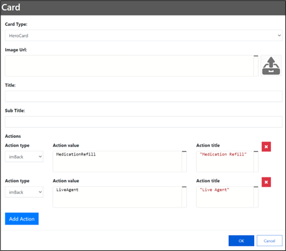

1. [] Select **Ok** and then **Save** to get back to designer.

1. [] Select the bottom circle on **Intro** and drag it to the top circle on the new prompt, **MedOrAgent** to connect them. An arrow will automatically appear when you try to connect Intro and MedOrAgent boxes using ellipse pointer.

    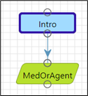

1. [] Select **Save**.

    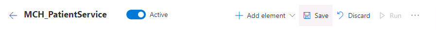

1. [] Select **Run** to see the output in the WebChat on the right.

    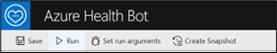

    
    
1. [] Select the Refresh button on the title bar of the chat window to clear the chat for the next text.

    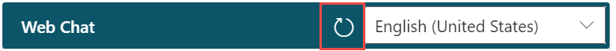

#### Step 3: Add MedicationOrAgent Decision Branch

This section checks whether the user has clicked Medication Refill or Live Agent with the help of the variable MedicationOrAgent. It will redirect the message accordingly.

1. [] Add a **Branch** to the designer canvas.

    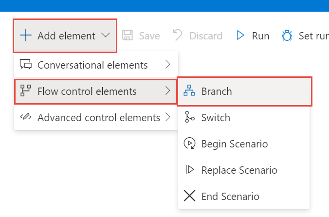

1. [] Enter the following in the javascript Boolean expression: +++scenario.MedicationOrAgent === "MedicationRefill"+++

1. [] Rename to +++IsMedRefill+++. Select **Save**.

    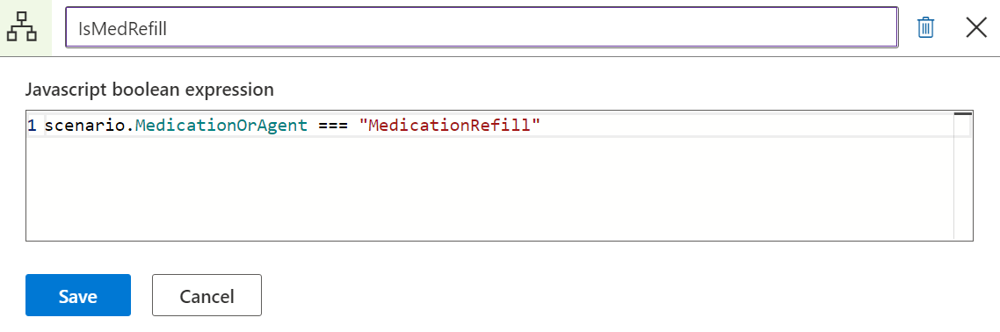

1. [] Select and drag the bottom circle of the **MedOrAgent** prompt to the top circle of the **IsMedRefill** branch decision to connect them. Select **Save**.

    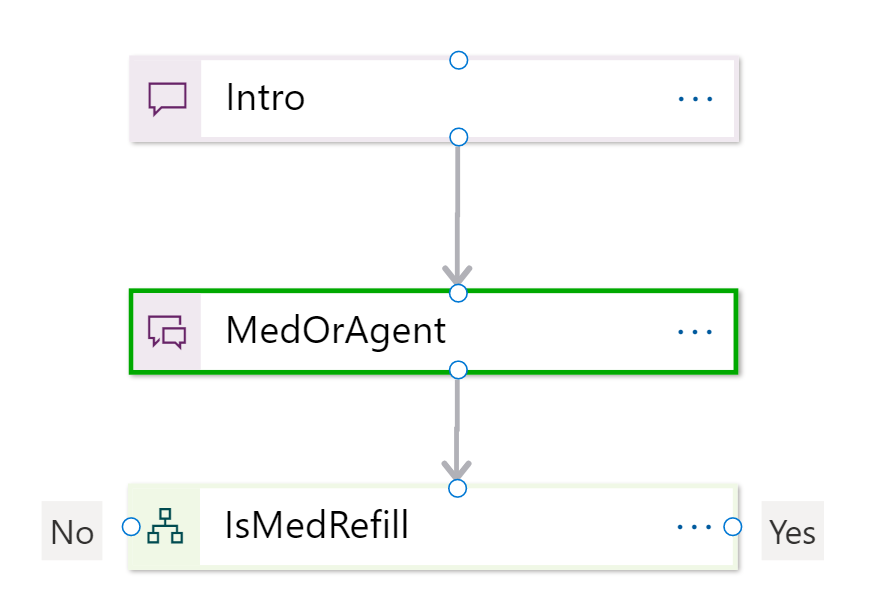
    

#### Step 4: Prompt User to Enter Data for Medication Refill Option

1. [] Add a **Prompt** element. This will be used to display the Form data (using Adaptive Card) to capture Patient name, email, and phone to create an appointment.

    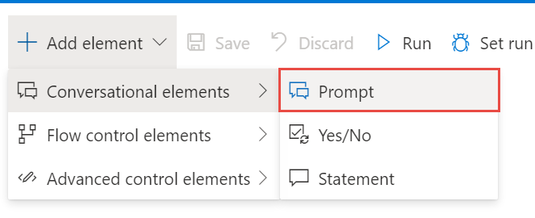

1. [] Add the following details and select **Add Cards**:
    1. [] **Input variable**: +++formData+++
    2. [] **Input Type**: Object
    3. [] Change Title to +++Submit+++
    4. [] Do not add any display text since the adaptive card will display instead

        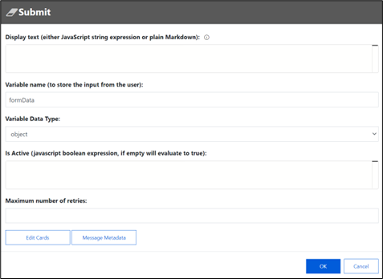

1. [] Select **Adaptive Card** in **Card Type**.

1. [] Refer to the lab resources file **AdaptiveCardForMedicationRefill.txt** and copy the json content and paste it in the json section of your card.

    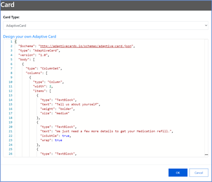

1. [] Select **OK** and **Save** to get back to the designer.
  
1. [] Connect the **Yes** condition of the **IsMedRefill** branch to the **Submit** prompt.

    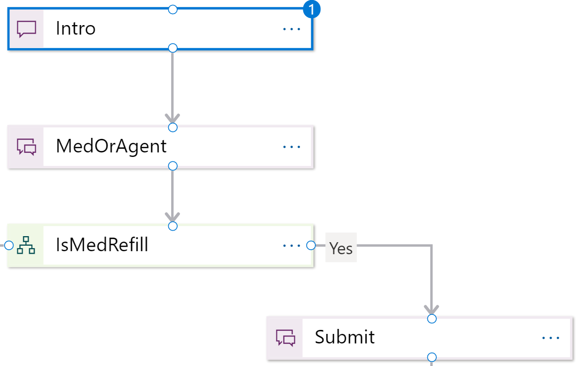

1. [] Save and run your current scenario. If you don’t save the scenario first, it won’t run with updates since the last save. If you haven’t saved at all, it won’t recognize any conversation.

1. [] Select the  **Medication Refill** card when prompted. The AdaptiveCard will be displayed.

    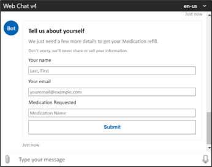

#### Step 5: Add Confirmation Statement

1. [] Add a **Statement** element.

    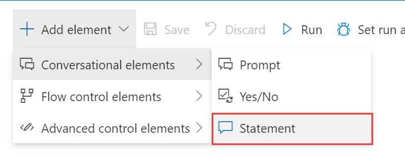

1. [] Add **Display text** as the following: +++**scenario.formData.myName + " - Thanks for providing the information, we have created a Medication Request for you regarding the following medication: " + scenario.formData.myMedReq**+++

1. [] Rename the statement to +++Confirmation+++ and select **Save**.

    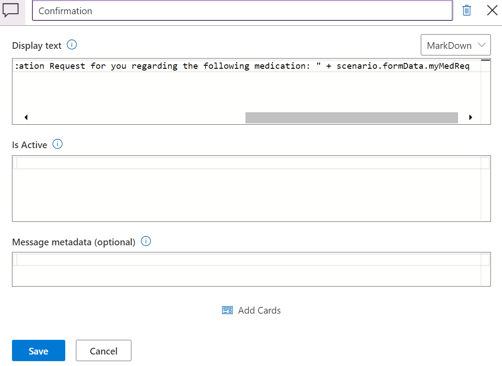

1. [] Connect the **Submit** step to the **Confirmation** step in the designer canvas.

    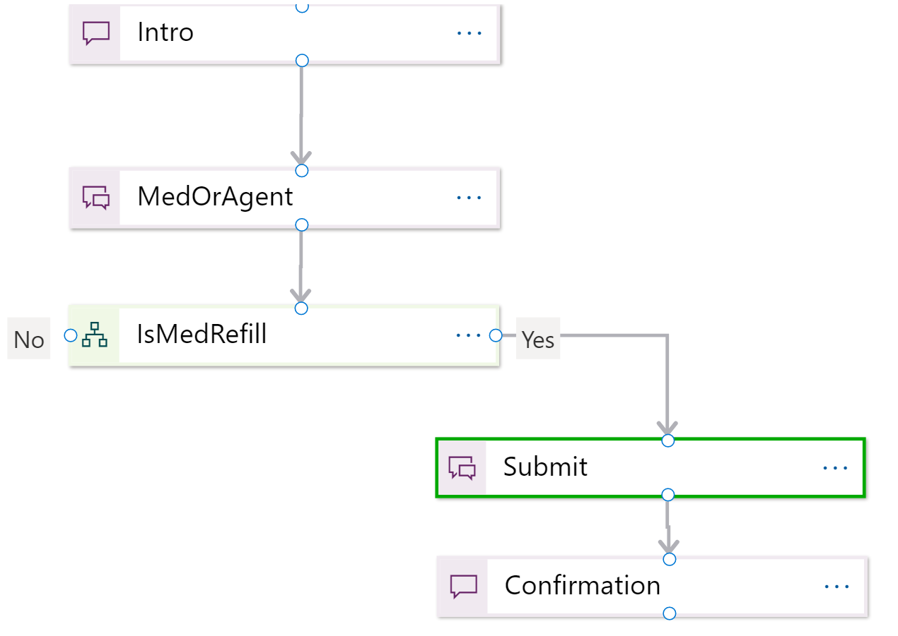

1. [] Select **Save** and select **Refresh** in the **Web Chat** pane. Select **Run** to see your scenario in the webchat.

1. [] Fill in information for the request and select **Submit** to see the confirmation text.

    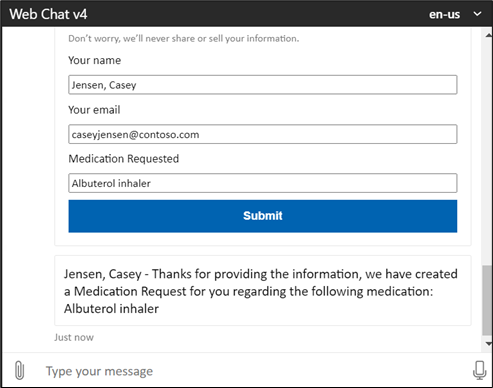

#### Step 6: Invoke Live Agent Action

1. [] Add a **Statement** element to the canvas.

1. [] Enter **Display Text**: +++**Please wait, I am transferring your request to a live agent for further assistance.**+++
  
1. [] Rename the statement to +++Live Chat+++

    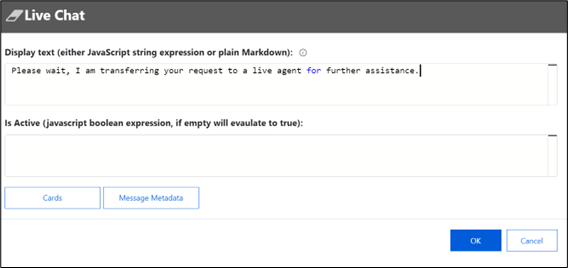

1. [] Select **Save** to return to the designer page.
  
1. [] Connect the **No** decision of the **IsMedRefill** branch to the **Live Chat** statement.

    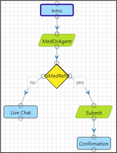

#### Step 7: Add Action to Invoke Escalation

1. [] Add an **Action** element to the canvas that will be used to trigger an escalation to Omnichannel Live Agent

    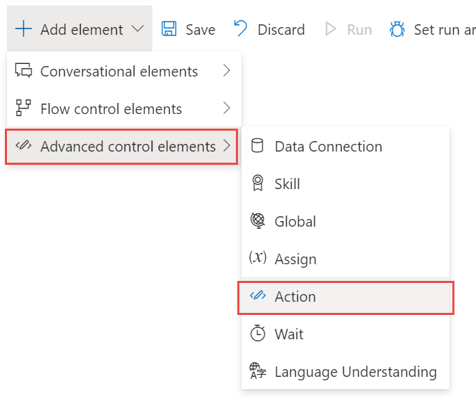

1. [] Add the following code in the action, which will trigger the Live agent chat:

    session.sendChannelData('Escalating...', {

    "tags": JSON.stringify({type: "Escalate", context: {"EscalateToAgent": 1}})

    });

1. [] Name the action +++Escalate+++. Select **Save** to return to the designer page.

    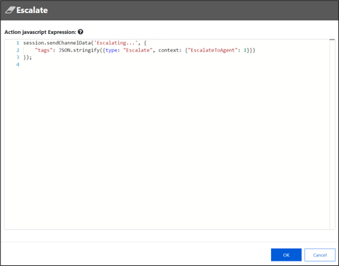

1. [] Connect the **Live Chat** to the new **EscalateToAgent** action. You completed the final connection!

    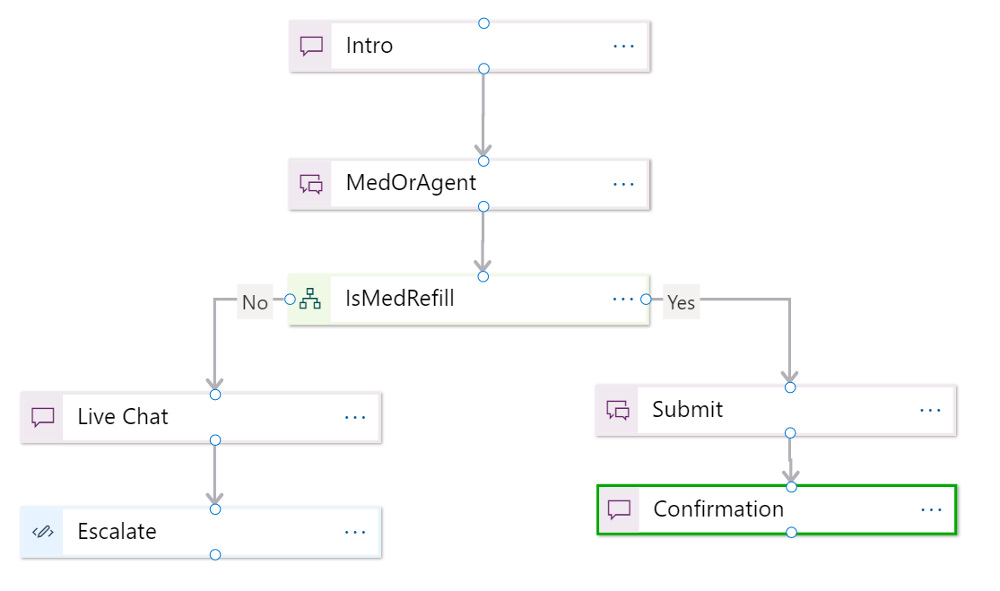

1. [] Save, refresh the chat, and run your scenario to see the full scenario output.

1. [] Select **Live Agent** in the authored card should show the escalation action.

    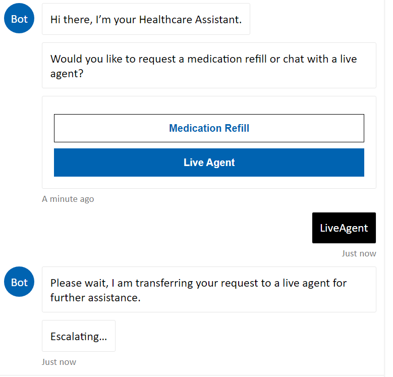

1. [] Select the back arrow next to **MCH_PatientSerivce** in the scenario editor.

    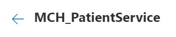

### Task 2: Create MCH_PatientServiceWelcome Scenario

In this task, you will create another bot scenario called **MCH_PatientServiceWelcome** to invoke the **MCH_PatientService** scenario.

1. [] On the Azure Health Bot scenarios page, select **+New** to create another new scenario

    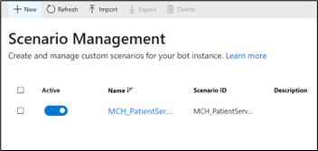

1. [] Provide the following details for the new scenario and select **Create**:
    1. [] **Name**: +++MCH_PatientServiceWelcome+++
    1. [] **Scenario ID**: +++MCH_PatientServiceWelcome+++

        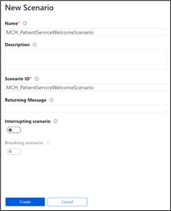

1. [] On the scenario editor designer, add a **Statement** element.

1. [] Rename the statement **Welcome**. Do not add any Display text as we will show it in the card instead.

1. [] Select **Add Cards**.

    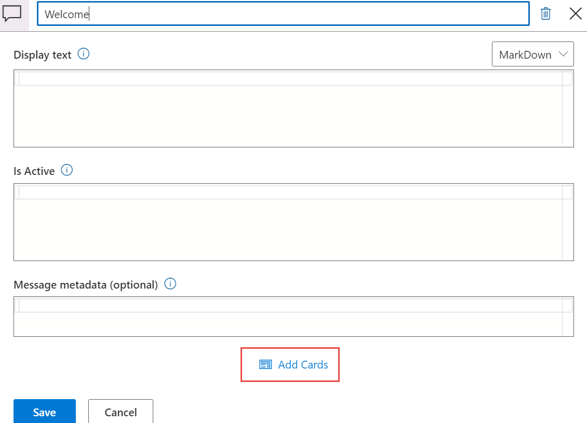

1. [] Choose **Hero Card**. Add **Title**: +++Welcome to Lamna Healthcare Patient Service Portal+++

    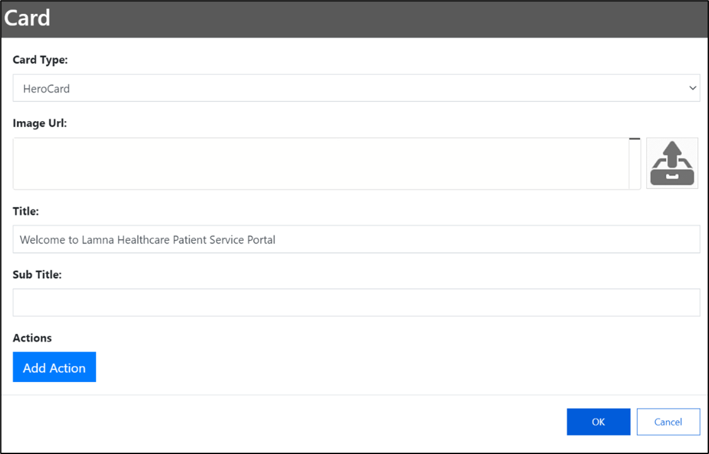

1. [] Select **Add Action** and provide the following details:
    1. [] **Action type**: imBack
    1. [] **Action value**: +++"begin MCH_PatientService"+++
    1. [] **Action title**: +++"Lamna Healthcare Support"+++

    

1. [] Select **OK** and **Save** to view your completed scenario. This will be used to kick off the conversation and allow the other MCH_PatientService scenario to be invoked through the authored card.

1. [] Save and run to test your bot scenario **MCH_PatientServiceWelcome** scenario in the Web Chat.

    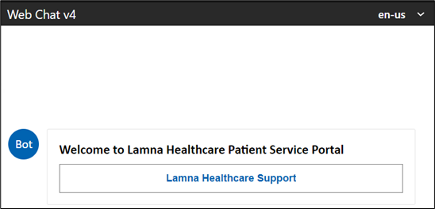

1. [] Select the back arrow next to **MCH_PatientSerivce** in the scenario editor.

### Task 3: Configure Welcome Scenario as Automatic

In this task, we will set the MCH\_ PatientServiceWelcome to be the “Automatic Welcome Scenario” in settings. This will always trigger the welcome scenario when a user starts a conversion with the **Azure** **Health Bot**.

1. [] Navigate to **Configuration > Conversation**

    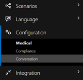

1. [] In the **Interactions** tab, scroll down to the **Automatic Welcome** section.

    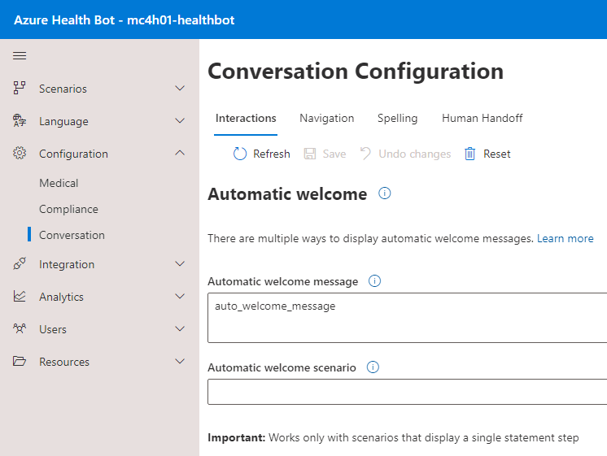

1. [] In the **Automatic welcome scenario** dropdown, select the **MCH_PatientServiceWelcome**. Select **Save**.

    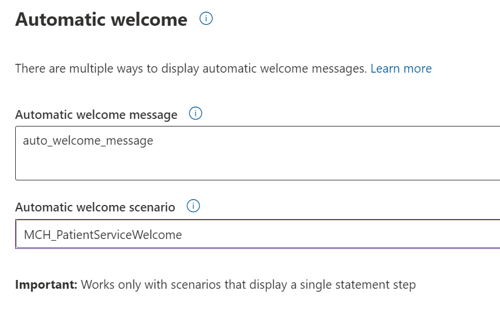

### Task 4: Test Health Bot Escalation from Power Apps Portal to Dynamics 365 Omnichannel

1. [] Navigate to **Power Apps** and click to open **Lamna Healthcare Patient Portal**.

    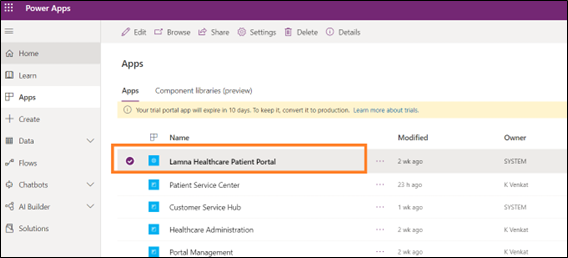

1. [] You should see the Health Bot **Let’s Chat** button in the lower right-hand corner of the screen. This means the chat widget was successfully embedded into the Customer Self-service portal.

    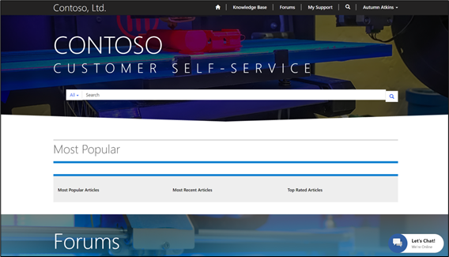

1. [] When you the select the chat widget, the bot will trigger the welcome scenario message we created and set as the default welcome message **(MCH_PatientServiceWelcome)**.

    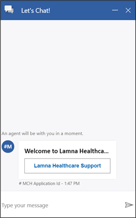

    > [!ALERT] Note: Omnichannel for Customer Chat Widget will work only when you see the presence status is enabled. There should be a splash loading screen that goes through multiple steps and then displays the status indicator as available once loaded. (Status is enabled when the green circle with the checkmark appears)

1. [] To verify the presence status, navigate back to **Power Apps** and open **Customer Service Workspace.**

    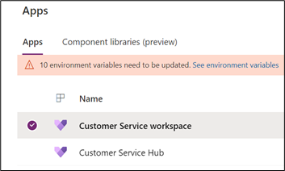

    

    Splash screen:

    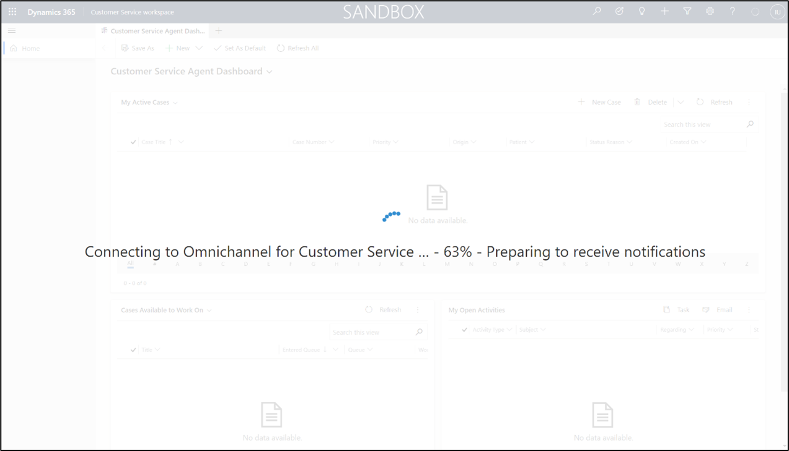

1. [] In the **Health Bot in Lamna Healthcare Patient Portal**, select **Lamna Healthcare Support** button, then the **Live Agent** button to witness the escalation into Omnichannel to chat with a live agent (your user!)

    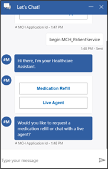 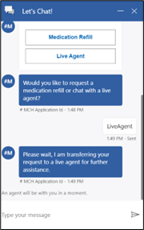

1. [] Navigating back to **Omnichannel for Customer Service**, your user as the Live Agent should receive an incoming notification with **Accept/Reject** options for that chat.

1. [] Select **Accept** to connect and chat with customer (In this case chat with the **patient**).

    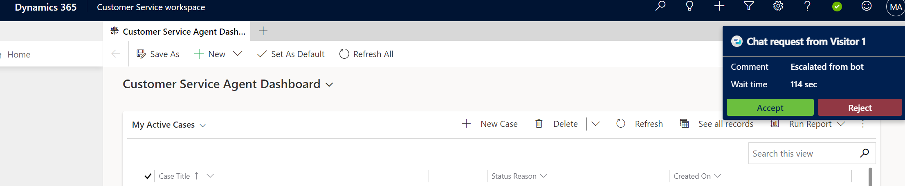

1. [] As soon as Live Chat Agent accepts the incoming chat notification, Omnichannel for Customer Service has opened a **Live Chat Widget** and Agent would be able to see the entire bot conversation with user and continue the chat conversation with user for further assistance.

    

**Congratulations!** You have successfully extended the Azure Health Bot with custom scenarios and tested the end-to-end escalation scenario from a patient using the Azure Health Bot in Power Apps Portals to chatting with a Live Agent in Omnichannel for Customer Service.
