# Module 4 Lesson 1- Lab 3: Patient Access & Service Center

## Overview

Microsoft Cloud for Healthcare includes Patient Access and Patient Service Center.

You can provide patients with access to their health data, in-person and virtual appointment scheduling, and information through knowledge articles. Patient Access provides a portal that will help you give patients the ability to chat with a health bot, communicate with a caregiver, and view their clinical data.

Patient Access includes the following capabilities that you can provide to your patients:

-   **Access** - Patients have a user-friendly portal to access their health information.
-   **Direct engagement** - Patients can engage through automated chat conversations that will hand off to your patient service center.
-   **Scheduling and messaging** - Patients can schedule appointments and send messages to their providers.

In the Patient Service Center, you can engage with your patients in the way that they want while monitoring automatic conversations through the Microsoft Azure Health Bot service. Additionally, service agents can help your patients with information and setting up appointments.

The Patient Service Center includes the following capabilities:

-   **Monitor patient conversations** - An ongoing conversations dashboard provides information on the conversations that are handled by the agents and integrated bots.
-   **Agent scripts** - Use provider-specific agent scripts to address patient issues.
-   **Monitor effectiveness** - Conversation intelligence provides insights for service center managers on agent performance.
-   **Follow-up** - Send follow-up surveys on patient satisfaction, reminders on appointments, and more.
-   **Appointment scheduling** - Schedule or reschedule appointments during conversations with patients.

The Patient Access Portal and Patient Service Center modules focus on the **Enhance Patient Engagement** priority scenario by communicating effectively with patients with the prebuilt guidance and automated systems.

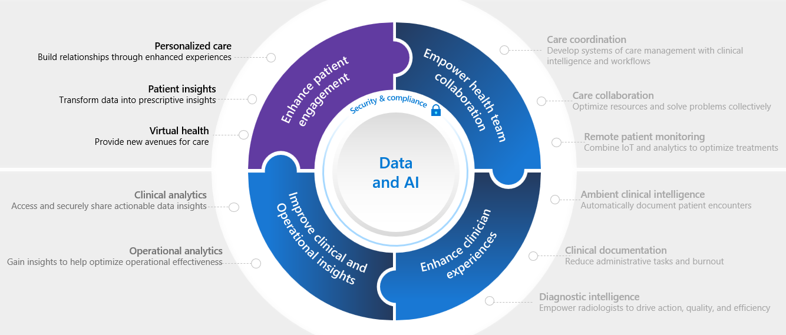

The lab for this module will focus on the healthcare story of Casey Jensen.

Casey is an avid runner but has exercise-induced asthma and requires an albuterol inhaler to help her breathe while running. Casey has realized that her current albuterol inhaler is low on medication and decides that it's a good time to get a refill.

In this lab, you'll first play the role of a Lamna Healthcare system administrator, where you'll set up the Patient Access portal and various tools in the Patient Service Center application. Next, you'll play the role of Casey, who will sign in to the portal, navigate the various options, interact with the Azure Health Bot, and escalate to a live agent in Patient Service Center to refill the medication.

## Exercise 1: Configure & Navigate the Patient Access Portal

In this exercise, you will learn how to do the following:

1.  Configure an external website to the Healthcare Patient Portal template

2.  Create a registration code and invite a patient to create an account for the website

3.  Log in as a patient to navigate the features of the healthcare website

The **Healthcare Patient Portal** is a template installed in your environment by the Patient Access module in Microsoft Cloud Solution Center when Microsoft Cloud for Healthcare was deployed.

**Microsoft Power Pages** (previously Microsoft Power Apps portal) is an external website that allows communication between a company and its users. In this case, Lamna Healthcare Company wants an external website for their patients to access their medical histories and communicate effectively with the institution. The Healthcare Patient Portal template tailors the website's user interface (UI) for a healthcare company. It focuses on providing more secure communication, information access, and an overall improved patient experience.

The following image shows an example of the welcome page that displays after you've set up and signed in to the Lamna Healthcare Patient Portal.

For more information, see [Microsoft Power Apps portals documentation].(https://learn.microsoft.com/en-us/power-apps/maker/portals/)

## Task: Set up the Lamna Healthcare Patient Portal

Prior to deploying Microsoft Cloud for Healthcare, you created a portal in your environment by using the Customer Self-Service template. Creating this portal was a prerequisite for deploying the Patient Access module.

Lamna Healthcare wants to associate the previously installed Customer self-service template with the Healthcare Patient Portal template so that the correct website is displayed to the user. The following steps will guide you through the process of binding your website to the proper template and restarting the portal for changes to apply.

First, open the portal to view the Customer Self-Service template that’s currently bound. After you've completed the configuration steps in this task, the new Lamna Healthcare Patient Portal UI will display.

1.	While signed into your Microsoft 365 tenant, open a new tab, and go to [Power Pages portal].(https://powerpages.microsoft.com/en-in/) Select your environment.

2.	Under **Active Sites**, Select **Lamna Healthcare Patient Portal > Preview > Desktop**.
 

3.	The **Customer Self-Service** website template is displayed in the Lamna Healthcare Patient Portal. Close the website. You'll need to set it to the Healthcare Patient Portal template.
 

4.	Go back to Power Pages Portal.

5.	Select the three horizontal dots and then **Admin center.**
 
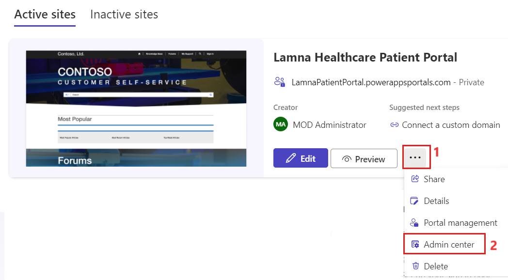

6.	Selecting **Admin center** will open a new window, **Microsoft Power Platform admin center**, where you can complete administrative tasks. Select **Switch to Classic** in the upper command bar to use the classic UI to complete the template binding.
 
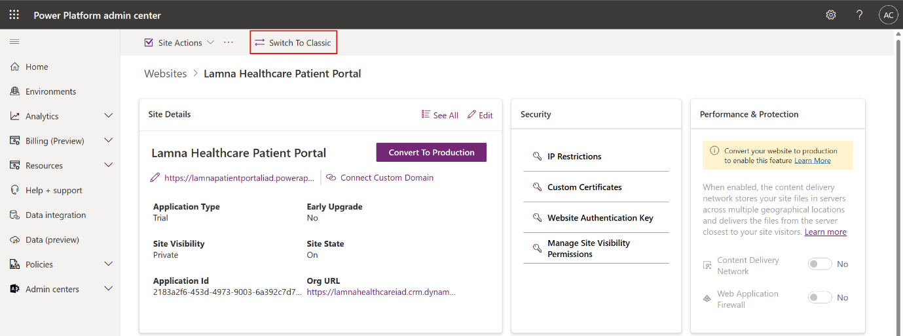

7.	In the **Portal Details** area, scroll down to **Update Portal Binding** and select **Healthcare Patient Portal** from the **Select Website** **Record** dropdown menu.
 

8.	Select **Update** after you’ve selected the Healthcare Patient Portal.

9.	Select **Portal Actions** on the left navigation pane and then select **Restart**.

10.	Wait for 1 to 5 minutes for the portal to restart and then return to the website. The website should show the Healthcare Patient Portal template.
 

You've completed the post deployment step to set up the Healthcare Patient Portal template that’s deployed from Patient Access. After you've updated the bindings and have restarted the portal, the website will display as **Healthcare Patient Portal** template rather than **Customer Self-Service.**

## Task: Modify the company name in Lamna Healthcare Patient Portal

In this task, you'll edit the Lamna Healthcare Patient Portal website to align the name with Lamna Healthcare Company because the template uses a generic company name.

1.	Go back to **Power Pages** where you have your **Lamna Health care Patient Portal.**
 
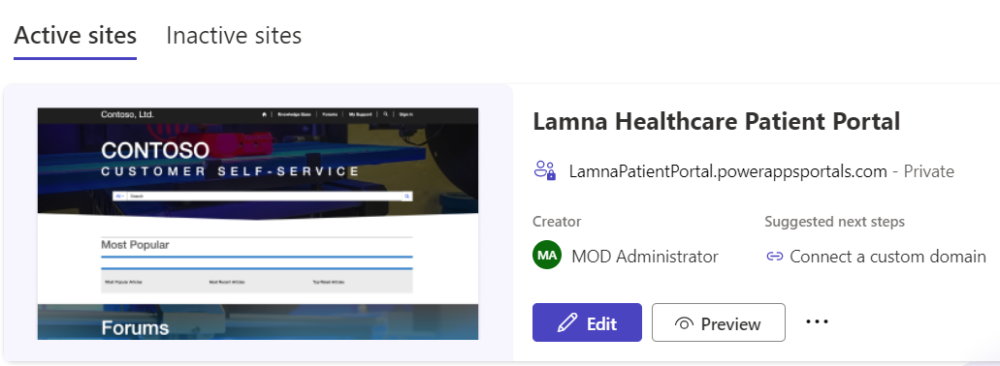

2.	Click on three horizontal dots and select **Portal management.**
 

3.	Once **Portal management** launches, click on **Code Snippets** from the left navigation pane under Content.

4.	Search for **Navbar** in the search area. Click on **Navbar left** for **Healthcare patient portal**.
 
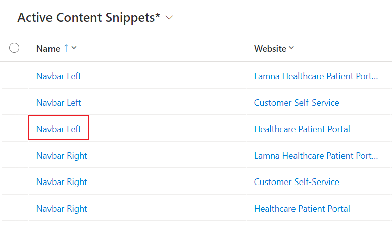

5.	Under **General** tab, scroll down to Value parameter. On scrolling right in the HTML code area, replace Contoso Healthcare with Lamna Healthcare.
 

6.	Click on **Save & Close.**

7.	The name of the portal is changed successfully. 

8.	Go back to **Power pages.** Open the **admin center** of the portal. 
 
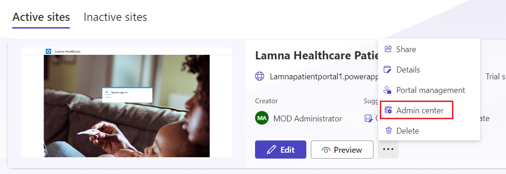

9.	Click on **Restart site** under **Site Actions**.
 

When you launch the Lamna Healthcare Patient Portal, it should now show **Lamna Healthcare** company name in the upper-left corner. You've now completed modifying the Lamna Healthcare Patient Portal to display the correct company name.

## Task: Invite a patient to the portal

Now that the Lamna Healthcare Patient Portal is ready, you can allow Lamna Healthcare patients to create accounts. In this task, you'll create an invitation code for patients to sign up and use the Lamna Healthcare Patient Portal. Additionally, you'll create an account for Casey Jensen, who will access the patient portal to refill medication in this lab.

1.	Open the **Healthcare Administration** app in [Power Apps](http://make.powerapps.com/) under **Apps** from the left navigation pane by clicking on **play** button in your environment **Lamna Healthcare Company**.

2.	In the **Administration** section on the left navigation pane, select **Patients**, which will display the **Active Patients** grid view. Open the **Casey Jensen** patient record so that you can obtain an invitation code for Casey to use.
 
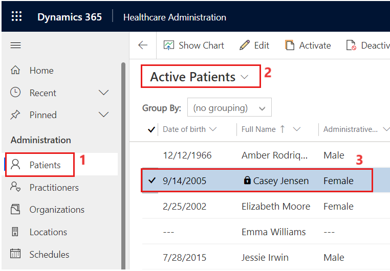

3.	On the Casey Jensen patient record, select the vertical ellipsis (...) on the command bar and then select **Create Invitation.**
 
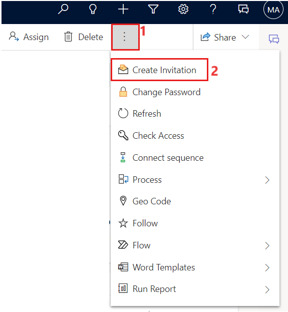

4.	A **New Invitation** form is displayed. Don't change anything; select **Save**. An invitation code will be created for the patient.
 

5.	To retrieve the patient code, go to the **Advanced** tab on the **Invitation** record. Copy and store the **Invitation Code** for accessing the Lamna Healthcare Patient Portal in the next task.
 

You've successfully created an invitation code for Casey to register an account in the Lamna Healthcare Patient Portal.

## Task: Redeem the invitation code and sign in to Patient Portal

In this task, you'll transition personas and act as Casey, a patient who has recently received an invitation code to the Lamna Healthcare Patient Portal. You'll use the code to register for the website and then navigate its features.

1.	Login to Powerpages with your credentials and launch the Lamna Healthcare Patient Portal.

2.	In the Lamna Healthcare Patient Portal, select **Sign in.**
 
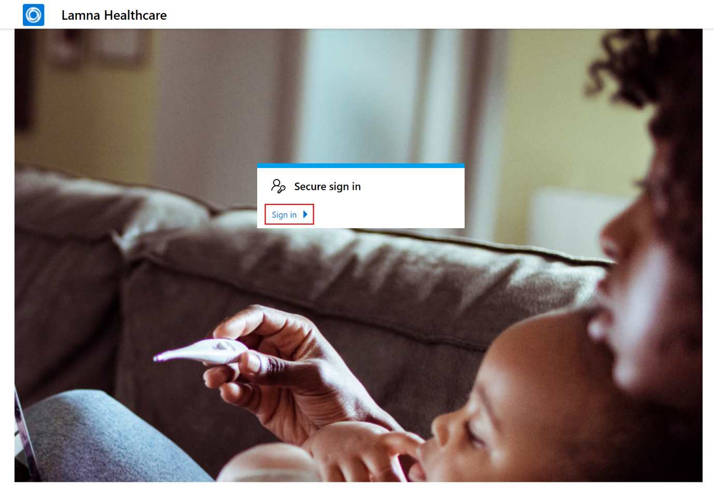

3.	After the sign-in page loads, select the **Redeem invitation** tab.

4.	Paste the invitation code that you stored for Casey Jensen. Select **Register**.
 

5.	Register a new local account for Casey Jensen with the following recommended details:

    o	**Email** - Casey.Jensen@contoso.com (should autofill)

    o	**Username** - CaseyJensen

    o	**Password** - Make up your own. Note the password to use for sign-in later.

6.	Select **Register** and then you should be signed in to the Lamna Healthcare Patient Portal.

You've successfully redeemed an invitation to register an account for Casey Jensen and you’ve also signed in.

## Task: Navigate the Patient Access portal

In this task, you'll continue as Casey and navigate the features of the Lamna Healthcare Patient Portal.

1.	You should be directed to the Lamna Healthcare Patient Portal home page. If not, select the logo in the upper-left corner to go to the home page anytime.
 
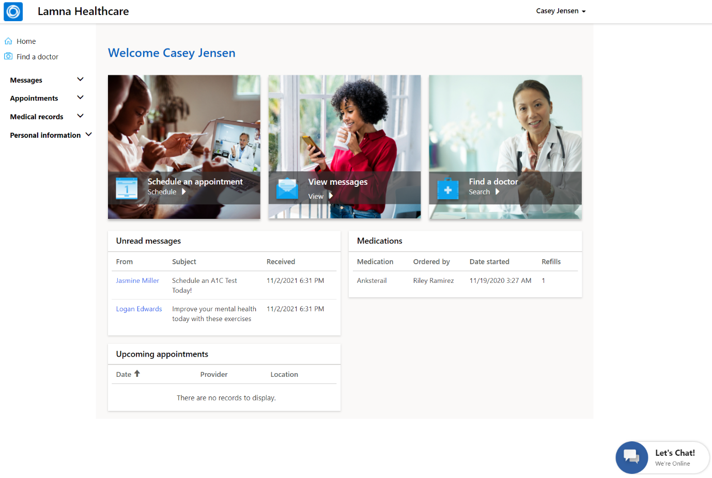

The center of the home page shows shortcuts to **Schedule an appointment, View messages, or Find a doctor.**
 

Under the shortcuts, a section shows current patient information, including **Unread messages, Upcoming appointments, and Medications.**
 
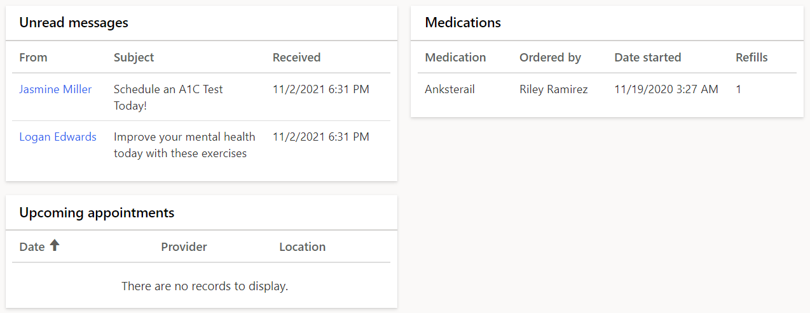

2.	The left navigation pane contains all available options for navigation in the Lamna Healthcare Patient Portal. Select each option to discover what's available and to view each associated screen.
 

3.	Select **Home** to return to the home page.

4.	Select **Find a doctor** to view a list of practitioners with associated information.
 

5.	Selecting **Messages** allows for a more secure method to send and receive messages to healthcare professionals. Expand **Messages** on the navigation bar to view the **Inbox** and **Sent** messages.
 

6.	Expand **Appointments** to check upcoming appointments and to schedule new appointments. Scheduling new appointments allows for clinic or virtual appointments, including instant virtual appointments. The **Schedule a virtual visit** exercise will go through the process of booking an instant virtual appointment.
 

7.	Expand the Medical records section, in the **Overview** section, review the medical records, including medications, allergies, conditions, visit summaries, care plans, and care team. You can view a full overview and filter by date and type.
 

8.	In the **Personal information** section, review the emergency contacts and insurance coverages.
 
 

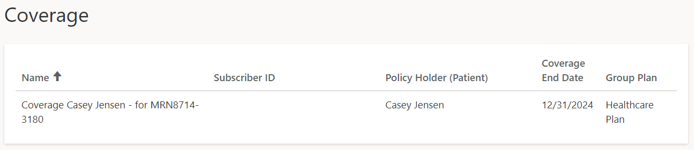

9.	Locate the Azure Health Bot icon in the lower-right corner of the screen. You can start a conversation by selecting the **Let's Chat** button to open the virtual assistant.
 

In the final exercise, you'll have a full conversation with the bot; for now, you can select Close and then continue with this lab.
 

10.	Access the patient profile page by selecting the patient's name in the dropdown menu in the upper-right corner and then selecting **Profile**.
 
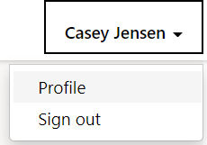

11.	On the patient profile page, you can customize the patient profile as needed. For now, keep it the same.
 

12.	Sign out of the Lamna Healthcare Patient Portal by selecting the patient's name in the dropdown menu in the upper-right corner and then selecting **Sign out.**
 
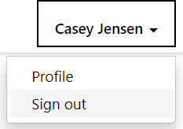

You should be redirected to the sign-in page.
 

You've now navigated the Lamna Healthcare Patient Portal to discover the information and communication that are available to the patient.

In this exercise, you’ve completed the following tasks of:

    •	Setting up the Patient Access portal to display as the Healthcare Patient Portal template.

    •	Modifying the portal to display the company name.

    •	Inviting a patient to register for the website.

    •	Navigating the Healthcare Patient Portal features.

## Create and set up agent scripts

Lamna Healthcare Company wants to ensure that they have proper tools in place to provide the best service and guidance during patient interactions.

Patient Service Center has a **Productivity** pane, an auxiliary work area that contains tools that support or expedite an agent's tasks when they're engaging with patients. During a patient engagement, the pane will be shown next to the patient record information, and the agent can collapse or expand it as needed. For more information, see [Productivity pane overview].(https://learn.microsoft.com/en-us/dynamics365/omnichannel/administrator/productivity-pane/)

Agents can use the **Agent scripts** tool in the **Productivity** pane to help with patient care. Agent scripts provide guidance for a specific situation and can help organizations be unified, accurate, and effective while also being more efficient with patients. The scripts ensure that only company-endorsed information is being shared, help reduce error, and improve customer satisfaction.

In this exercise, you'll create and set up an agent script to appear in the **Productivity** pane in Patient Service Center. The following screen shows the **Productivity** pane, with the **Agent scripts** tab showing.
 

## Task: Assign the Productivity tools administrator role
In this task, you'll assign the necessary roles to your user to create and use agent scripts. Specifically, you'll add the **Productivity tools administrator** and **Productivity tools user** roles. The **Productivity tools administrator** can complete any action (create/read/write/append/delete) on the agent script, whereas the **Productivity tools user** role only has read capabilities. Because you're creating the roles, you'll need the administrator role. For more information, see ]Assign roles and enable users for Omnichannel for Customer Service](https://learn.microsoft.com/en-us/dynamics365/omnichannel/administrator/add-users-assign-roles#understand-roles-and-their-privileges/?azure-portal=true#)

1.	While signed into your Microsoft 365 tenant, open a new tab, and go to [Microsoft Power Apps].(https://make.powerapps.com/). Select your environment.

2.	Select the **gear icon** in the upper-right corner and then select **Advanced settings**. A new window should open and direct you to Dynamics 365. If it takes a while to load, reload the page.

3.	In **Dynamics 365**, select **Settings > Security**.

4.	Under **Security**, select **Users**.
 

5.	Switch the **System Views** dropdown menu from **Omnichannel Users** to **Enabled Users** for the grid view so that your user will show in the list.

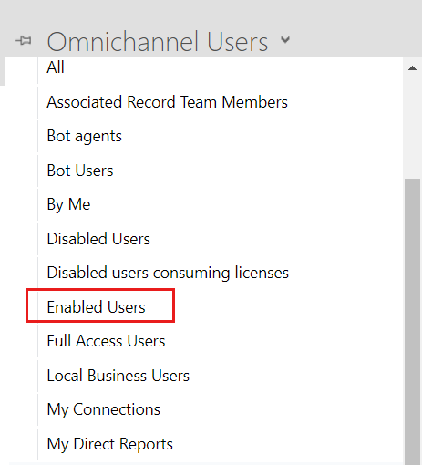 

6.	While in the **Enabled Users** list, scroll down to find your user, or you can use the search option. Select your user and then select **Manage Roles** on the command bar.
 
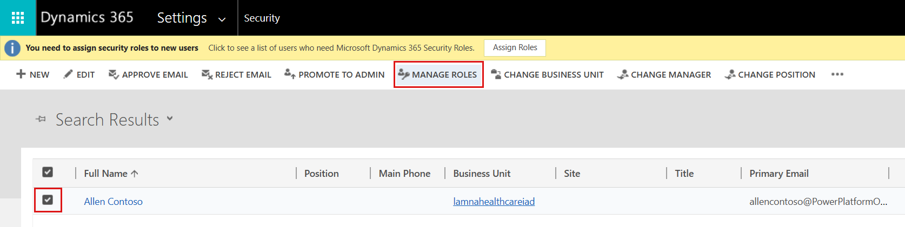

7.	Scroll down and select the following two roles for your user. Select **OK**.

    o	**Productivity tools administrator**

    o	**Productivity tools user**
 

**Note** - You'll assign more roles in this exercise. We recommend that you leave the user screen open.

You've successfully assigned the necessary Productivity tools user roles to set up and use agent scripts.

## Task: Create an agent script

In this task, you'll create an agent script in the Omnichannel Administration app. This script will guide the agent to validate patient information when a conversation is initiated between a patient and an agent in Patient Service Center. The script will have two steps: one to confirm phone number information and another to verify insurance information. This task will guide you through the creation of this agent script and its steps.

1.	In Power Apps, select **Apps** on the left navigation pane. Open the **Customer Service admin center** application.
 
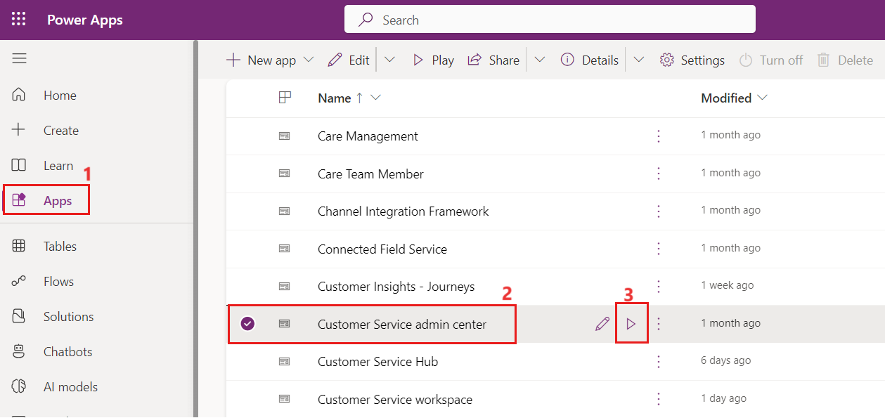

2.	On the left navigation pane, under **Agent experience**, select **Productivity** and then select **Manage** next to **Agent scripts.**
 
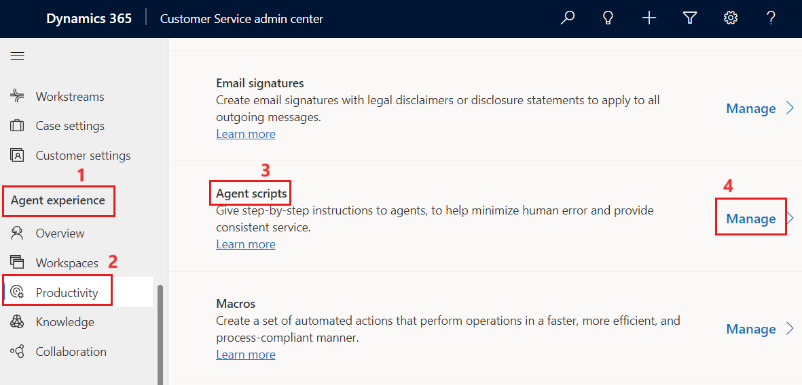

3.	Select **+ New** on the command bar to create a new agent script.
 
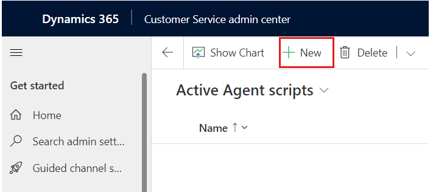

4.	For the **New Agent** script record, specify the following information and then select **Save**.

    o	**Name** - Validate Patient Information

    o	**Unique Name** - msdyn_ValidatePatientInformation

5.	The **New Agent script steps** subgrid should appear. Select **+ New Agent script step** to create a new step in the agent script.
 
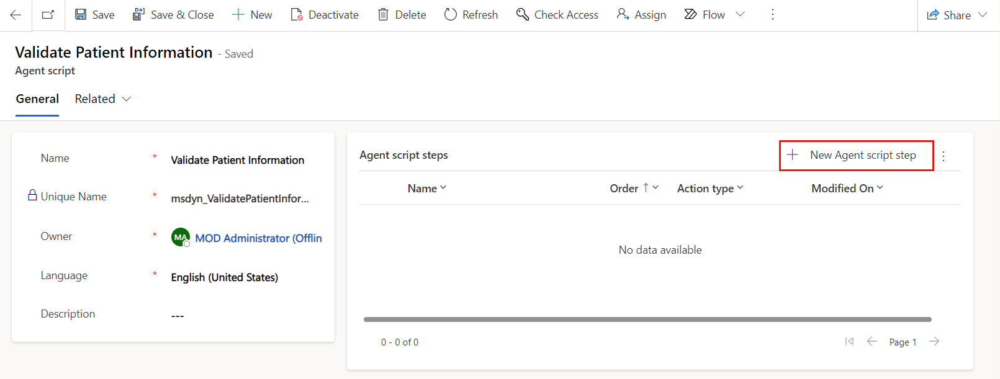

6.	Specify the following fields in the New Agent script step form:

    o	**Name** - Confirm Phone Number

    o	**Unique Name** - msdyn_ConfirmPhone

    o	**Order** - 1

    o	**Action type** - Text

    o	**Text instructions** - Ask patient to confirm phone number.

7.	Select **Save & Close**.

 

8.	In the **Agent script steps** section, select **+ New Agent script step** again to add another step.

9.	Specify the following fields in the second **Agent script step** form:

    o	**Name** - Verify Insurance Information

    o	**Unique Name** - msdyn_VerifyInsuranceInformation

    o	**Order** - 2

    o	**Action type** - Text

    o	**Text instructions** - Ask Patient for Insurance Provider and ID #. Verify their response matches insurance information on file.

10.	Select **Save & Close.**

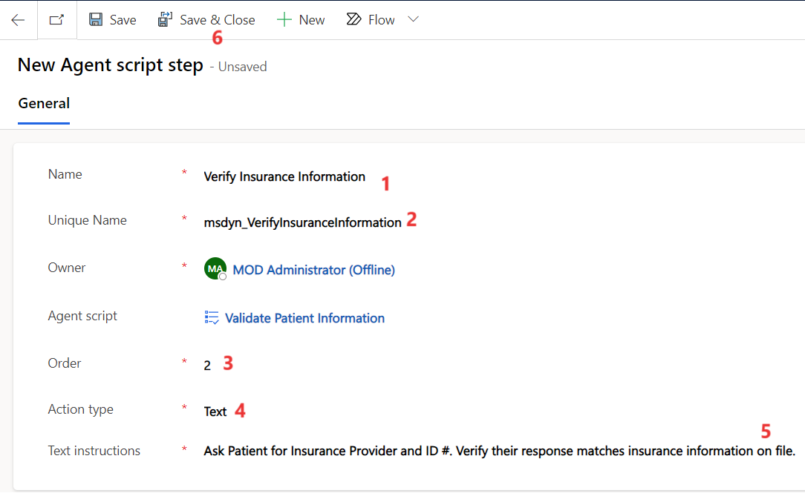

11.	Both steps should now be in the **Agent script steps** subgrid. Select **Save & Close.**

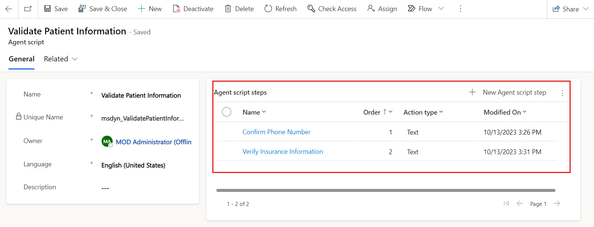

You've now completed creating an agent script with two steps to validate patient information, including phone number and insurance information.

## Task: Associate the agent script with a session template

In this task, you'll associate the agent script with a session template so that it will load for agents in specific chat sessions. You'll be associating the agent script that you created with the **Default chat session.** This default chat session opens during an escalation to an agent in Patient Service Center.

1.	In the Customer Service admin center, on the left navigation pane, under **Agent experience,** select **Overview**. This page displays an overview of vital agent information.

 
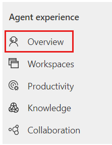

2.	Select **Session templates** under **Workspaces**.

 
3.	Select the **Chat session - default** session template. Select **Edit** on the command bar to open the **Chat session - default** record.

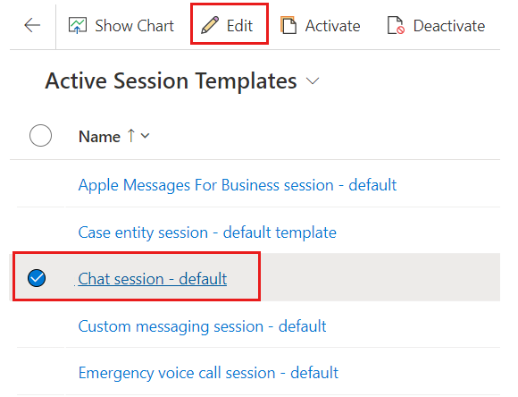 

4.	To associate this session with the agent script, select the **Agent scripts** tab. In the **Agent scripts** section, select **Add Existing Agent script.**

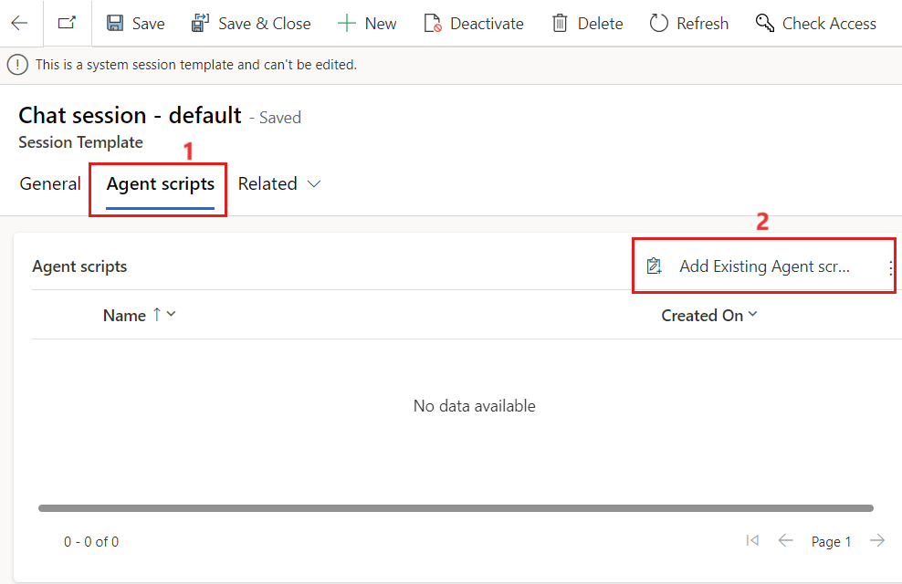 

5.	The **Lookup Records** pane will display. In the **Look for records** box, select the search icon (magnifying glass). Select the **Validate Patient Information** agent script from the list.

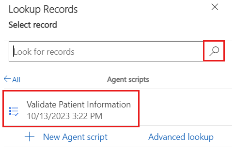 

6.	After the agent script has been added as a record, select **Add**.
 

The **Chat session - default** session template should now have the **Validate Patient Information** agent script in the subgrid. Then Click on **Save and Close.**

You've now successfully created an agent script with two steps and have associated the agent script with the default chat session. Now, your agents can use this script during a default chat session with a patient.

## Exercise - Create and manage knowledge articles

In this exercise, you'll learn how to create and manage knowledge articles that can address numerous issues that your customers want to discuss during the Patient Service Center conversation. These knowledge articles will appear in the **Productivity** pane in Patient Service Center through searching and AI-enabled suggestions.
 

## Task: Assign the Knowledge Manager user role

In this task, you'll assign the necessary user role to create and view knowledge articles.

1.	If you kept the **User Settings** page open from the previous exercise, go to the page, and then skip to the step after selecting Manage Roles.

2.	Go to [Power Apps].(http://make.powerapps.com/) Select the **gear icon** in the upper-right corner and then select **Advanced settings.**

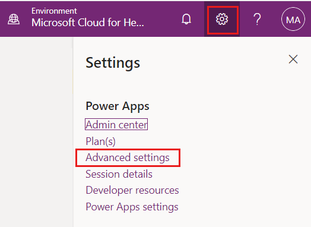

3.	In **Dynamics 365**, select **Settings > Security.**
 

4.	Under **Security**, select **Users**.

5.	Switch the **System Views** dropdown menu from **Omnichannel Users** to **Enabled Users** for the grid view so that your user will show in the list.
 

6.	In the **Enabled Users** list, scroll and find your user. Alternatively, you can use the search option. Select your user and then select **Manage Roles** on the command bar.
 

7.	Three roles that you can choose for [create/read permissions for knowledge articles](https://learn.microsoft.com/en-us/dynamics365/customer-service/customer-service-hub-user-guide-knowledge-article#create-a-knowledge-article/?azure-portal=true#) are:

    o	Knowledge Manager

    o	Customer Service Manager

    o	Customer Service Representative

For this exercise, select the **Knowledge Manager** role.
 

8.	Ensure that you have the **System Administrator** role.
 

9.	Select **OK** to close the **Manage User Roles** window and accept changes.

You’ve now assigned the proper roles to create and read knowledge articles.

## Task: Create a knowledge article

In this task, you'll learn about the knowledge management settings that are available.

1.	In [Power Apps],(http://make.powerapps.com/) open the Customer Service Hub app by clicking on play
 

2.	On the left navigation pane, select **Knowledge Articles**. Select **+ New** on the command bar to add a new knowledge article.
 
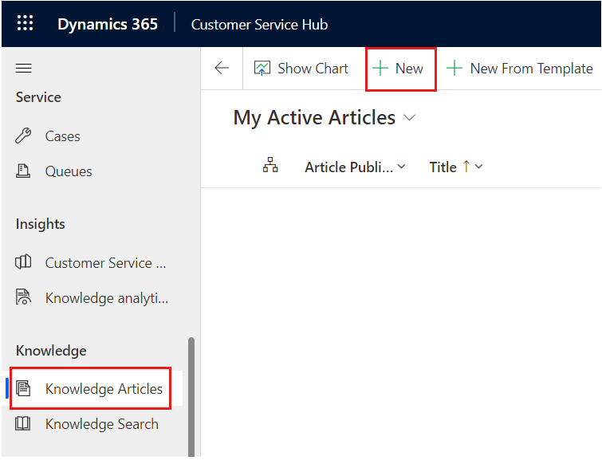

3.	In the **Article Content** section of the **New Knowledge Article,** specify the following details for a knowledge article on asthma and shortness of breath:

    o	**Title** - Shortness of Breath

    o	**Keywords** - Asthma, shortness of breath, trouble breathing, albuterol, inhaler

    o	**Description** - Uncomfortable sensation or awareness of breathing or needing to breathe.

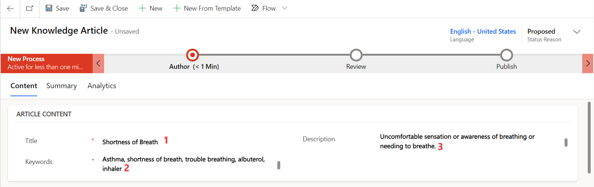

4.	Scroll down to **Content** section under the **Article Content** area, copy and paste the following content for your knowledge article.

    **Common causes**

        Shortness of breath isn't always related to an underlying condition. It might be caused by:

        o	Aerobic exercise

        o	Intense physical activity

        o	High altitude with lower oxygen levels

        o	Poor cardiovascular fitness

        o	Anxiety

        o	Being obese

        o	General weakness

    **Treatment**

        Self-treatment: Self-care steps that might be helpful in some less-serious cases:

        o	Stop smoking

        o	Avoid exposure to pollutants, allergens, and environmental toxins

        o	Lose weight if overweight

        o	Avoid exertion at elevations

        o	Take slow, even breaths

        o	When you breathe out, put your lips together, like slowly blowing out a candle (pursed lip breathing)

    **See a doctor if you notice:**

        o	Chest pain or pressure

        o	Inability to function

    **See a doctor immediately if you notice:**

        o	Fever or a change in the amount, color, or thickness of sputum

  	    o	Breathlessness doesn't go away after resting for 30 minutes

        o	Swelling in the feet and ankles

        o	Trouble breathing when you lie flat

        o	High fever, chills, and cough

        o	Wheezing

        o	Worsening of preexisting shortness of breath

5.	Select **Save**.

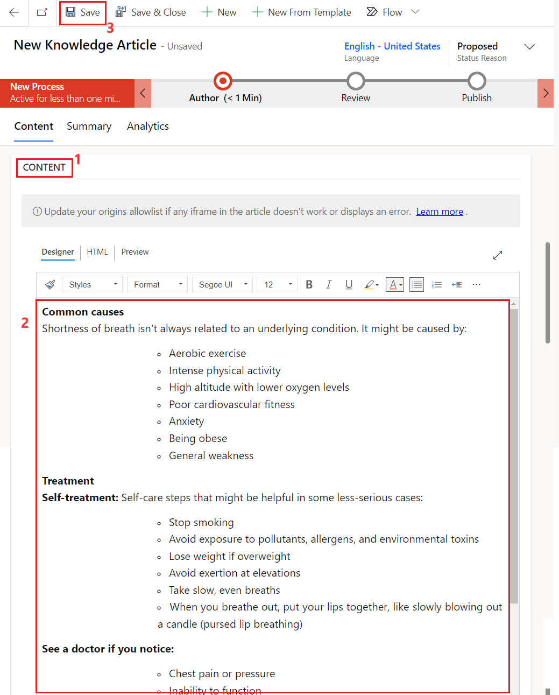

6.	The business process flow bar at the top of the form will help you to drive the article toward completion. On the business process bar, select **Author**. The business step options should be displayed in a pop-up window.

    o	Add the **Article Subject** as **Default Subject,** which is the subject of the article to help with searches.

    o	Under **Mark for Review** Select the checkbox for **Mark Completed** and it will change to **Completed**.

    o	Select **Next Stage** to mark the article as complete and ready for review.

7.	The knowledge article is now in the **Review** stage of the business process flow. Select **Save & Close.**

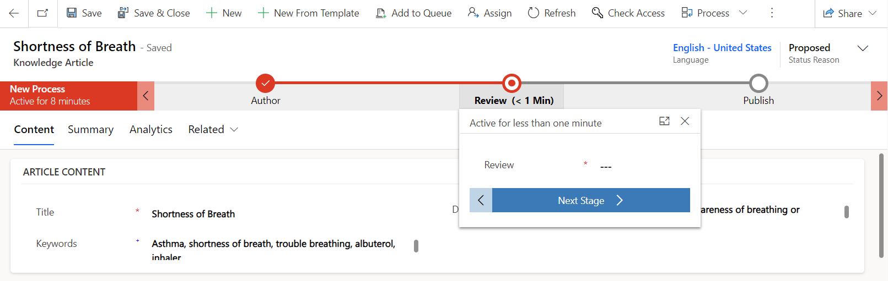

The article is now in draft state and ready for review.

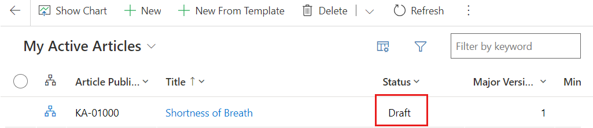

You've now successfully created a knowledge article titled **Shortness of Breath** and have marked it for review.

## Task: Review and publish a knowledge article

Typically, to ensure accuracy of the knowledge article, someone else should review and approve it. However, for this training exercise, you'll mark the article as reviewed and approved instead. This task also requires the Knowledge Manager role or another role that can approve knowledge articles.

1.	 Click on **Dashboards** under **My Work.** Filter with My **Knowledge Dashboards.**
 

2.	Select the **Shortness of Breath** knowledge article in the **My Active Articles** stream.

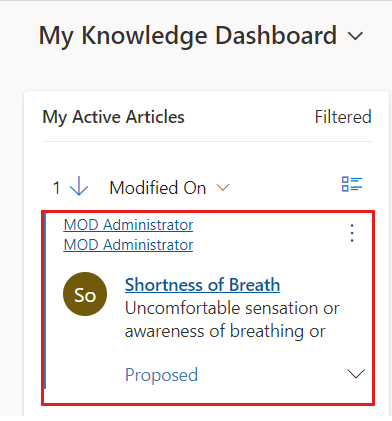

3.	On the business process bar, Click on **Review** stage and in the **Review** dropdown menu, select **Approved**.

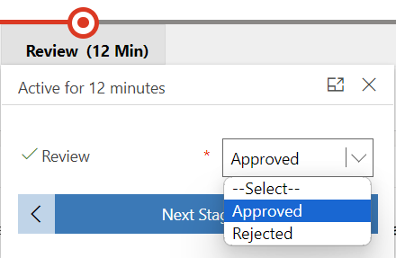

4.	Select **OK** when prompted to **Confirm approval of article(s).**

5.	Select **Next Stage** to move to the **Publish** stage.
 
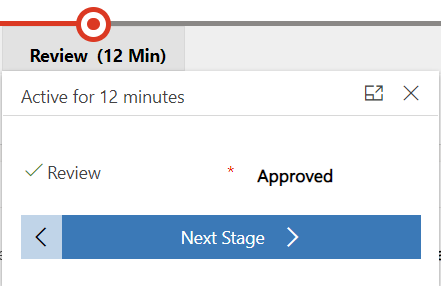

6.	You should now be in the **Publish** stage and the **Status Reason** should have changed to **Approved**.

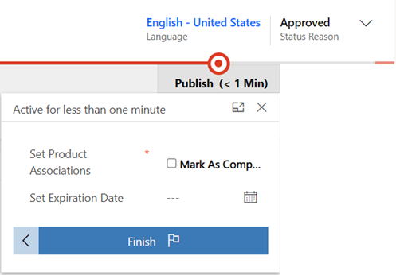

You’ve now successfully reviewed and approved the knowledge article. Next, you'll learn how to publish the knowledge article to be available during Patient Service Center calls.

## Task: Publish your knowledge article

In this task, you'll learn how to publish the knowledge article so that it's live and ready to be used.

1.	In your **Shortness of Breath** knowledge article, select the **Publish** stage.

    I.	For **Set Product Associated,** select **Mark as completed** checkbox  which will change to **Completed**.

    II.	In the **Set Expiration Date** field, set the date for one year from now.

    III. Select **Finish**.

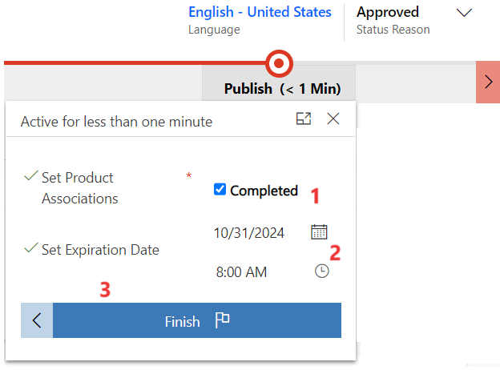

After you select **Finish**, a panel will show to **Publish**.

2.	Set **Expiration State** and **Expiration Status** to **Published**. Select **Publish**.

Now, the knowledge article is in a **Published** state.

You’ve now successfully reviewed and published the knowledge article. You can view this knowledge article in Patient Service Center when you’re testing the final escalation.

You can accomplish numerous tasks with knowledge articles, and this module mentions only a small portion of capabilities. For more information about knowledge articles, see the following documentation:

[Create and manage knowledge articles](https://learn.microsoft.com/en-us/dynamics365/customer-service/customer-service-hub-user-guide-knowledge-article/)

[Search and share knowledge articles](https://learn.microsoft.com/en-us/dynamics365/customer-service/search-knowledge-articles-csh#rue#)

## Exercise - Experience escalation into Patient Service Center

In this exercise, you'll test the end-to-end escalation experience that you set up for the Patient Service Center agent. This process starts from when the patient signs in to the portal website and continues with a Health Bot conversation. Then, it will end with an escalation to a human agent who will provide proper care by using agent scripts and knowledge articles from Dynamics 365.

The following screen shows Patient Service Center after a patient call has been escalated to a call agent. This exercise will show how the call agent can use the agent setup to give personalized experiences with proposed insights directly in the application.
 

## Task: Sign in to Healthcare Patient Portal and Patient Service Center

In this task, you'll sign in to Healthcare Patient Portal and Patient Service Center.

1.	Go to [Power Apps](http://make.powerapps.com/) and open **Healthcare Patient Portal.**

2.	Sign in to the Lamna Healthcare Patient Portal as **Casey Jensen** by using the credentials that you created.
 
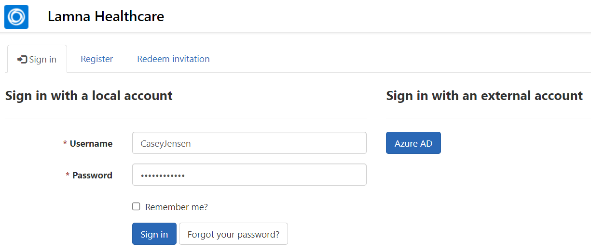

3.	You should be directed to the home page. If you're on the profile page, select the Lamna Healthcare name/logo in the upper-left corner to go to the home page.
 

4.	Your patient is ready in Healthcare Patient Portal. Now, you'll ensure that an agent is available for the patient when the Health Bot needs to escalate.

**Note** - Before opening Patient Service Center, make sure that you've already added the Omnichannel agent role to your user, as shown in the Azure Health Bot lab.

5.	If you didn't assign the Omnichannel agent role in the Azure Health Bot lab, go to **Users** in Dynamics 365, select your user, select **Manage Roles,** assign the **Omnichannel agent** role, and then select **OK**. Changes might take 15 minutes to reflect properly.
 

6.	Switch back to Power Apps Portal. Go to the **Apps** list in Power Apps and open the Omnichannel for Customer Service app.

7.	In the **Omnichannel for Customer Service** , a loading screen will display that will go through percentages. This process ensures that the live agent status is captured properly.

8.	If the loading screen doesn't appear and/or the presence indicator continuously spins or appears dimmed, then escalation into the Patient Service Center app from the Health Bot won't work properly. If so, refresh again, or close and reopen Patient Service Center until the loading screen appears. You might need to close all other apps or close the InPrivate or Incognito window and then sign in again.

If you assigned the Omnichannel agent role, it might take up to 15 minutes to apply and for the presence to show for your user.
When your presence indicator is green, you're ready to accept patient escalations.

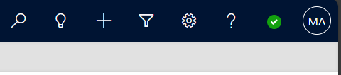

You've successfully signed in as the patient and the live agent. Now, you can start the Health Bot conversation.

## Task: Patient escalates through Azure Health Bot to live agent

In this task, you'll experience the patient call escalation through the Azure Health Bot to a live agent.

1.	Switch back to your Patient Portal. Select the Azure Health Bot **Let's Chat widget** in the lower-right corner of the portal.
 

2.	The Health Bot should go through the same conversation that you created in the Azure Health Bot lab. If the conversation doesn't start, check the following factors:

    a. Make sure that you've set the automatic welcome message in the Health Bot portal.

    b. Verify the settings that you made in the Azure Health Bot lab (Microsoft Teams and human handoff enabled). Also, make sure that you added the widget snippet to the Patient Healthcare chat widget code in Portal Management.

3.	Select the **Lamna Healthcare Support** button to start a support conversation.
 
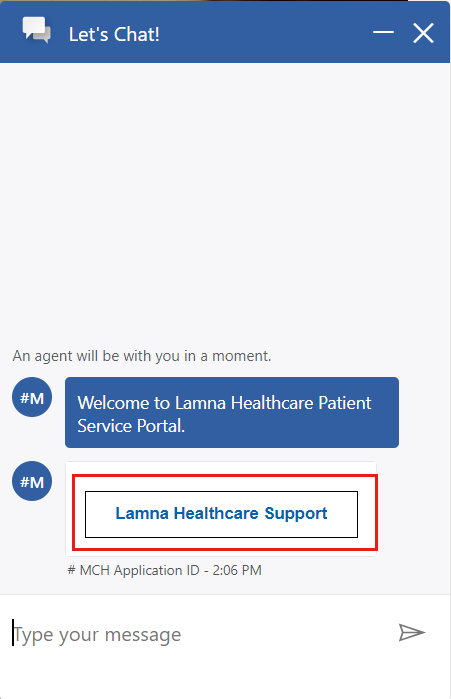

4.	The Health Bot responds with options to refill a medication or escalate to a live agent. Select **Medication Refill** because Casey wants to refill the inhaler medication.
 

5.	Fill in Casey Jensen's **name** and **email** information and then enter **Albuterol inhaler** in the **Medication Requested** field.
 
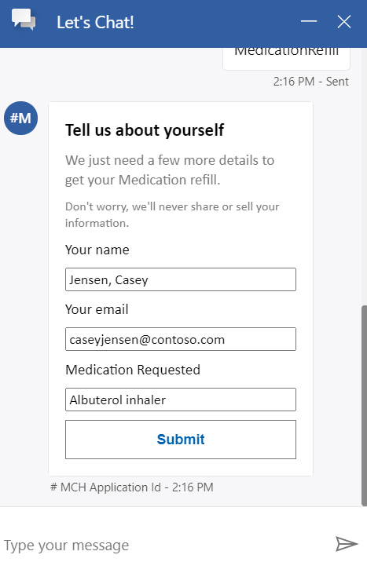

6.	Select **Submit**, and you'll receive a response that confirms your request.
 
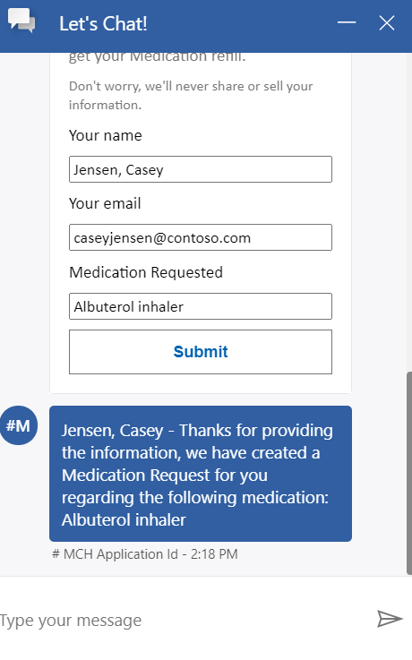

7.	In the next steps, assume that Casey is out of medication refills. Therefore, you'll test the process of escalating to a live agent to refill Casey's medication another way.

8.	**Close** the Azure Health Bot chat.
 
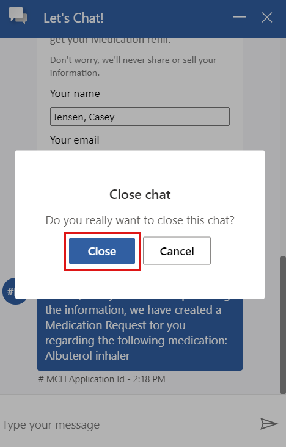

9.	Select **Let's Chat** to open a new Health Bot conversation.
 

10.	Select **Lamna Healthcare Support.**

11.	Select **Live Agent** in the next prompt to escalate to an agent.
 

The chat will soon notify you that **An agent will be with you in a moment.**
 
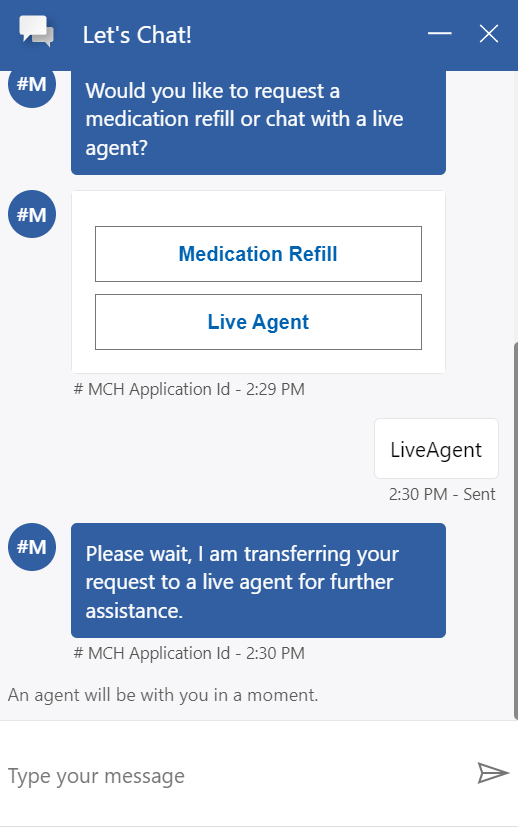

12.	Switch to the **Omnichannel for Customer Service** app so that you can accept the escalation as an agent. The upper-right corner will show a notification indicating that you have a **Chat request** from your user. Select **Accept** to start a conversation with the patient.

13.	The page should reload and show the patient record, active chat, and **Productivity** pane, as shown in the following screenshot. Your status should now show as red (busy).

14.	The chat will be directly embedded in the window. Explore the command bar in the chat to try various options, such as adding a note that's associated with the patient.

 

15.	Notice that the **patient sentiment analysis** in the chat indicates **Neutral**.
 

16.	Go to the **Lamna Healthcare Patient Portal**. Acting as Casey, type **Thank you very much!** in the chat.

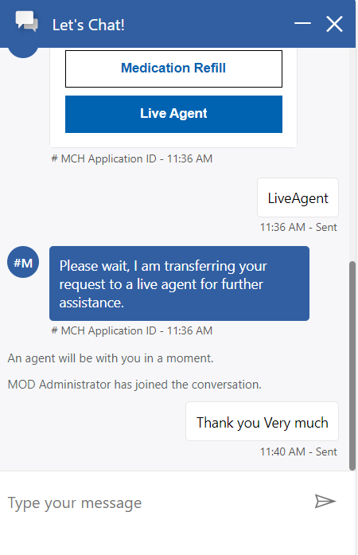 

17.	Return to **Patient Service Center** and notice that the **patient sentiment** **analysis** has changed from **Neutral** to **Slightly positive** from the patient feedback in the chat.
 
 

18.	Go to the **Productivity** pane on the right side of the screen, which includes **Smart assist**, agent scripts, and knowledge articles. You can expand and collapse this panel as needed.

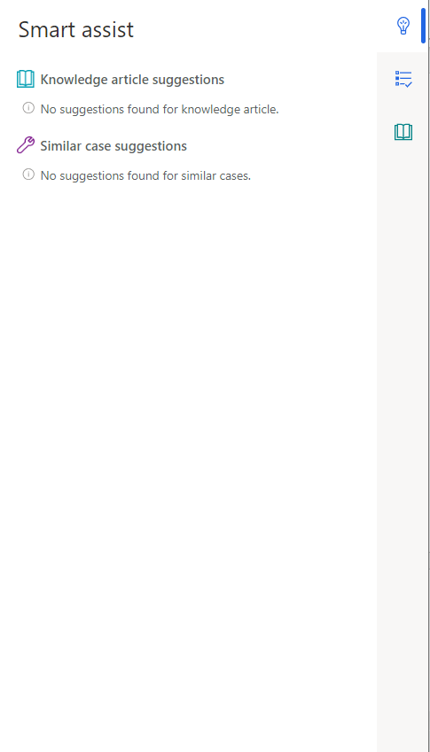 

19.	The **Smart assist** tab will show suggested articles and cases based off the chat discussion. Because you haven't set up the Smart assist option, these articles won't show at this time. When this training is expanded, steps for this functionality will be added.
 
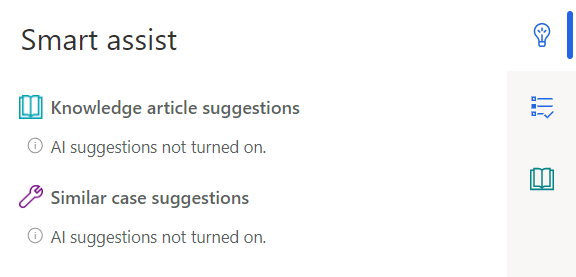

20.	Select the **Agent script** tab and complete the steps by selecting the button to the right of the step name. The text will turn green, and a check mark will appear to the left of the step name.
 
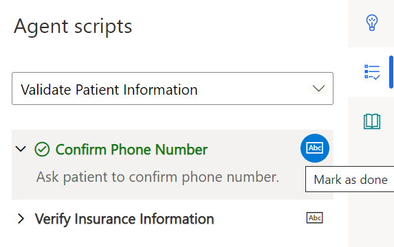

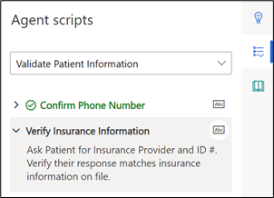

21.	Go to the **Knowledge Article** tab and search for **breath** or **inhaler**. Notice that your article appears.

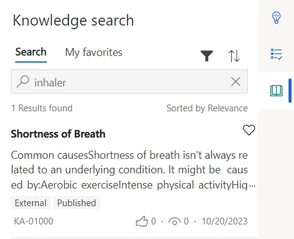 

22.	Select the knowledge article in the list to open in the larger tab.

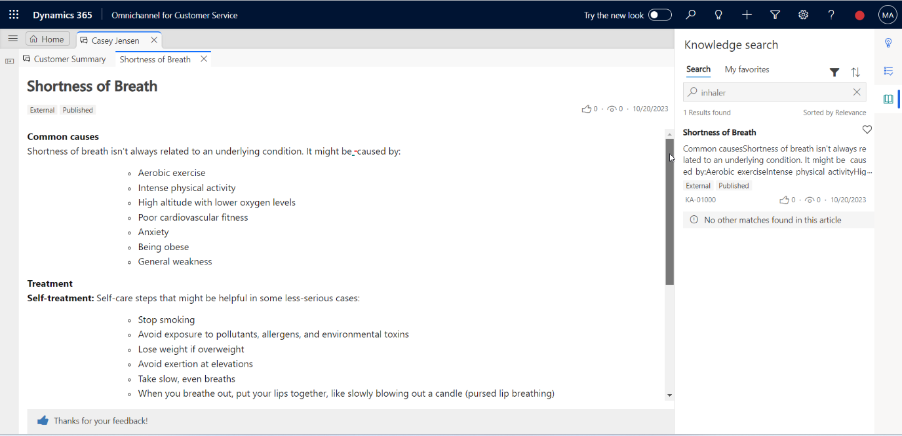 

23.	When completed with the conversation, the agent can select **End** to stop the conversation.
 
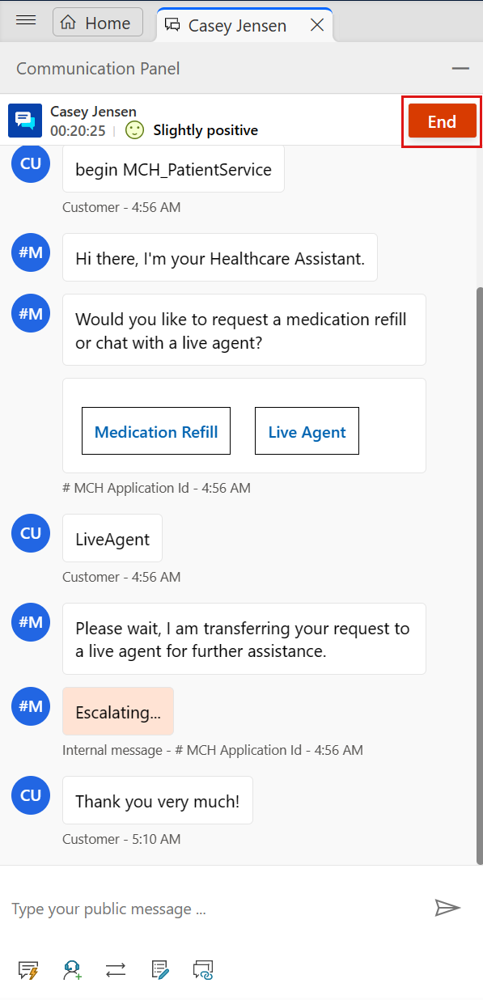 

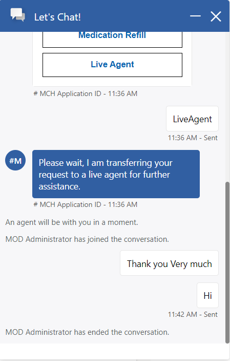

24.	**Close** the session.

25.	After closing the session, you'll be directed to the Omnichannel Agent Dashboard and your status will turn green (available).

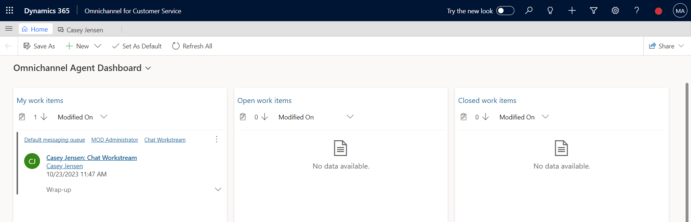 

You've completed the full experience from signing in as a patient to the portal, conversing with the Health Bot, and escalating into Patient Service Center to navigate the features as a live agent.

