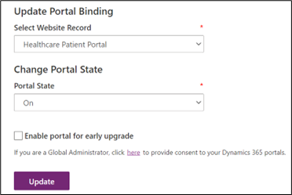
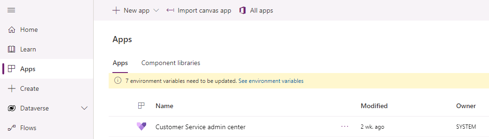
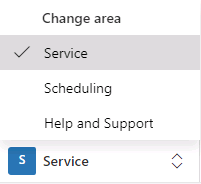
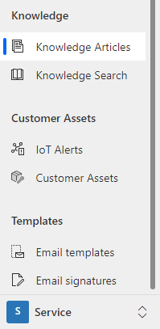

# Module 4 Lesson 1- Lab 3: Patient Access & Service Center

## Overview

Microsoft Cloud for Healthcare includes Patient Access and Patient Service Center.

You can provide patients with access to their health data, in-person and virtual appointment scheduling, and information through knowledge articles. Patient Access provides a portal that will help you give patients the ability to chat with a health bot, communicate with a caregiver, and view their clinical data.

Patient Access includes the following capabilities that you can provide to your patients:

-   **Access** - Patients have a user-friendly portal to access their health information.
-   **Direct engagement** - Patients can engage through automated chat conversations that will hand off to your patient service center.
-   **Scheduling and messaging** - Patients can schedule appointments and send messages to their providers.

In the Patient Service Center, you can engage with your patients in the way that they want while monitoring automatic conversations through the Microsoft Azure Health Bot service. Additionally, service agents can help your patients with information and setting up appointments.

The Patient Service Center includes the following capabilities:

-   **Monitor patient conversations** - An ongoing conversations dashboard provides information on the conversations that are handled by the agents and integrated bots.
-   **Agent scripts** - Use provider-specific agent scripts to address patient issues.
-   **Monitor effectiveness** - Conversation intelligence provides insights for service center managers on agent performance.
-   **Follow-up** - Send follow-up surveys on patient satisfaction, reminders on appointments, and more.
-   **Appointment scheduling** - Schedule or reschedule appointments during conversations with patients.

The Patient Access Portal and Patient Service Center modules focus on the **Enhance Patient Engagement** priority scenario by communicating effectively with patients with the prebuilt guidance and automated systems.

The lab for this module will focus on the healthcare story of Casey Jensen.

Casey is an avid runner but has exercise-induced asthma and requires an albuterol inhaler to help her breathe while running. Casey has realized that her current albuterol inhaler is low on medication and decides that it's a good time to get a refill.

In this lab, you'll first play the role of a Lamna Healthcare system administrator, where you'll set up the Patient Access portal and various tools in the Patient Service Center application. Next, you'll play the role of Casey, who will sign in to the portal, navigate the various options, interact with the Azure Health Bot, and escalate to a live agent in Patient Service Center to refill the medication.

## Learning objectives

In this lab, you will:

-   Configure and navigate the Patient Access Portal
-   Create and configure Agent Scripts to show in the Productivity Pane
-   Create and configure Knowledge Articles
-   Experience escalation scenario from Patient Portal through Azure Health Bot into Patient Service Center

## Exercise 1: Configure & Navigate the Patient Access Portal

In this exercise, you will learn how to do the following:

1.  Configure an external website to the Healthcare Patient Portal template
2.  Create a registration code and invite a patient to create an account for the website
3.  Log in as a patient to navigate the features of the healthcare website

The **Healthcare Patient Portal** is a template installed in your environment by the Patient Access module in Microsoft Cloud Solution Center when Microsoft Cloud for Healthcare was deployed.

A **Portal** is an external website that allows for communication between a company and its users. In this case, the Lamna Healthcare Company wants an external website for their patients to access their medical history and communicate effectively with the institution. The Healthcare Patient Portal template tailors the website’s user interface for a healthcare company focusing on secure communication, information access, and an overall improved patient experience.

Here’s what you should see after configuring and logging into the Healthcare Patient Portal:

If you’d like to learn more about portals, check out Microsoft Docs: [What is Power Apps portals?](https://docs.microsoft.com/en-us/powerapps/maker/portals/overview)

### Task 1: Configure the Healthcare Patient Portal

Prior to deploying Microsoft Cloud for Healthcare, we created a portal in your environment using the **Customer Self-Service** template. This was a prerequisite to install the Healthcare Patient Portal as part of the Patient Access module.

Lamna Healthcare wants to associate the previously installed Customer Self-Service portal with the **Healthcare Patient Portal** template, so the correct website is displayed to the user. The following steps will guide you through how to bind your website to the proper template and restart the portal for changes to apply.

We will first open the Portal to show the Customer Self-Service template currently bound. After the configuration steps in this task, you will see the new Healthcare Patient Portal user interface.

1. [] Navigate to <https://make.powerapps.com> in an In-Private or Incognito window.

1. [] Select the correct environment from the upper right **Environment** dropdown.

    

1. [] Select **Apps** on the left navigation bar.

    

1. [] Find the **Lamna Healthcare** **Patient Portal** app. It should be the only app where the app type is Portal. You may also search for it in the Search bar in the upper right.

    

1. [] Select the app name to open the **Lamna Healthcare Patient Portal**. You may also select **More Commands (…) > Browse** or click **Browse** on the top command bar to open it.

    

1. [] You should see the Customer Self-Service template shown in the Lamna Healthcare Patient Portal.

    

1. [] Close the **Lamna Healthcare Patient Portal** website. Now you will configure it to the Healthcare Patient Portal template.

1. [] Return to **Apps** section in Power Apps. Select the **Lamna Healthcare Patient Portal** app if it isn’t already selected.

    

1. [] Select **More Commands (…) > Settings**.

    

1. [] This will bring out the **Portal settings** panel on the right.

    

1. [] In **Portal settings**, under **Advanced options**, select **Administration**.

    

1. [] Selecting Administration will open a new window, the **Power Apps Portals admin center**, where you can do portal administrative tasks. You should be first navigated to the **Portal Details** tab of the Power Apps Portals admin center.

    

1. [] Scroll down to **Update Portal Binding > Select Website Record**.

    

1. [] Open the **Select Website Record** dropdown and change the value from Customer Self-Service to +++**Healthcare Patient Portal**+++. This will bind the Healthcare Patient Portal template with this portal URL and show the proper user interface to the user for our healthcare scenario.

    

1. [] Select **Update**.

    

1. [] Select **Portal Actions** section on the left navigation. Then select the first option, **Restart.**

    

1. [] When prompted, confirm the **Restart** for the portal. This will allow the change to take effect.

    

1. [] Wait 1-5 minutes for the portal to restart. (Feel free to refill water or stretch your legs!)

1. [] After a few minutes, open the **Lamna Healthcare Patient Portal** in Power Apps.

    

1. [] If you see **HTTP Error 503: The service is unavailable,** the portal is still restarting.

    

1. [] Once the Portal is opened and running properly, it should look like the following:

    

**Congratulations!** You completed the post deployment steps to configure the Healthcare Patient Portal template deployed from Patient Access. After updating the bindings and restarting the portal, the website now shows as Healthcare Patient Portal template rather than Customer Self-Service.

### Task 2: Modify Company Name in Patient Portal

In this task, we will edit the Patient Portal website to align the name with Lamna Healthcare Company since the template uses a generic company name.

1. [] Navigate to **Apps** in <https://make.powerapps.com>.

1. [] Select the **Healthcare Patient Portal** app and select **More Commands (…) > Edit**.

    

1. [] The Patient Portal designer will load after getting thing ready.

    

1. [] Once loaded, you should see **Contoso Healthcare** in the upper left of the design screen. The name may be overlapping the logo but will display properly on the website.

    

1. [] Select the text box that reads **Contoso Healthcare** and change it to **Lamna Healthcare**.

    

1. [] The page should automatically save the changes. You can verify in the command bar that it says **Saved**, has the green check mark, and on hover shows the correct saved time.

    

1. [] Select **Sync Configurations** in the command bar to sync data to CDS.

    

1. [] It may take a moment to load the preview.

    

1. [] Once configurations are completed syncing, select **Browse website** on the command bar.

    

1. [] The Healthcare Patient Portal should open, and you should see the **Lamna Healthcare** company name in the upper left corner.

    

**Congratulations!** You completed modifying the Healthcare Patient Portal to display the correct company name.

### Task 3: Invite a Patient to the Portal

Now that the Patient Portal is ready to go, we need to allow Lamna Healthcare patients to create accounts.

In this task, you will learn how to **create an invitation code** for patients to sign up and use the Lamna Healthcare Patient Portal. Since **Casey Jensen** will be accessing the patient portal to fill her medication in this lab, we will create an account for her.

1. [] Open the **Healthcare Administration** app in [Power Apps](http://make.powerapps.com).

    

1. [] In the **Administration** section of the sitemap, select **People,** if not already selected. You will see the **Active Patients** grid view. Open the **Casey Jensen** patient record so we can obtain an invitation code for her to use.

    

1. [] On Casey Jensen patient record, select **Create Invitation** from the top command bar. It should be near the right side.

    

1. [] You may have to expand additional options to see this command in the dropdown.

    

1. [] A New Invitation form will appear. You don’t need to make any changes. Select **Save**. Once saved, an invitation code will be created for the patient. Let’s go retrieve it.

    

1. [] Go to the **Advanced** tab on the Invitation record. Copy and store the **Invitation Code** for accessing the Patient Portal in the next task.

    

**Congratulations!**  You have successfully created an invitation code for **Casey** to register an account in the Patient Portal.

### Task 4: Redeem Invitation Code and Sign into Patient Portal

In this task, you will **transition personas** and act as **Casey Jensen**, who just received an invitation code to Lamna Healthcare’s Patient Portal and is excited to register and navigate its features.

1. [] Open the Lamna Healthcare Patient Portal in [Power Apps](https://make.powerapps.com/).

    

1. [] In the first task, we configured the portal to the Healthcare Patient Portal template. Now that it’s been restarted, your Patient Portal should open and look like the following:

    

1. [] If you still see the Customer Self-Service template, make sure you’ve completed Exercise 1, Task 1 to change the template to the Healthcare Patient Portal.

1. [] In the Patient Portal, select **Sign in**.

    

1. [] After the sign in page loads, select the **Redeem invitation** tab.

    

1. [] Paste the **Invitation code** you stored for Casey Jensen. Select **Register.**

    

1. [] Register a new local account for Casey Jensen with the following recommended details:
    1. [] **Email**: Casey.Jensen@contoso.com (should auto-fill)
    1. [] **Username**: CaseyJensen
    1. [] **Password**: Make up your own. Please note the password to use for sign in later.

        

1. [] Select **Register**. After selecting Register, you should be signed into the Patient Portal.

**Congratulations!** You have successfully redeemed an invitation to register an account for Casey and signed in.

### Task 5: Navigate the Patient Access Portal

In this task, you will continue as **Casey** and navigate the features of the Patient Portal.

1. [] After registering for an account in the **Patient Access Portal**, you should be welcomed by the portal Homepage or profile page if your account requires action, such as email confirmation required. You can ignore the email confirmation warning if displayed.

    

1. [] Select **Lamna Healthcare** in the upper left to go back to the Homepage.

    

1. [] You will be navigated to the Patient Portal **Homepage**.

    

1. [] In the center of the homepage, you will see **shortcuts** to schedule an appointment, view messages, or find a doctor.

    

1. [] Below the shortcuts, you will see **current patient information** including unread messages, upcoming appointments, and current medications.

    

1. [] In the left navigation bar, you will see all available options for navigation in the Patient Portal. Select the options to see what’s available and each associated screen.

    

1. [] **Home** command will direct you to the homepage.

1. [] **Find a doctor** shows a list of practitioners with associated information.

    

1. [] **Messages** allows a secure method to send and receive messages to healthcare professionals. Expand **Messages** on the navigation bar to see both the **Inbox** and **Sent** messages.

    

1. [] Expand **Appointments** to check upcoming and schedule new appointments. Scheduling new appointments allows for clinic or virtual appointments, which also includes instant virtual appointments. The Virtual Visit Lab will go through the process of booking an instant virtual appointment.

    

1. [] Check **Medical records** including medications, allergies, conditions, visit summaries, care plans, and care team. You can see a full overview and filter by date and type.

    

1. [] Lastly, there is Personal information, including emergency contacts and insurance coverages.

    

    

1. [] The Azure Health Bot icon shows at the lower right-hand corner of the screen. You may start a conversation by selecting **Let’s Chat** button to open the virtual assistant.

    

1. [] In the final exercise, we will have a full conversation with the bot, but for now we will close and continue.

    

1. [] You may access the patient Profile page at any time by selecting the patient’s name in the upper right dropdown and selecting **Profile**.

    

1. [] Here you can customize the patient profile as needed. For now, we will keep it the same.

    

1. [] You may log out of the Patient Portal by selecting the patient’s name in the upper right drop-down and selecting **Sign Out**.

    

1. [] You should be redirected back to the sign in page.

    

**Congratulations!** You have navigated the Patient Portal to see what information and communication is available to the Patient. In this exercise, you learned how to configure the Patient Access Portal to display as the Healthcare Patient Portal, modify the portal to display the company name, invite patients to register to the website, and navigate the website features.

===

## Exercise 2: Configure Agent Scripts

Lamna Healthcare Company wants to ensure they have proper tools in place to provide the best service and guidance during patient interactions.

Patient Service Center has a **productivity pane** which is an auxiliary work area which contains tools that support or expedite an agent's tasks when engaging with patients. During a patient engagement, it will be embedded directly on the screen next to patient information and can be collapsed or expanded as needed.

See the following documentation to learn more about the productivity pane: [Productivity pane overview](https://docs.microsoft.com/en-us/dynamics365/omnichannel/administrator/productivity-pane)

**Agent Scripts** are one of the tools in the productivity pane that agents can use to help with patient care. Agent Scripts provide guidance for a specific situation and help organizations be unified, accurate, and effective while also being faster and more efficient with patients. The scripts ensure that only accurate, company-endorsed information is being shared and help reduce error and improve customer satisfaction.

In this exercise, you will create an agent script to appear in the productivity pane in Patient Service Center. The following screen shows the productivity pane on the right-hand side with the Agent Scripts tab showing. The agent script selected is Validate Patient Information and there are two steps shown. You will not see this below output until the final exercise in this lab while testing escalation, however, you will be creating the components needed to display in the productivity pane later.

### Task 1: Assign Productivity Tools Administrator Role

In this task, you will assign the necessary roles to your user to create and use agent scripts. Specifically, you will be adding the **Productivity tools administrator** and **Productivity tools user** roles. The Productivity tools administrator can do any action (create/read/write/append/delete) on the agent script, while the Productivity tools user only has read capabilities. Since we are creating them, we need the administrator role.

See the following documentation to learn more about these roles: [Assign roles and enable users for Omnichannel for Customer Service](https://docs.microsoft.com/en-us/dynamics365/omnichannel/administrator/add-users-assign-roles#understand-roles-and-their-privileges)

1. [] Using an In-Private or Incognito window, navigate to [Power Apps](http://make.powerapps.com).

1. [] Select the correct environment from the upper right **Environment** dropdown.

    

1. [] Select **Apps** on the left navigation bar.

    

1. [] Open the **Omnichannel admin center** app.

    

1. [] Select the **gauge** icon in the upper right corner and navigate to **Advanced Settings**.

    

1. [] A new window should open and navigate to Dynamics 365. It may take a while to load. If it’s been longer than a minute, stop and reload the page. It should then load faster.

1. [] In Dynamics 365, select **Settings > Security**.

    

1. [] Under **Security**, select **Users**.

    

1. [] Switch the view dropdown from **Omnichannel Users** to **Enabled Users** for the grid view so that your user will show in the list.

    

1. [] While in the **Enabled User** list, scroll down to **find your user** or use the **Search** bar.

    

1. [] Select your user for the training and select **Manage Roles** on the top command bar.

    

1. [] Scroll down and select the following two roles to your user and select **OK**.
    1. [] Productivity tools administrator
    1. [] Productivity tools user

        

        Note: You will assign more roles in this lab. It is recommended to leave the User screen open.

**Congratulations!** You have successfully assigned the necessary **Productivity tools** user roles to set up and use agent scripts.

### Task 2: Create an Agent Script

In this task, you will create an agent script in the Omnichannel admin center app. This script will guide the agent to **validate patient information** when a conversation is initiated between a patient and an agent in Patient Service Center. The script will have two steps, one to **confirm phone information** and another to **verify insurance information**. This task will guide you through creation of this agent script and its steps.

1. [] Navigate to **Omnichannel admin center** application which you opened in the first task.

1. [] In the left navigation bar, under **Agent Experience**, select **Agent Scripts.**

1. [] On the **Active Agent scripts** page, select **+New**.

    

1. [] For the **New Agent script** record, specify the following:
    1. [] **Name:** Validate Patient Information
    1. [] **Unique Name**: msdyn_ValidatePatientInformation

        

1. [] Select **Save**. The Agent script steps should appear on the right

    

1. [] In the **Agent script steps** section, select **+New Agent script step**.

    

1. [] Quick Create form for the Agent script step appears. Specify the following fields:
    1. [] **Name:** Confirm Phone Number
    1. [] **Unique Name**: msdyn_ConfirmPhone
    1. [] **Order**: 1
    1. [] **Action type**: Text
    1. [] **Text instructions**: Ask patient to confirm phone number.

        

1. [] Select **Save and Close**. Now let’s add another step.

1. [] In the **Agent script steps** section, select **+New Agent script step** again.

    

1. [] Another Quick Create form for the Agent script step appears. Specify the following fields:
    1. [] **Name:** Verify Insurance Information
    1. [] **Unique Name**: msdyn_VerifyInsuranceInformation
    1. [] **Order**: 2
    1. [] **Action type**: Text
    1. [] **Text instructions**: Ask Patient for Insurance Provider and ID \#. Verify their response matches insurance information on file.

    

1. [] Select **Save and Close**. Both steps should now be in the Agent script steps table.

    

1. [] The agent script is now complete. Select **Save & Close**.

    

**Congratulations!** You have completed creating an agent script with two steps to validate patient information, including phone number and insurance information.

### Task 3: Associate the Agent Script with a Session Template

In this task, you will associate the agent script with a session template so it will load for agents based on the type of session they’ve opened. We will be associating the agent script we just created with the **Default chat session.** This is the default chat session that opens during an escalation to an agent in Patient Service Center.

1. [] Open the **Omnichannel admin center** app in Power Apps if you aren’t already in it.

    

1. [] In the left navigation bar, under **Agent Experience**, select **Sessions**.

    

1. [] Select the **Chat session – default** session template. We will associate this session with the agent script.

    

1. [] Double-click or select **Edit** on the command bar to open the Chat session – default record.

    

1. [] Select the **Agent scripts** tab. In the **Agent scripts** section, select **Add Existing Agent script**.

    

1. [] The Lookup Records pane should appear on the right.

    

1. [] In the **Look for Records** box, select the **search** icon (magnifying glass).

    
 
1. [] Select the **Validate Patient Information** agent script from the list and select **Add.**

    

1. [] Chat session – default Session Template should have the Validate Patient Information Agent script.

    

**Congratulations!** You have successfully created an agent script with two steps and associated the agent script with the default chat session. Now your agents can use this script during a default chat session with a patient.

===

## Exercise 3: Configure Knowledge Articles

In this exercise, you will learn how to create and manage **Knowledge Articles** that can address any number of issues your customers would like to discuss during the patient service center conversation. These knowledge articles will appear in the productivity pane in Patient Service Center through AI-enabled suggestions.

### Task 1: Assign Knowledge Manager User Role

In this task, we will assign the necessary user role to create and view knowledge articles.

1.  If you kept the User Settings page up from the previous exercise, navigate to that page. If you didn’t keep it open, follow all the steps in Exercise 2, Task 1 and then return here to assign the proper role.

1.  Once you’ve selected your user and clicked **Manage Roles**, you must assign the necessary role(s).

    

1.  There are three roles you can choose with [create/read permissions for Knowledge Articles](https://docs.microsoft.com/en-us/dynamics365/customer-service/customer-service-hub-user-guide-knowledge-article#create-a-knowledge-article).
    1.  Knowledge Manager
    2.  Customer Service Manager
    3.  Customer Service Representative

1.  For this lab, select the **Knowledge Manager** role.

    

1.  Also ensure you have the **System Administrator** role. Official training users have it assigned.

    

1.  Select **OK** to close the Manage User Roles window and accept changes.

**Congratulations!** You have assigned the proper roles to create and read knowledge articles.

### Task 2: Set up Knowledge Management Settings

1.  In [Power Apps](http://make.powerapps.com), open the **Customer Service Hub** app.

    

1.  In **Customer Service Hub**, on the left navigation bar, go to the bottom left corner where there’s a drop down that says **Service**. Select it and change the area to **Customer Service Admin Center**.

    

1.  Once in the **Customer Service Admin Center** area, scroll down to **Knowledge Base Management** section and select **Settings** in the left navigation.

    

1.  Record Types allows you to configure the record types you want to turn on for knowledge management.
    1.  The list will include all entities that are available for an N:N relationship.
    1.  Knowledge management is enabled for Case table by default. Because our scenario will also use the Case table, we don’t need to add any additional tables at this time.

        

1.  For Support Portal Connection, this allows you to integrate an external portal for publishing knowledge articles.
    1.  Selecting Yes would share the knowledge article as a link in the email sent to the customer.
    2.  Selecting No would share the article content inserted in the email body.
    3.  Keep as **No** as we will not be integrating an external portal connection

        

1.  In the **Knowledge Articles Feedback** section, set **Enable users to provide feedback on knowledge articles from search control** to **Yes**. This will allow users to provide feedback on knowledge articles opened from knowledge search control.

    

### Task 3: Create Knowledge Article

In this task, you will create a new knowledge article about Asthma for agents to access during patient conversations.

1.  In **Customer Service Hub,** on the left navigation bar, go to the bottom left corner where you previously modified the drop down. Change it back from Customer Service Admin Center to **Service**.

    

1.  In the sitemap, navigate to **Service > Knowledge Articles**.

    

1.  Select **New** on the command bar.

    

1.  You should be on the Content tab of a new knowledge article.

    

1.  On the **Article Content** section tab of the new knowledge article, specify the following details:
    1.  **Title**: Shortness of Breath
    2.  **Keywords**: Asthma, shortness of breath, trouble breathing, inhaler, albuterol
    3.  **Description**: Uncomfortable sensation or awareness of breathing or needing to breathe.

        

    4.  In the **Content** section, copy and paste the content for your knowledge article.

    **Common causes**

    Shortness of breath is not always related to an underlying condition. It may be caused by:
    - Aerobic exercise
    - Intense physical activity
    - High altitude with lower oxygen levels
    - Poor cardiovascular fitness
    - Anxiety
    - Being obese
    - General weakness

    **Treatment**

    Self-treatment: Self- care steps that may be helpful in some less- serious cases:
    - Stop smoking
    - Avoid exposure to pollutants, allergens and environmental toxins
    - Lose weight if overweight
    - Avoid exertion at elevations
    - Take slow even breaths
    - When you breathe out, put your lips together, like slowly blowing out a candle (Pursed Lip Breathing)

    **See a doctor if you notice:**
    - Chest pain or pressure
    - Inability to function

    **See a doctor immediately if you notice:**
    - Fever or a change in the amount, color, or thickness of sputum
    - Breathlessness does not go away after resting for 30 minutes
    - Swelling in the feet and ankles
    - Trouble breathing when you lie flat
    - High fever, chills, and cough
    - Wheezing
    - Worsening of pre- existing shortness of breath

1.  Select **Save**.

    

    The Business Process flow bar at the top of the form helps you to drive the article towards completeness. You have the option to customize the stages in the Business Process flow to suit your requirements. We will now complete the author stage so it can move into review.

1.  On the Business process bar, select **Author**. The business step options should pop out below.

    

1.  Add the **Article Subject:** Default Subject. This is the subject of the article to help with searches.

1.  Check the box for **Mark for Review** as **Mark Complete**.

1.  In the **Assign Primary Author** drop-down list, you may choose a person who is responsible for maintaining the article content. By default, the user who creates the article is the primary author. For this training, we will keep it as our IAD user.

1.  Select **Next Stage** to mark the article complete and ready for review.

    

1.  The knowledge article is now in the review stage of the business process flow and is ready for review.

    

**Congratulations!** You have successfully created a knowledge article for Shortness of Breath and marked it for review.

### Task 4: Review and Publish Knowledge Article

To ensure accuracy of the knowledge article, typically someone else would review and approve it. For this training exercise, you will mark the article reviewed and approved yourself. Quick note that this task also requires the Knowledge Manager role or another that can approve knowledge articles.

1.  In **Customer Service Hub**, navigate to **Service > Dashboards** and use the drop-down to choose the **My Knowledge Dashboard**.

    

1.  Note the **Shortness of Breath** knowledge article in My Active Articles stream.

    

1.  Select the **Shortness of Breath** knowledge article.

1.  On the Business process bar, in the Review stage and in the **Review** drop-down, select **Approve**.

    

1.  Click **OK** when prompted to confirm approve article.

    

1.  Select **Next Stage** to move to Publish stage.

    

1.  You should now be in the Publish stage and Status Reason should have changed to Approved.

    

**Congratulations!** You have successfully reviewed and approved the knowledge article. We will show you how to publish the Knowledge Articles to be available during patient service center calls.

### Task 5: Publish your Knowledge Article

In this task, you will learn how to publish the knowledge article so it’s live and ready to be used.

1.  In your **Shortness of Breath** Knowledge Article, Select the **Publish** stage.
    1.  For **Set Product Associated** check the box **Completed**.
    2.  Add an **Expiration Date** for one year from now.
    3.  Select **Finish**

        

1.  Once you select **Finish**, the business process flow should show as completed.

    

1.  Now you can specify the additional Publish details. On the command bar to go **More > Publish**.

    

1.  Specify the following details (see screenshot below):
    1.  **Publish**: Now
    2.  **Published Status**: Published
    3.  **Expiration State**: Published
    4.  **Expiration Status**: Published
    5.  Publish approved related translations with Article, choose **Yes**.

1.  Select **Publish**

    

**Congratulations!** You have successfully reviewed and published the knowledge article. We will see these knowledge articles highlighted in Patient Service Center when testing the final escalation.

## Exercise 4: Experience Escalation & Smart Assist Features

In this exercise, you will utilize the Smart Assist features and test the full experience you configured for the patient and patient service center agent. Starting from when the patient logs into the portal website, continuing with a health bot conversation, and ending with an escalation to a human agent who can provide proper care in Dynamics 365 with Agent Scripts and Knowledge Articles.

The following screen shows Patient Service Center after a patient has been escalated to a call agent. This lab will conclude by bringing together all the components we’ve set up in previous exercises and show how the call agent can give personalized experiences with proposed insights directly in the application.

### Task 1: Patient Logs into Access Portal & Agent logs into Patient Service Center

1.  Navigate to Power Apps and open the **Lamna Healthcare Patient Portal** app.

1.  Sign into the Patient Portal as Caseyn Jensen, using the credentials you created in Exercise 1, Task 2 when you registered Casey for the patient portal.

    

1.  You should be directed to the profile if your email requires confirmation. Click **Contoso Healthcare** in the upper left to go to the portal Homepage.

    

1.  Your patient is all set in the Patient Portal. Now we need to make sure an agent is available for them when the Health Bot needs to escalate.

    

    Note: Before opening Patient Service Center, make sure you have completed adding the Omnichannel agent role to your user in Lab 04.

2.  If you didn’t assign the Omnichannel agent role in Lab 04, assign the proper role by following the steps in Exercise 2, Task 1 – Assign Productivity User Roles. Once you’ve selected your user and clicked **Manage Roles**, assign the **Omnichannel agent** role and click **OK**.

    

1.  Navigate to **Apps** and open the **Patient Service Center** app.

    

1.  In the Patient Service Center, you should see a “Loading…” splash screen that goes through percentages. This ensures the live agent status is captured properly.

    

    1.  If you don’t see the splash screen and the presence indicator is grayed out, escalation into the app from the health bot won’t work properly.
    1.  Refresh again or close and reopen Patient Service Center until the splash screen appears. You may need to close all other apps or close incognito altogether and sign back in.
   1.  If you just assigned the Omnichannel agent role, it may take up to 15 minutes to apply and for the presence to show for your user.

1.  Once your presence indicator is green, you are ready to accept patient escalations.

**Congratulations!** You have successfully logged in as both the patient and the live agent. Now it’s time to start the Health Bot conversation.

### Task 2: Patient Escalates through Healthcare Bot

1.  Select the **Let’s Chat** Health Bot chat widget in the bottom right corner of the portal.

1.  The Health Bot should go through the same conversation you created in Lab 04.
    1.  Make sure you set the Welcome message in the Health Bot lab
    1.  If the welcome message doesn’t show, check the settings you did in Lab 04 (Teams and Human handoff enabled). Also make sure you added the widget snippet to the Patient Healthcare chat widget.

1.  Select **Lamna Healthcare** **Support** to start a support conversation.

    

1.  Select **Live Agent** in the next prompt to escalate to an agent.

    

1.  You will see the chat notifies you -- **An agent will be with you in a moment.**

    

1.  Now let’s switch over to the Patient Service Center app so you can accept the escalation as an agent.

**Congratulations!** You have successfully configured and started a conversation with the Health Bot in the Healthcare Patient Portal and asked to escalate to an agent in Patient Service Center.

### Task 3: Agent Provides Personalized Care in Patient Service Center with the Productivity Pane

In this task, you will act as the Patient Service Center Agent, accept the escalation from the healthbot and assist the patient with their issue by using the productivity pane.

1.  Navigate back to the **Patient Service Center** app. You should be signed in as your IAD User.

1.  Notice in the upper right corner there is a **Chat request** from your user.

    

1.  Select **Accept** to start a conversation with the patient.

    

1.  The page should reload and show the patient record, active chat, and productivity pane as seen below.

    

1.  See the chat directly embedded on the left-hand side. Try out the command bar below it to see various options such as **auto-replies** and **surveys**.
  
1.  Navigate the **productivity pane**. Go through the **agent script** and check off ones you complete asking the patient.
  
6.  Go to **Knowledge Article** tab and search for **Breath** or **Inhaler**. Notice your Knowledge Article appear.

**Congratulations!** You completed the full experience from logging in as a patient to the portal, conversing with the health bot, and escalating into Patient Service Center to navigate the features for the agent.
