# Module 4 Lesson 2 Lab 5: Home Health

## Overview

Microsoft Cloud for Healthcare’s **Home Health** application allows provider personnel to schedule appointments for the patient based on a variety of factors. It allows for the communication of the right information, at the right time, to the right people, to provide safe and effective care to your patients. Manage home visit schedules, notify patients, and give access to medical information to the provider on the go.

Key capabilities of Home Health include:

-   **Schedule home visit**: Enable care coordinators to schedule home visit appointments, while viewing patient information directly in context.
-   **Provider scheduling**: View schedules of care team members and optimize visiting routes.
-   **Patient engagement**: Notify patients about upcoming appointments, follow up with patients after a visit, and automatically check with patients between visits.
-   **Home visit coordination**: Coordinate care and support distinct processes and tasks for the home visit.

Home Health focuses on both the **Empower health team collaboration** and **Enhance patient engagement** priority scenarios by creating a system that allows for improved care team coordination with optimized resources and enhanced patient engagement with personalized experiences and home visits.

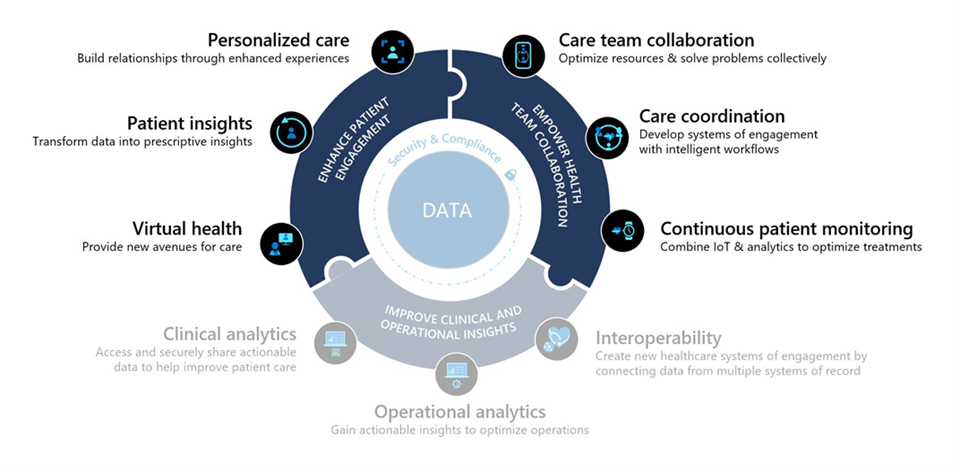

This lab will focus on the healthcare story of Monica Thomson.

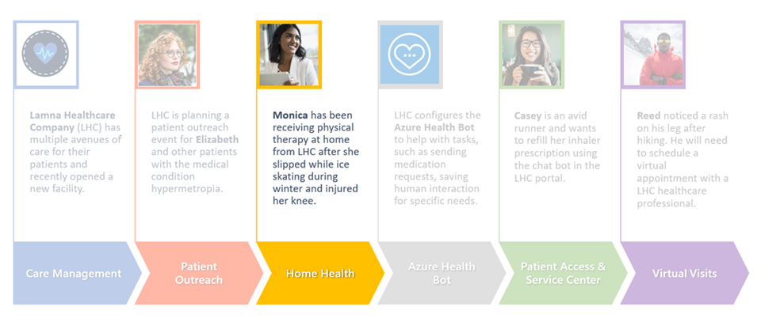

Monica sprained her knee while ice skating last winter and was prescribed at-home physical therapy by her practitioner to rehabilitate the injury. To facilitate this home care scenario, Lamna Healthcare Company has deployed Microsoft Cloud for Healthcare’s Home Health capabilities.

In this lab, you will play the role of a Lamna Healthcare Company Home Health dispatcher to configure the Home Health application.

## Learning objectives

In this lab, you will:

-   Create a Bookable Resource
-   Configure the Schedule Board
-   Leverage Care Management Components with the Field Service Mobile App

## Exercise 1: Create a Bookable Resource

In this exercise, you will learn how to create a **Bookable Resource** to be used for scheduling a Home Health Work Order. A bookable resource in the Microsoft Cloud for Healthcare is anything that needs to be scheduled. This most commonly includes people, equipment, and physical spaces (facilities). Bookable Resources must be created before scheduling a Home Health Work Order.

Each resource can have different attributes that distinguish it from others, including but not limited to the following:

-   Characteristics (for example: Accounting)
-   Categories (for example: Manager)
-   Territories (for example: Washington State)
-   Organizational Unit (for example: Seattle Service Delivery)
-   Location (for example: Location Agnostic)
-   Resource Type (for example: User)

Now let’s create a Bookable Resource in the Home Health application.

1. [] Navigate to +++https://make.powerapps.com+++. Ensure the MC4H Labs Environment is selected in the upper right. 

1. [] Open the **Field Service** app. You may have to sign out and back into Dynamics 365 as your user.

    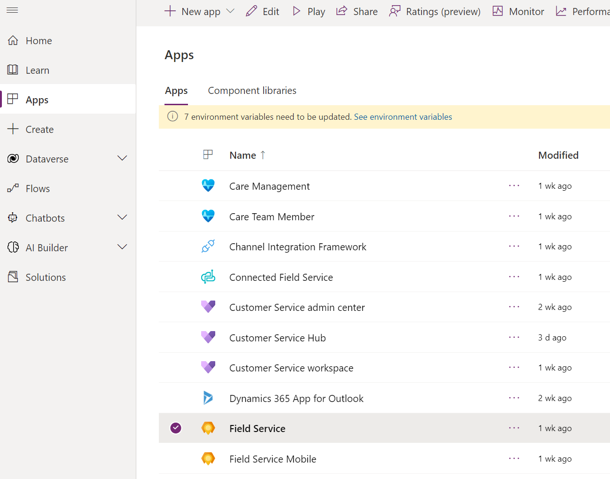

1. [] In the bottom left of the navigation pane, change the area from **Service** to **Resources.**

    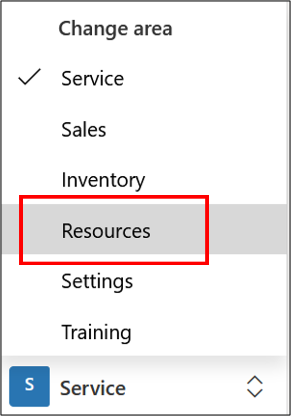

1. [] This will take you to the Bookable Resources entity. Select **New** on the command bar to create a new **Bookable Resource**.

    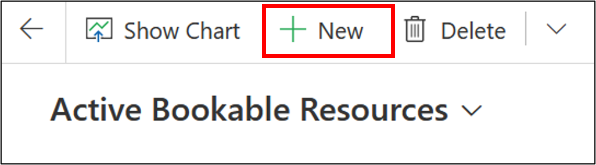

1. [] Select **Resource Type**. A Resource type is a classification that describes who or what the resource is and how the resource relates to your organization. In this case, if necessary, select **User**, who is a person and a member of your organization and needs access to the Field Service Mobile app.

    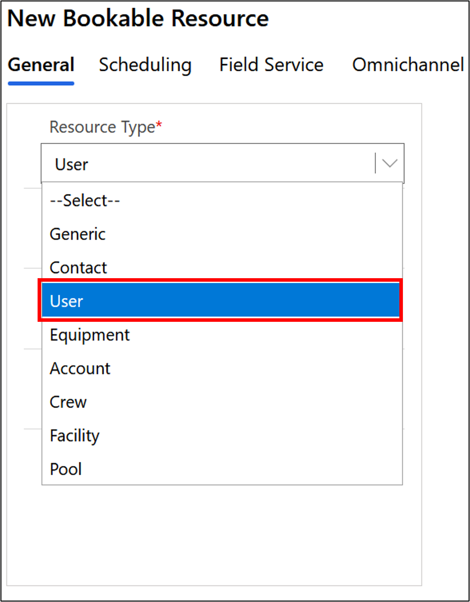

1. [] Pick your training **User** (**MCH Application**) and select your **Time Zone.**

    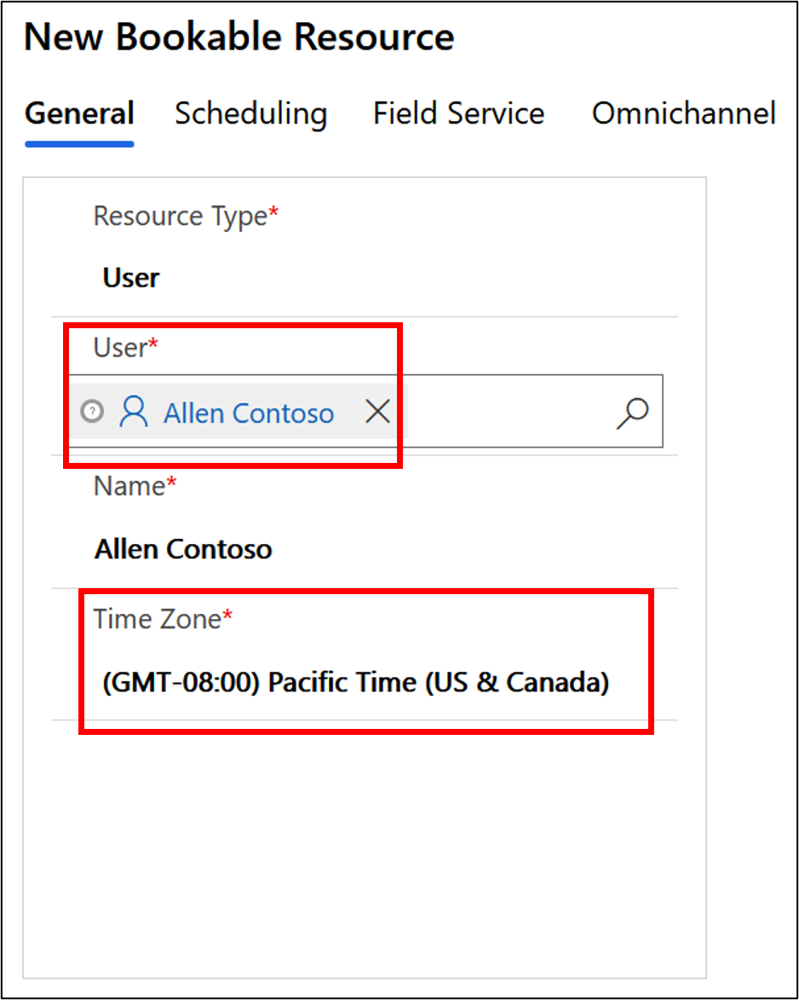

1. [] Select the **Scheduling** tab to decide where the resource starts and ends his or her working day for scheduling and routing purposes. There are three options available when selecting the **Start/End location** for the Bookable Resource:
    1. **Location agnostic** - select this option if the location of this resource is not required for the business need and does not need to be considered during the scheduling process. Note that if the work location of a requirement is set to on site, location agnostic resources will not return in results.
    1. **Resource Address** - select this option if the resource starts and ends his or her day at a unique location. The exact location is derived from the latitude and longitude values on the related user, account, or contact records depending on the resource type.
    1. **Organizational Unit** - select this option if the resource starts and ends the day at an organizational unit, typically representing a company location.

1. [] In this case, choose **Location Agnostic**.

    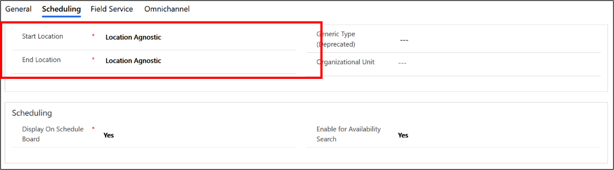

1. [] Select the **Field Service** tab to optionally configure any other aspects of the Bookable Resource.

    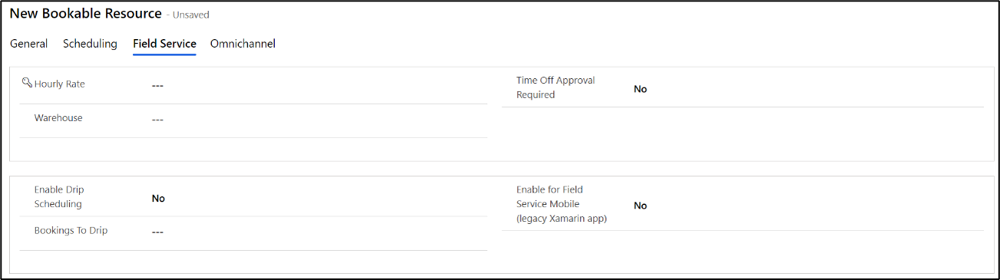

1. [] Save the record.

    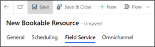

1. [] After saving the bookable resource, it's time to set the working hours of the resource. Working hours are considered by the following:
    1. The schedule board by displaying working and nonworking hours as different colors.
    1. The schedule assistant by only displaying resources that are working in the result.
    1. Resource Scheduling Optimization, which automatically books requirements to resources that are working.

    Select **Show Work Hours** on the command bar:

    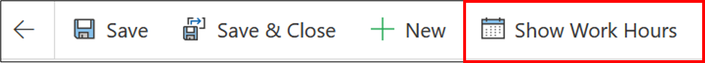

1. [] Select **+New -> Working hours**.

    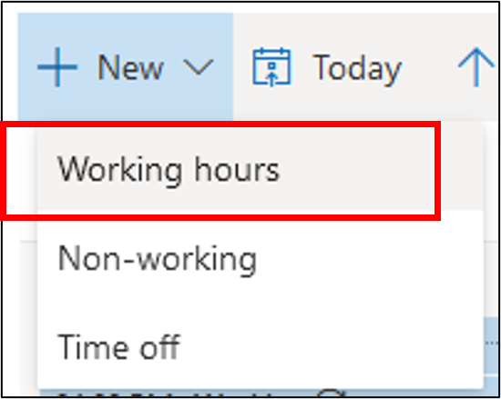

1. [] Choose the date you want the working schedule to begin on, set the **Repeat** option to **Every day**, deselect **Sunday** and **Saturday**, and set the beginning and end time of working hours (such as 8am to 5pm). Select **Save**.

    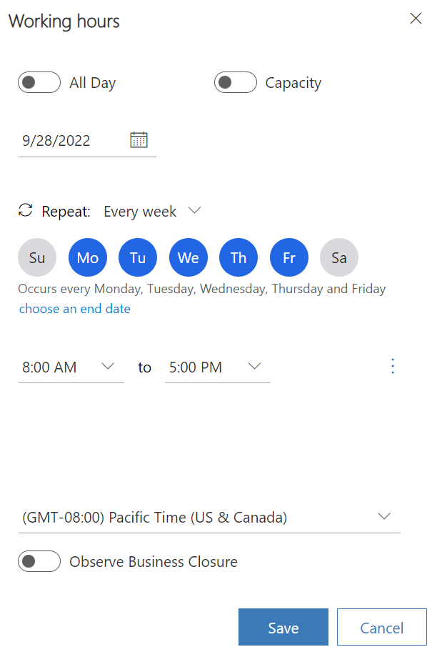

1. [] Go back to the **General** tab. If the bookable resource has specific skills, you should add them now. To create a **Resource Characteristic**, go to the subgrid on the form and select **+New Bookable Resource Characteristic** from the command menu.

    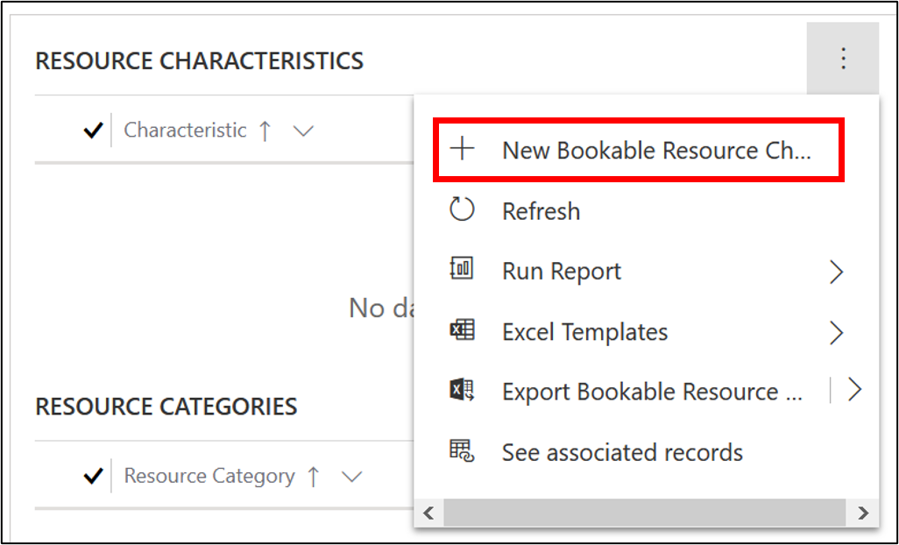

1. [] In the **Skill Name** field, select the magnifying glass and select **+New Characteristic.**

    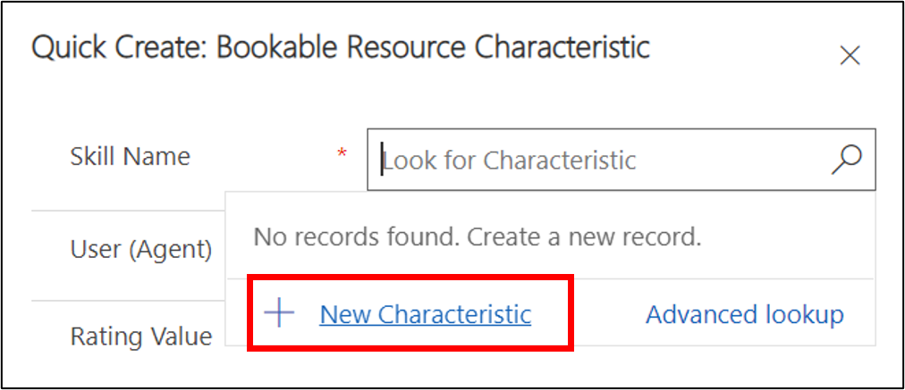

1. [] A quick create form for Characteristic will appear. We want to assign a characteristic to the bookable resource. In this case, the user can speak Spanish fluently. Therefore, type +++**Spanish fluency**+++ for the characteristic **Name** and select **Save & Close**.

    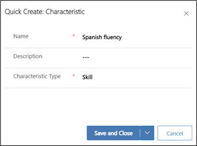

1. [] Back on the Bookable Resource Characteristic quick create form, the Skill Name should be populated with the new Spanish fluency characteristic. Select **Save & Close**. Select **Save & Close** on the **Bookable Resource**.

    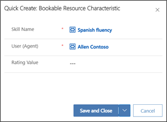

    > [!NOTE] Note: Characteristics represent a resource's skills and certifications. This could be concrete, like a CPR certification; more general, like accounting or web development experience; or as simple as security clearance for a specific building or fluency in the Spanish language.

1. [] If you’d like more data in the system, you may create two more Bookable Resources following the same process. For each of them, select **Contact** as the **Resource Type** and choose any Contact in the system. Choose **Location Agnostic** just as before and select **Save**. Configure the **Work Hours** the same as the previous Bookable Resource and select **Save & Close**.

**Congratulations**! You have created a Bookable Resource. In the next task, we will use this bookable resource to help configure the Schedule Board. For more information on bookable resources, see [Set up bookable resources (Dynamics 365 Field Service) \| Microsoft Docs](https://docs.microsoft.com/en-us/dynamics365/field-service/set-up-bookable-resources).

===

## Exercise 2: Configure the Schedule Board

In this exercise, you will configure the schedule board for the **Bookable Resource** created in the previous task. The schedule board provides an overview of resource availability and bookings you can make. Before you use the schedule board, it is important to set up the views and filters to your preference. To use the schedule board booking functionality, geocoding, and location services, you need to turn on maps.

Here is an example of a configured **Schedule Board**:

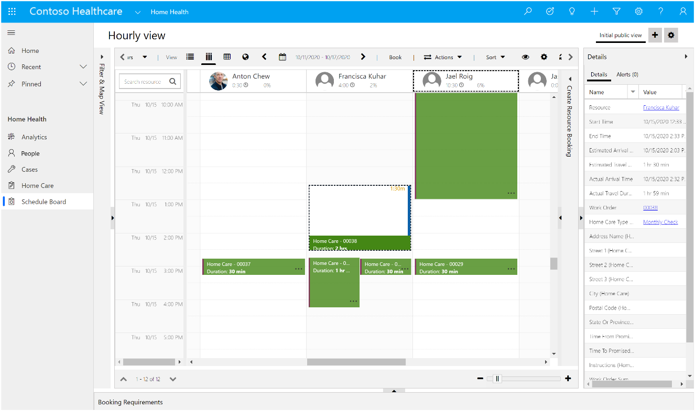

1. [] Navigate to +++https://make.powerapps.com/+++.

1. [] Open the **Resource Scheduling** app.

    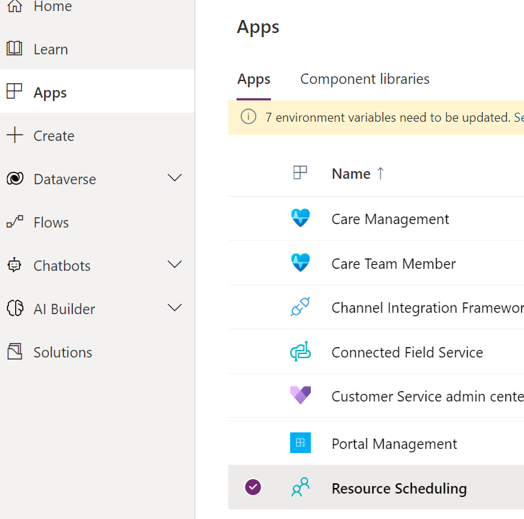

1. [] Change the area in the bottom left navigation dropdown from **Resource Scheduling** to **Settings.**

    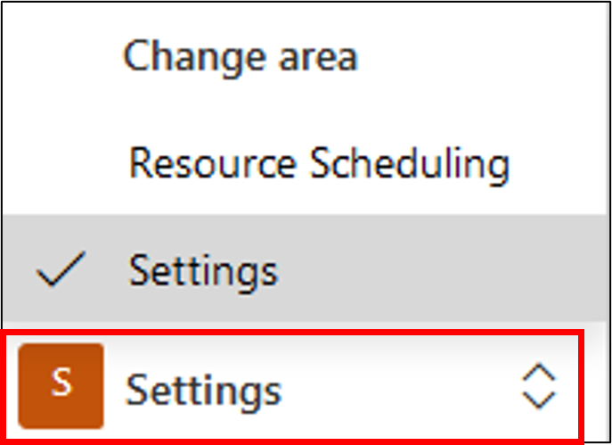

1. [] Select **Administration** on the site map.

    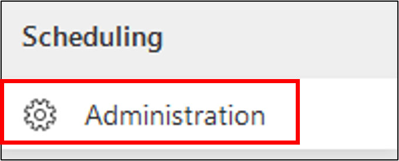

1. [] Select **Scheduling Parameters**.

    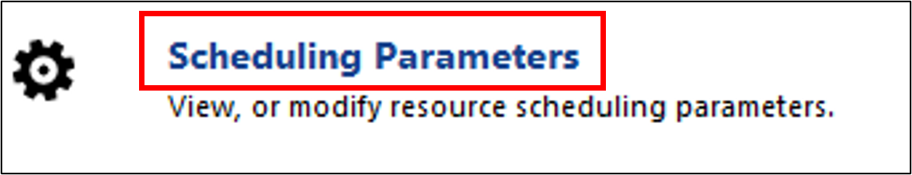

1. [] Set **Connect to Maps** to **Yes**. Then select **OK** to accept the terms. If it is already set to yes, you can skip this step.

    

    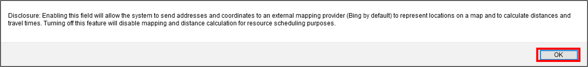

1. [] Select **Save & Close**.
  
1. [] Open the **Home Health** app.

    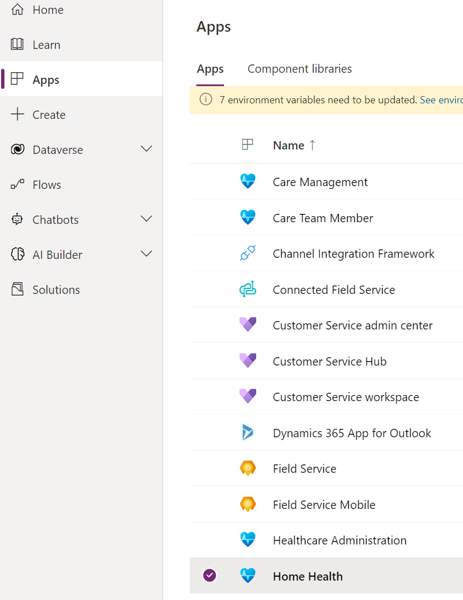

    Now we will associate the Thomson Household home care work order with the Spanish fluency characteristic, so they match Monica with someone who is fluent in Spanish. We have already applied this characteristic to her practitioner. We also want to set the estimated duration for the home visit.

1. [] Select **Home Care** on the left sitemap and open the Home Care Work Order record number **00034** associated with the **Thomson Household**.

    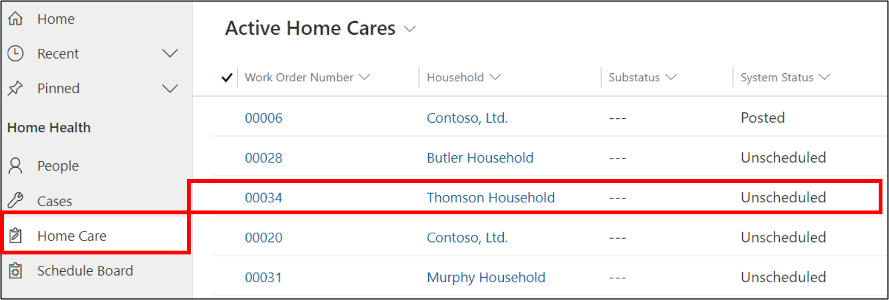

1. [] On the **Summary** tab, scroll down to the **Primary Incident** section and set the **Primary Incident Estimated Duration** to **1 hour** (this will ensure that the work order takes up time on the Resource’s calendar).

    

1. [] Select the **Related** tab and then select **Characteristics**.

    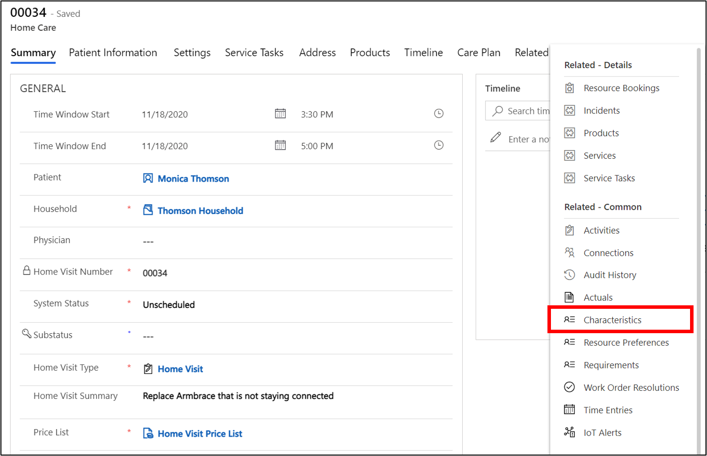

1. [] Select **+ New Requirement Characteristic**.

    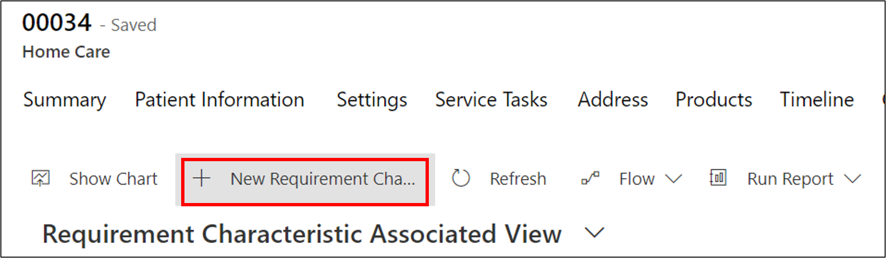

1. [] Choose **Spanish fluency** for the **Characteristic** and Work Order **00034** as the **Resource Requirement**.

    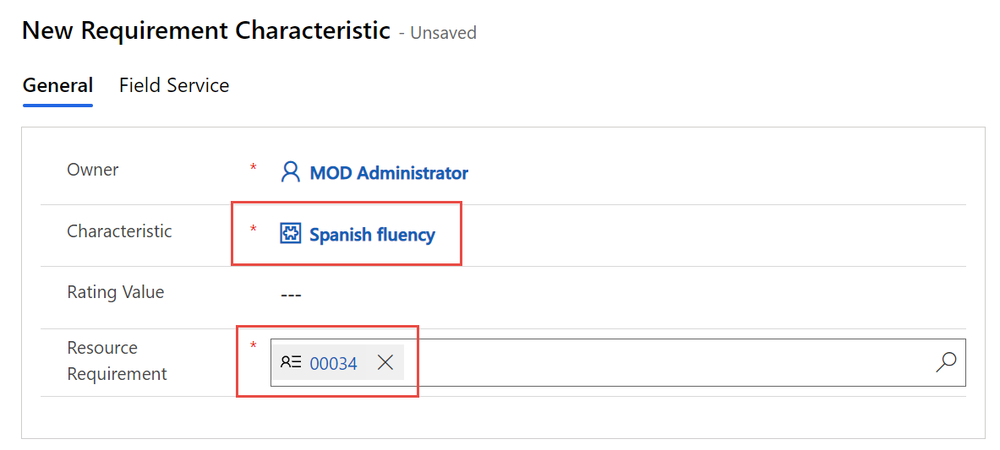

    > [!ALERT] **Important**: Make sure the **Work Order** number populated in the **Resource Requirement** field on the general tab matches the Work Order number on the **Field Service** tab on the Resource Requirement record.

    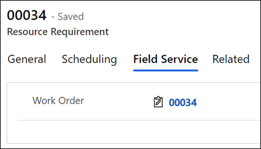

1. [] Select **Save & Close**. You will now see the new characteristic requirement in the subgrid.

    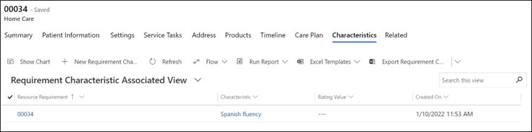

1. [] Now let’s configure the schedule board. Select **Schedule Board** on the left site map.

    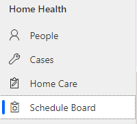

1. [] Select the **plus button (+)** in the upper right corner to create a new **Schedule Board** tab.

    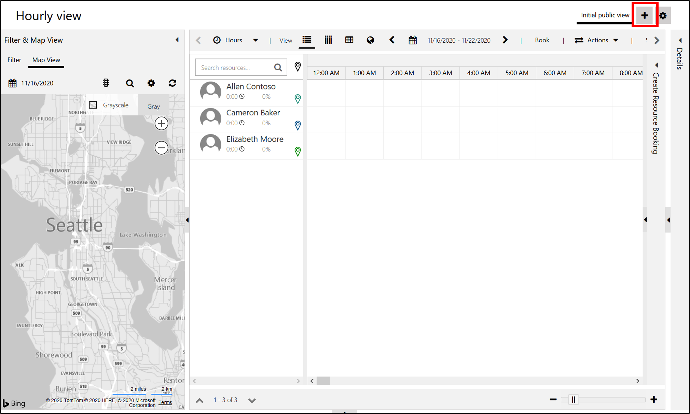

1. [] Name the new Schedule Board tab +++**My Schedule Board Tab**+++. Leave all defaults and click **Add**.

    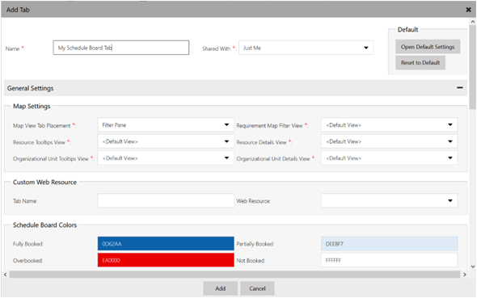

1. [] Select the Scheduler Settings **gear** icon.

    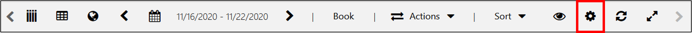

1. [] Change the **Working Time** to be closer to typical working hours, such as **6am** to **6pm**.

    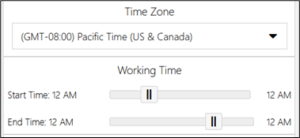

1. [] Open the scheduled Work Orders by selecting the small arrow at the bottom of the screen.

    

1. [] Select the **Unscheduled Work Orders** tab. Find work order **00034** where you added the **Spanish fluency** characteristic and select the grid to highlight it. Select **Find Availability** to open the Schedule Assistant filter.

    

1. [] Notice that any Bookable Resources which do not have the “Spanish fluency” characteristic are dropped from the search. Hover over an open hour on the **Bookable Resource’s** schedule and select the **Book** button to schedule the work order.

    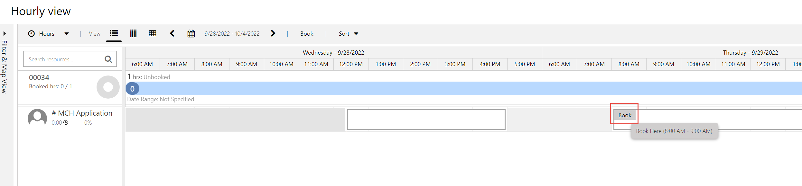

1. [] Select **Exit Search** to close the pane. The work order is now scheduled and will no longer show in the Unscheduled Work Orders grid. The Resource Optimizing tool will schedule it for the next available time.

    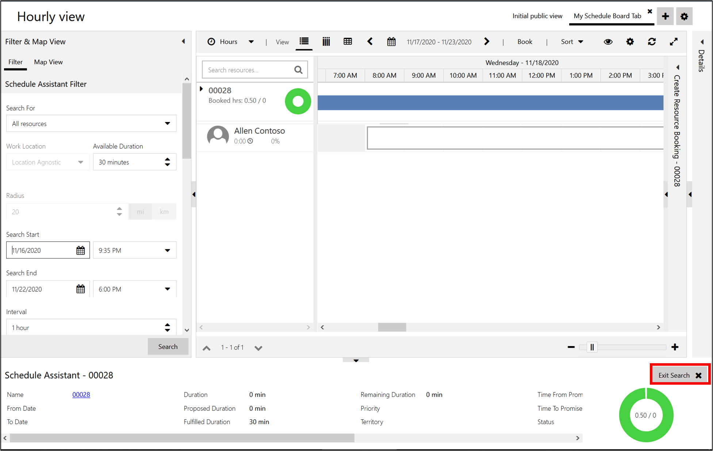

**Congratulations**! You have configured a Schedule Board tab and scheduled a Home Health visit using the bookable resource you created in the previous task. For more information on schedule boards, see [Use and configure the schedule board (Dynamics 365 Field Service) \| Microsoft Docs](https://docs.microsoft.com/en-us/dynamics365/field-service/configure-schedule-board).

===

## Exercise 3 – BONUS : Leverage Care Management Components with Field Service Mobile App

In this exercise, we will walk you through the **Field Service Mobile App** and demonstrate how to leverage **Care Management** components from the perspective of a Nurse or a Physical Therapist out in the field working with a patient. We will explain the installation process, how to set up **Home Health** users and security profiles, and how to use the mobile app to complete work orders.

[The Field Service (Dynamics 365) mobile app](https://docs.microsoft.com/en-us/dynamics365/field-service/mobile-power-app-overview) is designed and optimized for mobile health workers to view Dynamics 365 Home Health work orders and patient information. This mobile app is **built on Microsoft Power Platform** and is customizable to your business needs with the same admin console as all Dynamics 365 business apps.

It is available natively for Apple iOS and Google Android phones and tablets, the Field Service (Dynamics 365) mobile app offers technicians many capabilities they need to perform onsite customer service, such as the following:

-   A calendar view of assigned jobs
-   Support for picture, video, and asset barcode scanning
-   Customer signature capture
-   Offline capabilities so mobile health workers can continue viewing and recording work in areas without internet

Here is a calendar view of scheduled work orders:

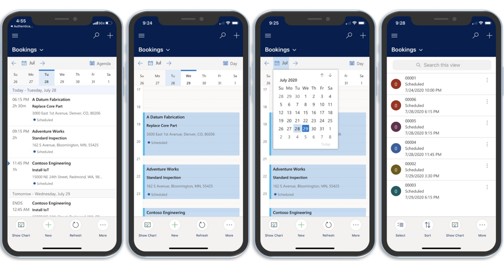

### Task 1: Assign Security Roles to Field Service Mobile Users

In this task we will assign the Field Service – Resource role to Home Health workers.

1. [] Navigate to <https://make.powerapps.com> in your incognito window.

1. [] Select the **gear icon** in the upper righthand corner and go to **Advanced Settings**.

    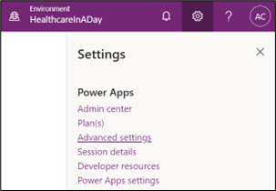

1. [] You will be navigated to the classic view. If it takes a while to load, refresh the page.

    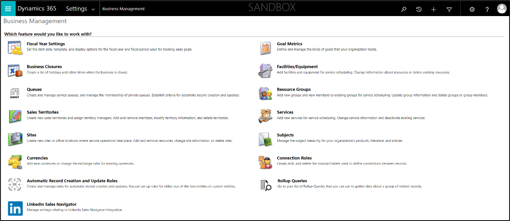

1. [] Select **Settings** on the top command bar and then in the flyout menu choose **Security**.

    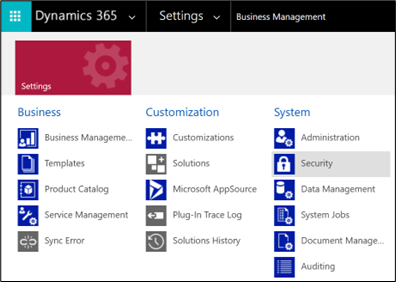

1. [] Select **Users**.

    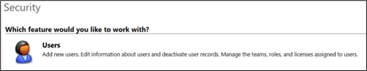

1. [] Select the view drop-down and change the view to show **Enabled Users**.

1. [] Find and select the user whom you would like to assign the “Field Service – Resource” role. Select **Manage Roles** on the command bar.

    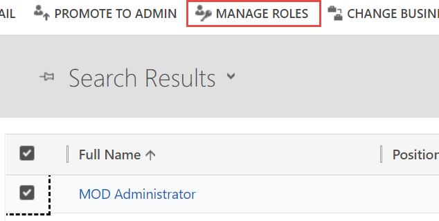

1. [] Scroll down to select the **Field Service – Resource** security role and select **OK**.

    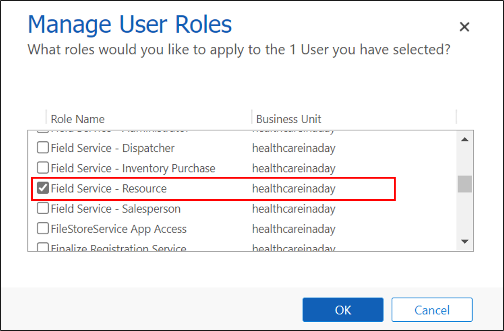

**Congratulations**! You have assigned the Field Service – Resource role to a Field Service Mobile Home Health user in the Microsoft Cloud for Healthcare.

### Task 2: Download the Field Service Mobile app and sign in

In this task, we will walk through how to download the Field Service Mobile app to an iOS or Android device and sign in.

1. [] Go to the app store on your iOS or Android device and search for Dynamics 365 Field Service.

1. [] Download the app called **Field Service (Dynamics 365)**, as seen in the following screenshot. It is the mobile application built on the Power Platform.

1. [] Launch the app and sign in with the Microsoft Cloud for Healthcare username and password for the user that you assigned the **Field Service – Resource** security role to in the previous task.

    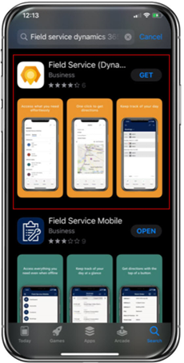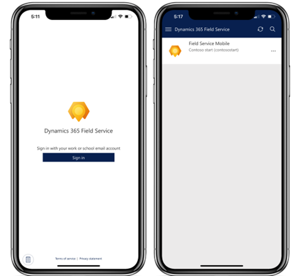
    
**Congratulations**! You have downloaded and signed into the Field Service Mobile as a Home Health user in the Microsoft Cloud for Healthcare

### Task 3: Use the Field Service Mobile app to manage Home Health Work Orders

In the last exercise, we assigned **Home Health Work Order** 00034 to our Home Health Bookable Resource. We will now view and make updates to the work order in the Field Service mobile app, and then view those changes in the Microsoft Cloud for Healthcare Home Health app.

1. [] On your mobile device, log into the Field Service Mobile App as your Bookable Resource user. If you encounter a message that says “Contact your administrator for access to your organization’s mobile apps”, select the menu icon in the top left and **toggle Show non-production apps to Yes**.

    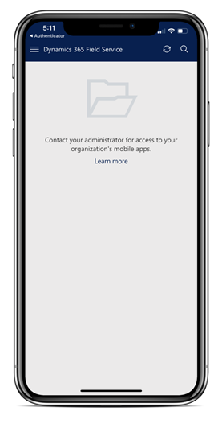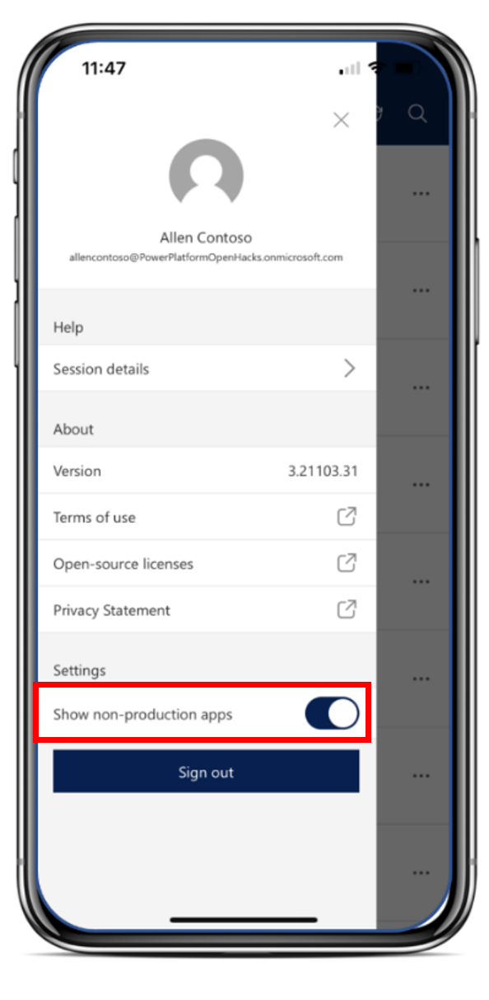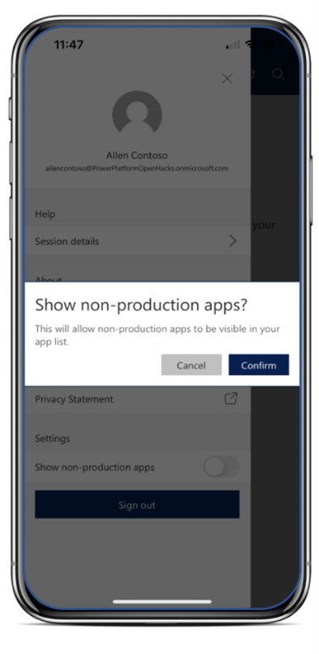

1. [] In the list of environments, find the Microsoft Cloud for Healthcare environment that you have been working in. You will find the Home Health Work Order in the calendar view in an **In Progress** state.

    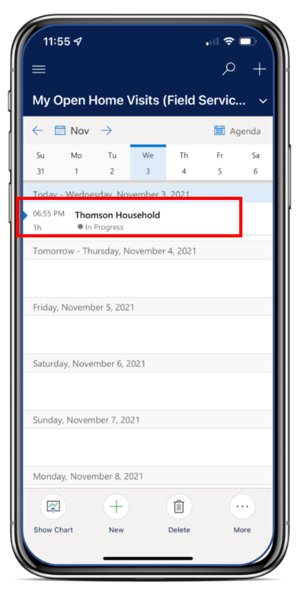

1. [] Select to open the Work Order. Notice the **Booking Status** says **In Progress**. Expand the status field using the arrow in the upper right.

    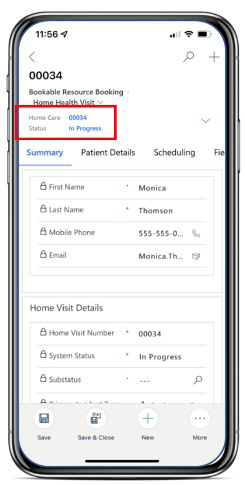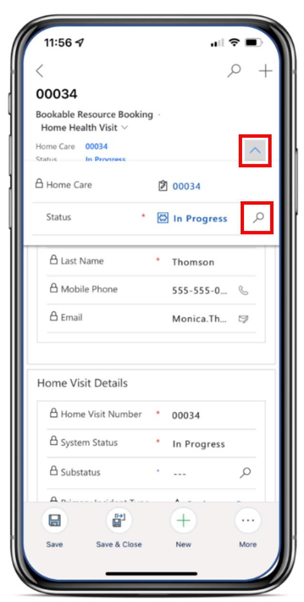

1. [] Remove **In progress** from the selected values by selecting the **x** next to it.

    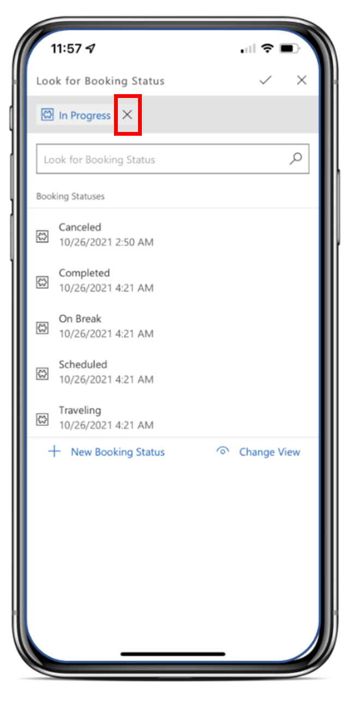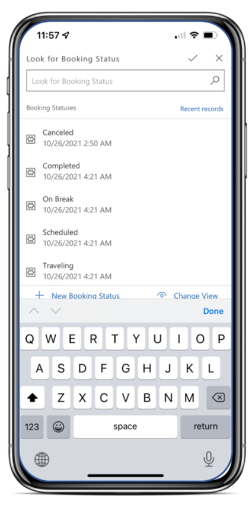

1. [] Set the **Booking Status** to **Completed** to close the Work Order. Select **Save** in the upper right.

    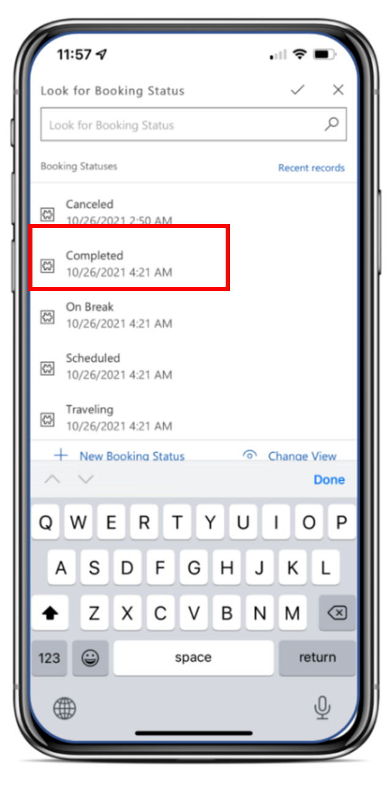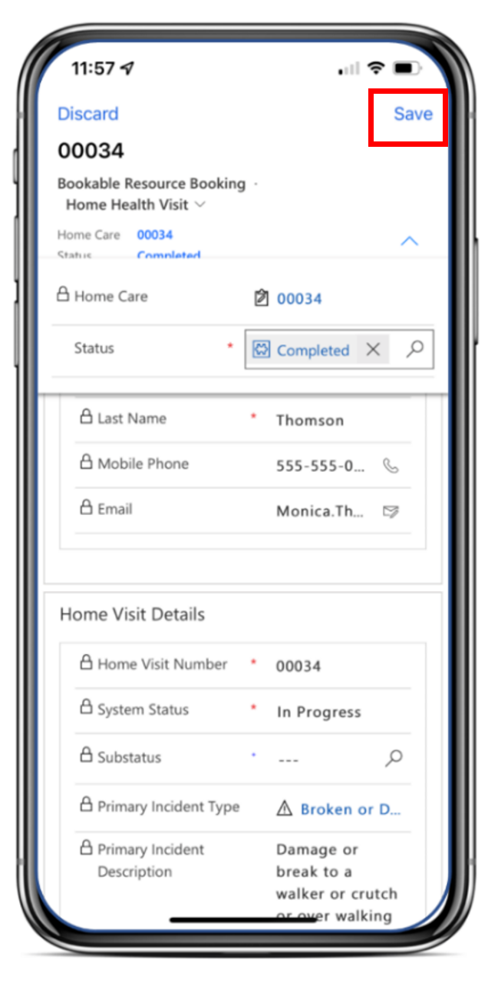

1. [] The Work order has been completed and the time values have reflected based on the start time and when we completed the order. We are now finished with the mobile app.

    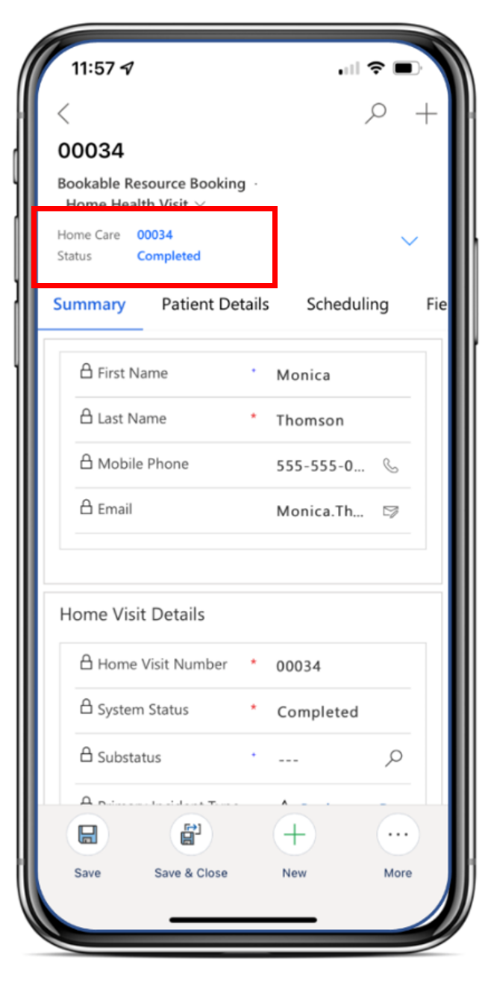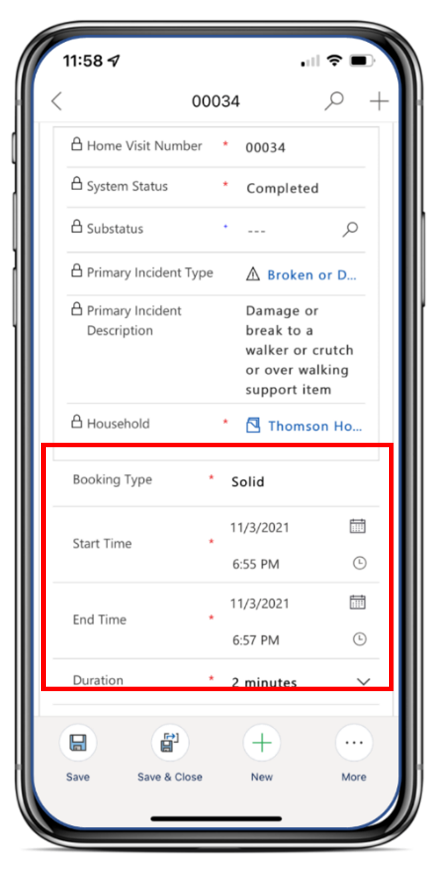

1. [] Navigate back to the **Home Health** app. You’ll see on the schedule board the work order has been updated to show the reflected time and status.

    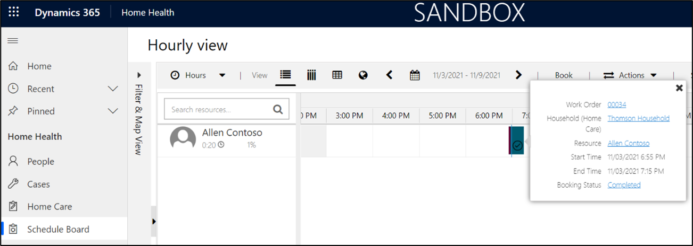

1. [] Select **Home Care** on the site map and find **Work Order 00034**. You will see that the **System Status** has been updated to **Complete**.

    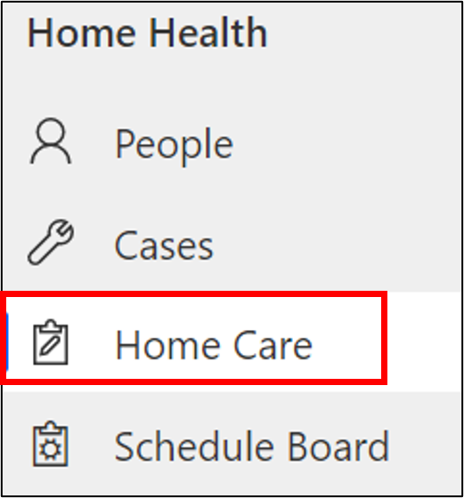

    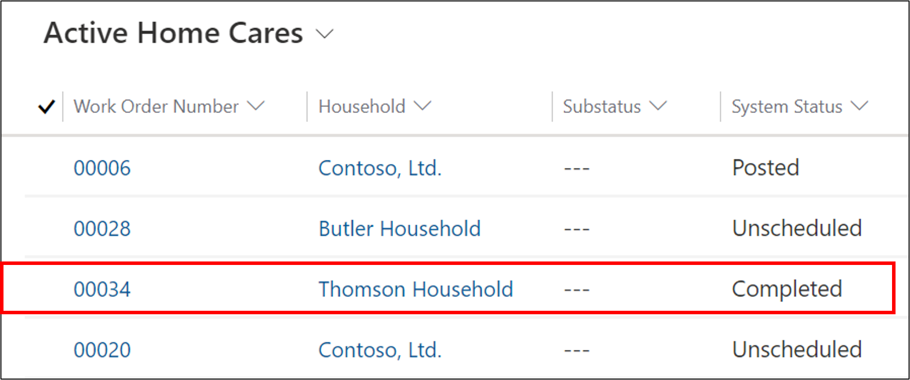

**Congratulations!** You have assigned a Home Health Work Order to a Home Health Bookable Resource, made updates to the work order in the Field Service mobile app, and then viewed those changes in the Microsoft Cloud for Healthcare Home Health app. For more information on the Field Service mobile app, see [Install and set up the Field Service (Dynamics 365) mobile app \| Microsoft Docs](https://docs.microsoft.com/en-us/dynamics365/field-service/mobile-power-app-get-started).
