# Module 4 Lesson 2 Lab 5: Home Health

## Overview

Microsoft Cloud for Healthcare’s **Home Health** application allows provider personnel to schedule appointments for the patient based on a variety of factors. It allows for the communication of the right information, at the right time, to the right people, to provide safe and effective care to your patients. Manage home visit schedules, notify patients, and give access to medical information to the provider on the go.

Key capabilities of Home Health include:

-   **Schedule home visit**: Enable care coordinators to schedule home visit appointments, while viewing patient information directly in context.
-   **Provider scheduling**: View schedules of care team members and optimize visiting routes.
-   **Patient engagement**: Notify patients about upcoming appointments, follow up with patients after a visit, and automatically check with patients between visits.
-   **Home visit coordination**: Coordinate care and support distinct processes and tasks for the home visit.

**Industry prioritized scenarios**

Home Health focuses on the Empowering health team collaboration and Enhance patient engagement priority scenarios by creating a system that allows for improved care team coordination with optimized resources and enhanced patient engagement with personalized experiences and home visits.

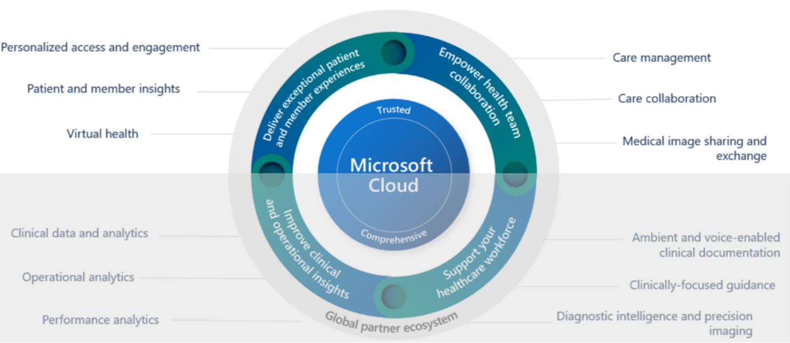

This lab will focus on the healthcare story of Monica Thomson.

Monica sprained her knee while ice skating last winter and was prescribed at-home physical therapy by her practitioner to rehabilitate the injury. To facilitate this home care scenario, Lamna Healthcare Company has deployed Microsoft Cloud for Healthcare’s Home Health capabilities.

In this lab, you will play the role of a Lamna Healthcare Company Home Health dispatcher to configure the Home Health application.

## Exercise 1: Create a Bookable Resource

In this exercise, you will learn how to create a **Bookable Resource** to be used for scheduling a Home Health Work Order. A bookable resource in the Microsoft Cloud for Healthcare is anything that needs to be scheduled. This most commonly includes people, equipment, and physical spaces (facilities). Bookable Resources must be created before scheduling a Home Health Work Order.

Each resource can have different attributes that distinguish it from others, including but not limited to the following:

-   Characteristics (for example: Accounting)

-   Categories (for example: Manager)

-   Territories (for example: Washington State)

-   Organizational Unit (for example: Seattle Service Delivery)

-   Location (for example: Location Agnostic)

-   Resource Type (for example: User)

## Task: Create a bookable resource

Now let’s create a Bookable Resource in the Home Health application.

1.  Navigate to [Power Apps Portal](https://make.powerapps.com). Ensure you select your environment.

2.  Select Apps on the left navigation pane.

1.  Open the **Field Service** app. Click on **Play** button.

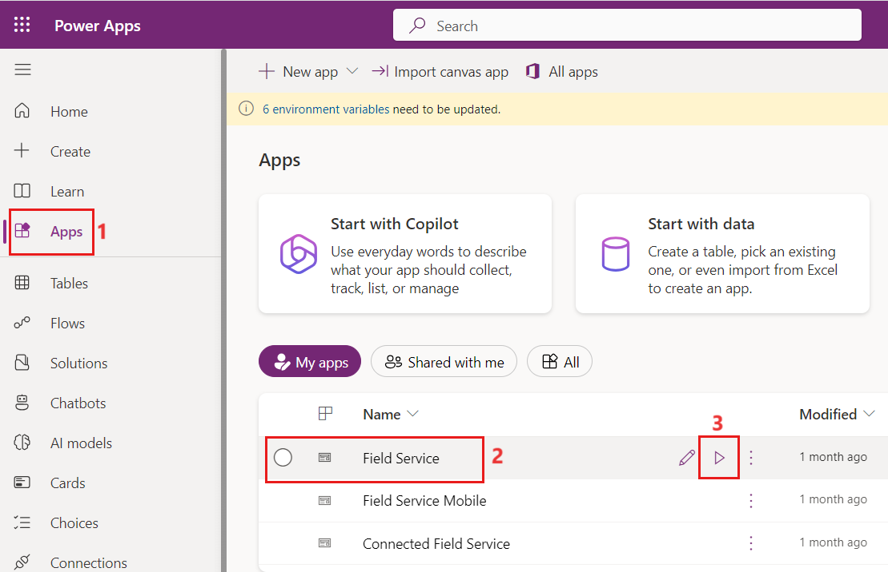  

1.  Select **Resources** from the lower-left **Change area** menu.

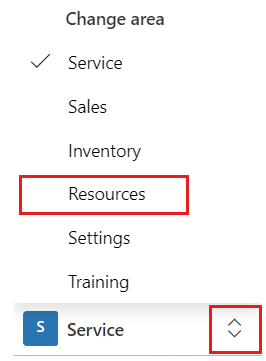

1.  On the resources page, select **+ New** on the command bar to create a new bookable resource.

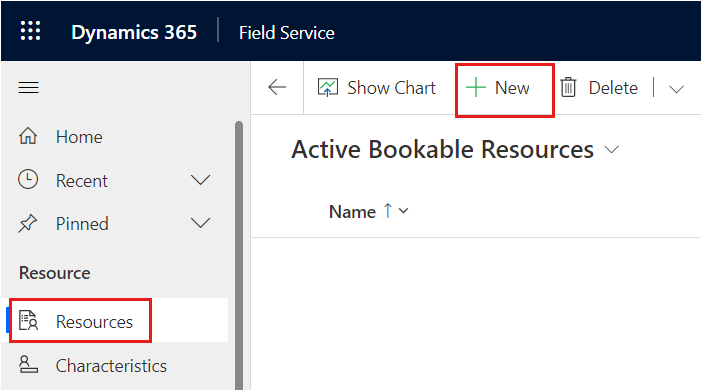  

1.  Select **Resource Type** as User, who is a person and a member of your organization that needs access to the **Field Service Mobile** app.

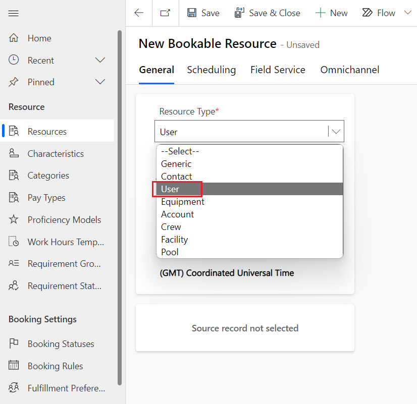

**Note** - Resource Type is a classification that describes the resource and how it relates to your organization.

1.  Pick a **User** and then select their **Time Zone.**

**Note**: Select your own user name

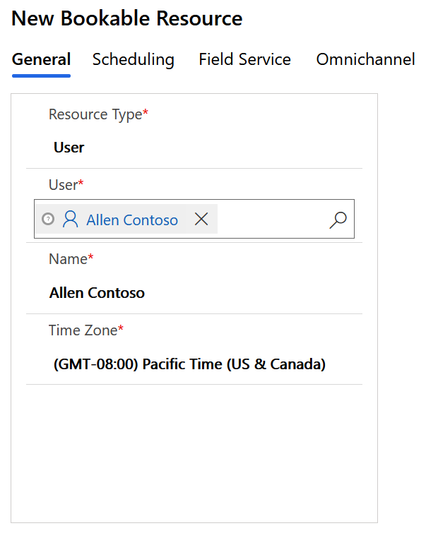

1.  Select **Scheduling** tab and then select **Location Agnostic** as value for **Start Location** and **End Location** fields.

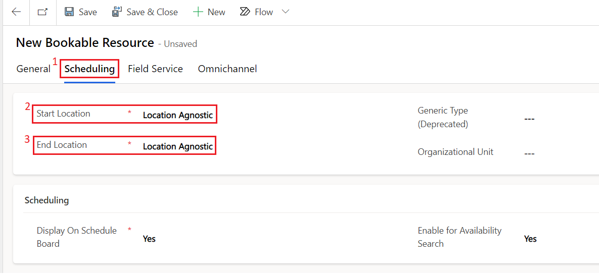

Scheduling is used to decide the location where a bookable resource starts and ends their workday. Select from the following three start or end location options available:
    1. **Location agnostic** - select this option if the location of this resource is not required for the business need and does not need to be considered during the scheduling process. Note that if the work location of a requirement is set to on site, location agnostic resources will not return in results.
    1. **Resource Address** - select this option if the resource starts and ends his or her day at a unique location. The exact location is derived from the latitude and longitude values on the related user, account, or contact records depending on the resource type.
    1. **Organizational Unit** - select this option if the resource starts and ends the day at an organizational unit, typically representing a company location.

1.  Select the **Field Service** tab to optionally configure other aspects of the bookable resource. **Save** the record

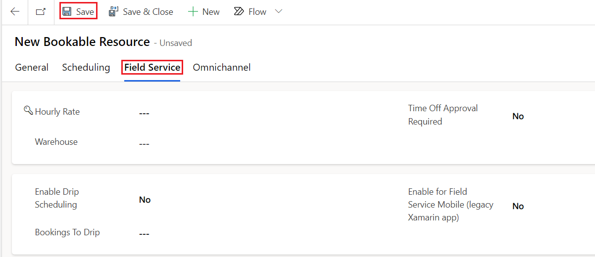

## Task: Set working hours for bookable resource

After you've saved the bookable resource, you can set the working hours of the resource. Working hours are considered by the following entities:

    •	The schedule board, by displaying working and nonworking hours as different colors.

    •	The schedule assistant, by only displaying resources that are working in the result.

    •	Resource Scheduling Optimization, which automatically books requirements to resources that are working.

1.	Select the **Work Hours** tab.

2.	Select **+ New > Working hours.**
 
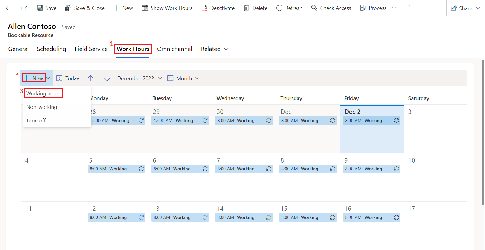

3.	Choose the date that you want the working schedule to begin on, the beginning and end time of working hours (such as 8:00 AM to 5:00 PM), along with a **Repeat** option (such as Every week), and then clear the **Sunday** and **Saturday** options. Select **Save**. On the working hours panel, use the following values to set the working hours of a bookable resource:

    o	**Schedule start date** - any future date.

    o	**Repeat** - Every week

    o	**Working days** - Mo, Tu, We, Th, Fr

    o	**Choose an end date** - Select when this schedule ends (optional)

    o	**Time Range** - Any suitable time range (Like 8:00 AM – 5:00 PM)

    o	**Time Zone** - (GMT) UTC or any suitable time zone

    o	**Observe Business Closure** - Toggle right (optional)
 
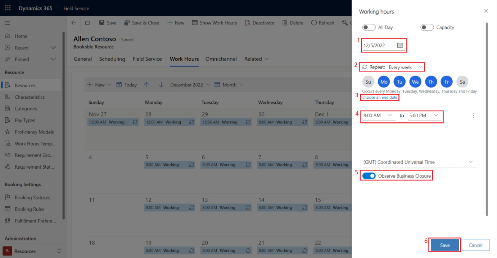

## Task: Create resource characteristic

Characteristics represent a resource’s skills and certifications. These characteristics could be:

    •	Concrete like a CPR certification.

    •	More general, like accounting or web development experience.

    •	Simple as security clearance for a specific building or fluency in any language such as Spanish or French.

1.	Select the **General** tab and then select the ellipsis (⋮) next to **Resource Characteristics** to select **+ New Bookable Resource Characteristic** option from the pop-up menu.
 
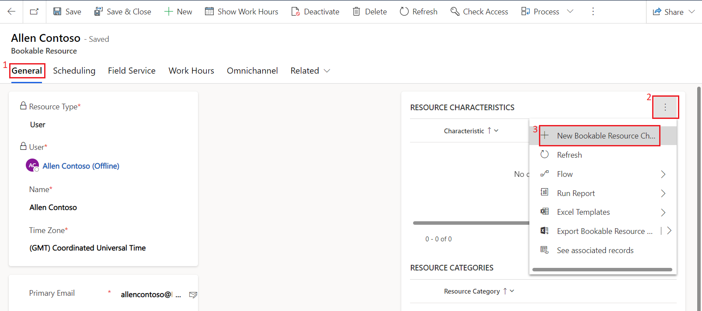

2.	In the **Skill Name** field, select the magnifying glass and then select **+ New Characteristic.**

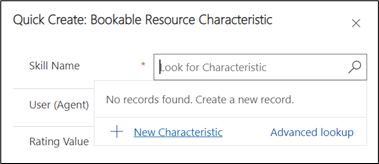

3.	A quick create form for Characteristic will appear. You need to assign a characteristic to the bookable resource. In this case, the user can speak Spanish fluently. Type "**Spanish fluency**" for the Name and select **Save and Close.**
 
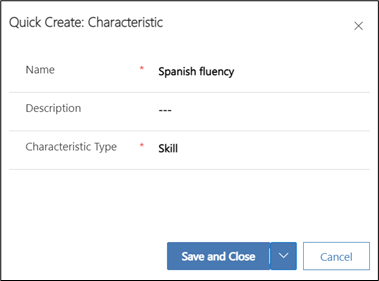

4.	Back on the Bookable Resource Characteristics quick create form, the Skill Name should be populated with the new Spanish fluency characteristic. Select **Save and Close.**
 

5.	Your bookable resource (user) now has the proper characteristics applied.

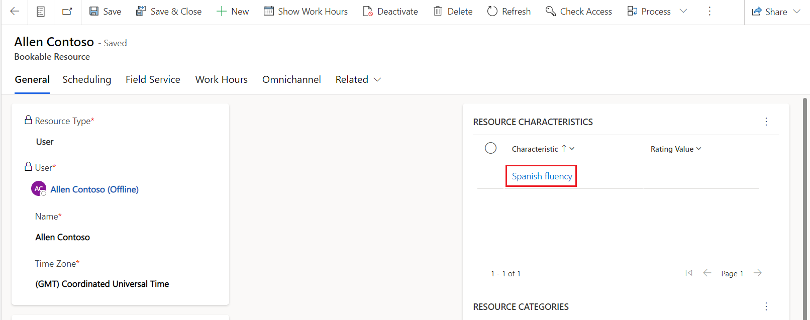 

6.	For more data in the system, create two more bookable resources following the same process. For each of them, select **Contact** as the **Resource Type** and select any **Contact** in the system. Select **Location Agnostic** as before and select **Save**. Set up the **Work Hours** the same as the previous bookable resource. Add characteristics as you see fit and select **Save & Close**.

You've created a bookable resource. In the next exercise, you'll use this bookable resource to help configure the schedule board.

## Exercise - Configure the schedule board

In this exercise, you'll configure the schedule board for the bookable resource that you created in the previous exercise. The schedule board provides an overview of resource and booking availability. Before you use the schedule board, you need to set up the views and filters to your preference. To use the schedule board booking functionality, geocoding, and location services, you need to turn on the **Maps** feature.

The following screenshot shows an example of a configured schedule board.
 
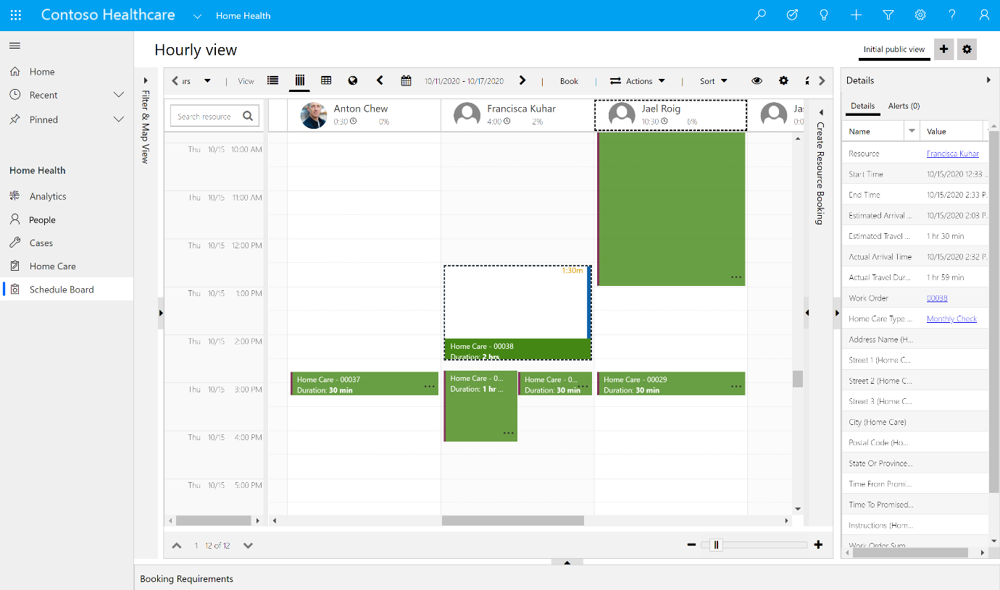

## Task: Set up Resource Scheduling app

In this task, you'll enable connect to maps feature in the **Resource Scheduling** app. The connect to maps feature allows an external mapping provider to represent locations on a map and to calculate distances and travel time.

1.	While signed into your Microsoft 365 tenant, open a new tab, and go to [Power Apps](https://make.powerapps.com/)

2.	Select **Apps** on the left navigation pane.

3.	Select **Resource Scheduling** app on the right pane. Click on **play** button.
 
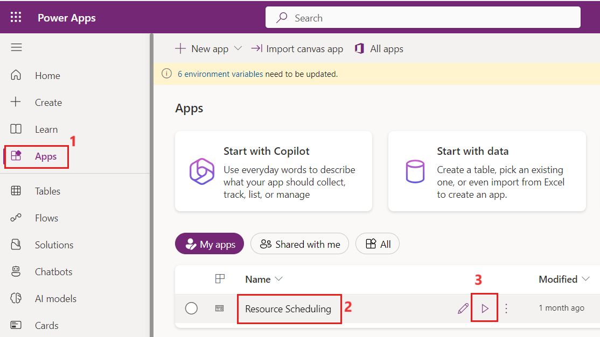

4.	Select **Settings** from the lower-left **Change area** menu.

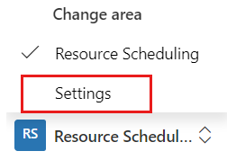

5.	Select **Administration** on the left navigation pane and then select **Scheduling Parameters** on the right pane.

 
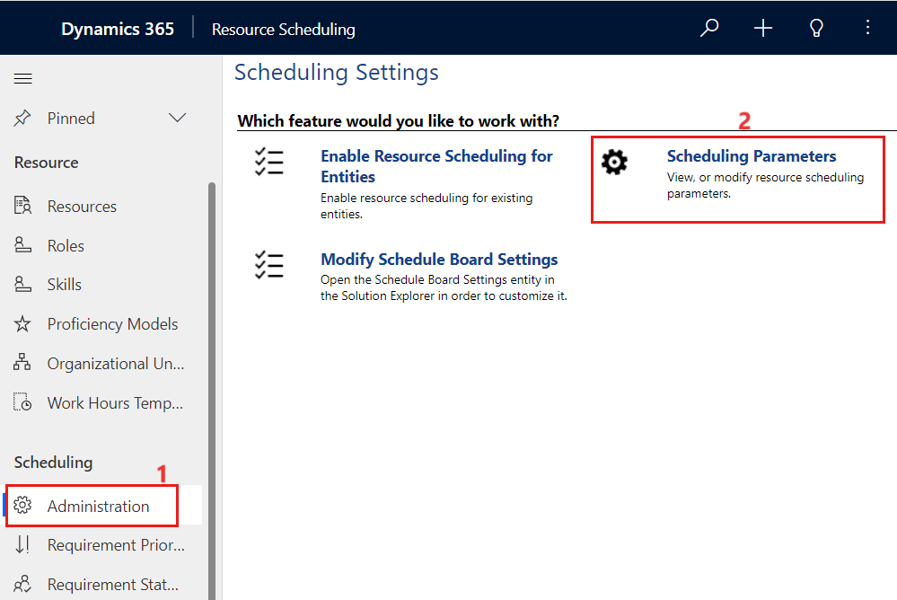

6.	Verify the **Connect to Maps** option to **Yes**, If not change it to Yes and then select **OK** to accept the terms. Select **Save & Close.**

 
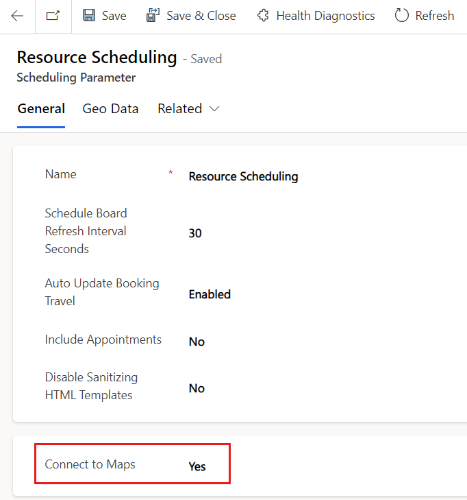

## Task: Set up Home Health app

In this task, you’ll associate the Thomson Household home care work order with the Spanish fluency characteristic, so they match Monica with someone who is fluent in Spanish. You've already applied this characteristic to the practitioner. You also want to set the estimated duration for the home visit.

1.	Go to [Power Apps](https://make.powerapps.com/)

2.	Select **Apps** on the left navigation pane.

3.	Select **Home Health** app on the right pane. Click on **play** button.

4.	In the **Home Health** app, select **Home Care** on the left navigation pane. On the right pane, select the Work Order number **00034** associated with the **Thomson Household**. Then, select **Edit**.

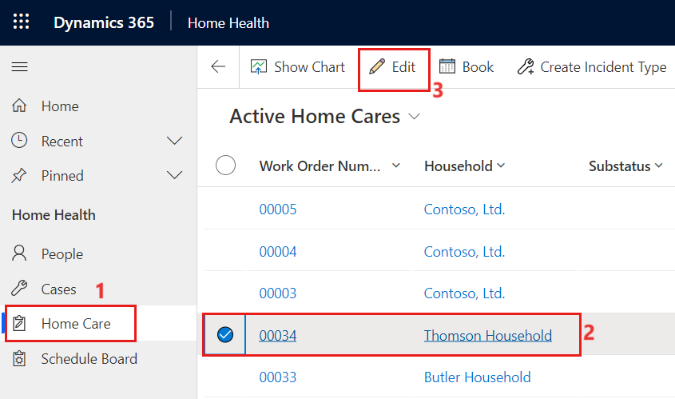 

5.	On the **Summary** tab, scroll down to the Primary Incident section and set the **Primary Incident Estimated Duration** to 1 hour (this setting will ensure that the work order takes up time on the Resource’s calendar).
 
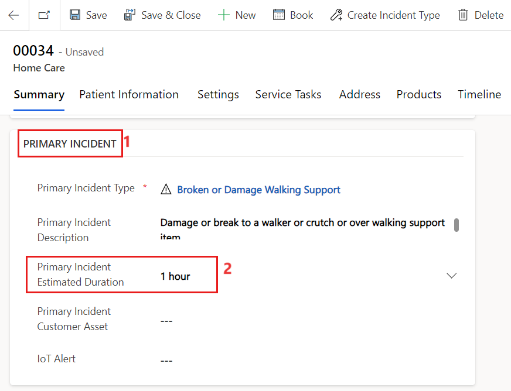

6.	Select **Related** and then select **Characteristics**.
 
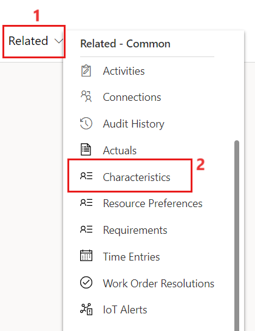

7.	Select **+ New Requirement Characteristic**.
 
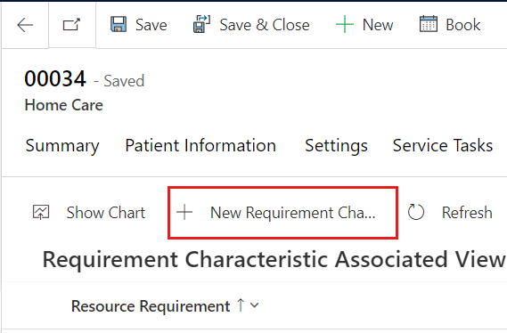

8.	Select **Spanish fluency** for the **Characteristic** and work order **00034** for the **Resource Requirement.**
 
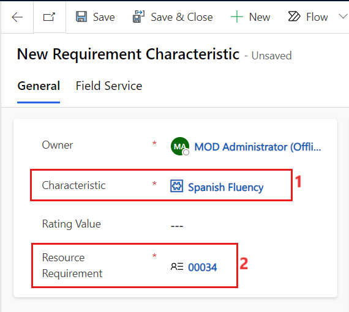

9.	Make sure that the **Work Order Number 00034** that is populated in the **Resource Requirement** field matches the **Work Order Number** on the **Field Service** tab. Select **Save & Close**.
 
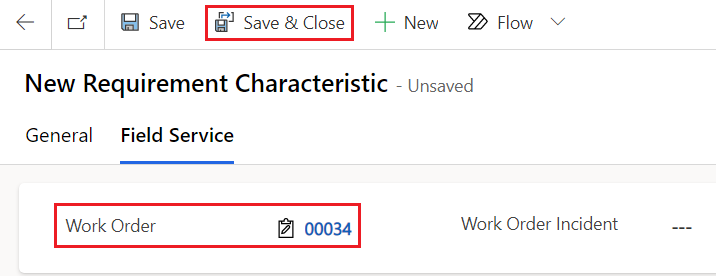

10.	You'll now see the new characteristic requirement in the **Requirement Characteristic Associated View.**
 

## Task: Create schedule board

In this task, you’ll create a schedule board and schedule a home work order.

1.	Switch back to **Resource Scheduling** app and , select **Schedule Board** on the left navigation under **Tools**.
 
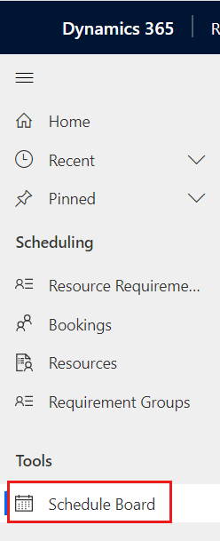

2.	Select the plus **(+)** button beside Initial public view. 
 
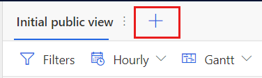

3.	Name the new schedule board tab **My Schedule Board** Tab. Leave all defaults and then select **Add**.
 
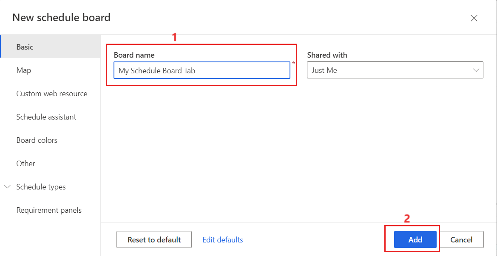

4.	Select three horizontal dots and select **Scheduler settings.**
 
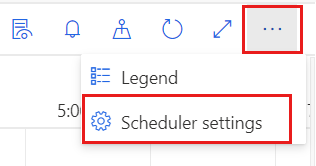

5.	Change the start and end working time to match typical working hours, such as 6:00 AM to 6:00 PM. Then close the settings page.
 
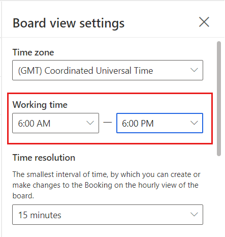

6.	Select the Unscheduled Work Orders tab at the bottom of the screen.
 
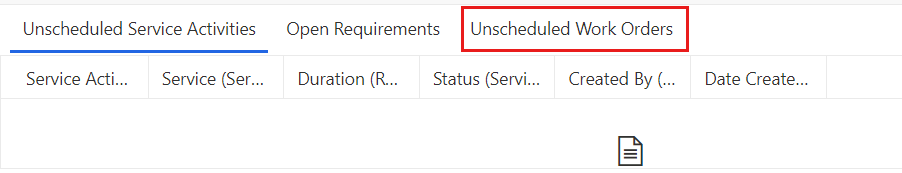

7.	Find work order 00034 where you added the **Spanish fluency** characteristic and select the grid to highlight it. Select **Find Availability** to open the **Schedule Assistant** filter.
 
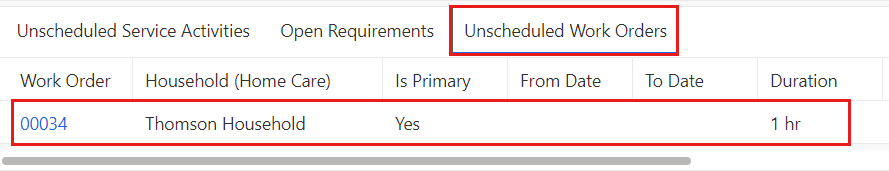

8.	Notice that the two other bookable resources that you created, which don't have the **Spanish fluency** characteristic set, are dropped from the search. Select the timings. Select the listed entry. This opens up the **Create Booking** pane. Select the **Book** button on the bookable resource's schedule to schedule the work order.

**Note**: Click on **Allow** in the Dynamics 365 wants to Know your location popup.

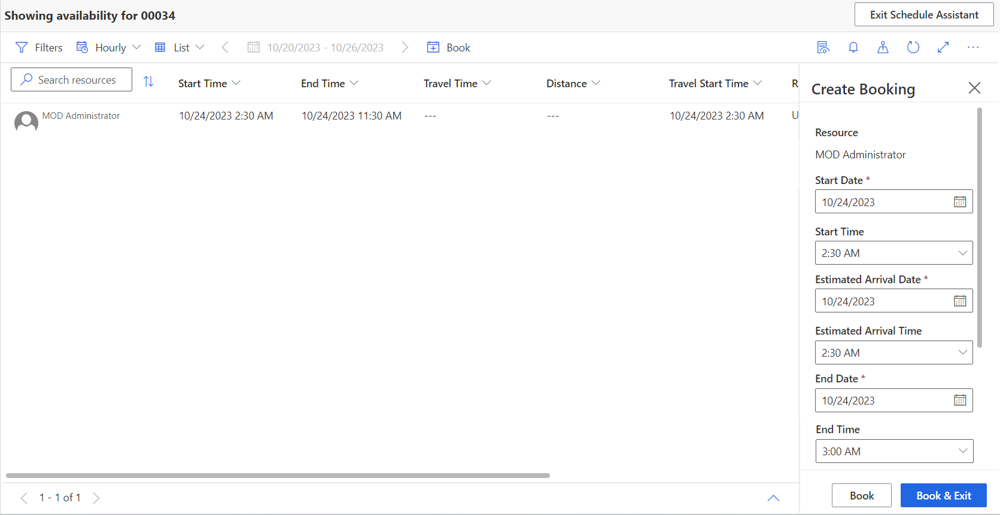

9.	When you click on Initial public view, you can view the booked schedule.

**Note**: If the Initial public view option does not showup, click on the Schedule Board from the left pane again.
 
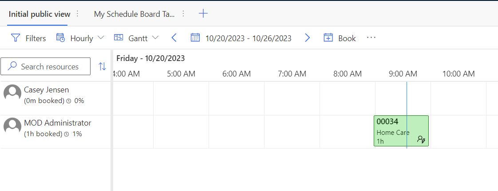

You've configured a schedule board tab and scheduled a Home Health visit by using the bookable resource that you created in the previous exercise. For more information on schedule boards, see [Use and configure the schedule board (Dynamics 365 Field Service).](https://learn.microsoft.com/en-us/dynamics365/field-service/configure-schedule-board/)

## Exercise - Use care management components with the Field Service Mobile app

In this exercise, you'll learn about the Field Service Mobile app and how to use care management components from the perspective of a nurse or a physical therapist, who is out in the field working with a patient. This exercise goes through the installation process, shows how to set up Home Health users and security profiles, and demonstrates how to use the app to complete work orders.

[The Dynamics 365 Field Service Mobile app](https://learn.microsoft.com/en-us/dynamics365/field-service/mobile-power-app-overview/) is designed and optimized for mobile health workers to view Dynamics 365 Home Health work orders and patient information. This mobile app is built on Microsoft Power Platform and is customizable to your business needs with the same admin console as all Dynamics 365 business apps.
Field Service Mobile app is available natively for Apple iOS and Google Android phones and tablets, and it offers technicians many capabilities that they need to perform on-site customer service, such as:

    •	A calendar view of assigned jobs

    •	Support for picture, video, and asset barcode scanning

    •	Customer signature capture

    •	Offline capabilities so that mobile health workers can continue viewing and recording work in areas without internet

The following screenshot shows a calendar view of scheduled work orders.
 
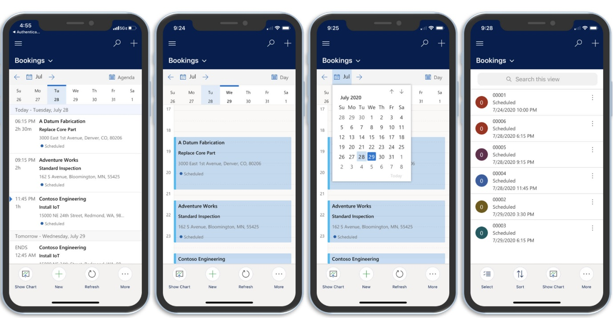

## Task: Download the Field Service Mobile app and sign in

In this task, you'll download the Field Service Mobile app to an iOS or Android device and then sign in.

1.	Go to the app store on your iOS or Android device and search for **Dynamics 365 Field Service.**

2.	Download the **Dynamics 365 Field Service** app, as shown in the following screenshot. It's the mobile app that is built on Microsoft Power Platform.
 
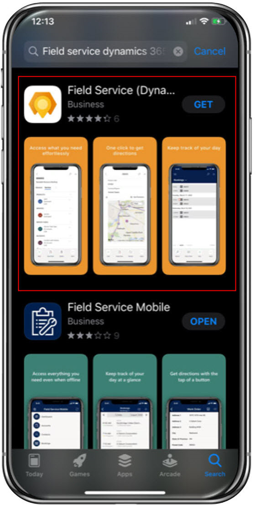

3.	Launch the app and then **sign in** with the Microsoft Cloud for Healthcare username and password for the user whom you assigned the **Field Service - Resource** security role in the previous task.
 
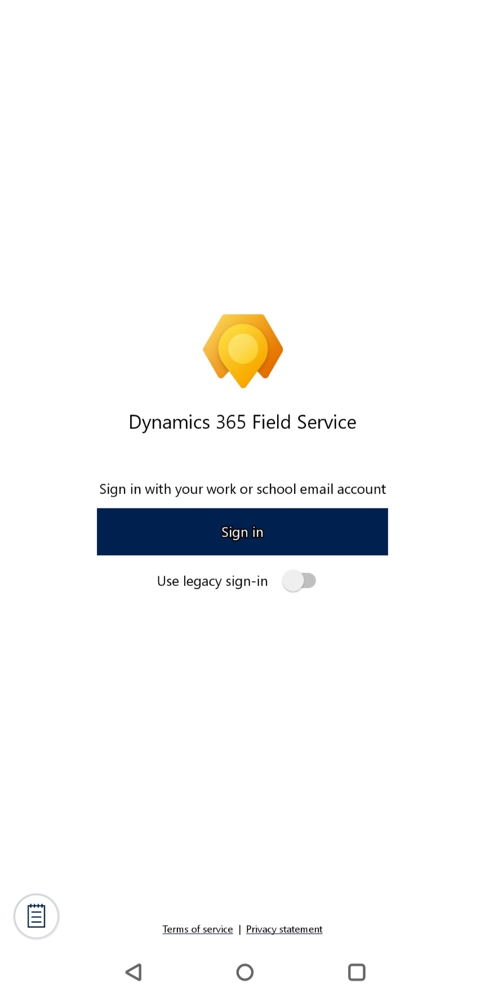

You've downloaded and signed in to the Field Service Mobile app as a Home Health user in Microsoft Cloud for Healthcare.

## Task: Use the Field Service Mobile app to manage Home Health work orders

In this task, you'll assign a Home Health work order to your Home Health bookable resource. Next, you'll view and update the work order in the Field Service Mobile app and then view those changes in the Microsoft Cloud for Healthcare Home Health app.

1.	On your mobile device, sign in to the Field Service Mobile app as your bookable resource user. If you encounter a message that states, "Contact your administrator for access to your organization's mobile apps," select the menu icon in the upper left and set the **Show non-production apps** toggle to **Yes** (because the list shows production apps by default).
 
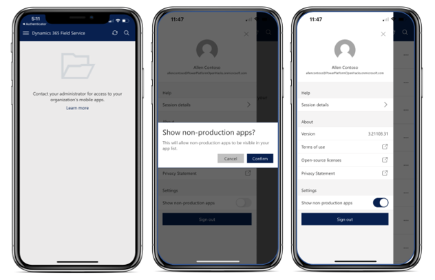

**Note**: If you are not able to find the environment, Refresh the page or sign out and sign in again.

2.	In the list of environments, find the Microsoft Cloud for Healthcare environment that you have been working in. From that environment, you'll find the Home Health work order in the calendar view, shown in an **In Progress** state.

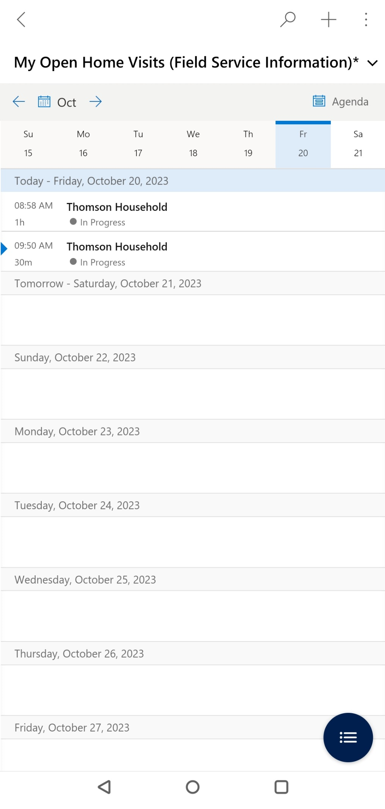 

3.	Select to open the work order. Notice that the **Status** shows as **In Progress**. Expand the status field with the help of the down arrow.

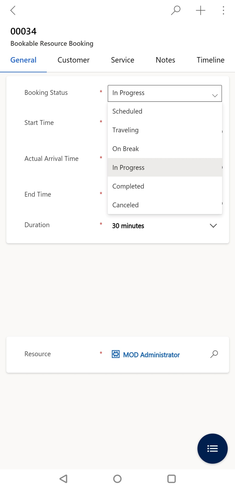 

4.	Select the magnifying glass next to the status field to modify the value. **Remove** In progress from the selected values by selecting the x next to it.
 
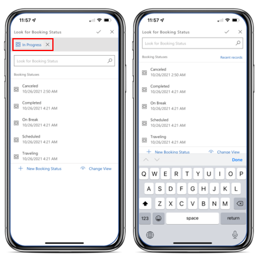

5.	Select the **Completed** option for **Booking Status** to close the Work Order. Select **Save** in the upper right corner.

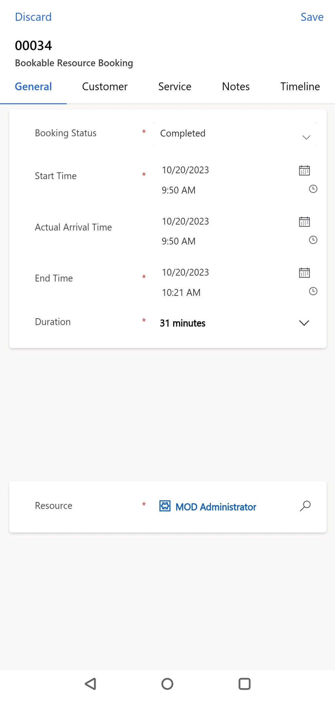 

6.	The Work order has been completed and the time values have reflected based on the start time and when you completed the order.

7.	You now finished with the mobile app. Go back to the **Resource Scheduling app.**

8.	You'll see on the **schedule board** the work order has been updated to show the reflected time and status.

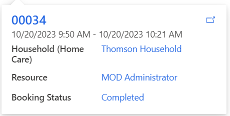 

9.	Select **Home Care** on the site map and find **Work Order 00034**. You'll see that the **System Status** has been updated to **Completed**.
 
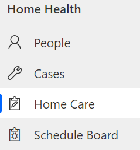

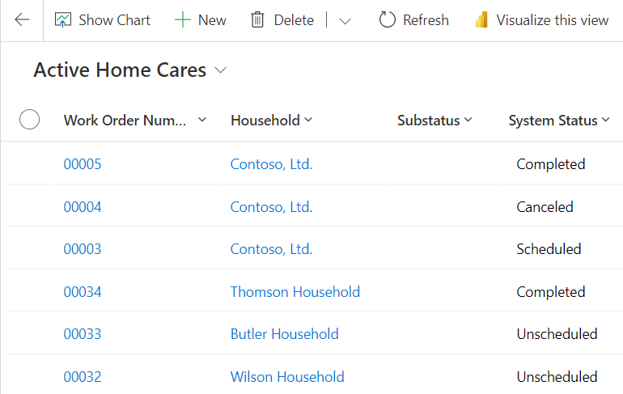

You've assigned a Home Health Work Order to a Home Health Bookable Resource, made updates to the work order in the Field Service mobile app, and then viewed those changes in the Microsoft Cloud for Healthcare Home Health app. For more information on the Field Service mobile app, see [Install and set up the Field Service (Dynamics 365) mobile app.](https://learn.microsoft.com/en-us/dynamics365/field-service/mobile-power-app-get-started/)
