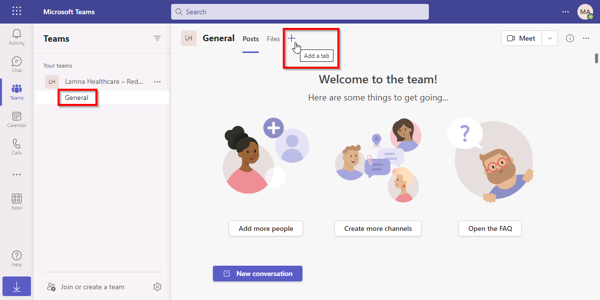
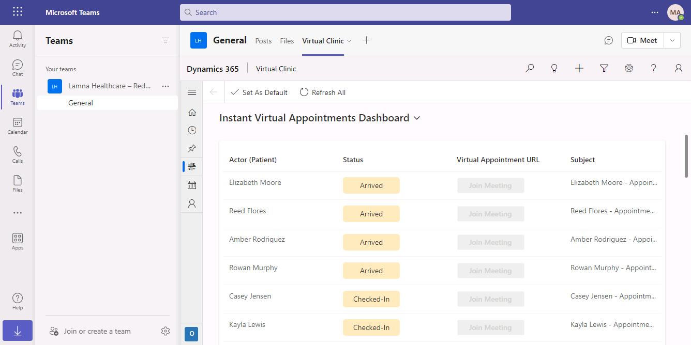

# Module 4 Lesson 2 Lab 6: Virtual Visits

## Overview

Microsoft Cloud for Healthcare’s Virtual Clinic application allows clinicians to use video conferencing to provide high-quality, personalized, and affordable consultations. Using the entire meetings platform in Microsoft Teams, providers will be able to schedule, manage, and conduct virtual visits with patients. The Virtual Clinic application can then be embedded inside of Microsoft Teams to provide a practitioner with a full view of their patient’s information and history all in one unique experience.

Virtual Care focuses on the **Enhance patient engagement** priority scenario by providing a virtual health solution for scheduling and following up on virtual visits between patients, providers, and care managers.

This lab will focus on the healthcare story of Reed Flores.

After coming home from hiking, Reed noticed he had a new rash on his right leg. He decides to schedule a virtual appointment to get a diagnosis.

In this lab, you will first play the role of a Lamna Healthcare system administrator by configuring the Microsoft Cloud for Healthcare Virtual Clinic application to be used for virtual appointments. Then, you will play the role of Reed Flores by scheduling a virtual appointment with his practitioner, Alex Johnson. Finally, you will join the virtual appointment from the view of a practitioner to observe the complete end-to-end experience.

## Learning objectives

In this lab, you will:

-   Configure the Virtual Clinic app
-   Configure Microsoft Teams for virtual visits
-   Schedule a virtual visit in the Patient Portal

## Exercise 1: Configure Virtual Clinic Application

In this exercise, you will configure the Microsoft Cloud for Healthcare Virtual Clinic application. The Virtual Clinic application allows practitioners to use video conferencing in Microsoft Teams to provide high-quality, personalized, and affordable consultations for their patients.

### Task 1: Create a new Practitioner Specialty for the Patient Portal

In this task, we are going to create a new Practitioner Specialty for the Patient Portal. Practitioner Specialties are used to define the reason why a patient is booking the virtual appointment. They are defined as Codeable Concepts records, with the type of Practitioner Specialty.

Below is an example of the appointment booking screen in the Patient Portal. As the first step in the process, the user must select a reason for their appointment.

1. [] Go to +++https://make.powerapps.com+++ and open **Virtual Clinic** on the **Apps** page.

1. [] In the upper right-hand corner, select the **funnel** icon which will open **Advanced Find**.

    

1. [] In the **Search** box, scroll to and select **Codeable Concepts** and select **Results** on the ribbon.

    

1. [] Select **New Codeable Concept**.

    

1. [] In the **New Codable Concept** record, fill in the following details and select **Save**.
    1. [] **Name**: +++General Medicine+++
    1. [] **Text**: +++General Medicine+++
    1. [] **Type**: Practitioner Specialty (you may have to scroll down pretty far)
    1. [] **Code**: +++general+++

        

**Congratulations!** You have created a new Practitioner Specialty that will now be available for selection as an appointment visit in the Patient Portal.

### Task 2: Configure Mapped System User on Practitioner Record

In this task, you will configure the Mapped System User field on the Practitioner record. This field should be set to the system user that maps to the contact record. In our case here, we will set it to the record associated with our logged in user. This will allow our user to act as the practitioner in the virtual visit.

There are two different places the Teams meeting may be created:

-   In the case of virtual appointments, the Teams meeting is created on the mapped user’s calendar.
-   In the case of instant virtual appointments, the Teams meeting is created on the Organizer (organizer email for virtual appointments) specified in the Admin settings.

1. [] In Power Apps, select **Apps** and then open the **Virtual Clinic** application (you may have it open in another tab already).

    

1. [] Select **People**, change the view to **Active Practitioners**, and open the **Alex Johnson** record.

    

1. [] Select your logged in user as the **Mapped System User**.

    

1. [] Select **Save & Close**. If you receive a **Duplicate records found** message, select **Ignore and Save**.

**Congratulations!** You have mapped the practitioner record to your logged in user.

### Task 3: Enable a Practitioner’s Schedule

In this task, you will configure the practitioner’s schedule to allow patients to book appointments with them using the Patient Portal. This will allow Reed to schedule an appointment with his practitioner, Alex Johnson.

1. [] In the **Virtual Clinic** app, change the sitemap area in the lower left corner from **Operations** to **Schedule Administration**.

    

1. [] On the sitemap, select **Schedules** and open the **Alex Johnson schedule** record.

    

1. [] Verify the toolbar at the top shows **Deactivate** as a choice instead of **Activate**. This means the schedule is active. Select the back arrow next to **Show Chart**.

    

**Congratulations!** You have verified a practitioner’s schedule is enabled to be used for booking virtual appointments.

### Task 4: Configure Slots

In this task, we will configure a new appointment slot to show practitioner’s availability. This will allow patients to select an available appointment time slot when booking with a practitioner. In this case, we will enable the practitioner, Alex Johnson, to be available today at a set time for virtual appointments.

1. [] In the **Virtual Clinic** app, select **Slots** on the Site Map and select **+ New**.

    

1. [] Fill in the following record details and select **Save & Close**.
    1. [] **Name**: +++Alex Johnson Slot+++
    1. [] **Start**: Today, at a later time
    1. [] **End**: Today, an hour after the Start
    1. [] **Schedule**: Alex Johnson schedule
    1. [] **Status**: Free
    1. [] **isVirtual**: Yes
    1. [] **Specialty**: General Medicine (the practitioner specialty record you created)
    1. [] **Service Category**: General Medicine (same as specialty)

        

**Congratulations!** You have created a new virtual slot for Reed to book with his practitioner, Alex Johnson.

### Task 5: Configure Environment Variables

In this task, you will configure the environment variables necessary to generate a Microsoft Teams URL for virtual appointments.

1. [] Go to +++https://make.powerapps.com+++. You may already have this window open.

1. [] Go to **Apps** and select **See environment variables**.

    

1. [] Scroll down to the bottom to find the **Virtual Visit Secret** and the **Virtual Visit Client ID**. These environment variables are used to authenticate against the Microsoft Graph API to schedule the meeting event. To set these up, we need to create a new Application Registration in Microsoft Azure.

    

1. [] Copy and paste the following variables:
    1. [] **Virtual Visit Secret**: aJm7Q\~y_bSlwV0z\~pQ0NZ3-zIlmhNKJbPzPfa
    1. [] **Virtual Visit Client ID**: dfda9044-cb98-4b0f-8086-cd651dbe4af4

        

1. [] Finally, enter the email address of your logged in user into the **Virtual Appointment Scheduler Email** field (*ex: admin@WWLx...*).

    

1. [] Select **Save and close**.

    

**Congratulations!** You have obtained the Virtual Visit Client ID and Virtual Visit Secret combination to be used to authenticate against the Microsoft Graph API to schedule virtual meeting events. You have also entered the email address of a primary event scheduler.

### Task 6: Activate Flows and Connection References

In this task, we will activate the Flows and Connection References that deployed along with the Virtual Clinic application.

1. [] In **Power Apps**, select **Solutions** and then select **+ New Solution**.

    

1. [] Name the solution +++LamnaHealthcare+++, choose the **CDS Default Publisher** and select **Create**.

    

1. [] Select the new **LamnaHealthcare** solution and select **Edit**.

    

1. [] Select **+ Add existing** and select **Cloud flow** under **Automation**.

    

1. [] Select **CF -> Schedule Teams Meeting for instant and virtual, update record with url and status to booked** and select **Add**.

    

1. [] Select the **Cloud flow**. Navigate to **Details in a new tab** on the command bar to open Power Automate.

    

1. [] Under the **Connection References** section, select **Edit**

    

1. [] Select **Edit**.

    

1. [] Select **Sign in** for **Microsoft Dataverse** to create the Connection Reference.

    

1. [] Select **Sign in** for **Office 365 Users** to create the Connection Reference.

1. [] Select **Continue**.

    

1. [] Select **Save** to commit your updates.

    

1. [] Select the **Back** arrow to return to the flow’s main page. Ensure it has completed saving first.

    

1. [] Select **Turn on** to turn on the flow.

    

**Congratulations!** You have set the Connection References and turn on the Cloud flow for creating virtual appointments.

===

## Exercise 2: Configure Microsoft Teams for Virtual Visits

In this exercise, you will configure integration with Microsoft Teams for Lamna Healthcare Company. Microsoft Teams offers several features useful for hospitals and other healthcare organizations. By integrating Microsoft Cloud for Healthcare with Microsoft Teams, you can improve the collaboration between your care team staff and enhance patient care. You can quickly schedule and conduct virtual visits remotely with patients.

Additionally, your care team can use Microsoft Teams internally to do the following:

-   Chat, call, post messages, and communicate as a team.
-   Store and share files and documents to collaborate.
-   Use Shifts to create, manage, and share schedules among your staff.

### Task 1: Install and Set up Microsoft Teams Integration

By default, the Basic and Enhanced Microsoft Teams integration is disabled for customer engagement apps in Dynamics 365. In this Task, we will enable Microsoft Teams in Dynamics 365.

1. [] Go to +++https://admin.powerplatform.microsoft.com+++.

1. [] Select **Environments** and then select your **MC4H Labs** environment from the list

    

1. [] You will land on your environments detail page.

    

1. [] Select the **Settings** button on the top command bar.

    

1. [] Expand **Integration** and select **Teams integration settings**.

    

1. [] On the **Microsoft Teams collaboration and chat** page, switch **Turn on the linking of Dynamics 365 records to Microsoft Teams channels** to **Yes**.

1. [] Select the **Save** button at the bottom left.

    

1. [] After the page finishes saving, switch **Turn on Enhanced Microsoft Teams Integration** to **Yes**.

    

1. [] Another pop-up window will open to grant permissions. Select the user you are signed in as currently.

    

1. [] Select **Accept** for requested permissions. It may take several minutes to configure. Ensure you do not have pop ups blocked that may interfere with the communication. If so, turn off blockers for this website, cancel and try connecting again.

    

1. [] Once the dialog disappears, select the **Save** button at the bottom left.

    

You will now see that both Microsoft Teams Integration settings are set to Yes.

**Congratulations!** You have enabled Microsoft Teams integration for Dynamics 365.

### Task 2: Embed Virtual Clinic App in Microsoft Teams

In this task, you will customize the Microsoft Teams experience for a practitioner by embedding the Virtual Clinic app to the Teams channel in your environment. We will be utilizing the Microsoft Teams web experience for this task.

1. [] While logged in to your Microsoft 365 tenant, open a new tab and go to +++teams.microsoft.com+++.

1. [] Select **Next** through the prompts, and then select **Let’s Go.**

    

1. [] At the bottom of the left navigation bar, select **Join or create a team** and then **Create a team**.

    

1. [] Select **From scratch**.

    

1. [] Select **Public**.

    

1. [] Name the Team +++Lamna Healthcare – Redmond+++ and select **Create**. You may skip the **add members** step.

    

1. [] Once the Team is created and the **General** channel selected, select the **+** button to add a tab

    

1. [] Search for **Power Apps** and select **Power Apps**

    

1. [] Select **Add**

    

1. [] Select **Model-driven apps** form the dropdown menu, then scroll down and select **Virtual Clinic** and select **Save**. Ensure to select the app that is associated with your environment.

    

1. [] You will now see the Virtual Clinic app embedded in Microsoft Teams

    

**Congratulations!** You have embedded the Virtual Clinic app in Microsoft Teams.

===

## Exercise 3: Schedule a Virtual Visit

In this final exercise, you will use the items that you configured in the previous exercises to schedule a virtual visit between Reed Flores and his practitioner, Alex Johnson.

### Task 1: Schedule an Instant Virtual Appointment

In this task, you will log in to the Patient Portal as Reed Flores and schedule an instant virtual appointment.

1. [] Go to +++https://make.powerapps.com+++ (You may already have it open in another tab.)

1. [] First, we must create an account in the patient portal for Reed Flores like we did for Casey Jensen in Lab 05: Patient Access & Service Center. Go to **Apps** and open **Healthcare Administration**.

    

1. [] Open **Reed Flores**’ record and select **Create Invitation** on the command bar.

    

1. [] Select **Save** and navigate to the **Advanced** tab for the invitation code. Store the invitation code.

    

1. [] Navigate back to **Power Apps** and open the **Lamna Healthcare Patient Portal.**

    

1. [] Select **Secure sign in**.

    

1. [] Select the **Redeem Invitation** tab, enter the **Invitation code**, and select **Register**.

    

1. [] Create an account for **Reed Flores**. Select **Register**.

    

1. [] If you are landed on the profile page, select the **Lamna Healthcare** name or logo in the top left to go to the homepage.

    

1. [] Expand **Appointments** and select **Schedule new**.

    

1. [] Select **Instant virtual appointment**.

    

1. [] Select the **General Medicine** option that you created earlier in the lab as the reason for the visit.

    

1. [] On the Personal tab, Reed Flores’ personal information should auto-populate. Scroll down and select **Next** to go to the next section. It may take a moment for the button to enable.

    

1. [] On the **Insurance** section, select **+ Add Insurance.**

    

1. [] Fill out the required fields with any information and select **Next.**

    

1. [] Select **Next.**

    

1. [] Check the box for **Consent Terms** and then select **Join queue**.

    

1. [] A new internet browser tab will open and may be blank. Let’s join as the practitioner first and then rejoin as the patient.

1. [] Open a new tab in your browser and go to [teams.microsoft.com](https://teams.microsoft.com). Select **Use the web app instead**.

    

1. [] Navigate to the **Virtual Clinic** app that you embedded in the **Lamna Healthcare – Redmond** Teams channel.

    

1. [] On the Instant Virtual Appointment Dashboard, you will see that **Reed Flores** has arrived for a virtual appointment. Double-click to open the record.

    

1. [] When **Reed Flores**’ patient record opens, select **Join Meeting**.

    

1. [] Select **Cancel** as we will not open the Microsoft Teams desktop app in this example.

    

1. [] Select **Continue on this browser** to proceed with opening the virtual meeting.

    

1. [] Select **Join now** to join the virtual meeting.

    

1. [] Select **Teams** on the right to reduce the size of the meeting and see the full holistic experience for a practitioner.

    

    

1. [] Go back to the **Lamna Healthcare Patient Portal** tab and select the link provided to join the appointment as the patient in the portal.

    

**Congratulations!** You have scheduled an instant virtual appointment using the patient portal and joined the appointment as a practitioner using the Virtual Clinic app embedded in Microsoft Teams.
