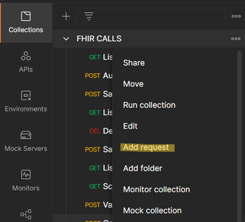
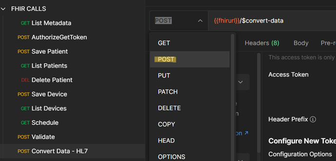
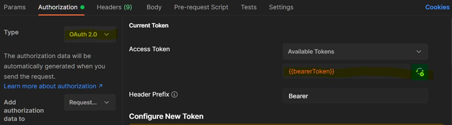
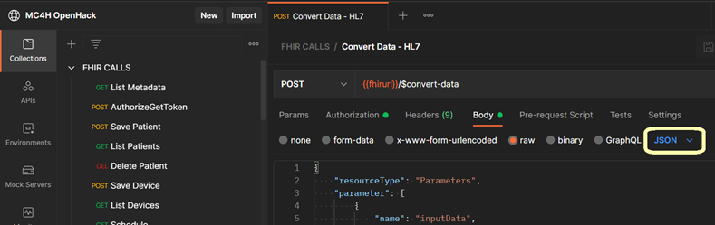

# Module 5 Lesson 4 Lab 8: Convert HL7v2 and C-CDA to FHIR

## Overview

In this lab, you will learn how to use the FHIR service's custom \$convert-data operation to convert HL7v2 messages and C-CDA documents into FHIR.

In today's health industry, the FHIR R4 format has become the standard medium for storage and exchange of health data. As FHIR interoperability spreads throughout the industry, health IT operations are deploying conversion pipelines for ingesting and transforming legacy data formats into FHIR. Two of the most common legacy formats in use are **HL7v2** (see +++https://www.hl7.org/implement/standards/product_brief.cfm?product_id=185+++) and **C-CDA** (see +++https://www.healthit.gov/topic/standards-technology/consolidated-cda-overview+++). In this lab, we will explore how to convert data from these formats into FHIR using the Microsoft health data platform.

## Learning objectives

In this lab, you will:
- Specify API request parameters for converting data into FHIR
- Prepare/clean data for conversion into FHIR
- Make API calls to convert HL7v2 and C-CDA data into FHIR

## Exercise 1: Prepare an API request to convert HL7v2 into FHIR

To convert HL7v2 data into FHIR, first you must prepare a \$convert-data API request.

1. [] Go to **Postman** and create a new API request by selecting **Add request** in the **FHIR CALLS** collection imported in Lab 7.

    

1. [] In the top bar, rename the new request to **Convert Data - HL7**.

1. [] Fill in the URL of the request with **{{fhirurl}}/$convert-data**.

1. [] Change the HTTP operation from **GET** to **POST**.

    

1. [] Go to the **Authorization** tab of the request and make the following changes:
    1. [] For **Type**, choose **OAuth 2.0**.
    1. [] Add **{{bearerToken}}** below the **Available Tokens** menu.
    1. [] Put **Bearer** in the **Header Prefix** field (if it is not already there).

        

1. [] Be sure to save the **Convert Data - HL7** request.

===

## Exercise 2: Set up Request Parameters

1. [] Review the FHIR service documentation at +++https://docs.microsoft.com/en-us/azure/healthcare-apis/fhir/convert-data+++ for an overview of the **\$convert-data** operation.

1. [] To view a sample HL7v2 message, open a new tab and go to **ADT_A01.hl7** at +++https://github.com/microsoft/azure-health-data-services-workshop/blob/main/Challenge-02%20-%20Convert%20HL7v2%20and%20C-CDA%20to%20FHIR/samples/ADT_A01.hl7+++  (You may want to select the **Raw** button on the right for ease of viewing.)

1. [] In the **Body** tab in Postman, select the **raw** button and choose **JSON** from the dropdown menu on the right.

    

1. [] In the **Body**, enter and format the JSON request parameters following the example given in the **\$convert-data** documentation at +++https://docs.microsoft.com/en-us/azure/healthcare-apis/fhir/convert-data#sample-request+++. Use the screenshot below for guidance.

    

1. [] Copy and paste the HL7v2 message into the **inputData valueString**. You will need to make some changes in the HL7v2 payload so that the formatting follows the sample request given in the \$convert-data documentation at +++https://docs.microsoft.com/en-us/azure/healthcare-apis/fhir/convert-data#sample-request+++.

    > [!HINT] Hint: In the sample request in the documentation (URL above), look at how the \\ escape character is used to escape the \\& in the HL7v2 payload. Also pay attention to the way \\n newline characters are used. You will need to add at least one \\ escape character and several \\n newline characters in the HL7v2 message in the Convert Data - HL7 request. Use the online tool at +++https://www.freeformatter.com/json-escape.html+++ for automatically escaping JSON if you would prefer not to do this manually.

    *Optional – prepare the JSON request parameters and HL7v2 payload in VS Code (with the HL7 extension installed) first before pasting into the body of the Postman request.

1. [] Make sure to save the **Convert Data - HL7** request.

===

## Exercise 3: Convert Data

1. [] In Postman, get a new AAD access token using the **POST AuthorizeGetToken** call.

1. [] Go to the **Convert Data - HL7** request and press **Send** to initiate the **\$convert-data** operation.

After making the **\$convert-data** request, you should receive a JSON FHIR **Bundle** response containing the HL7v2 message converted into FHIR R4. The top of the response should be as shown below.

    {

    "resourceType": "Bundle",

    "type": "batch",

    "timestamp": "2021-11-05T13:13:28",

    "identifier": {

    "value": "TST5150"

    },

    "id": "b6356bc1-0175-b82e-a98c-b094a16d4bb9",

    "entry": [

    {

    "fullUrl": "urn:uuid:cf0a2d6b-21e6-48c0-70a9-2b8ae1f57e70",

    "resource": {

    "resourceType": "MessageHeader",

    "id": "cf0a2d6b-21e6-48c0-70a9-2b8ae1f57e70"

    ...

    }

    }

> [!NOTE] Note: If you get an error, check to make sure that **\\** and **\\n** characters have been properly added to the HL7v2 payload.

===

## Exercise 4: Prepare a request to convert C-CDA data into FHIR

Now you will make another API request similar to the one above, except this time you will be converting C-CDA data into FHIR.

1. [] In Postman, select **Add request** again to create another API request in the **FHIR CALLS** collection imported in Lab 7.

    

1. [] Rename the new request to **Convert Data - CCDA**.

1. [] Fill in the URL of the request as before with **{{fhirurl}}/$convert-data**

1. [] Change the HTTP operation from **GET** to **POST**.

1. [] Go to the **Authorization** tab of the request and make the following changes:
    1. [] Switch the **Type** to **OAuth 2.0**.
    1. [] Add **{{bearerToken}}** below **Available Tokens**.

        

1. [] Make sure to save the **Convert Data - CCDA request**.

===

## Exercise 5: Set up Request Parameters

1. [] To view a sample C-CDA data file, open a new tab and navigate to **CCDA_Ford_Elaine.xml** at +++https://github.com/microsoft/azure-health-data-services-workshop/blob/main/Challenge-02%20-%20Convert%20HL7v2%20and%20C-CDA%20to%20FHIR/samples/CCDA_Ford_Elaine.xml+++  

1. [] Select **Raw** on the right side for ease of viewing.

1. [] Copy the XML file and save it in a notepad.

1. [] In the **Body** tab in Postmanfor the **Convert Data - CCDA** request, select the **raw** and choose **JSON** from the dropdown menu on the right.

1. In the **Body**, enter and format the C-CDA request parameters following the example given in the $convert-data documentation at +++https://docs.microsoft.com/en-us/azure/healthcare-apis/fhir/convert-data+++. Be aware that the parameters now need to work for C-CDA data (see the table below).

    | **name**                      | **valueString**                         |
    |-------------------------------|-----------------------------------------|
    | "inputDataType"               | "Ccda"                                  |
    | "templateCollectionReference" | "microsofthealth/ccdatemplates:default" |
    | "rootTemplate"                | "CCD"                                   |

    
    
1. [] Reformat the xml file of the C-CDA payload you saved earlier so that the formatting follows the sample request given in the **$convert-data** documentation at https://docs.microsoft.com/en-us/azure/healthcare-apis/fhir/convert-data. You will need to escape the quotation marks. Use the online tool in the note below or a text editor, whichever is easiest. Note the formatted xml file.

    > [!NOTE] **Note**: The JSON spec requires all keys and values to be surrounded by double quotes. Any double quotes within the JSON data payload must be \\ escaped, however. Look at the " quotation marks in the C-CDA data string. These " quotes all need to be \\ escaped in order for the \$convert-data request to work. The online tool at +++https://www.freeformatter.com/json-escape.html+++ is helpful for adding \\ escape characters to JSON where needed. Alternatively, you could use a text editor and do a "find and replace". Whatever method works best for you is fine.

    *Optional – prepare the C-CDA request parameters and C-CDA payload in VS Code first before pasting into the body of the Postman request.*

1. [] Copy and paste the re-formatted **C-CDA** message into the **inputData valueString**.

1. [] Make sure to save the **Convert Data - CCDA** request.

===

## Exercise 6: Convert Data

1. [] Get a new access token from AAD with **POST AuthorizeGetToken** (this is not strictly necessary unless it has been over 60 minutes since the last access token was issued).

1. [] Go to the **Convert Data - CCDA** request and press **Send**.

After making the \$convert-data request, you should receive a FHIR Bundle response containing the C-CDA data converted into FHIR R4. The top of the response will be as shown below.

    {

    "resourceType": "Bundle",

    "type": "batch",

    "entry": [

    {

    "fullUrl": "urn:uuid:0990ecf3-327d-4194-1aae-00724d4cba22",

    "resource": {

    "resourceType": "Composition",

    "id": "0990ecf3-327d-4194-1aae-00724d4cba22",

    "identifier": {

    "use": "official",

    "value": "2.16.840.1.113883.19.5.99999.1"

    },

    ...}

    ...}

    ...}

> [!NOTE] Note: If you get an error, check that the "" characters are properly escaped in the C-CDA payload.

What does success look like for Lab 8?
-   A FHIR "resourceType": "Bundle" response after calling \$convert-data with an HL7v2 payload
-   A FHIR "resourceType": "Bundle" response after calling \$convert-data with a C-CDA payload
