# Module 5 Lesson 4 Lab 8: Convert HL7v2 and C-CDA to FHIR

## Overview

In this lab, you will learn how to use the FHIR service's custom \$convert-data operation to convert HL7v2 messages and C-CDA documents into FHIR.

In today's health industry, the FHIR R4 format has become the standard medium for storage and exchange of health data. As FHIR interoperability spreads throughout the industry, health IT operations are deploying conversion pipelines for ingesting and transforming legacy data formats into FHIR. Two of the most common legacy formats in use are **HL7v2** (see https://www.hl7.org/implement/standards/product_brief.cfm?product_id=185) and **C-CDA** (see https://www.healthit.gov/topic/standards-technology/consolidated-cda-overview). In this lab, we will explore how to convert data from these formats into FHIR using the Microsoft health data platform.

## Exercise 1: Prepare an API request to convert HL7v2 into FHIR

To convert HL7v2 data into FHIR, first you must prepare a $convert-data API request.

1.  Login to your **Postman workspace**, and then select **Collections** from the left navigation.
 
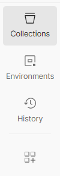

2.	Click on the dropdown on the upper-right corner and select **fhir-service** environment

3.	Click on the ellipses (…) next to **FHIR CALLS** and then select **Add request.**
 

4.	 Update with below details:

   i. In the top bar, rename the new request to **Convert Data - HL7**

   ii. Fill in the URL of the request with **{{fhirurl}}/$convert-data**

   iii. Change the **HTTP operation** from **GET** to **POST**.

   iv. Go to the **Authorization** tab of the request and make the following changes:

   1. For **Type**, choose OAuth 2.0.
   
   2. Add **{{bearerToken}}** below the **Available Tokens** menu.
   
   3. Put **Bearer** in the **Header Prefix** field (if it is not already there). Click **Save**.
 
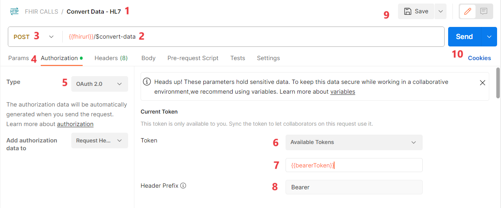

## Exercise 2: Set up Request Parameters

1.	 In the **Body** tab in Postman, select the **raw** button and choose **JSON** from the dropdown menu on the right.
 
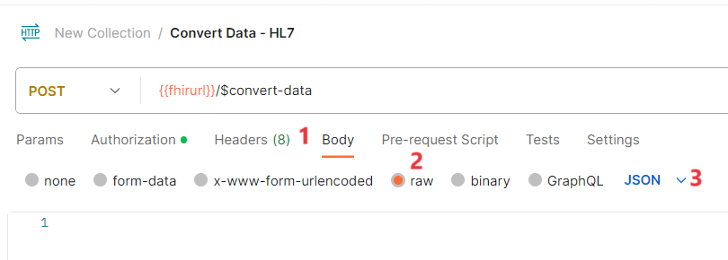

2.	 Copy a sample request given below and paste it in the Body of your **Convert Data – HL7** request.

{
    "resourceType": "Parameters",
    "parameter": [
        {
            "name": "inputData",
            "valueString": "To be replaced in next step"
        },
        {
            "name": "inputDataType",
            "valueString": "Hl7v2"
        },
        {
            "name": "templateCollectionReference",
            "valueString": "microsofthealth/fhirconverter:default"
        },
        {
            "name": "rootTemplate",
            "valueString": "ADT_A01"
        }
    ]
}
 

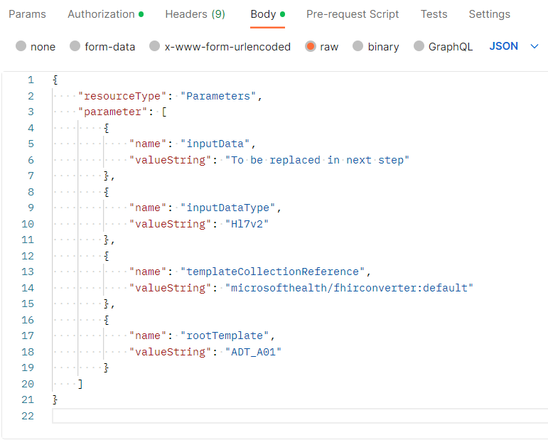

3.	To view a sample HL7v2 message, open a new tab and go to **ADT_A01.hl7** at (https://github.com/microsoft/azure-health-data-services-workshop/blob/main/Challenge-02%20-%20Convert%20HL7v2%20and%20C-CDA%20to%20FHIR/samples/ADT_A01.hl7) 

4.	Click on anywhere on the code and select all (Ctrl +A) 

5.	Next, you will need to format the above HL7v2 message so that the formatting follows the sample request given in the $convert-data documentation at (https://docs.microsoft.com/en-us/azure/healthcare-apis/fhir/convert-data#sample-request).

**Hint** - In the sample request in the documentation (URL above), look at how the \ escape character is used to escape the \& in the HL7v2 payload. Also pay attention to the way \n newline characters are used. You will need to add at least one \ escape character and several \n newline characters in the HL7v2 message in the Convert Data - HL7 request. 

6.	To format the above HL7v2 message, use the online tool at (https://www.freeformatter.com/json-escape.html) for automatically escaping JSON if you would prefer not to do this manually.
 
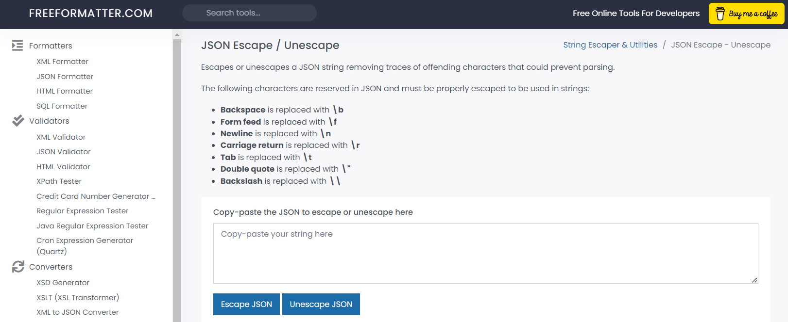

7.	Copy the raw **HL7v2** **message**, paste it on the **FREEFORMATTER** tool and select **Escape JSON.**
 
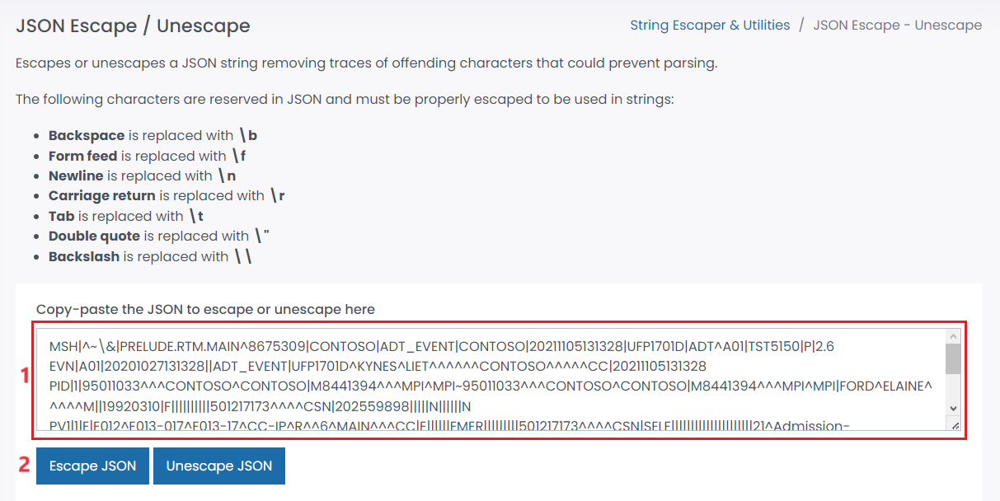

8.	You will get an **Escaped JSON**. Click on **Copy** and then paste it into the **inputData** **valueString** of your **Convert Data - HL7** request.
 
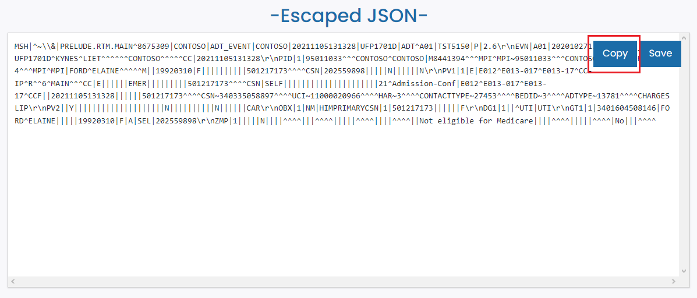

9.	Below is the screenshot where the copied Escaped JSON must be pasted.
 
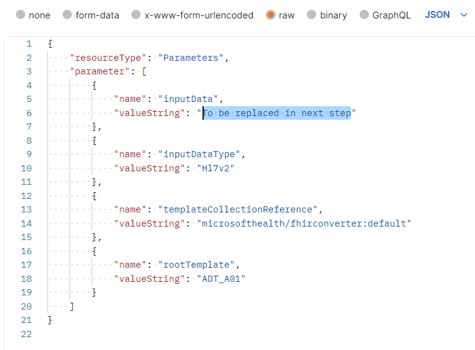

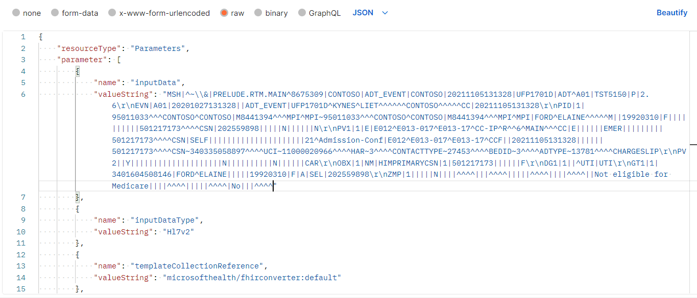

10.	Save the **Convert Data - HL7** request.

## Exercise 3: Convert Data

1.	In Postman, get a new Entra access token using the **POST AuthorizeGetToken** call. From the **FHIR CALLS** collection, Go to **Post AuthorizeGetToken** call.

2.	Go to the **Authorization** tab of the request and make the following changes:

    o	For **Type**, choose **OAuth 2.0.**

    o	Add **{{bearerToken}}** below the **Available Tokens** menu.

    o	Put **Bearer** in the **Header Prefix** field (if it is not already there).

    o	Select **Save**.

3.	Select **Send**. You should receive a response in the **Body** tab like shown below.
 
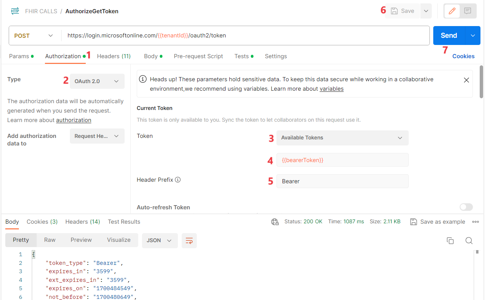

4.	Go to the **Convert Data - HL7** request and press **Send** to initiate the **$convert-data** operation.
 
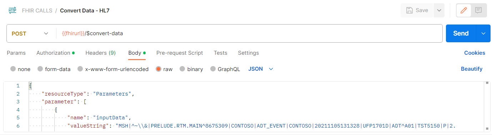

5.	After making the **$convert-data** request, you should receive a JSON FHIR **Bundle** response containing the HL7v2 message converted into FHIR R4. The top of the response should be as shown below.

{
"resourceType": "Bundle",
"type": "batch",
"timestamp": "2021-11-05T13:13:28",
"identifier": {
"value": "TST5150"
},
"id": "b6356bc1-0175-b82e-a98c-b094a16d4bb9",
"entry": [
{
"fullUrl": "urn:uuid:cf0a2d6b-21e6-48c0-70a9-2b8ae1f57e70",
"resource": {
"resourceType": "MessageHeader",
"id": "cf0a2d6b-21e6-48c0-70a9-2b8ae1f57e70"
...
}
}

 

**Note** - If you get an error, check to make sure that \ and \n characters have been properly added to the HL7v2 payload.

## Exercise 4: Prepare a request to convert C-CDA data into FHIR

Now you will make another API request similar to the one above, except this time you will be converting C-CDA data into FHIR.

1.	 In Postman, select **Add request** again to create another API request.

2.	 Rename the new request to **Convert Data - CCDA.**

3.	 Fill in the URL of the request as before with **{{fhirurl}}/$convert-data**. Change the operation from **GET** to **POST**.
 
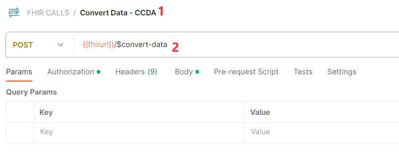

4.	 Go to the Authorization tab of the request and make the following changes:

   i. Switch the **Type** to **OAuth 2.0.**

   ii. Add **{{bearerToken}}** below **Available Tokens.**

   iii. Make sure to save the **Convert Data - CCDA request.**

   iv. Select **Save**.
 
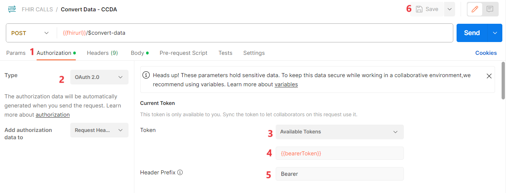

## Exercise 5: Set up Request Parameters

1.	In the **Body** tab of your **Convert Data - CCDA** request, select the **raw** button and choose **JSON** from the dropdown menus.

2.	Copy a sample request given below and paste it in the **Body** of your **Convert Data - CCDA** request.

{
    "resourceType": "Parameters",
    "parameter": [
        {
            "name": "inputData",
            "valueString": "To be replaced in next step"
        },
        {
            "name": "inputDataType",
            "valueString": "Hl7v2"
        },
        {
            "name": "templateCollectionReference",
            "valueString": "microsofthealth/fhirconverter:default"
        },
        {
            "name": "rootTemplate",
            "valueString": "ADT_A01"
        }
    ]
}
 
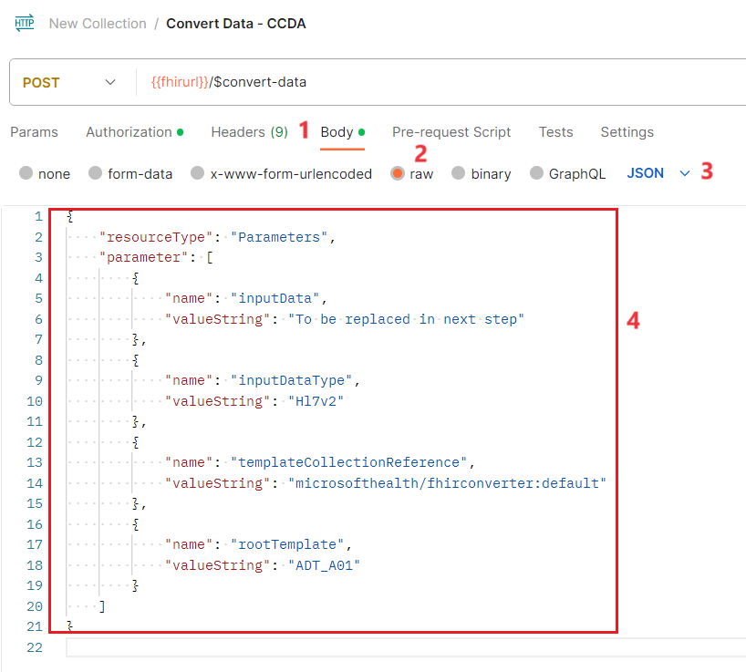

3.	Replace the parameters values in the sample request as per table given below:

"name"	                            "valueString"
"inputDataType"	                    "Ccda"
"templateCollectionReference"	    "microsofthealth/ccdatemplates:default"
"rootTemplate"	                    "CCD"

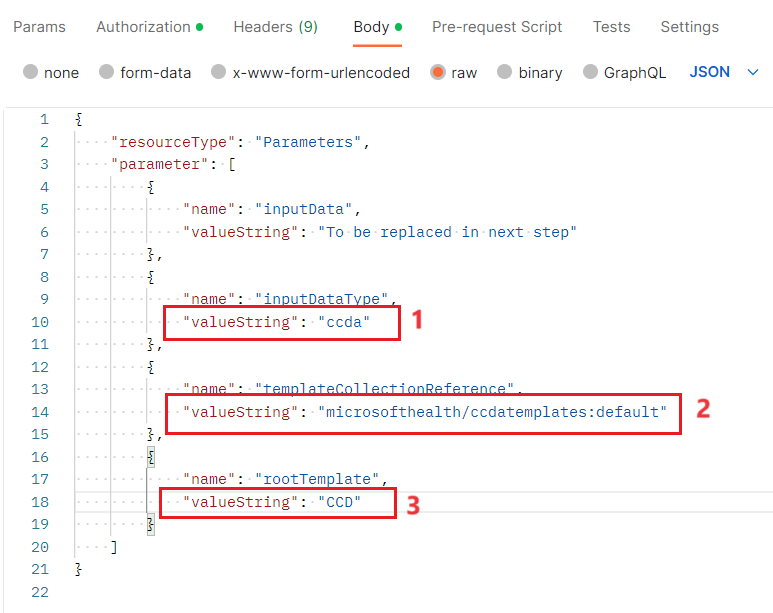
 
4.	To view a sample C-CDA data file, open a new tab and navigate to **CCDA_Ford_Elaine.xml** at (https://github.com/microsoft/azure-health-data-services-workshop/blob/main/Challenge-02%20-%20Convert%20HL7v2%20and%20C-CDA%20to%20FHIR/samples/CCDA_Ford_Elaine.xml)

5.	Click on anywhere in the code and Select all (Ctrl+A). Paste it in the notepad.

6.	You will need to format the C-CDA data payload so that it sits correctly in the JSON request body.

**Hint** - The JSON spec requires all keys and values to be surrounded by double quotes. Any double quotes within the JSON data payload must be \ escaped, however. Look at the " quotation marks in the C-CDA data string. These " quotes all need to be \ escaped in order for the $convert-data request to work.

7.	To format the above C-CDA message, use the online tool at (https://www.freeformatter.com/json-escape.html) for automatically escaping JSON if you would prefer not to do this manually.

8.	Copy the raw **C-CDA message**, paste it on the **FREEFORMATTER** tool and select **Escape JSON.**
 
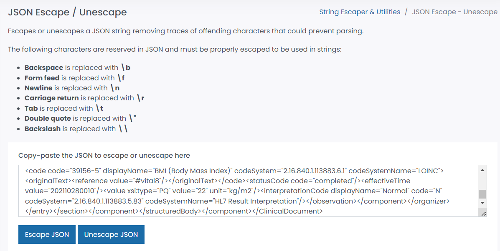

9.	You will get an **Escaped JSON**. **Copy** it and then paste it into the **inputData valueString** of your **Convert Data - CCDA** request.
 

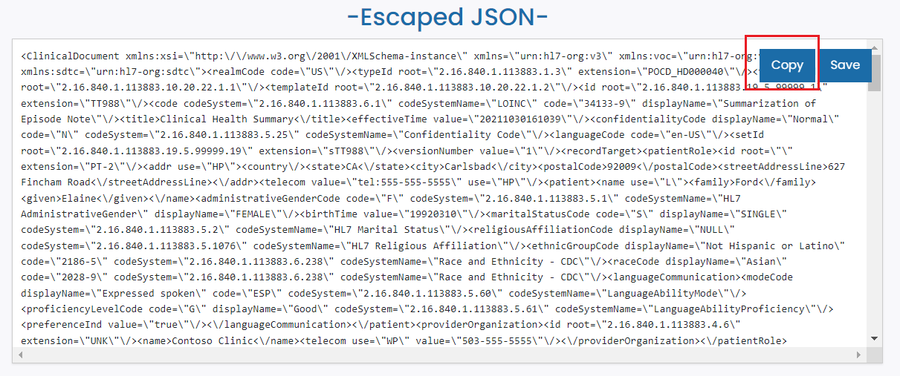

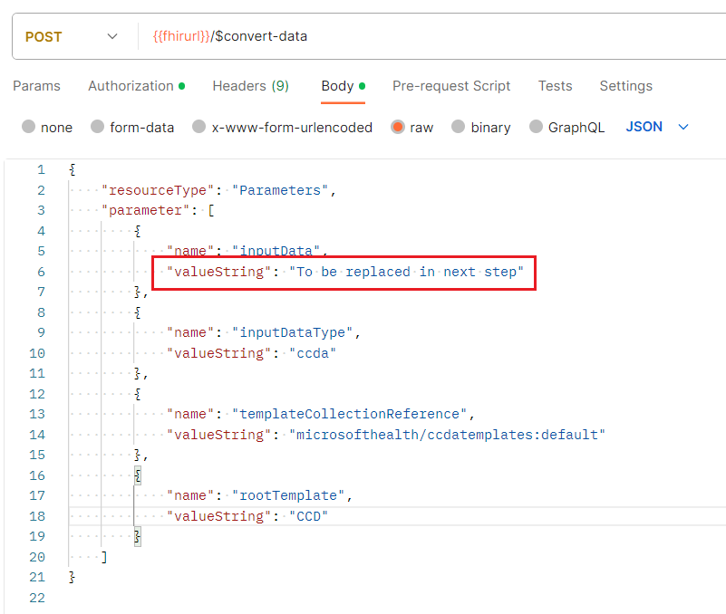

10.	Save the Convert Data - CCDA request.
 
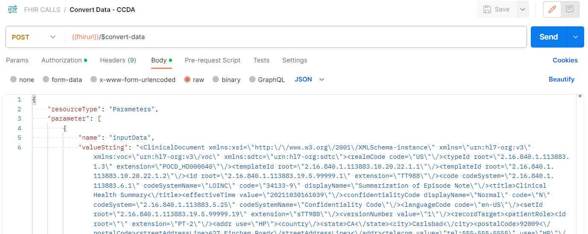

## Exercise 6: Convert Data

1.	Get a new access token from **POST AuthorizeGetToken** request (this is not strictly necessary unless it has been over 60 minutes since the last access token was issued).

2.	 Go to the **Convert Data - CCDA** request and press **Send**. After making the $convert-data request, you should receive a FHIR Bundle response containing the C-CDA data converted into FHIR R4. The top of the response will be as shown below.

{
"resourceType": "Bundle",
"type": "batch",
"entry": [
{
"fullUrl": "urn:uuid:0990ecf3-327d-4194-1aae-00724d4cba22",
"resource": {
"resourceType": "Composition",
"id": "0990ecf3-327d-4194-1aae-00724d4cba22",
"identifier": {
"use": "official",
"value": "2.16.840.1.113883.19.5.99999.1"
},
...}
...}
...}
 
**Note**: If you get an error, check that the "" characters are properly escaped in the C-CDA payload.
 
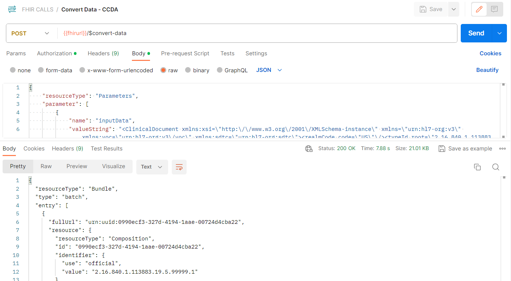

