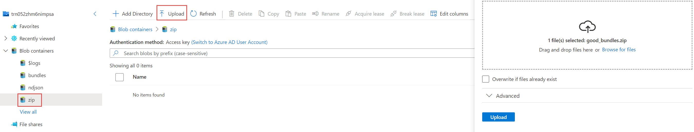
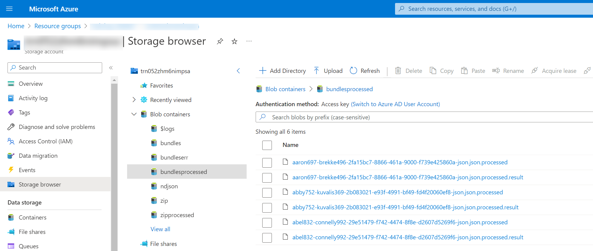
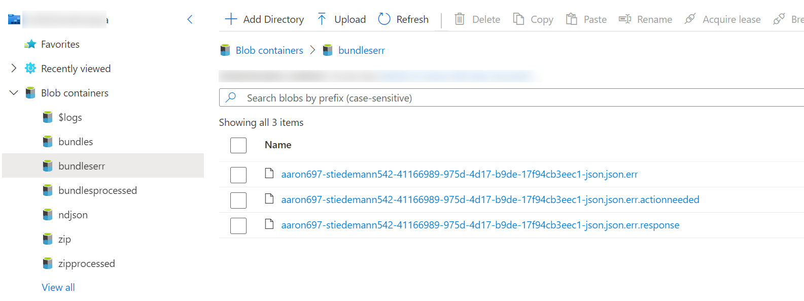
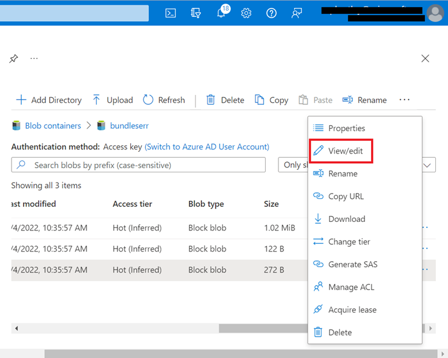
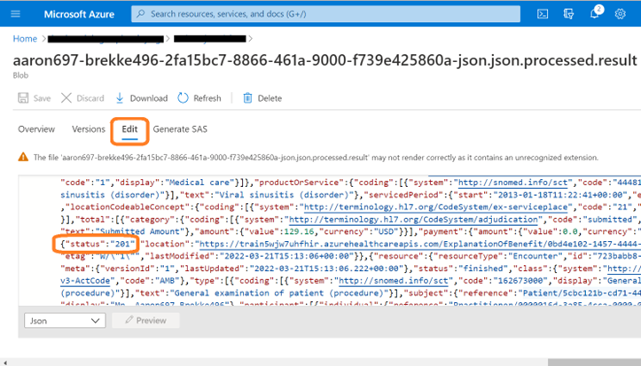

# Module 5 Lesson 4 Lab 9: Ingest to FHIR

## Overview

In this lab, you will learn how to use the FHIR Loader utility to ingest FHIR data into the FHIR service.

Data ingestion into FHIR is a vital capability for a healthcare organization's integration with multiple health data systems. While the FHIR service does features a custom $import operation for data ingestion, it is only recommended for the initial transfer of data into the FHIR service (data loading at high speeds). Alternate approaches can be used for the ongoing, transactional loading of FHIR data. In this challenge, we will be using Microsoft's FHIR Loader (OSS) utility, which is an Azure Function App built for importing data into the FHIR service.

For this lab, you will upload FHIR data bundles for import into the FHIR service. You will need to examine error logs and determine what is preventing the data in one of the bundles from being ingested.

Below is a component view of FHIR Loader connected to the FHIR service endpoint.

## Learning objectives

In this lab, you will:
-	Ingest FHIR data into FHIR service with FHIR Loader
-	Identify issues in loading FHIR bundles
-	Recognize data constraints with FHIR Loader
-	Track and compare FHIR Loader operations

## Exercise 1: Download Sample Data

1. [] Start by downloading these two .zip files to your desktop (when you select the links, you will see a download button on the right).

-   [good_bundles.zip](https://github.com/microsoft/azure-health-data-services-workshop/blob/main/Challenge-03%20-%20Ingest%20to%20FHIR/samples/good_bundles.zip)
-   [bad_bundles.zip](https://github.com/microsoft/azure-health-data-services-workshop/blob/main/Challenge-03%20-%20Ingest%20to%20FHIR/samples/bad_bundles.zip)

===

## Exercise 2: Use FHIR Loader to upload data

Visit the FHIR Loader (OSS) repository [here](https://github.com/microsoft/fhir-loader) and read the documentation for more info on the operating principles of the application.

1. [] In Azure Portal, navigate to the Blob Storage account that was created for FHIR Loader in Lab-01. Go to **Portal -\> Resource Group -\> Storage account** (the name of the Storage account will end in **"impsa"**).

    

1. [] In the **Storage account**, click the **Storage browser (preview)** blade and then click **Blob containers**.

    

1. [] Select the **zip** container and upload the **good_bundles.zip** file downloaded in Exercise 1 of this lab.

    

    -   Once you select **Upload**, the FHIR Loader will automatically import the data from the .zip file into the FHIR service database.

1. [] Now, when you do a refresh and select **bundlesprocessed**, you should see six files as shown below.

    > [!NOTE] Note: If you upload a .zip file, the names of the bundles within the .zip archive are exposed (not the .zip filename itself).*

    

===

## Exercise 3: Debug issues with importing FHIR data

1. [] Now try importing the **bad_bundles.zip** file that you downloaded in Exercise 1 of this lab. Upload the file to the same container where you uploaded the good_bundles.zip file.

1. [] What happens as a result? Go ahead and unzip the bad_bundles.zip archive. Open and inspect the JSON bundle in a text editor (e.g., VS Code). You can compare this "bad" JSON bundle with the "good" JSON bundles contained in the good_bundles.zip archive.

Refer to the **Troubleshooting** section below or the FHIR Loader [testing](https://github.com/microsoft/fhir-loader/blob/main/docs/testing.md) documentation for information on tracking issues in FHIR data ingestion.

===

## Exercise 4: BONUS - Troubleshooting

Here are some points for inspecting FHIR Loader operations:

1. [] In **Storage browser (preview)**, go to **Container** -\> **bundleserr** to view info about errors in importing FHIR bundles.

    

1. [] Find the **.response** file and select the three dots (···) located on the right end of the file. Then select **View/edit**.

    

    -   What is the reason given for the error?

1. [] In comparison, you can go to **bundlesprocessed** and look in the .result files for ingest operations that succeeded. For example, in the image below there is a 201 status code, meaning success. The response shows an endpoint for a FHIR Resource ExplanationOfBenefit/\<resourceId\>, indicating that this Resource (ExplanationOfBenefit/\<resourceId\>) has been successfully persisted in FHIR service from the ingest operation.

    

What does success look like for Lab-09?

-   Successfully upload and import data from the file good_bundles.zip.
-   Successfully identify the problem in the bad_bundles.zip file. Use the Troubleshooting tips above for help.

