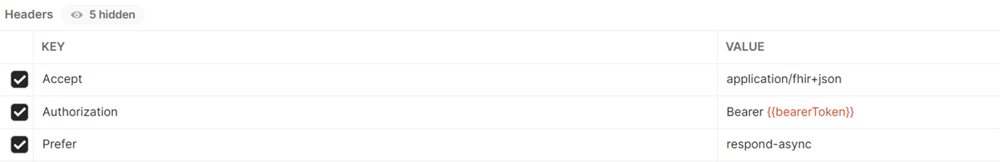

# Module 5 Lesson 4 Lab 11: Export and Anonymize Data

## Overview

In this lab, you will learn how to export de-identified data from the FHIR service.

Healthcare organizations frequently conduct research studies with patient medical records as the main source of data. This type of study where patient health records are used for non-treatment purposes is referred to as "secondary use" research. In the U.S., access to patients' Personal Health Information (PHI) for secondary use is strictly controlled by two federal regulations: **The Revised Common Rule** (at +++https://www.hhs.gov/ohrp/regulations-and-policy/regulations/finalized-revisions-common-rule/index.html+++) and the **Health Insurance Portability and Accountability Act (HIPAA)** (at +++https://www.cdc.gov/phlp/publications/topic/hipaa.html#:~:text=The%20Health%20Insurance%20Portability%20and,the%20patient's%20consent%20or%20knowledge+++). In the latter case, researchers are not allowed to access patients' PHI unless the information has been de-identified following HIPAA guidelines. De-identification (or anonymization) of PHI involves removing details from patients' medical data that could reveal patients' identities. HIPAA specifies two methods of de- identification: the **HIPAA Safe Harbor Method** (at +++https://www.hhs.gov/hipaa/for-professionals/privacy/special-topics/de-identification/index.html#safeharborguidance+++) and the **HIPAA Expert Determination Method** (at +++https://www.hhs.gov/hipaa/for-professionals/privacy/special-topics/de-identification/index.html#guidancedetermination+++). In this lab, we will get practice using the Azure health data platform to de-identify and export FHIR data according to a set of data redaction/transformation rules.

In this lab, you will be using the \$export command in the FHIR service to export de-identified FHIR data into an ADLS Gen2 blob storage container. The \$export operation in FHIR service is an implementation of the bulk export function detailed in the **FHIR Bulk Data Access specification** located at +++https://hl7.org/fhir/uv/bulkdata/export/index.html+++. To familiarize yourself with the FHIR service \$export operation, please read the **How to export FHIR data** article located at +++https://docs.microsoft.com/en-us/azure/healthcare-apis/fhir/export-data+++ and return here when finished.

## Learning objectives

In this lab, you will:

-   Configure bulk export of FHIR data from the FHIR service
-   Use a sample anonymization config file to de-identify FHIR data on export
-   Export anonymized data to an Azure Data Lake Storage Gen2 (see +++https://docs.microsoft.com/azure/storage/blobs/data-lake-storage-introduction+++)
    account
-   Securely share anonymized data with a group not affiliated with your
    organization

## Exercise 1: Review sample anonymization configuration and customize as needed

1. [] Review the sample configuration file, provided by Microsoft, [here](https://docs.microsoft.com/en-us/azure/healthcare-apis/fhir/de-identified-export#configuration-file). It demonstrates how de-identification works between the FHIR service and an ADLS Gen2 account. In real-world use, you would need to review the HIPAA guidelines and customize the configuration file with additional anonymization rules (e.g., rules for redacting/transforming patient names).

More information on HIPAA de-identification rules can be found [here](https://www.hhs.gov/hipaa/for-professionals/privacy/special-topics/de-identification/index.html).

===

## Exercise 2: Configure storage account for export

1. [] When you deployed Azure components in Lab 7, a managed identity (see +++https://docs.microsoft.com/en-us/azure/active-directory/managed-identities-azure-resources/overview+++) was automatically enabled for your FHIR service. That managed identity is what needs to be assigned the Storage Blob Data Contributor role in one of the ADLS Gen2 storage accounts in your resource group. The name of this storage account ends with "expsa". Follow the instructions in the **Configure export settings and set up a storage account** article at +++https://docs.microsoft.com/en-us/azure/healthcare-apis/fhir/configure-export-data+++ for configuring your **expsa** storage account for the \$export operation. Return when you reach **Securing the FHIR service $export operation**. Read the note below about the FHIR service managed identity.

> [!ALERT] Note: Keep in mind that you are configuring the storage account in this step (and not the FHIR service!). In the storage account, be careful not to add a role assignment to a service client or a service principal by mistake!

1. [] Follow the instructions in the **Exporting de-identified data** article located at +++https://docs.microsoft.com/en-us/azure/healthcare-apis/fhir/de-identified-export+++ for creating your anonymizationConfig.json file and placing it inside the anonymization container within your **expsa** storage account. Return when you reach **Manage Configuration File in ACR**.

    > [!HINT] Copy the sample configuration file and save it as a JSON file to the VM. Then in your storage account, select **Containers > anonymization > Upload** and upload the file. Keep track of the name of the container and the file as they will be used in the API call.

Review [How to export FHIR data](https://docs.microsoft.com/en-us/azure/healthcare-apis/fhir/export-data) for more information.

===

## Exercise 3: Export anonymized data

Now you will go to the FHIR CALLS collection in Postman and prepare a new \$export request to de-identify and export FHIR data. This API call will cause the FHIR service to create a new folder inside the anonymization container in the "expsa" storage account and export all Resources to the new folder. The PHI in the Resources will be de-identified following the rules defined in the anonymizationConfig.json file.

You can create a new request in Postman by clicking on the existing GET List Patients request and selecting Duplicate from the View more actions menu. Select Rename and name the new request GET Export Anonymized FHIR Data (the GET should already be present on the left).

The general form of the request string will be:

GET {{fhirurl}}/\$export?_container={{containerName}}&_anonymizationConfig={{configFilename}}

1. [] From the portal, note the name of the anonymization container and the file name of the configuration file.

1. [] In Postman, select your **fhir-service** environment and add the **containerName** and **configFilename** parameters and select **Save**.

1. [] Go to the **Authorization** tab for the **GET Export Anonymized FHIR Data** request and make sure that **Inherit auth from parent** is selected.

1. [] Under the **Headers** tab for the **GET Export Anonymized FHIR Data** request in **Postman**, add/modify the three headers as shown below. A screenshot of the Headers tab in Postman is provided for reference.
    1. [] **Accept**: application/fhir+json
    1. [] **Authorization**: Bearer {{bearerToken}}
    1. [] **Prefer**: respond-async

    

1. [] Be sure to save your **GET Export Anonymized FHIR Data** request.

1. [] Refresh your access token if necessary (use POST AuthorizeGetToken).

1. [] Once everything is set up and ready to go, with the **\$export** request selected, press **Send** in Postman to initiate the request.

    The \$export operation uses the **FHIR Asynchronous Request Pattern** (see +++https://hl7.org/fhir/R4/async.html+++). Detailed information on headers for bulk export operations in FHIR can be found at +++https://hl7.org/Fhir/uv/bulkdata/export/index.html#headers+++.

1. [] You should receive a 202 Accepted response.

1. [] Now if you go to your **expsa** storage account, there should be a new folder within the **anonymization** container. Go to this folder to access the de-identified FHIR data that you just exported. 

1. [] Inside the folder, each row will have three dots on the right side. Select these three dots and select **View/Edit**. You will notice that information has been removed/redacted from the FHIR records per the anonymization rules defined in the anonymizationConfig.json file.

===

## Exercise 4: Securely transfer the files to the research team

Researchers from outside organizations cannot have direct access to healthcare or payer organizations' Azure tenants. You will need to find a way to securely transfer the anonymized data to these external groups.

1. [] Review the **Create SAS Tokens** article at +++https://docs.microsoft.com/en-us/azure/cognitive-services/translator/document-translation/create-sas-tokens?tabs=Containers+++ for setting up a Shared Access Signature (SAS) token. 

1. Then, generate a SAS token to allow a research team to access the anonymized data that you exported.

> [!NOTE] Note: Pay special attention to the "Permissions" section of the above documentation. Reading files and listing files in a container are two different permissions.

What does success look like for Lab-11?

-   Successfully use an anonymization configuration file and the \$export operation to export anonymized data from the FHIR service.
-   Successfully set up a SAS token to allow access to the anonymized data.

