# Module 5 Lesson 4 Lab 12: FHIR service consent capabilities

## Overview

In this lab, you will use FHIR-Proxy (OSS) (see +++https://github.com/microsoft/fhir-proxy+++) to block access to data stored in the FHIR service (see +++https://docs.microsoft.com/en-us/azure/healthcare-apis/fhir/overview+++).

The wide adoption of FHIR R4 (see +++https://hl7.org/FHIR/+++) has given patients a new measure of control over their health data. With a patient's data stored in FHIR, mechanisms are available to block certain providers and/or organizations from accessing the data if the patient elects to withhold records. One way these data restrictions are managed in FHIR is through the Consent Resource (see +++https://build.fhir.org/consent.html+++). In this lab, we will be exploring capabilities in the Azure health data platform that make it possible for patients to opt out of sharing their FHIR records with certain parties.

In this lab, you will be activating the Consent Opt-Out filter (see +++https://github.com/microsoft/fhir-proxy/blob/main/docs/configuration.md#consent-opt-out-filter+++) in FHIR-Proxy (OSS). You will be modifying authorization settings to block a specific practitioner from accessing a patient's FHIR records in the FHIR service. For configuring and testing the Consent Opt-Out filter, you will be setting up Postman to call the FHIR-Proxy endpoint.

**HIR-Proxy and FHIR service overview**

In the Azure health data platform, FHIR-Proxy (OSS) acts as a gateway for API calls to the FHIR service. FHIR-Proxy enables pre-processing of API requests and post-processing of responses, selectively filtering data on the way into and out of the FHIR service. As an example, you can set up FHIR-Proxy to intercept FHIR API calls and trigger custom workflows based on detected FHIR requests. FHIR-Proxy also brings enhanced Role Based Access Control (RBAC) to the FHIR service, enabling fine-grained Azure AD authorization for REST API actions at the Resource level. This also provides a means of Role-Based Consent so that users (e.g. patients) can authorize or deny access to certain FHIR data.

Component View of FHIR-Proxy and FHIR service with Postman set up to call the FHIR-Proxy endpoint.

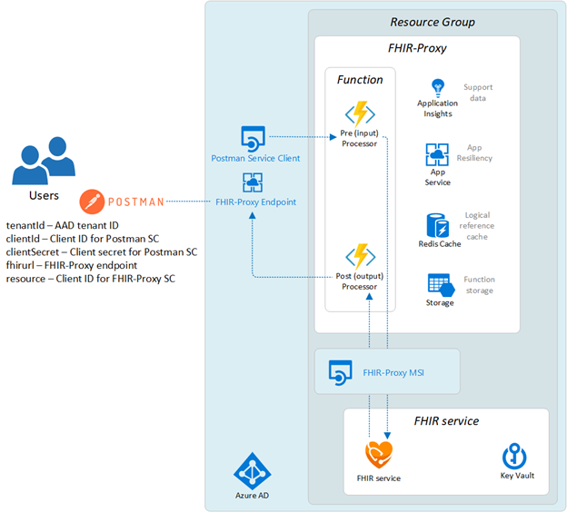

FHIR-Proxy asserts control over FHIR data interactions only if its pre- and/or post-processing modules (see +++https://github.com/microsoft/fhir-proxy/blob/main/docs/configuration.md#date-sort-post-processor+++) have been enabled and configured. Otherwise, with no special configuration, API calls made to the FHIR-Proxy endpoint go straight through to the FHIR service, and responses are sent back unfiltered to the remote client app (such as Postman in our case).

In Lab 07, you enabled the Consent Opt-Out filter when you deployed FHIR-Proxy. Now you'll need to do some configuration for the filter to take effect.

## Learning objectives

In this lab, you will:

-   Configure FHIR-Proxy authentication for connecting to the FHIR service
-   Configure Postman to connect with the FHIR service via FHIR-Proxy
-   Add a Consent Resource to the FHIR service
-   Configure Consent Opt-Out filtering in FHIR-Proxy
-   Verify that Consent Opt-Out filtering performs as expected


## Exercise 1: Configure FHIR-Proxy authentication settings

Before setting up FHIR-Proxy for Consent Opt-Out filtering, you must first configure FHIR-Proxy authentication so that FHIR-Proxy can securely connect with the FHIR service.

### Task 1: Complete FHIR-Proxy authentication

1. [] In the Azure Portal, navigate to your resource group and select it.

1. [] In the **Resources** list, find the resource ending in **pxyfa** and select it.

    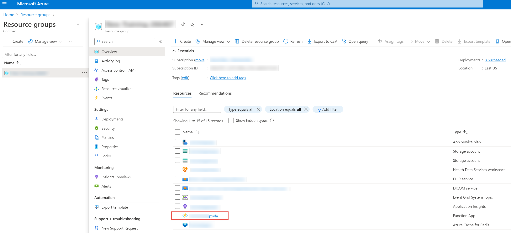
    
1. [] In the resource menu, under **Settings**, select **Authentication**.

1. [] Select **Add identity provider**.

1. [] On the **Add an identity provider** page, select the **Identity provider** menu and then select **Microsoft**.

1. [] Under **App Service authentication settings > Restrict Access**, select **Allow unauthenticated access**.

1. [] Select **Next: Permissions**.

    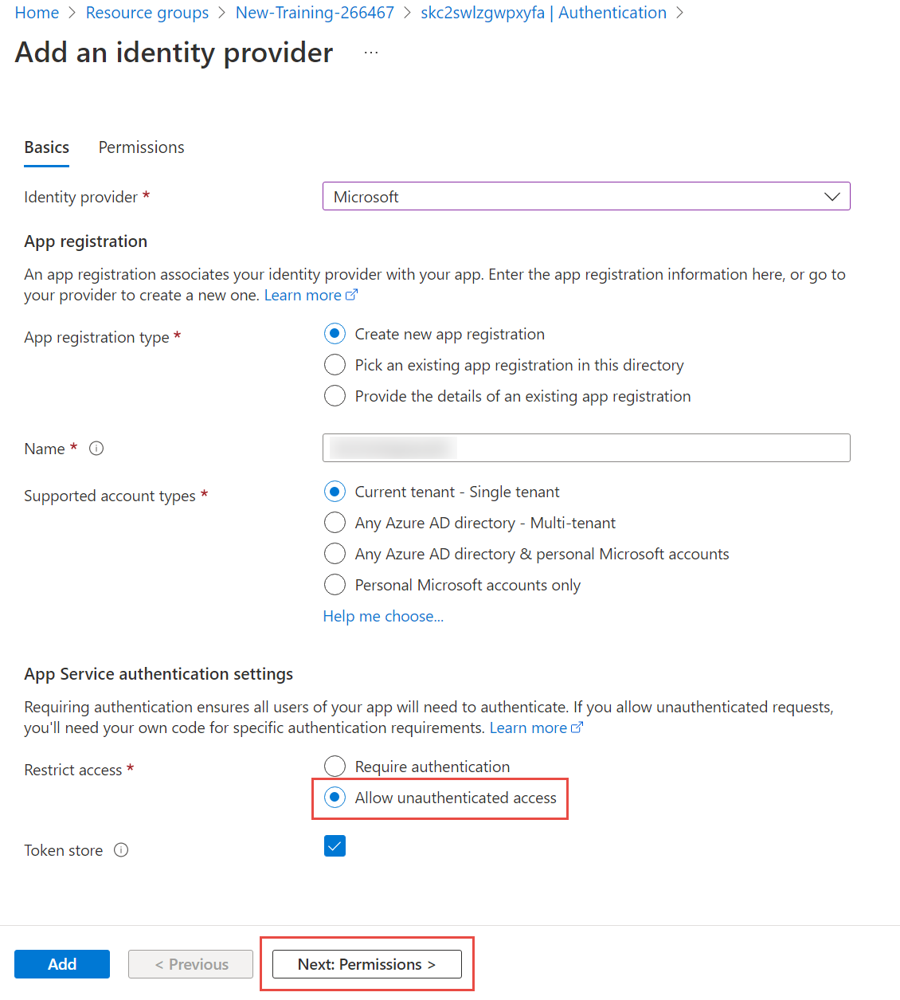

1. On the menu, select **+ Add permission**.

1. In the **Request API permissions** pane, scroll down and expand **User**.

1. Select **User.Read** and then select **Update permissions**.

1. [] Select **Add**.

### Task 2: Configure App Roles

1. [] In the **Authentication** pane, under **Identity provider**, select **Microsoft ([fhirproxyname])**.

1. [] In the resource menu, under **Manage**, select **Manifest**.

    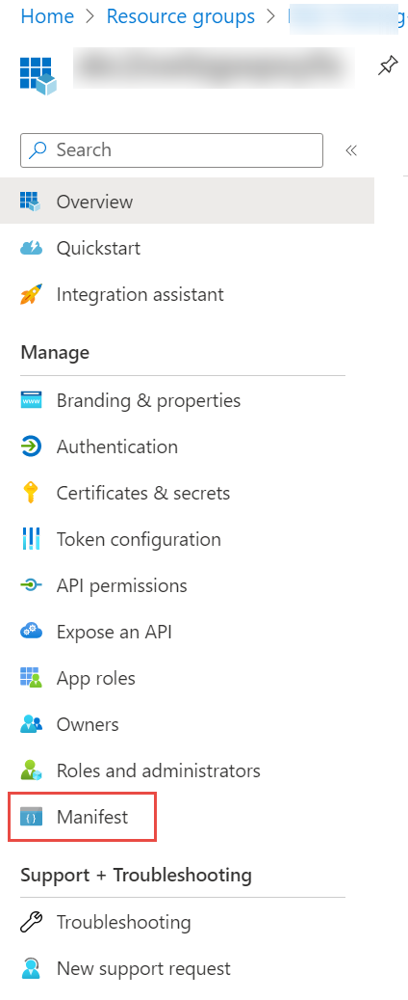
    
1. [] In the Manifest JSON file, locate the **appRoles** element.

    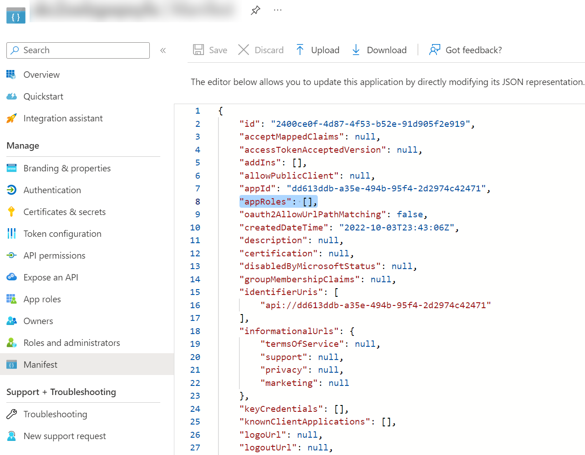

1. [] Press **enter** between the square brackets **[]** to create a new row and enter the following member types:

json
```
{
    "allowedMemberTypes": [
        "User",
        "Application"
    ],
    "description": "Writer of the FHIR Server",
    "displayName": "Resource Writer",
    "id": "2d1c681b-71e0-4f12-9040-d0f42884be86",
    "isEnabled": true,
    "lang": null,
    "origin": "Application",
    "value": "Writer"
},
{
    "allowedMemberTypes": [
        "User",
        "Application"
    ],
    "description": "Reader of the FHIR Server",
    "displayName": "Resource Reader",
    "id": "24c50db1-1e11-4273-b6a0-b697f734bcb4",
    "isEnabled": true,
    "lang": null,
    "origin": "Application",
    "value": "Reader"
},
{
    "allowedMemberTypes": [
        "User",
        "Application"
    ],
    "description": "DataScientist Role with de-id access to all resources",
    "displayName": "DataScientist",
    "id": "b90c2f1a-6a2c-4d1e-9ee6-d97cd5632307",
    "isEnabled": true,
    "lang": null,
    "origin": "Application",
    "value": "DataScientist"
},
{
    "allowedMemberTypes": [
        "User",
        "Application"
    ],
    "description": "RelatedPerson Access to FHIR Resources",
    "displayName": "RelatedPerson",
    "id": "75f86d84-27b6-4740-bd3d-4ec763c36144",
    "isEnabled": true,
    "lang": null,
    "origin": "Application",
    "value": "RelatedPerson"
},
{
    "allowedMemberTypes": [
        "User",
        "Application"
    ],
    "description": "Patient Access to FHIR resources",
    "displayName": "Patient",
    "id": "94b4402c-ea4a-43ac-a8f2-85a482e303a9",
    "isEnabled": true,
    "lang": null,
    "origin": "Application",
    "value": "Patient"
},
{
    "allowedMemberTypes": [
        "User",
        "Application"
    ],
    "description": "Practitioner Access to FHIR resources",
    "displayName": "Practitioner",
    "id": "8796299c-9039-4eb0-a93d-6eda41763238",
    "isEnabled": true,
    "lang": null,
    "origin": "Application",
    "value": "Practitioner"
},
{
    "allowedMemberTypes": [
        "User",
        "Application"
    ],
    "description": "Administrator of the FHIR Server",
    "displayName": "Administrator",
    "id": "ef3fd1c8-82cc-4619-a484-2cbcf97eefc1",
    "isEnabled": true,
    "lang": null,
    "origin": "Application",
    "value": "Administrator"
}
```
  
1. [] On the menu, select **Save**.

    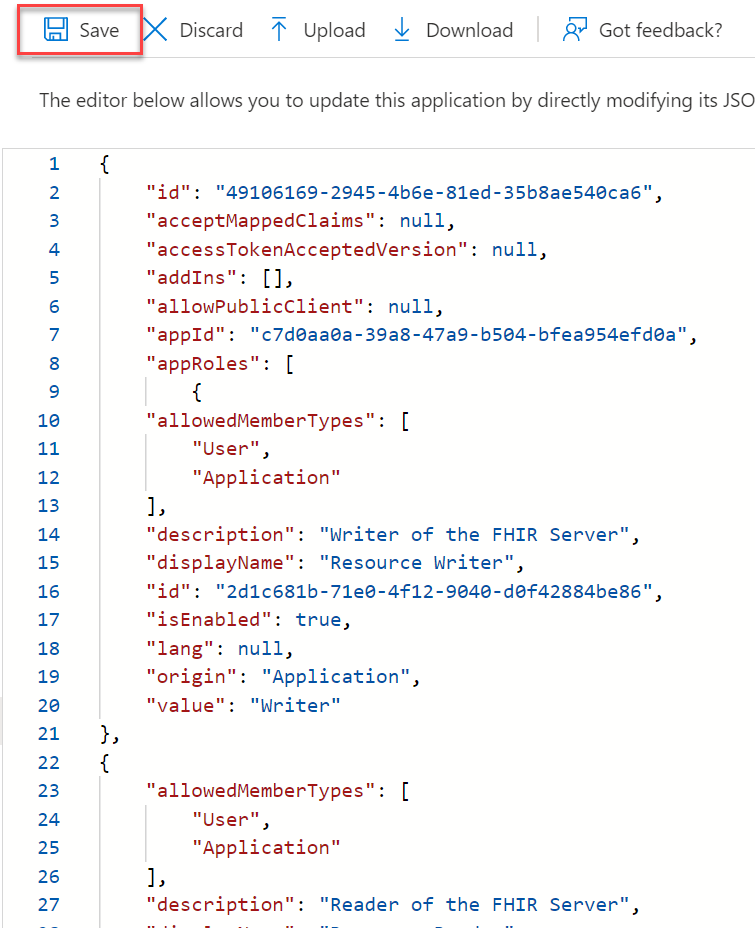

### Task 3: Configure API permissions

1. [] In the resource menu, under **Manage**, select **API permissions**.

1. [] Under **Configured permissions**, select **+ Add a permission**.

1. [] In the **Request API permissions** pane, select the **APIs my organization uses** tab.

1. [] In the search box, enter +++Azure Healthcare APIs+++.

1. [] In the results, select **Azure Healthcare APIs**

    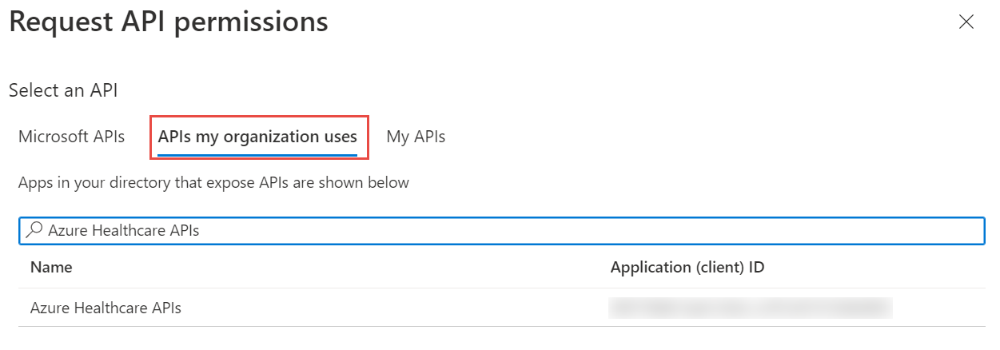

1. [] Ensure **Delegated permissions** is selected and select the **user_impersonation** checkbox. Then select **Add permissions**.

    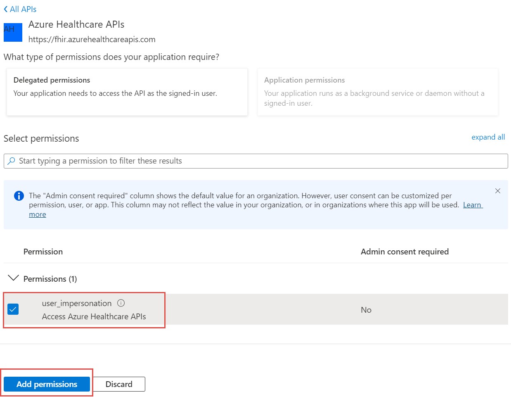

1. Under **Configured permissions**, select **Grant admin consent for Contoso**.

1. [] In the **Grant admin consent confirmation** dialog box, select **Yes**.

1. [] Verify the Status has been updated.

    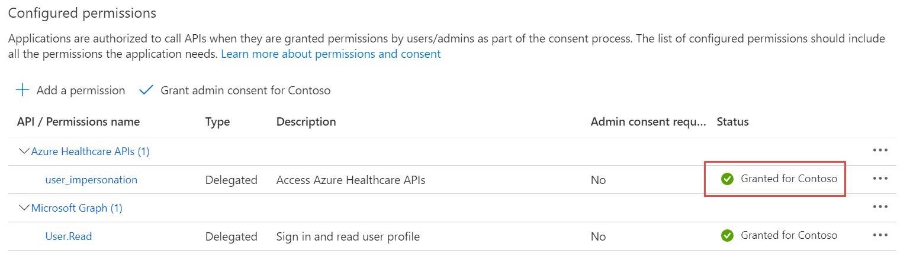

1. [] In the resource menu, under **Manage**, select **App roles**.

1. [] Review the App roles that have been created.

    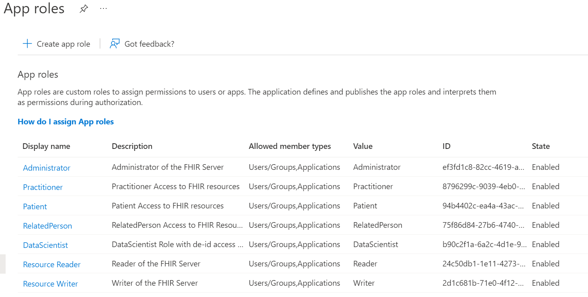

===

## Exercise 2: Configure Postman to connect with the FHIR-Proxy endpoint

In the next part of this lab, you will be setting up a new environment in Postman so that API calls go to the FHIR-Proxy endpoint rather than directly to the FHIR service endpoint.

1. [] In Microsoft Azure in **Azure Active Directory**, navigate to your **Postman** service client app (go to **Azure Portal -> AAD -> App registrations -> Postman**).

    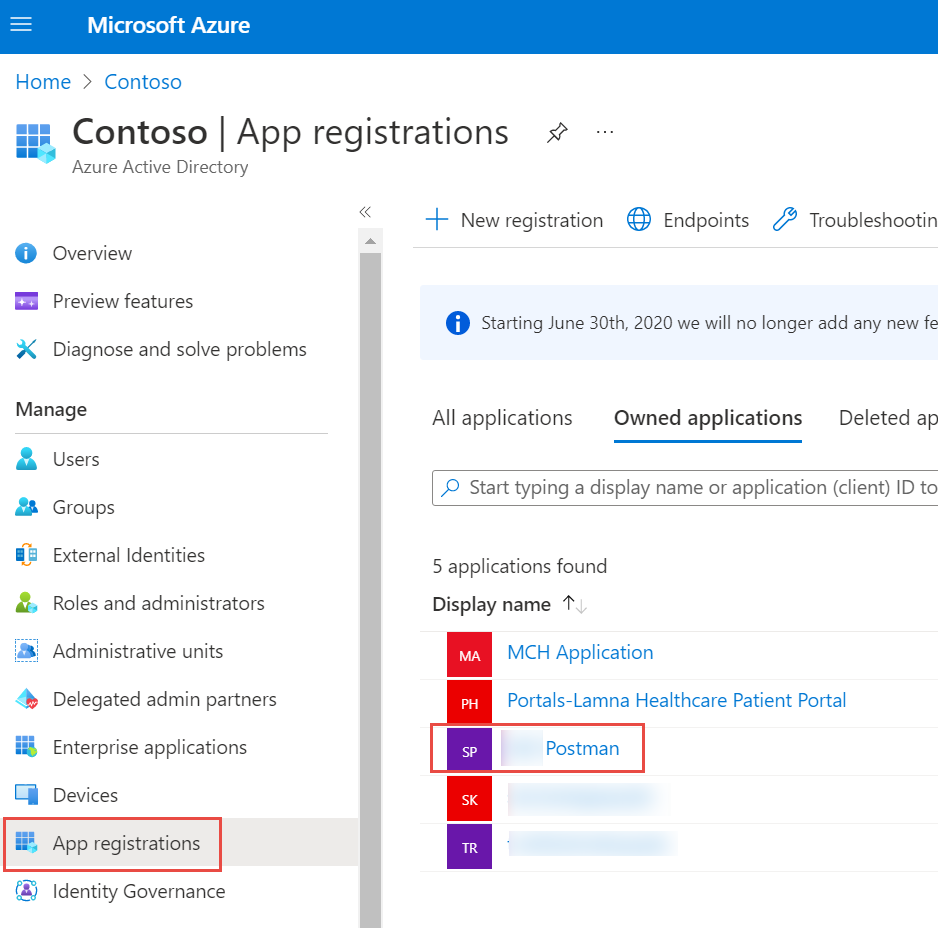

1. [] On the resource menu, under **Manage**, select **API permissions** and select **+ Add a permission**.

1. [] Select the **My APIs** tab and you will see a list containing the FHIR-Proxy instance that you deployed and registered earlier. Select the **FHIR-Proxy** app name.

1. [] Under **What type of permissions does your application require**, select **Delegated permissions**.

1. [] Select the **user_impersonation** checkbox and then select **Add permissions**.

    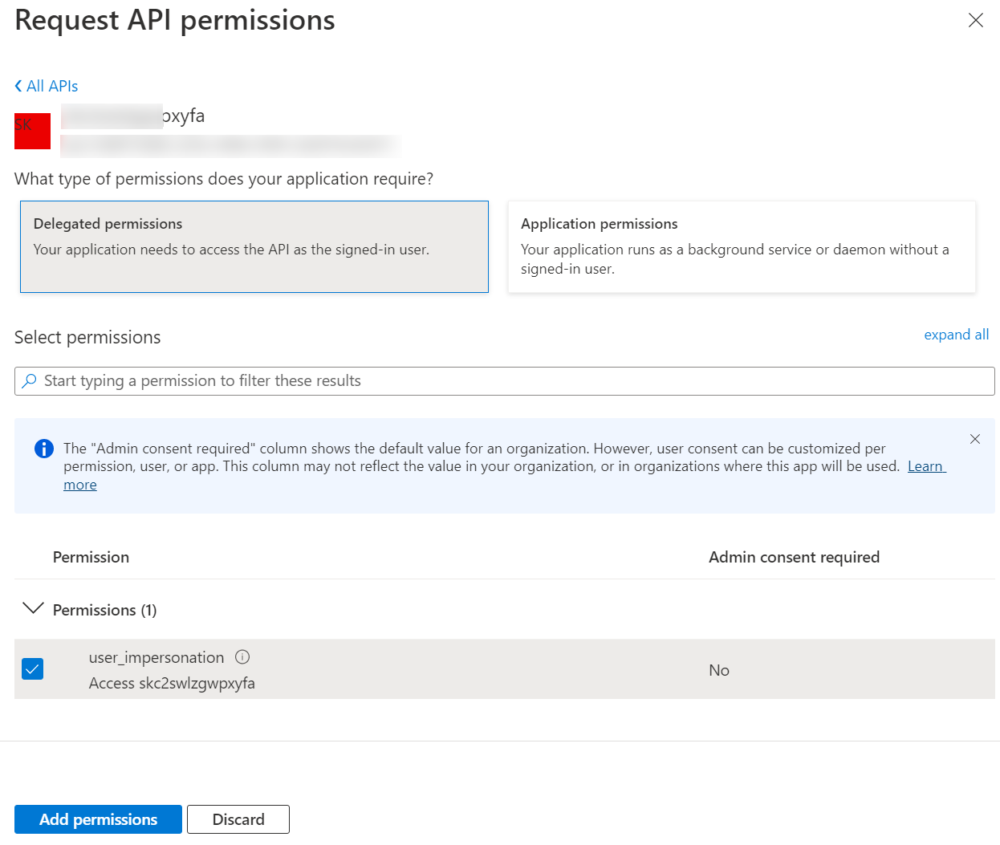

1. [] On the menu, select **+ Add a permission**.

1. [] In the **Request API permissions** pane, select the **My APIs** tab.

1. [] Select the **FHIR-Proxy** app name.

1. [] Select **Application permissions**.

1. [] Select the **Resource Reader** and **Resource Writer** checkboxes and then select **Add permissions**.

    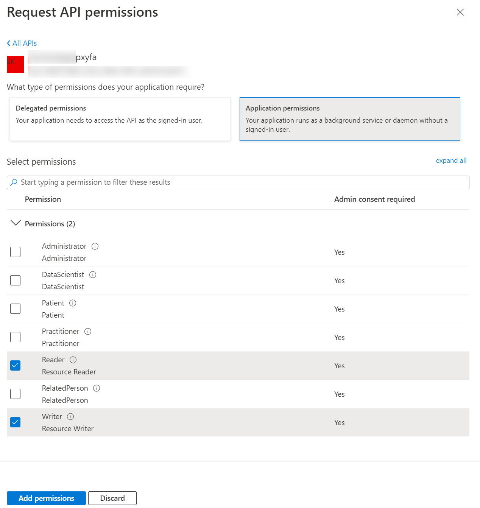

1. [] Under **Configured permissions**, select **+ Add a permission**.

1. [] In the **Request API permissions** pane, select the **APIs my organization uses** tab.

1. [] In the search box, enter +++Azure Healthcare APIs+++.

1. [] In the results, select **Azure Healthcare APIs**.

1. [] Select the **user_impersonation** checkbox and then select **Add permissions**.

1. [] Under **Configured permissions**, select **Grant admin consent for Contoso**.

1. [] In the **Grant admin consent confirmation** dialog box, select **Yes**.

1. [] Verify the **Status** has been updated.


===

## Exercise 3: Confirm Postman configuration

1. [] Be sure that **fhir-proxy** is selected as your active environment in **Postman** (upper right-hand corner).

1. [] Check that you can access **Patient Resources** on the **FHIR service** with **Postman** connected to the **FHIR-Proxy** endpoint. 

1. [] Try running the **Count All Patients** request in your **FHIR Search** collection in **Postman**.

    GET {{fhirurl}}/Patient?_summary=count

    You should receive a Bundle as shown below (the number of patients will be different from what is shown in the image).

    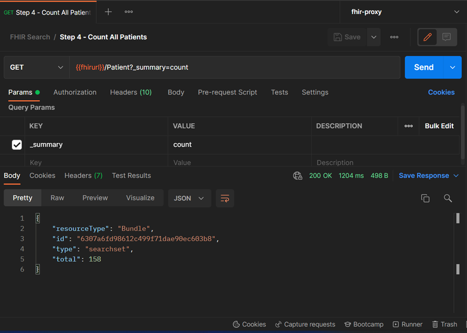

1. [] To confirm you have the **Patient** and **Practitioner Resources** needed for this lab, send the following requests in **Postman**:

    **GET Patient to Test Consent Opt Out**: GET {{fhirurl}}/Patient/WDT000000001

    GET {{fhirurl}}/Practitioner/WDT000000003

You should receive a 200 OK response code for each of these requests. If not, you will need to run the POST Save Sample Resources request again in the FHIR Search collection in Postman (this step was covered in Lab-10).

===

## Exercise 4: Post a Consent Resource to the FHIR service

Here you will populate your FHIR service with a Consent Resource (see +++https://www.hl7.org/fhir/consent.html+++) to configure the Consent Opt-Out filter (see +++https://github.com/microsoft/fhir-proxy/blob/main/docs/configuration.md#consent-opt-out-filter+++) in FHIR-Proxy.

1. [] Review the sample **Consent Resource** in the **consent-resource.json** file located at +++https://github.com/microsoft/azure-health-data-services-workshop/blob/main/Challenge-07%20-%20FHIR%20service%20consent%20capabilities/sample-data/consent-resource.json+++. You will see that Patient/WDT000000001 is opting out of sharing records with Practitioner/WDT000000003.

1. [] Go to the **FHIR CALLS** collection in **Postman** and select the **POST Consent Resource** call.

1. [] Inspect the **Body** of the request, and you will see that it contains the same Consent Resource that you just reviewed above.

1. [] Select **Send** to populate your FHIR service with the Consent Resource.

===

## Exercise 5: Add a Practitioner role in FHIR-Proxy

To configure Consent Opt-Out, you must create a FHIR Participant (see +++http://hl7.org/fhir/2020Feb/participant.html+++) role for the individual (or organization) being blocked from access to a patient's FHIR data. In the real world, you would be associating a FHIR Participant role with a provider, and you would be activating the Consent Resource on behalf of a patient to block said provider from accessing the patient's FHIR records. In this exercise, you are going to be assigning a FHIR Participant role to *your own Azure account* – as though you are the provider (i.e., Practitioner/WDT000000003) being blocked from accessing FHIR data owned by Patient/WDT000000001.

Review the information at +++https://github.com/microsoft/fhir-proxy/blob/main/docs/configuration.md#configuring-participant-authorization-roles-for-users+++ about configuring FHIR Participant roles for FHIR-Proxy and then return here when finished.

1. [] Go to **Portal > AAD > Enterprise Applications > [fhir_proxy_app_name] > Users and groups**.

1. [] Select **+Add user/group**.

1. [] Under **Users**, select **None Selected**. Type in your name or Azure login name and press **Select**.

1. [] Under **Select a role**, select **None Selected**. 

1. [] Select **Resource Reader**, and then select **Select** and **Assign**.

    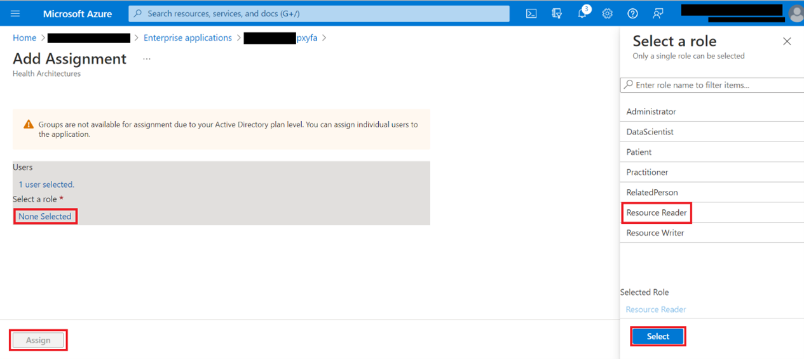

1. [] Select **+Add user/group** (again).

1. [] Under **Users**, select **None Selected** (again). 

1. [] Type in your name or Azure login name and press **Select** (again).

1. [] Under **Select a role**, select **None Selected** (again). 

1. [] Select **Practitioner**, and then select **Select** and **Assign**.

    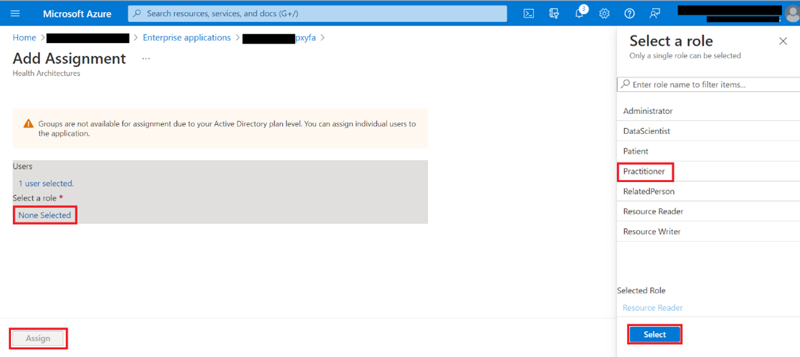

You have now assigned the Practitioner role to yourself in FHIR-Proxy. This prepares FHIR-Proxy to associate your identity in AAD with a Practitioner Resource in the FHIR service. In the next step, you will use FHIR-Proxy to make a direct link between your user account and Practitioner/WDT000000003.

===

## Exercise 6: Link your Object ID to a FHIR Practitioner Resource ID

Now you will be linking the Practitioner/WDT000000003 Resource to your user account's **Object ID** in AAD. This will cause the Consent Opt-Out filter in FHIR-Proxy to listen for API calls from *you* and enforce the Consent rules blocking Practitioner/WDT000000003 (you) from accessing data belonging to Patient/WDT000000001. See the FHIR-Proxy configuration documentation at +++https://github.com/microsoft/fhir-proxy/blob/main/docs/configuration.md#configuring-participant-authorization-roles-for-users+++ for details on the linkage between a User Principal (see +++https://docs.microsoft.com/en-us/azure/active-directory/develop/app-objects-and-service-principals#service-principal-object+++) in AAD and a Resource instance in the FHIR service.

1. [] Go to **Portal** -> **AAD** -> **Users**.

1. [] Do a search for yourself and select on your name in the list.

1. [] In the **Profile** blade, copy the **Object ID** for your account.

1. [] You will also need your &lt;fhir_proxy_app_name> (**Portal** -> **Resource Group** -> **/$lt;fhir_proxy_app_name>**).

1. [] In Postman, get a new access token (POST AuthorizeGetToken).

1. [] Then go to the **FHIR CALLS** collection and select the **GET Link Roles** call.

1. [] In the URL field for the request, you will see this string: https://<fhir_proxy_app_name\>.azurewebsites.net/manage/link/Practitioner/WDT000000003/\<object-id\>

1. [] Paste your **&lt;fhir_proxy_app_name>** and **&lt;object-id>** in the appropriate places in the string.

1. [] Press **Send**. You will get back a message saying the link has been established with a response code of 200.

===

## Exercise 7: Authenticate yourself using auth code flow in Postman

You now need to authenticate yourself as the caller trying to access Patient/WDT000000001. This way, FHIR-Proxy will know to block your access to Patient/WDT000000001 – because your Azure account is associated with Practitioner/WDT000000003.

1. [] Go to the **FHIR CALLS** collection in Postman (in the VM) and select the **GET Patient Consent Opt Out** call.

1. [] Select the **Authorization** tab.

1. [] Scroll down and select **Get New Access Token**.

1. [] You will be prompted to "Authenticate via browser". Select **Proceed**.

1. [] You will be taken to a new tab in your web browser, and if you are already logged into Azure Portal in your browser session, you should see a message: "Your call is authenticated".
    1. [] If you are not logged into Azure Portal, you will be prompted to authenticate with your Azure login credentials.

    > [!ALERT] **Important**: Make sure to disable pop-up window blocking for the Postman auth code page in your browser.

1. [] After authenticating in your browser, you'll return to Postman and you'll see "Authentication complete". Select **Proceed**.

1. [] Then select **Use Token** in the **MANAGE ACCESS TOKENS** window in Postman.

> [!NOTE] Note: To check that your Azure user account is correctly linked to the Practitioner role, copy the new **Access Token** from the **MANAGE ACCESS TOKENS** window and paste it into the JSON Web Token viewer at +++https://jwt.io/+++. Under "roles", you should see the "Writer", "Practitioner", and "Reader" roles for yourself.

===

## Exercise 8: Confirm Consent Opt-Out is working

1. [] Now, if you press **Send** in the **GET Patient Consent Opt Out** call, you should receive an **access-denied** response with a **401 Unauthorized** code as shown below. This indicates that Consent Opt-Out is working properly.

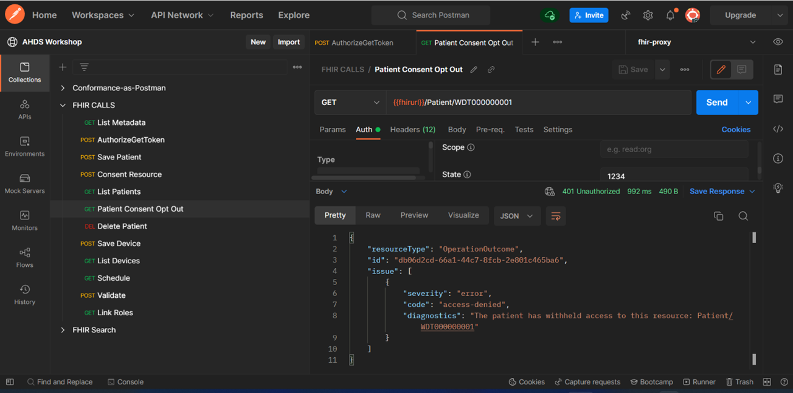

What does success look like for Lab-12?

-   Successfully POST a Consent Resource to the FHIR service.
-   Verify that Consent Opt-Out properly filters a Patient Resource.

