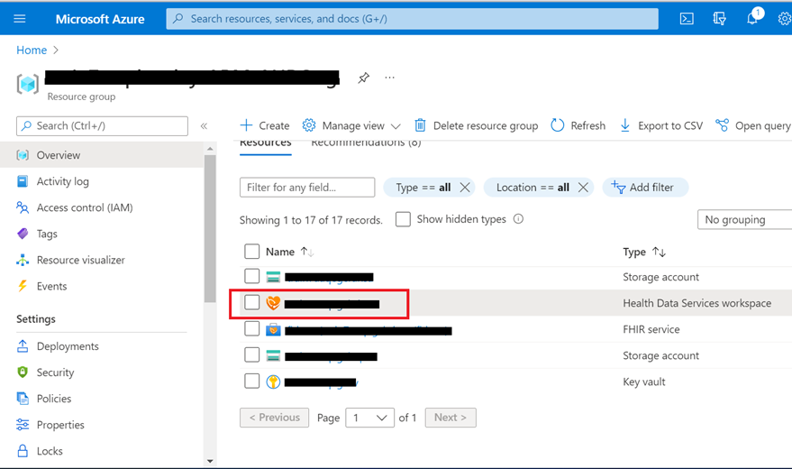
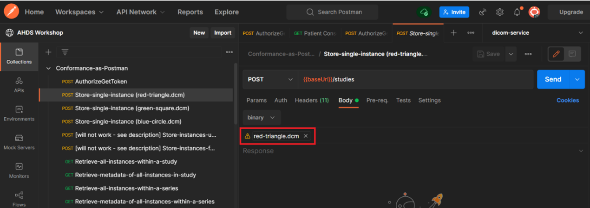

# Module 6 Lesson 4 Lab 13: DICOM Service

## Overview

In this lab, you will get experience working with medical images using the DICOM service in Azure Health Data Services.

The [DICOMweb™](https://www.dicomstandard.org/using/dicomweb) standard is the RESTful API protocol used throughout the health industry for medical image storage, querying, and exchange. The DICOM service within [Azure Health Data Services](https://docs.microsoft.com/azure/healthcare-apis/healthcare-apis-overview) is a DICOMweb™-compliant server that ingests and persists DICOM objects at multiple thousands of images per second. DICOM service in Azure Health Data Services facilitates transmission of imaging data with any DICOMweb™ enabled system or application through standard transactions like [Store (STOW-RS)](https://docs.microsoft.com/azure/healthcare-apis/dicom/dicom-services-conformance-statement#store-stow-rs), [Search (QIDO-RS)](https://docs.microsoft.com/azure/healthcare-apis/dicom/dicom-services-conformance-statement#search-qido-rs), and [Retrieve (WADO-RS)](https://docs.microsoft.com/azure/healthcare-apis/dicom/dicom-services-conformance-statement#retrieve-wado-rs). DICOM service is part of Azure Health Data Services, which establishes [HIPAA](https://docs.microsoft.com/azure/compliance/offerings/offering-hipaa-us) and [HITRUST](https://docs.microsoft.com/azure/compliance/offerings/offering-hitrust) compliance for all [PHI (protected health information)](https://www.hhs.gov/answers/hipaa/what-is-phi/index.html) stored within an Azure Health Data Services workspace. This means you can upload PHI data to the DICOM service and the data will remain safely within the Azure Health Data Services workspace compliance boundary. In this challenge, we will be looking at how to deploy, configure, and use DICOM service for its foundational features.

## Learning objectives

In this lab, you will:

-   Set up a DICOM service instance within an Azure Health Data Services
    workspace
-   Configure DICOM service settings for usage
    -   Add role assignment
    -   Obtain an access token
-   Ingest DICOM files into the service
-   Search among the files that are stored within the DICOM service
-   Retrieve DICOM files
-   Check logs of changes in DICOM service via Change Feed
-   Manage supported tags in your DICOM service instance
    -   Add extended query tags
    -   List extended query tags
    -   Get extended query tags
    -   Update extended query tags
    -   Delete extended query tags
-   Use a DICOM viewer to view DICOM images

## Exercise 1: Find your Azure Health Data Services workspace using Azure Portal

In Lab-07, you deployed an Azure Health Data Services workspace in your resource group. You can view your Azure Health Data Services workspace settings by navigating to **Portal** -> **Resource Group** and finding the resource with a name ending in **"ws"** (see image below).

1. [] Select the item in the list. 

1. [] Then, scroll down and select the **DICOM service** blade. 

1. [] Once there, select the **+Add DICOM service** button and proceed to the next step.

===

## Exercise 2: Deploy DICOM service using Azure Portal

Now you will visit another page and follow the instructions to [Deploy DICOM service using the Azure portal](https://docs.microsoft.com/en-us/azure/healthcare-apis/dicom/deploy-dicom-services-in-azure). 

1. [] Go directly to #3 in the instructions and begin from there. 

1. [] Then return here when finished.

> [!NOTE] Note: DICOM service deployment typically takes several minutes.

===

## Exercise 3: Configure Azure roles for access to DICOM data

You will need to add the **DICOM Data Owner** role for yourself (i.e., your username in Azure) as well as for the Postman service client that you created in Lab-07  ([documentation available here](https://docs.microsoft.com/azure/healthcare-apis/configure-azure-rbac#assign-roles-for-the-dicom-service)).

===

## Exercise 4: Import Postman environment and collection files to connect with DICOM service

1. [] Access the **Postman environment template** for **DICOM service** [here](https://github.com/microsoft/azure-health-data-services-workshop/blob/main/Challenge-08%20-%20DICOM%20service/postman/dicom-service.postman_environment.json). 

1. [] Save the file locally (select **Raw** and then do a **Save as** from your browser).

1. [] In Postman, find the **Environments** tab on the left and select the **Import** button.

1. [] Import the **dicom-service.postman_environment.json** file that you just saved locally.
    1. [] Add the file to Postman using the **Upload Files** button. 
    1. [] Then select **Import**.

1. [] Now, access the **Conformance-as-Postman.postman_collection.json** file available [here](https://github.com/microsoft/dicom-server/blob/main/docs/resources/Conformance-as-Postman.postman_collection.json) and save the file locally. 

1. [] Then import the file into Postman.
    1. [] Add the file to Postman using the **Upload Files** button. 
    1. [] Then select **Import**.

===

## Exercise 5: Configure Postman environment

You will now configure a new Postman environment for DICOM service (dicom-service).

1. [] For the dicom-service Postman environment, you will need to retrieve the following values:
    1. [] From your existing fhir-service Postman environment:
        1. [] **tenantId** - AAD tenant ID (you also can find it in **AAD** -\> **Overview** -\> **Tenant ID**).
        1. [] **clientId** - Application (client) ID for Postman service client app.
        1. [] **clientSecret** - Client secret for your Postman app.

    1. New values you need to input:
        1. [] **resource** - https://dicom.healthcareapis.azure.com
        1. [] **baseUrl** - Service URL appended with **/v1**. 
            1. [] Go to **Portal > Resource Group > DICOM service > Service URL**. 
            1. [] Copy and add **/v1** on the end: /**https://</workspace-name/>-</dicom-service-name/>.dicom.azurehealthcareapis.com/v1**.

1. [] Populate the above parameter values in your dicom-service Postman environment. 

1. [] Input the values in the **CURRENT VALUE** column. Leave bearerToken blank. 

1. []  Make sure to select **Save** to retain the dicom-service environment values.

===

## Exercise 6: Choose a path for the rest of the lab

From here, you will be using the DICOM service for the features outlined in [the beginning of this lab](https://github.com/microsoft/azure-health-data-services-workshop/tree/main/Challenge-08%20-%20DICOM%20service#learning-objectives-for-Lab-08). You have the option to follow either of these paths:

**Basic Path**

You can use an already configured Postman collection to execute the series of tasks.

-or-

**Advanced Path**

You can follow the provided articles that go over how to programmatically communicate with the DICOM service using C\#, Python, or cURL.

**Basic Path**

**Task 1: Obtain an access token to connect with DICOM service**

1. [] In Postman, make sure you have selected your **dicom-service environment** as the active environment.

1. [] Select the **Conformance-as-Postman** collection.

1. [] Select the **POST AuthorizeGetToken** request and select **Send**. You should receive a 200 OK message in response. Your access token is now saved to the bearerToken environment variable in your dicom-service Postman environment. Access tokens expire after 60 minutes. A refresh can be obtained by sending the POST AuthorizeGetToken request again.

**Task 2: Populate DICOM service with single instance images**

1. [] Once your dicom-service Postman environment is set up and you have obtained an access token, please go to [**this repo**](https://github.com/microsoft/dicom-server/tree/main/docs/dcms) and download the three DICOM instance files (**.dcm**).

1. [] Then, for each of the three **POST Store-single-instance** calls in the **Conformance-as-Postman** collection, 
    1. [] Go to **Body**, select the **x** next to the filename.
    1. [] Select **Select File** and choose the appropriate **.dcm** file (downloaded in the previous step).

    

1. [] Press **Send** for each POST Store-single-instance call and you will populate your DICOM service with the three .dcm single instance files.

===

## Exercise 7: Execute Outlined Features via Postman Collection

The Conformance-as-Postman collection has a complete set of API calls that you can execute one by one. See the list below for details.
-   Store DICOM files to the service
-   Search among the files that are stored within the DICOM service
-   Retrieve DICOM instance
-   Check logs of changes in DICOM service via Change Feed
-   Manage extended query tags in your DICOM service instance
-   Add extended query tags
-   List extended query tags
-   Get extended query tags
-   Update extended query tags
-   Delete extended query tags

**Advanced Path**

**Task 1: Choose your preferred method for uploading, searching, and retrieving DICOM images (C#, cURL, or Python)**

Each method comes with a set of prerequisites and instructions for getting started:

- C# - <https://docs.microsoft.com/azure/healthcare-apis/dicom/dicomweb-standard-apis-c-sharp>

- cURL - <https://docs.microsoft.com/en-us/azure/healthcare-apis/dicom/dicomweb-standard-apis-curl>

- Python - <https://docs.microsoft.com/en-us/azure/healthcare-apis/dicom/dicomweb-standard-apis-python>

**Task 2: Check the logs of the changes in the DICOM service via Change Feed**

The Change Feed provides logs of all the changes that occur in your DICOM service. You can view instructions in this [Change Feed Overview article](https://docs.microsoft.com/en-us/azure/healthcare-apis/dicom/dicom-change-feed-overview).

**Task 3: Manage Extended Query tags in your DICOM service instance**

By default, the DICOM service supports querying on the DICOM tags specified in [the conformance statement](https://docs.microsoft.com/en-us/azure/healthcare-apis/dicom/dicom-services-conformance-statement#searchable-attributes). By enabling extended query tags, the list of tags can easily be expanded based on the application's needs.

You can follow the instructions given in this [Extended Query Tag Overview article](https://docs.microsoft.com/en-us/azure/healthcare-apis/dicom/dicom-extended-query-tags-overview) to manage query tags.

===

## Exercise 8: BONUS : Set up a DICOM viewer for DICOM service

As an added challenge, go to [this repo](https://github.com/microsoft/dicom-ohif) and follow the instructions to set up an [Open Health Imaging Foundation DICOM viewer](https://ohif.org) for your DICOM service.

Once you have configured the DICOM viewer, you can experiment with viewing the three DICOM instance files (.dcm) that you downloaded earlier in this lab.

What does success look like for Lab-13?

-   Provison and configure DICOM service for ingestion and storage of DICOM studies.
-   Use DICOM service to upload, search, and retrieve DICOM studies.
-   Check changes log (Change Feed).
-   Add/remove additional query tags

