# Module 7 Lesson 4 Lab 14: MedTech service

## Overview

In this lab, you will get experience working with medical IoT data using the MedTech service (see https://docs.microsoft.com/en-us/azure/healthcare-apis/iot/iot-connector-overview) in Azure Health Data Services.

With the rise of wearables and other connected sensor technologies, IoT devices have exploded in the healthcare marketplace. Currently, there is no single data standard for medical IoT device I/O, and this has resulted in many proprietary data models in use across the medical IoT landscape. To provide a centralized platform for medical IoT data connectivity, Microsoft has taken a vendor-agnostic approach, offering the MedTech service toolkit for converting output from any medical IoT device into FHIR. In this lab, we will be using the MedTech service in Azure Health Data Services to map medical IoT data for ingestion into the FHIR service.

## Learning objectives

In this lab, you will:
-   Deploy and configure the MedTech service via Azure portal
-   Deploy and configure additional Azure services required for the MedTech
    service
-   Connect the MedTech service to FHIR service
-   Assign the roles post the deployment

## Exercise 1: Deploy and configure Azure Event Hubs

In the first part of this lab, you will use the Azure Portal to deploy an Event Hubs namespace in preparation to create your own Event Hub.

1.  Go to [Azure Portal](https://portal.azure.com/). Login with the credentials.

2.	Click on the three horizontal lines on the top left side of the Azure home page. Select **Create a resource.**
 
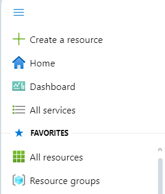

3.	Select **See more in All services**
 
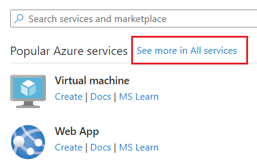

4.	Scroll down to **Analytics** (or select **Analytics** on the left) under **Categories**.
 
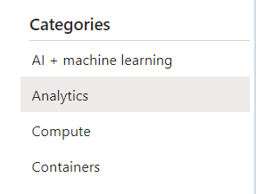

5.	Select **Event Hubs** under **Real-time** analytics.
 
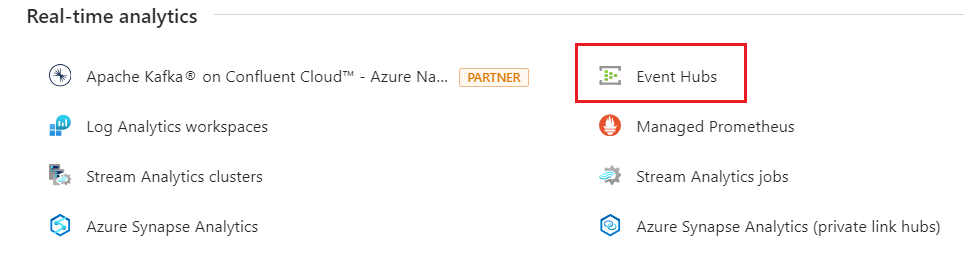

6.	Select **+Create.**
 
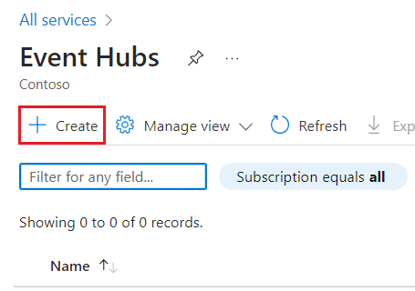

7.	Update the below details:

    1.	Select your Azure subscription.

    2.	Select your Azure health data service resource group.

    3.	Enter a unique **Namespace name – Medtec123.**

    4.	Confirm that the **Location** as **East US** and **Pricing tier** are correct. Select **Next: Review + create.**
 
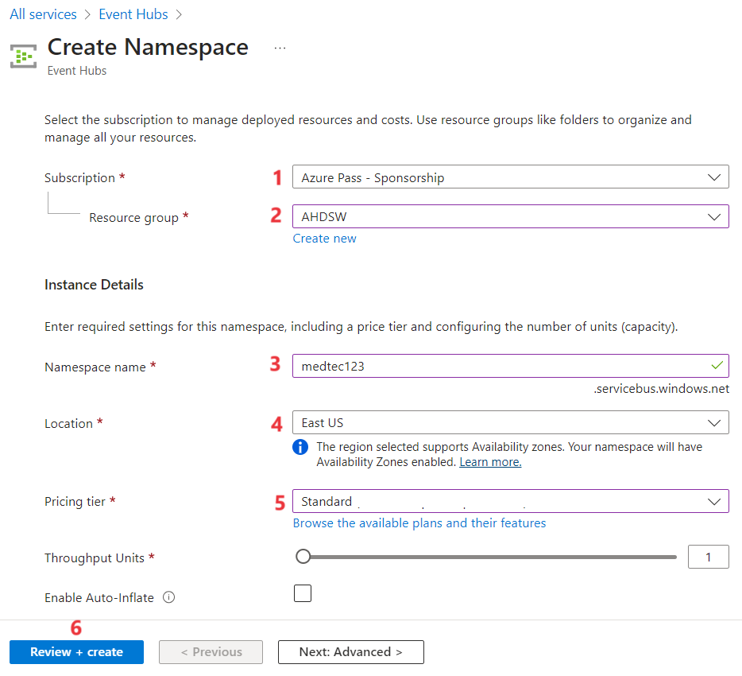

8.	Select **Create** once Validation is success.
 
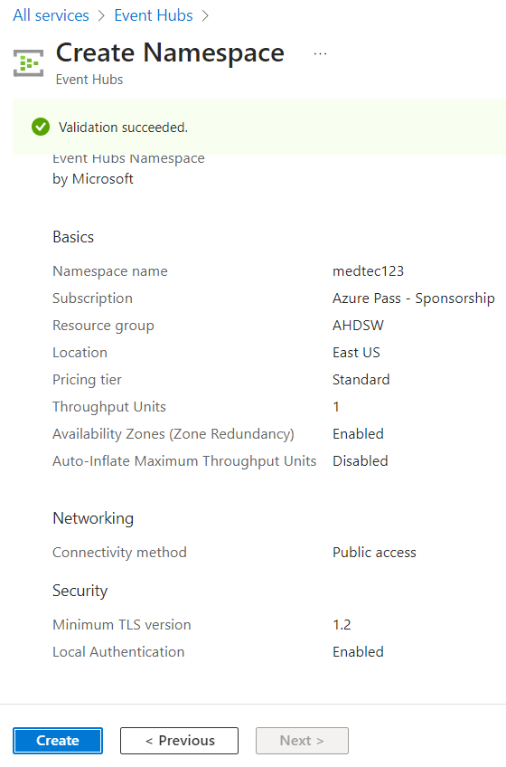

9.	The deployment takes a while to complete. Once it is complete, Click on **Go to resource.**
 
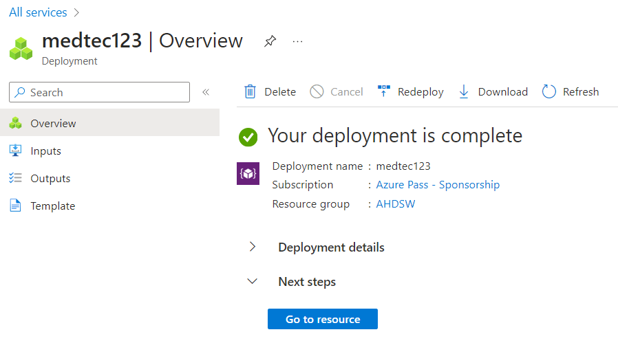

10.	Click on **+Event Hub** to create a new one.
 
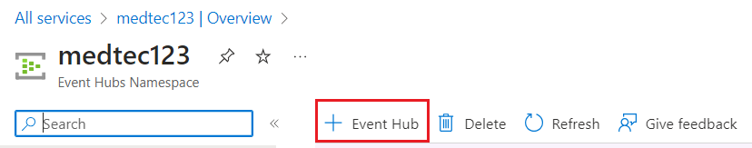

11.	Provide the name of the Event Hub as **Medtec123** and click on **Review + Create**.
 
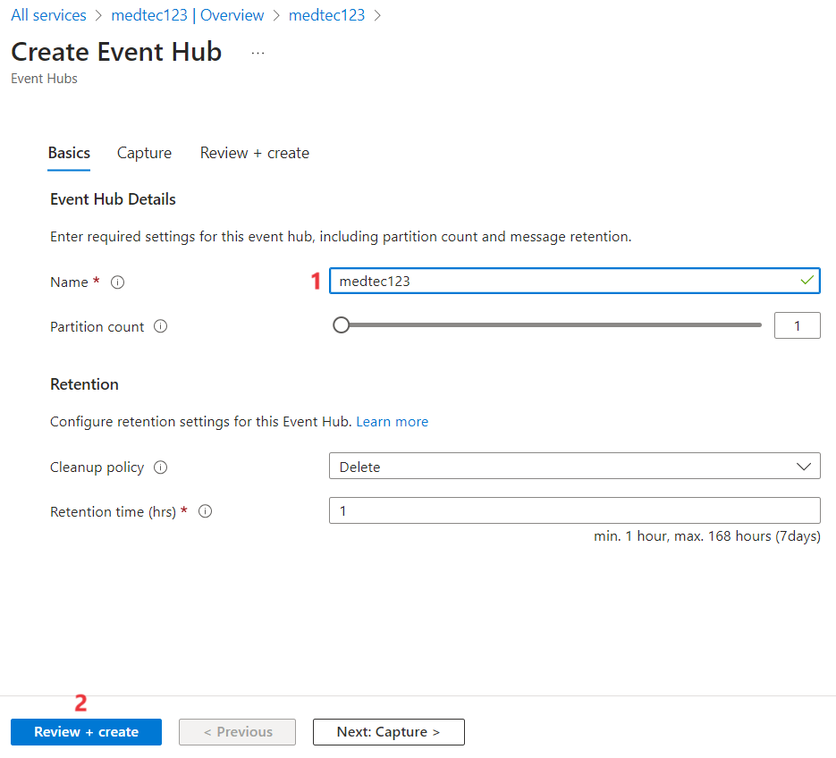

12.	Once the validation is passed, click on **Create**.
 
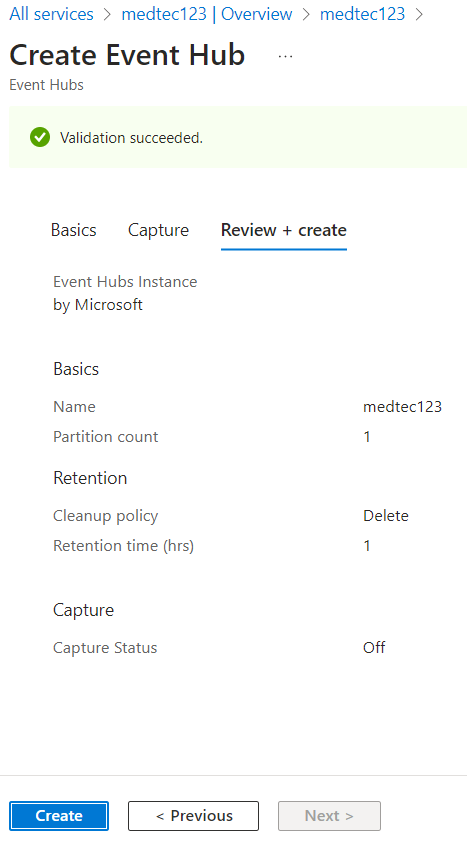

13.	You can view the Event hub under **Entities**.

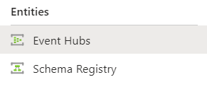

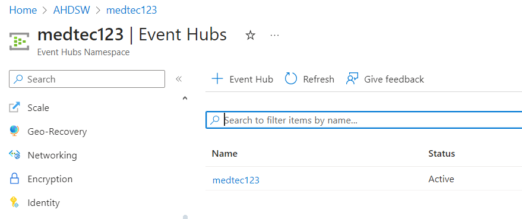

## Exercise 2: Deploy MedTech service in your Azure Health Data Services workspace

Now you will use Azure Portal to deploy and configure MedTech service within your Azure Health Data Services workspace.

1.	While you are on the Azure Portal. Navigate to your Azure Health Data Services Workspaces you created. Click on **Deploy MedTech Service**.
 
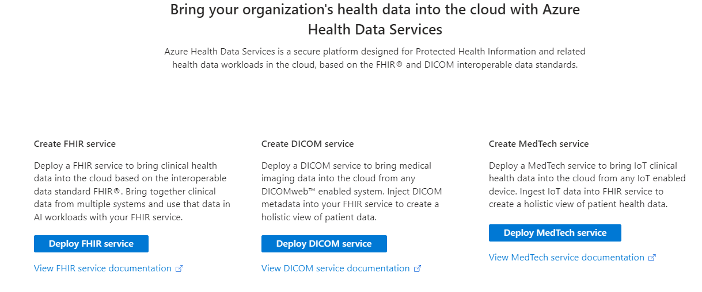

2.	Click on **Add MedTech service.** 

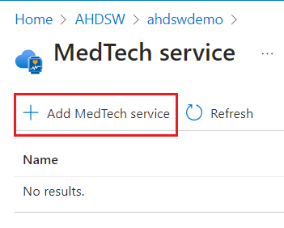
 
3.	This step takes you to the **Create MedTech service** page. This page has five tabs you need to fill out:

    1.	MedTech service name - **Medtecservice123**

    2.	Event Hubs Namespace – **Medtec123**

    3.	Event Hubs name – **Medtec123**

    4.	Consumer group - **$Default**

    5.	Click on **Next : Device mapping >**
  
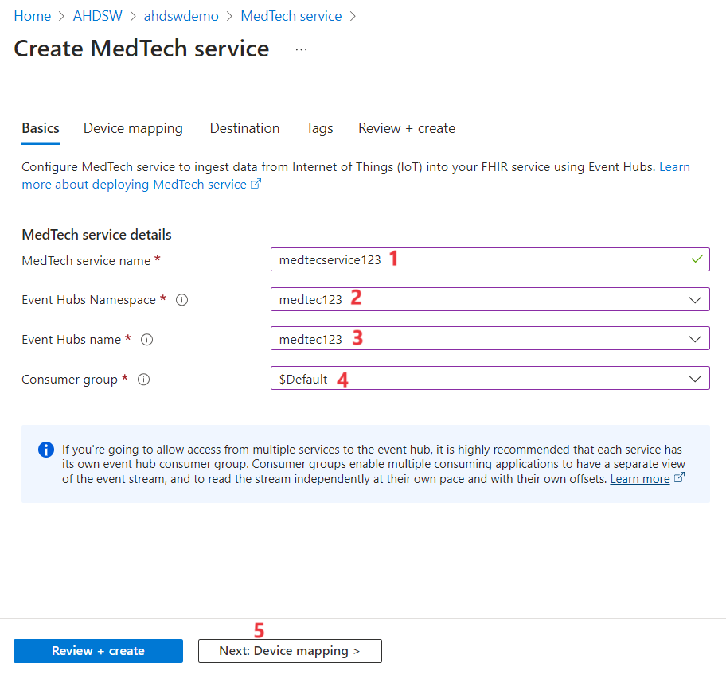

4.	Click on next until you reach the Destination tab. Update with the below details

    1.	FHIR server – Select your FHIR server

  	2.	Destination name – Enter **medtechdestination**

  	3.	Resolution type – **Create**

  	4.	Leave the Destination mapping as it is.

    5.	Click on **Review + Create**
 
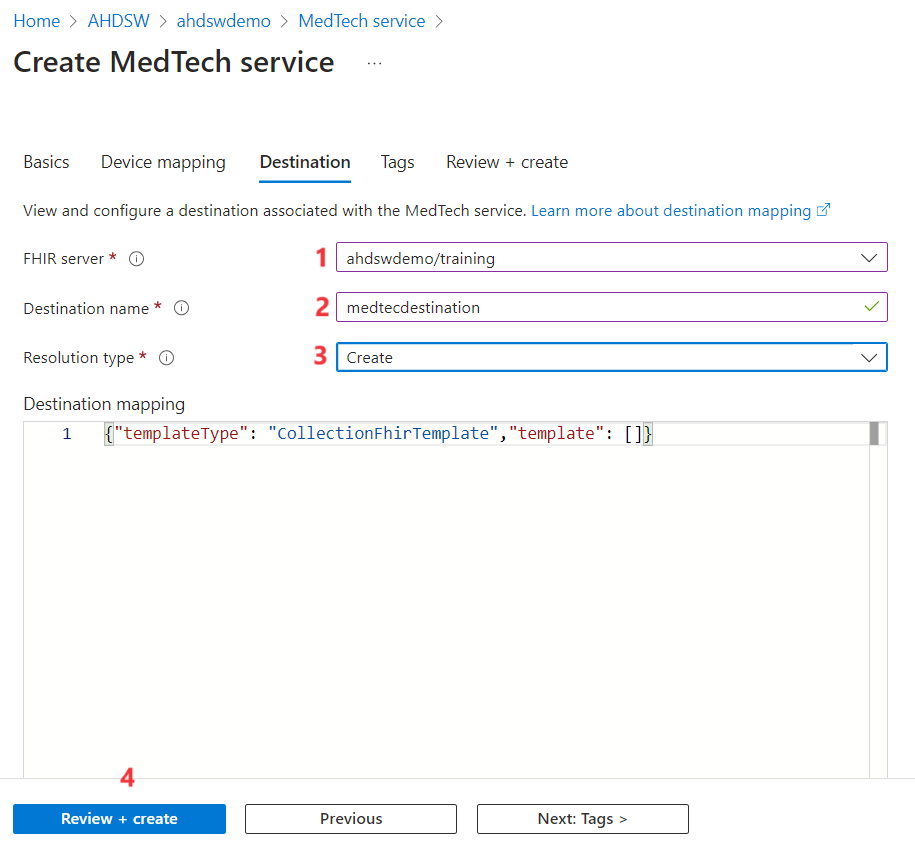

5.	Once the Validation is successful, click on **Create**.
 
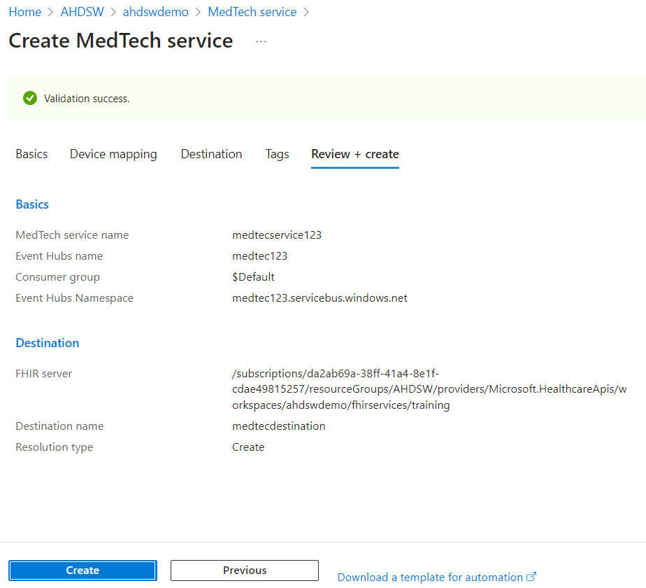

6.	The deployment takes a while to complete. Once completed, click on **Go to resource.**

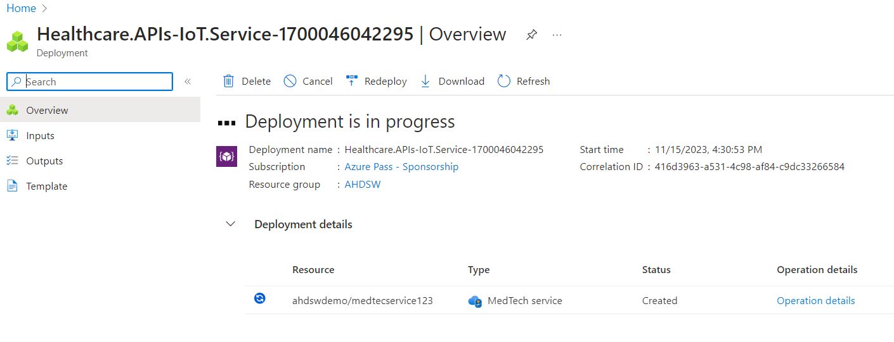

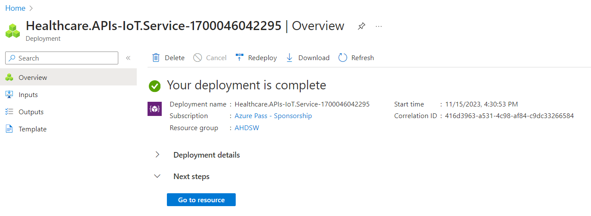

## Exercise 3: Configure Azure roles for MedTech service access

There are two post-deployment access steps you must perform or the MedTech service can't read data from the event hub or write data to the FHIR service.

## Task – Assign Azure Event Hubs Data Receiver role to Event hub.

1.	Navigate to your Azure Health Data Service resource group. 

2.	Select **Medtec123** Event Hubs Namespace
 

3.	Select **Event Hubs** under **Entities** from the left navigation pane.

4.	Click the **Medtec123** event hub

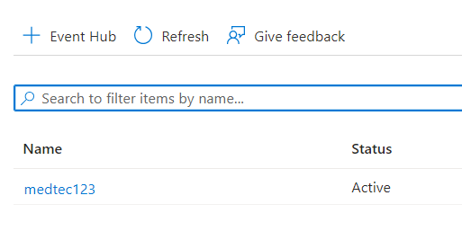
 
5.	Select **Access control (IAM)** from the left navigation pane.

6.	Click on **Add > Add role assignment.**
 
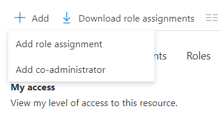

7.	Select Azure Event Hubs Data receiver and click on Next.
 
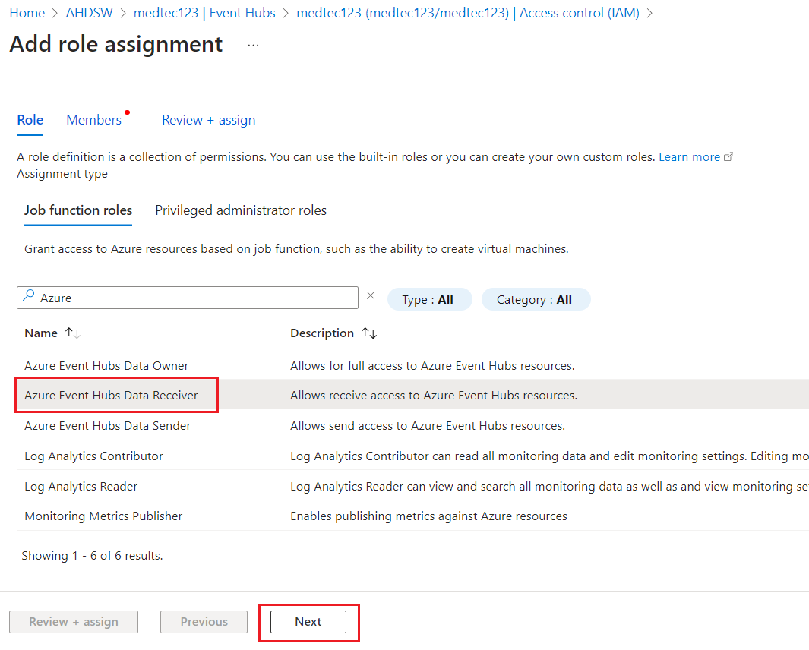

8.	Select **+Select Members** and add the admin user.
 
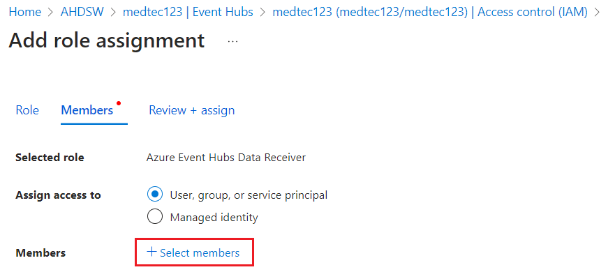

9.	Click on **Select** and then Click on **Next**. The role is added successfully.

## Task - FHIR Data Writer access to the FHIR service.

1.	You can proceed in the similar of navigating to Azure Health Data Service Resource group and selecting the FHIR service.

2.	Once you have reached the role assignment page. Search for **FHIR Data Writer** role and add the role to the admin user.
 
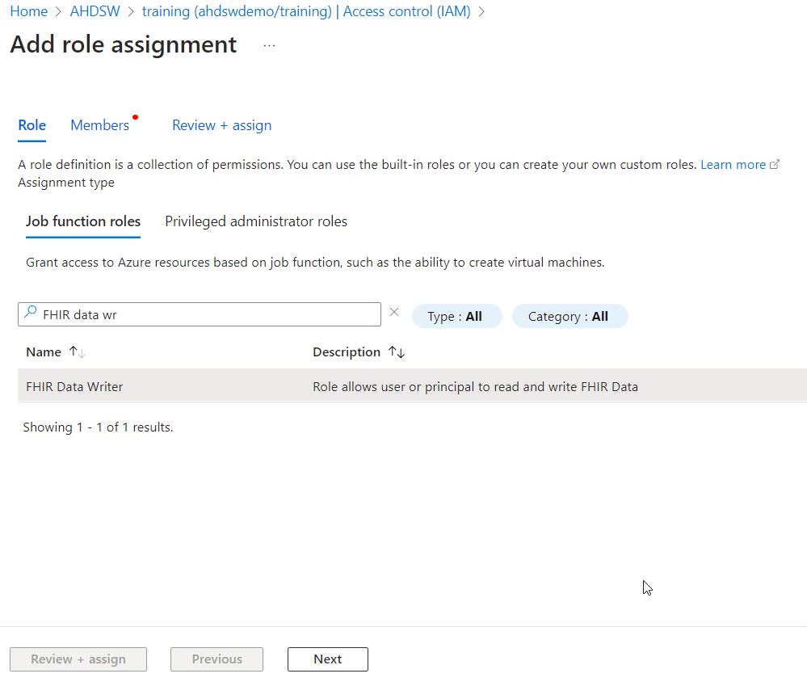
